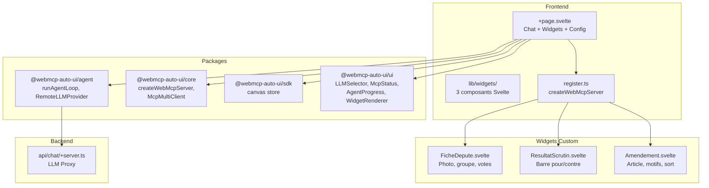

Boilerplate (`apps/boilerplate/`) est le template de demarrage pour integrer webmcp-auto-ui dans un projet SvelteKit. Il montre comment enregistrer des widgets custom via `createWebMcpServer`, connecter un ou plusieurs serveurs MCP distants, et piloter un agent IA pour generer automatiquement des interfaces. C'est le point de depart recommande pour tout nouveau projet.

## Ce que vous voyez quand vous ouvrez l'app

Quand vous ouvrez le Boilerplate, vous decouvrez une interface epuree avec une barre d'outils en haut. A gauche, le titre "Boilerplate Tricoteuses" en monospace. A droite, le statut de connexion MCP (avec la liste des serveurs connectes et le nombre d'outils), une checkbox Nano-RAG, un selecteur de modele LLM, et un toggle de theme clair/sombre.

Juste en dessous, un champ de saisie permet d'entrer l'URL d'un serveur MCP avec un bouton "Connecter". L'app se connecte automatiquement au serveur Tricoteuses (`mcp.code4code.eu/mcp`) au demarrage.

En dessous, une rangee de boutons permet d'activer ou desactiver les serveurs WebMCP locaux (Tricoteuses et AutoUI), chacun affichant le nombre de widgets qu'il expose.

Au centre, un etat vide accueille l'utilisateur avec trois boutons de suggestions : "Fiche depute", "Scrutin" et "Amendement". Quand l'agent genere des widgets, ils s'affichent dans une grille responsive 2 colonnes.

Tout en bas, une barre de saisie permet de poser des questions en langage naturel, et un indicateur `AgentProgress` montre le temps ecoule, le nombre d'appels d'outils et le dernier outil utilise.

## Architecture



## Stack technique

| Composant | Detail |
|-----------|--------|
| Framework | SvelteKit + Svelte 5 |
| Styles | TailwindCSS 3.4 |
| Icones | lucide-svelte |
| LLM provider | `RemoteLLMProvider` (LLM distant via proxy) |
| MCP | `McpMultiClient` (multi-serveurs) |
| Widgets custom | 3 composants Svelte via `createWebMcpServer` |
| RAG | `ContextRAG` (experimental) |
| Adapter | `@sveltejs/adapter-node` |

**Packages utilises :**
- `@webmcp-auto-ui/core` : `createWebMcpServer`, `McpMultiClient`
- `@webmcp-auto-ui/agent` : `runAgentLoop`, `RemoteLLMProvider`, `buildSystemPrompt`, `fromMcpTools`, `autoui`, `buildDiscoveryCache`, `ContextRAG`
- `@webmcp-auto-ui/sdk` : `canvas` store
- `@webmcp-auto-ui/ui` : `LLMSelector`, `McpStatus`, `AgentProgress`, `WidgetRenderer`, `getTheme`

## Lancement

| Environnement | Port | Commande |
|---------------|------|----------|
| Dev | 5178 | `npm -w apps/boilerplate run dev` |
| Production | 3011 | `node index.js` (via systemd) |

```bash
npm -w apps/boilerplate run dev
# Accessible sur http://localhost:5178
```

## Fonctionnalites

### 3 widgets Tricoteuses

Les widgets sont enregistres dans `src/lib/widgets/register.ts` via `createWebMcpServer`. Chaque widget est defini par un frontmatter YAML (nom, description, schema JSON) et un composant Svelte :

1. **FicheDepute** (`fiche-depute`) : fiche complete d'un depute de l'Assemblee nationale avec photo, groupe politique (couleur), circonscription, dates de mandat, taux de participation et repartition des votes (pour/contre/abstention)
2. **ResultatScrutin** (`resultat-scrutin`) : resultat d'un scrutin avec titre, numero, date, barre proportionnelle pour/contre/abstention, nombre de votants, badge "Adopte" ou "Rejete"
3. **Amendement** (`amendement`) : amendement parlementaire avec numero, article vise, auteur, groupe, expose des motifs et sort (adopte, rejete, retire, non soutenu)

### Agent IA multi-MCP

L'agent utilise une architecture en couches (layers) :
- **MCP layers** : un layer par serveur MCP distant connecte, avec ses outils convertis via `fromMcpTools`
- **WebMCP layers** : un layer par serveur WebMCP local active (Tricoteuses, AutoUI)

Les layers sont recalcules reactionnement a chaque changement de connexion.

### Suggestions pre-remplies

Trois boutons declenchent des requetes types qui demontrent les capacites des widgets :
- "Montre-moi la fiche de Jean-Luc Melenchon avec ses stats de vote"
- "Affiche le resultat du scrutin sur la reforme des retraites"
- "Montre un amendement adopte sur l'article 7 du projet de loi finances"

### Optimisation LLM automatique

Les options d'optimisation (sanitize, flatten, truncate, compress) s'ajustent automatiquement via un `$effect` quand le modele LLM change. Les petits modeles (Gemma, local) obtiennent des schemas aplatis et des resultats tronques pour rester dans leur fenetre de contexte.

## Configuration

| Variable | Description | Defaut |
|----------|-------------|--------|
| `ANTHROPIC_API_KEY` | Cle API du provider LLM distant (`.env` server-side) | requis |
| `mcpUrl` | URL du serveur MCP par defaut | `https://mcp.code4code.eu/mcp` |

## Code walkthrough

### `src/lib/widgets/register.ts`
Le fichier cle du Boilerplate. Il cree un serveur WebMCP nomme `tricoteuses-widgets` avec `createWebMcpServer`, puis enregistre chaque widget via `registerWidget()`. Chaque enregistrement prend un frontmatter YAML (schema JSON Schema complet) et un composant Svelte.

```typescript
export const tricoteusesServer = createWebMcpServer('tricoteuses-widgets', {
  description: 'Widgets parlementaires francais...',
});

tricoteusesServer.registerWidget(`---
widget: fiche-depute
description: Fiche d'un depute...
schema:
  type: object
  required: [nom, prenom, groupe]
  properties:
    nom: { type: string }
    ...
---
Affiche la fiche d'un depute...
`, FicheDepute);
```

### `src/routes/+page.svelte`
Le composant principal. Il gere :
- La connexion MCP via `McpMultiClient` (avec auto-connect au mount)
- La construction reactive des layers (`$derived`)
- La boucle agent avec callbacks `onWidget`, `onClear`, `onText`, `onToolCall`
- L'affichage des widgets via `WidgetRenderer` dans une grille responsive
- Les serveurs WebMCP locaux activables/desactivables

### `src/routes/api/chat/+server.ts`
Proxy server-side identique a celui de Flex : utilise `anthropicProxy` du package agent.

## Utilisation comme template

### Depuis le monorepo

```bash
cp -r apps/boilerplate apps/mon-app
```

Modifier :
1. `package.json` : changer le nom (`@webmcp-auto-ui/mon-app`) et le port dans le script dev
2. `src/lib/widgets/register.ts` : remplacer les 3 widgets par les votres
3. `+page.svelte` : adapter l'UI, les suggestions, le titre

### Depuis un projet externe

```bash
npx degit jeanbaptiste/webmcp-auto-ui/apps/boilerplate my-app
cd my-app
npm install
npm run dev
```

### Creer un nouveau widget

1. Creer un composant Svelte dans `src/lib/widgets/`
2. L'enregistrer dans `register.ts` avec un frontmatter YAML definissant le schema
3. Le serveur WebMCP local expose automatiquement le widget au LLM

:::tip
Le schema JSON dans le frontmatter est critique : c'est ce que le LLM voit pour comprendre quels parametres passer au widget. Soyez precis dans les descriptions et les types.
:::

## Deploiement

| Chemin sur le serveur | `/opt/webmcp-demos/boilerplate/` (racine) |
|----------------------|-------------------------------------------|
| Service systemd | `webmcp-boilerplate` |
| ExecStart | `node index.js` |

```bash
./scripts/deploy.sh boilerplate
```

## Liens

- [Demo live](https://demos.hyperskills.net/boilerplate/)
- [Package core](/webmcp-auto-ui/packages/core/) -- `createWebMcpServer`
- [Package agent](/webmcp-auto-ui/packages/agent/) -- `runAgentLoop`
- [Flex (app complete)](/webmcp-auto-ui/apps/flex/) -- pour voir toutes les fonctionnalites avancees
