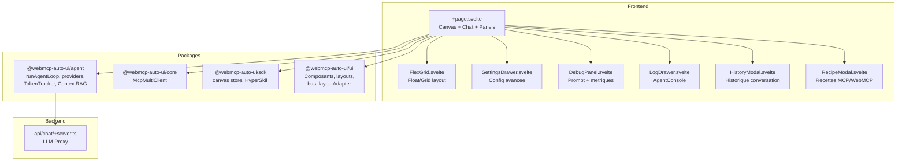

Flex (`apps/flex/`) est l'application phare du projet webmcp-auto-ui. C'est un canvas IA complet qui combine un agent LLM multi-provider, la connexion simultanee a plusieurs serveurs MCP, un systeme de widgets flottants ou en grille, et un ensemble d'outils de debug et d'export. C'est la vitrine de tout ce que l'architecture v0.8 permet de faire.

## Ce que vous voyez quand vous ouvrez l'app

Quand vous ouvrez Flex, vous decouvrez une interface sombre et epuree. En haut, une barre d'outils horizontale affiche le statut de connexion MCP (avec le nombre d'outils disponibles), un selecteur de modele LLM (modeles distants comme Claude, Gemini, ChatGPT ; Gemma E2B/E4B en WASM ; ou Ollama local), un toggle de theme clair/sombre, un compteur de tokens en temps reel, et un bouton d'export HyperSkill.

Au centre, le canvas occupe tout l'espace. Les widgets generes par l'agent s'y affichent soit en mode **float** (fenetres deplacables et redimensionnables avec drag & drop), soit en mode **grid** (grille responsive). Chaque widget porte un badge de provenance indiquant quel outil et quel serveur l'a genere.

A gauche, une sidebar repliable donne acces aux reglages avances : modele LLM, URL du serveur Ollama, temperature, max tokens, max tools, cache prompt, prompt systeme custom, et options d'optimisation de schema (sanitize, flatten). Un panneau de recettes (`RecipeModal`) liste les recettes WebMCP et MCP disponibles.

En bas, un tiroir lateral (`LogDrawer`) utilise le composant `AgentConsole` du package UI pour afficher les logs agent en temps reel : iterations, requetes LLM, reponses, appels d'outils avec arguments et resultats, metriques finales.

Tout en bas, la barre de saisie permet de taper une question en langage naturel. Un bouton Stop permet d'interrompre la generation en cours.

## Architecture



## Stack technique

| Composant | Detail |
|-----------|--------|
| Framework | SvelteKit + Svelte 5 (`$state`, `$derived`, `$effect`) |
| Styles | TailwindCSS 3.4 |
| Icones | lucide-svelte |
| LLM providers | `RemoteLLMProvider` (LLM distant via proxy), `WasmProvider` (Gemma in-browser), `LocalLLMProvider` (Ollama) |
| MCP | `McpMultiClient` (connexion simultanee multi-serveurs) |
| State | `canvas` store reactif du SDK |
| Token tracking | `TokenTracker` avec `TokenBubble` UI |
| RAG | `ContextRAG` (Nano-RAG experimental) |
| Export | `encodeHyperSkill` / `summarizeChat` |
| Adapter | `@sveltejs/adapter-node` (SSR) |

**Packages utilises :**
- `@webmcp-auto-ui/agent` : `runAgentLoop`, `RemoteLLMProvider`, `WasmProvider`, `LocalLLMProvider`, `buildSystemPrompt`, `fromMcpTools`, `trimConversationHistory`, `summarizeChat`, `TokenTracker`, `buildToolsFromLayers`, `runDiagnostics`, `buildDiscoveryCache`, `ContextRAG`, `autoui`
- `@webmcp-auto-ui/core` : `McpMultiClient`
- `@webmcp-auto-ui/sdk` : `canvas`, `listSkills`, `encodeHyperSkill`
- `@webmcp-auto-ui/ui` : `McpStatus`, `GemmaLoader`, `AgentProgress`, `EphemeralBubble`, `TokenBubble`, `bus`, `layoutAdapter`

## Lancement

| Environnement | Port | Commande |
|---------------|------|----------|
| Dev | 3007 | `npm -w apps/flex run dev` |
| Production | 3007 | `node index.js` (via systemd) |

```bash
npm -w apps/flex run dev
# Accessible sur http://localhost:3007
```

:::note
En production, un fichier `.env` contenant `LLM_API_KEY` est requis pour le proxy server-side. Ne jamais commiter ce fichier.
:::

## Fonctionnalites

### Multi-provider LLM
Flex supporte trois familles de providers :
- **LLM distant** (e.g. Claude, Gemini, ChatGPT, Mistral) via un proxy server-side compatible OpenAI
- **Gemma WASM** (E2B, E4B) charge directement dans le navigateur via LiteRT. Une barre de progression `GemmaLoader` affiche la progression du telechargement (~33 MB)
- **Ollama local** via `LocalLLMProvider` pour utiliser des modeles comme Llama 3.2 sur votre machine

Le provider est selectionne via le composant `LLMSelector`. Des smart defaults ajustent automatiquement les options d'optimisation selon le provider choisi (ex: flatten active pour Gemma, sanitize pour Claude).

### Multi-MCP
Connectez simultanement plusieurs serveurs MCP. Les outils de chaque serveur sont fusionnes dans les layers de l'agent. Les recettes MCP sont automatiquement chargees si le serveur expose un outil `list_recipes`.

### Widget interactif
Les widgets ne sont pas en lecture seule. Quand l'utilisateur clique sur un element dans un widget (ligne de tableau, carte, point de graphique...), l'interaction est capturee, traduite en message pour le LLM, et injectee dans la boucle agent pour generer de nouveaux widgets contextuels.

### Mode composeur/consommateur
Basculer entre :
- **Composeur** : edition complete, saisie libre, debug panel, export
- **Consommateur** : lecture seule des widgets generes

### Layout float/grid
- **Float** : fenetres deplacables et redimensionnables via `FloatingLayout`. L'agent peut deplacer et redimensionner les widgets via les callbacks `onMove`, `onResize`, `onStyle`
- **Grid** : grille responsive via `FlexLayout`

### Export HyperSkill
Exportez le canvas complet en URL HyperSkill compressez gzip. L'export inclut optionnellement un resume de la conversation genere par le LLM (`summarizeChat`) et les metadonnees de provenance.

### Debug panel
Le `DebugPanel` affiche en temps reel :
- Le prompt systeme effectif (avec les layers)
- Les outils disponibles avec leur schema JSON
- Les diagnostics de compatibilite (via `runDiagnostics`)
- Les metriques de tokens (input, output, cache, cout)

### Nano-RAG (experimental)
Active via une checkbox dans la barre d'outils. `ContextRAG` compacte le contexte de l'agent en utilisant des embeddings pour ne garder que les passages les plus pertinents.

## Configuration

| Variable | Description | Defaut |
|----------|-------------|--------|
| `LLM_API_KEY` | Cle API du provider LLM distant (server-side `.env`) | requis |
| `maxContextTokens` | Fenetre de contexte max | 150 000 |
| `maxTokens` | Tokens max par reponse | 4 096 |
| `maxTools` | Nombre max d'outils par requete | 8 |
| `temperature` | Temperature de generation | 1.0 |
| `cacheEnabled` | Cache prompt (dependant du provider) | `true` |
| `schemaSanitize` | Nettoyage des schemas JSON | auto |
| `schemaFlatten` | Aplatissement des schemas | auto |
| `truncateResults` | Troncature des resultats MCP | auto |
| `compressHistory` | Compression de l'historique | auto |

## Code walkthrough

### `+page.svelte` (composant principal)
Le composant principal orchestre tout : il declare l'etat reactif (`$state`), construit les layers a partir des serveurs MCP connectes et des packs locaux (`$derived`), initialise les providers LLM, et pilote la boucle agent via `runAgentLoop`. Les callbacks de l'agent alimentent le canvas, les logs, les bulles ephemerales et le token tracker.

### `api/chat/+server.ts` (proxy LLM)
Un endpoint SvelteKit qui utilise `llmProxy` du package agent pour relayer les requetes vers l'API du provider LLM distant. La cle API est lue depuis l'environnement server-side ou depuis le body de la requete (pour le mode BYOK).

### `FlexGrid.svelte` (layout)
Gere l'affichage des widgets en mode float (fenetres deplacables) ou grid. Chaque widget est rendu via `WidgetRenderer` et encadre par un badge de provenance.

### `SettingsDrawer.svelte` (configuration)
Tiroir lateral avec tous les reglages avances : modele, provider, parametres de generation, options de schema, prompt custom, connexion MCP.

### `LogDrawer.svelte` (logs agent)
Tiroir bas utilisant `AgentConsole` pour afficher les logs structures de la boucle agent avec horodatage et type colore.

## Personnalisation

Pour modifier Flex :

1. **Ajouter un provider LLM** : etendre la fonction `getProvider()` dans `+page.svelte`
2. **Ajouter des widgets locaux** : creer un `WebMcpServer` et l'ajouter dans les layers
3. **Modifier le prompt systeme** : utiliser le champ "System prompt" dans les Settings pour prefixer le prompt genere
4. **Changer le layout** : basculer entre float et grid via le bouton dans la barre d'outils

## Deploiement

| Chemin sur le serveur | `/opt/webmcp-demos/flex/` (racine) |
|----------------------|--------------------------------------|
| Service systemd | `webmcp-flex` |
| ExecStart | `node index.js` |

```bash
./scripts/deploy.sh flex
```

## Liens

- [Demo live](https://demos.hyperskills.net/flex/)
- [Package agent](/webmcp-auto-ui/packages/agent/)
- [Package core](/webmcp-auto-ui/packages/core/)
- [Package SDK](/webmcp-auto-ui/packages/sdk/)
- [Package UI](/webmcp-auto-ui/packages/ui/)
