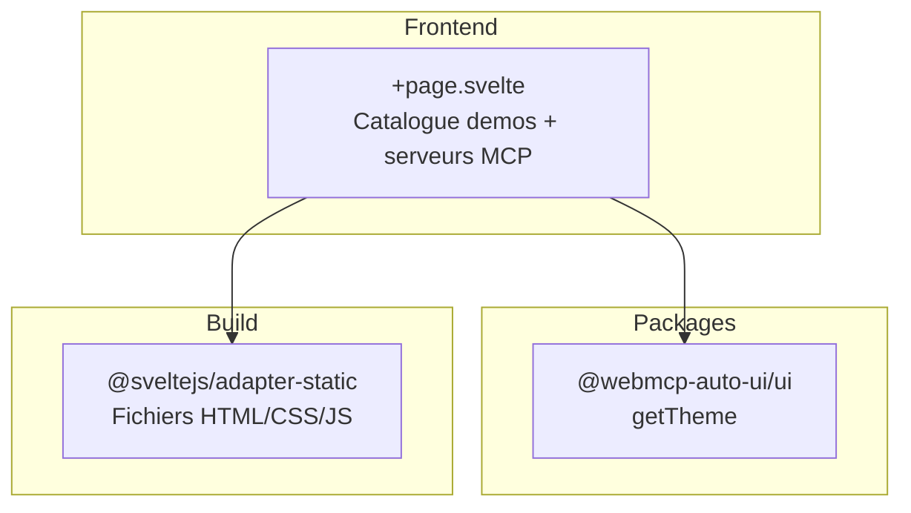

Home (`apps/home/`) est la page d'accueil du site de demos. C'est une page statique qui catalogue toutes les applications disponibles et liste les serveurs MCP connectables. C'est la premiere chose que les visiteurs voient sur `demos.hyperskills.net`.

## Ce que vous voyez quand vous ouvrez l'app

Quand vous ouvrez Home, vous decouvrez une page sobre et verticale, centree sur un maximum de 3 colonnes.

En haut, le titre **WEBMCP Auto-UI** en gras avec un sous-titre en gris expliquant le projet : "Interactive demos of the webmcp-auto-ui framework -- Svelte 5 components, W3C WebMCP protocol, AI-driven UI composition, and portable HyperSkills URLs." Trois liens : hyperskills.net, GitHub, et un toggle de theme (soleil/lune).

En dessous, une liste verticale de cartes cliquables presente chaque app avec :
- Un trait de couleur vertical a gauche (chaque app a sa couleur distinctive)
- Le titre de l'app
- Une description courte
- Le chemin URL (`/flex2`, `/viewer2`, etc.)

Les apps listees sont : Flex, Viewer, Showcase, Todo-WebMCP, Recipes, Multi-WebMCP-UI, et Boilerplate.

En bas, un encadre "Serveurs MCP disponibles" affiche une grille 4 colonnes avec les 8 serveurs MCP de demo : Tricoteuses (Parlement francais), Hacker News (Stories & commentaires), Met Museum (Collections d'art), Open-Meteo (Donnees meteo), Wikipedia (Articles & recherche), iNaturalist (Biodiversite), data.gouv.fr (Open data FR), et NASA (Donnees spatiales).

Un footer affiche la licence AGPL-3.0, la version et le hash du commit.

## Architecture



## Stack technique

| Composant | Detail |
|-----------|--------|
| Framework | SvelteKit + Svelte 5 |
| Styles | TailwindCSS 3.4 |
| Adapter | `@sveltejs/adapter-static` (build statique) |

**Packages utilises :**
- `@webmcp-auto-ui/ui` : `getTheme` pour le toggle dark/light

:::note
Home est la seule app de demo qui utilise `adapter-static`. Elle ne necessite pas de serveur Node.js en production -- elle est servie directement par nginx comme fichiers statiques.
:::

## Lancement

| Environnement | Port | Commande |
|---------------|------|----------|
| Dev | 5173 | `npm -w apps/home run dev` |
| Production | -- | Fichiers statiques (nginx) |

```bash
npm -w apps/home run dev
# Accessible sur http://localhost:5173
```

### Build de production

```bash
PUBLIC_BASE_URL=https://demos.hyperskills.net npm -w apps/home run build
```

:::caution
La variable `PUBLIC_BASE_URL` est obligatoire pour le build de production. Sans elle, tous les liens vers les demos pointent vers des chemins relatifs qui ne fonctionnent pas sur le serveur. Ce n'est pas necessaire en developpement.
:::

## Fonctionnalites

### Catalogue des demos

Chaque app est representee par un objet avec titre, description, URL et couleur d'accent. L'URL est construite en prefixant `PUBLIC_BASE_URL` (ou vide en dev). Les cartes sont cliquables et menent directement a l'app.

### Serveurs MCP

La grille des serveurs MCP est purement informative -- elle montre les serveurs disponibles pour les apps qui supportent la connexion MCP (Flex, Boilerplate, Showcase, Multi-Svelte, Recipes).

### Theme dark/light

Le toggle utilise `getTheme()` du package UI. Le mode est persiste en localStorage.

## Configuration

| Variable | Description | Obligatoire |
|----------|-------------|-------------|
| `PUBLIC_BASE_URL` | Prefixe des URLs de demo (ex: `https://demos.hyperskills.net`) | Production uniquement |

## Code walkthrough

### `+page.svelte`
Fichier unique de l'app. Deux tableaux de donnees statiques :
- `demos` : 7 objets `{title, desc, url, accent}` pour les cartes d'apps
- `mcpServers` : 8 objets `{name, desc}` pour la grille de serveurs

La variable `base` est derivee de `PUBLIC_BASE_URL` et sert de prefixe pour toutes les URLs.

## Personnalisation

Pour ajouter une nouvelle app au catalogue :
1. Ajouter un objet dans le tableau `demos` avec `title`, `desc`, `url` et `accent` (couleur hex)
2. Rebuild avec `PUBLIC_BASE_URL` en production

## Deploiement

| Chemin sur le serveur | `/opt/webmcp-demos/home/` (racine) |
|----------------------|-------------------------------------|
| Servi par | nginx (fichiers statiques) |

```bash
PUBLIC_BASE_URL=https://demos.hyperskills.net npm -w apps/home run build
./scripts/deploy.sh home
```

## Liens

- [Demo live](https://demos.hyperskills.net)
- [Flex](/apps/flex2/) -- app principale
- [Package UI](/packages/ui/) -- `getTheme`
