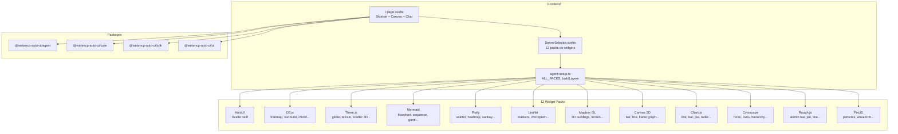

Multi-Svelte (`apps/multi-svelte/`) est la demo la plus complete et la plus ambitieuse du projet. Elle reunit toutes les capacites de l'architecture dans une seule app : 12 packs de serveurs WebMCP (D3.js, Three.js, Plotly, Leaflet, Mermaid...), multi-provider LLM, multi-MCP, layouts float/grid, token tracking, diagnostics, et un systeme de liens inter-widgets. C'est le terrain d'experimentation pour les cas d'usage avances.

## Ce que vous voyez quand vous ouvrez l'app

Quand vous ouvrez Multi-Svelte, vous decouvrez une interface dense et configurable.

**Sidebar gauche** (repliable) : la sidebar occupe environ 300px et contient une serie de controles empiles verticalement :
- **LLM** : selecteur de modele (haiku, sonnet, opus, Gemma E2B/E4B, Ollama local) avec un champ URL pour Ollama
- **MCP** : champ URL + token optionnel pour connecter un serveur MCP distant, avec un bouton "Connecter tous" pour connecter les 8 serveurs de demo d'un coup. Un composant `RemoteMCPserversDemo` affiche la liste des serveurs avec leur statut (connecte, en cours, deconnecte)
- **Packs** : le composant `ServerSelector` affiche les 12 packs de widgets activables/desactivables. Chaque pack est un bouton avec son nom, sa description, et un indicateur on/off. Par defaut seul "AutoUI (Svelte)" est active
- **Parametres** : max tokens (slider), max tools, temperature, cache prompt, prompt systeme custom
- **Optimisation** : sanitize, flatten, truncate, compress history, max result length
- **Nano-RAG** : checkbox experimentale
- **Diagnostics** : icone qui affiche un modal de diagnostics des tools et du prompt

**Canvas central** : occupe tout l'espace restant. En haut, des boutons permettent de basculer entre float et grid, et un toggle de logs. Les widgets generes s'affichent soit en fenetres flottantes deplacables/redimensionnables (`FloatingLayout`), soit en grille responsive (`FlexLayout`). Chaque fenetre a une barre de titre avec le type du widget, un indicateur de liens inter-widgets (`LinkIndicators`) et un bouton de fermeture. Le bord gauche des fenetres liees s'eclaire de la couleur du groupe de lien.

**Barre de saisie** : en bas, un champ texte avec boutons Send/Stop, plus des bulles ephemerales (`EphemeralBubble`) qui affichent les reponses intermediaires de l'agent.

**Token tracking** : une pastille `TokenBubble` affiche en permanence les metriques : tokens in/out, cache hits, cout estime.

**Logs** : un panneau depliable sous le canvas affiche les logs structures de l'agent (iterations, requetes, reponses, outils, metriques finales).

## Architecture



## Stack technique

| Composant | Detail |
|-----------|--------|
| Framework | SvelteKit + Svelte 5 |
| Styles | TailwindCSS 3.4 |
| Icones | lucide-svelte |
| LLM providers | `RemoteLLMProvider`, `WasmProvider`, `LocalLLMProvider` |
| MCP | `McpMultiClient` |
| Widget packs | 12 serveurs WebMCP locaux |
| Layouts | `FloatingLayout` (float) + `FlexLayout` (grid) |
| Token tracking | `TokenTracker` + `TokenBubble` |
| RAG | `ContextRAG` (experimental) |
| Adapter | `@sveltejs/adapter-node` |

**Packages utilises :**
- `@webmcp-auto-ui/agent` : `runAgentLoop`, `RemoteLLMProvider`, `WasmProvider`, `LocalLLMProvider`, `buildSystemPrompt`, `fromMcpTools`, `trimConversationHistory`, `TokenTracker`, `buildToolsFromLayers`, `runDiagnostics`, `buildDiscoveryCache`, `ContextRAG`, `autoui`
- `@webmcp-auto-ui/core` : `McpMultiClient`
- `@webmcp-auto-ui/sdk` : `canvas`, `MCP_DEMO_SERVERS`
- `@webmcp-auto-ui/ui` : `McpStatus`, `GemmaLoader`, `AgentProgress`, `EphemeralBubble`, `TokenBubble`, `LLMSelector`, `FloatingLayout`, `FlexLayout`, `WidgetRenderer`, `LinkIndicators`, `linkGroupColor`, `RemoteMCPserversDemo`, `DiagnosticIcon`, `DiagnosticModal`, `bus`, `layoutAdapter`

## Lancement

| Environnement | Port | Commande |
|---------------|------|----------|
| Dev | 3010 | `npm -w apps/multi-svelte run dev` |
| Production | 3012 | `node index.js` (via systemd) |

```bash
npm -w apps/multi-svelte run dev
# Accessible sur http://localhost:3010
```

## Fonctionnalites

### 12 packs de widgets

Chaque pack est un serveur WebMCP local qui expose des widgets et des outils specifiques a une librairie de visualisation :

| Pack | Librairie | Widgets |
|------|-----------|---------|
| **AutoUI** | Svelte natif | stat, chart, table, kv, list, cards, gallery, etc. |
| **D3.js** | D3 v7 | treemap, sunburst, chord diagram, force graph, etc. |
| **Three.js** | Three.js r170 | globe, terrain, scatter 3D, mesh viewer, etc. |
| **Mermaid** | Mermaid | flowchart, sequence, gantt, ER, class, mindmap, etc. |
| **Plotly** | Plotly.js | scatter, heatmap, 3D surface, sankey, etc. |
| **Leaflet** | Leaflet | markers, choropleth, heatmap layer, routing, etc. |
| **Mapbox GL** | Mapbox GL JS | 3D buildings, terrain, globe, animated lines, etc. |
| **Canvas 2D** | Canvas API | bar chart, line chart, flame graph, etc. |
| **Chart.js** | Chart.js 4 | line, bar, pie, doughnut, radar, scatter, bubble |
| **Cytoscape** | Cytoscape.js | force-directed, DAG, hierarchy, etc. |
| **Rough.js** | Rough.js | sketch bar, pie, line, network (style dessin a la main) |
| **PixiJS** | PixiJS | particles, waveform, gauge (animations WebGL) |

Les packs sont definis dans `agent-setup.ts`. Chaque pack importe un serveur WebMCP depuis `src/lib/servers/{pack}/server.js`.

### Layout float et grid

- **Float** (`FloatingLayout`) : chaque widget est une fenetre deplacable et redimensionnable. L'agent peut les positionner via les callbacks `onMove(id, x, y)` et `onResize(id, w, h)`. Le `layoutAdapter` fait le pont entre les outils agent et le composant de layout
- **Grid** (`FlexLayout`) : grille responsive CSS flex-wrap avec largeur min/max configurable

### Liens inter-widgets

Le systeme `bus` permet aux widgets de communiquer entre eux. Les `LinkIndicators` affichent des pastilles colorees dans la barre de titre de chaque fenetre pour indiquer les relations. `linkGroupColor` attribue une couleur deterministe a chaque groupe de lien. Le bord gauche des fenetres liees s'eclaire de cette couleur.

### Token tracking en temps reel

Le `TokenTracker` cumule les metriques de chaque requete LLM (tokens input/output, cache read/write, latence). Le `TokenBubble` les affiche en permanence dans l'interface avec un cout estime.

### Diagnostics

L'icone `DiagnosticIcon` en sidebar affiche le nombre de warnings. Le `DiagnosticModal` detaille les problemes detectes : schemas invalides, outils dupliques, prompt trop long, etc.

### Multi-MCP

Connexion simultanee a plusieurs serveurs MCP distants avec token optionnel. Le composant `RemoteMCPserversDemo` liste les 8 serveurs de demo avec un bouton pour connecter/deconnecter chacun et un bouton "Connecter tous".

### Gemma WASM

Identique a Flex : chargement in-browser avec `GemmaLoader` pour la progression.

### Nano-RAG

Compaction du contexte via embeddings, activable par checkbox.

## Configuration

| Variable | Description | Defaut |
|----------|-------------|--------|
| `ANTHROPIC_API_KEY` | Cle API Anthropic (`.env`) | requis |
| `maxContextTokens` | Fenetre de contexte max | 150 000 |
| `maxTokens` | Tokens max par reponse | 4 096 |
| `maxTools` | Nombre max d'outils | 8 |
| `temperature` | Temperature | 1.0 |
| `cacheEnabled` | Cache prompt | `true` |

## Code walkthrough

### `src/lib/agent-setup.ts`
Fichier central qui importe les 12 serveurs WebMCP et les expose dans le tableau `ALL_PACKS`. Exporte `buildLayers(enabledIds)` pour construire les layers actifs et `getActiveServers(enabledIds)` pour le `WidgetRenderer`.

### `src/lib/ServerSelector.svelte`
Composant d'affichage des packs avec toggle on/off. Chaque pack affiche son label, sa description et son etat.

### `+page.svelte`
Le composant principal (~500 lignes de script). Gere :
- L'etat de la sidebar (ouverte/fermee)
- Les packs actifs (`enabledPacks` Set)
- La connexion multi-MCP
- Les providers LLM (Claude/Gemma/Ollama)
- Le layout float/grid avec `ManagedWindow[]`
- La boucle agent avec tous les callbacks
- Les logs, le token tracking, les diagnostics

### `src/lib/servers/{pack}/server.js`
Chaque pack est un fichier JS qui utilise `createWebMcpServer` ou un pattern similaire pour creer un serveur WebMCP avec ses widgets et outils specifiques.

## Personnalisation

### Creer un nouveau pack de widgets

1. Creer un dossier `src/lib/servers/monpack/`
2. Creer `server.js` qui exporte un `WebMcpServer` avec vos widgets
3. Ajouter l'import et l'entree dans `ALL_PACKS` dans `agent-setup.ts`

### Modifier la sidebar

La sidebar est directement dans `+page.svelte`. Ajouter des sections en suivant le pattern existant (titre en uppercase, controles en dessous).

## Deploiement

| Chemin sur le serveur | `/opt/webmcp-demos/multi-svelte/` (racine) |
|----------------------|---------------------------------------------|
| Service systemd | `webmcp-multi-svelte` |
| ExecStart | `node index.js` |

```bash
./scripts/deploy.sh multi-svelte
```

## Liens

- [Demo live](https://demos.hyperskills.net/multi-svelte/)
- [Package agent](/packages/agent/)
- [Package UI](/packages/ui/) -- FloatingLayout, FlexLayout, LinkIndicators
- [Flex](/apps/flex2/) -- version avec export HyperSkill
