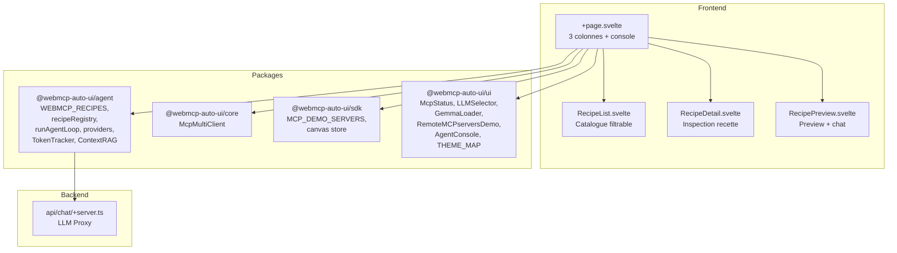

Recipes (`apps/recipes/`) est un explorateur interactif pour les recettes WebMCP (UI) et MCP (serveur). Les recettes sont des templates qui guident l'agent IA pour generer le bon ensemble de widgets selon le contexte (donnees meteo = graphiques + KPI, donnees parlementaires = fiche depute + hemicycle, etc.). L'app permet de parcourir, inspecter et tester chaque recette avec des donnees reelles.

## Ce que vous voyez quand vous ouvrez l'app

Quand vous ouvrez Recipes, vous decouvrez une interface professionnelle en 3 colonnes sur desktop, avec un layout adaptatif tablette/mobile.

**Barre d'outils** (haut) : titre "Auto-UI recipes" a gauche. A droite : un bouton "MCP" pour ouvrir le panneau de connexion aux serveurs, une checkbox Nano-RAG, un selecteur LLM, un indicateur MCP, le compteur de recettes ("X local + Y mcp"), un lien GitHub, et un toggle de theme.

**Colonne gauche** (redimensionnable, ~220px par defaut) : le composant `RecipeList` affiche le catalogue des recettes. En haut, les recettes WebMCP locales (built-in). En bas, les recettes MCP chargees depuis les serveurs connectes. Chaque recette est un item cliquable avec son nom.

**Colonne centrale** (redimensionnable, ~350px) : le composant `RecipeDetail` affiche le detail de la recette selectionnee -- nom, description, composants attendus, conditions d'activation ("when"), corps markdown, et un bouton "Tester" pour lancer l'agent.

**Colonne droite** (extensible) : le composant `RecipePreview` combine un chat input en bas et une zone de preview en haut. Les widgets generes par l'agent s'affichent ici, avec le texte de sortie et les erreurs eventuelles. Le chat permet de poser des questions libres (avec un placeholder contextuel qui change selon la recette selectionnee) ou de tester la recette selectionnee.

**Barre de resize** : entre chaque colonne, une barre verticale draggable permet de redimensionner les colonnes.

**Console agent** (bas) : un tiroir redimensionnable (drag vertical) affiche les logs structures de l'agent via `AgentConsole` : iterations, requetes LLM, reponses (tokens + latence), appels d'outils avec arguments et resultats, metriques finales.

**Panneau MCP** (pliable) : quand le bouton "MCP" est active, un panneau horizontal s'affiche sous la barre d'outils avec `RemoteMCPserversDemo` pour connecter/deconnecter les serveurs de demo.

**Mobile** : sur ecran < 768px, les 3 colonnes sont remplacees par des onglets (Recettes, Detail, Preview). La console est reduite a 120px.

## Architecture



## Stack technique

| Composant | Detail |
|-----------|--------|
| Framework | SvelteKit + Svelte 5 |
| Styles | TailwindCSS 3.4 + CSS custom (3-column layout) |
| Icones | lucide-svelte |
| LLM providers | `RemoteLLMProvider`, `WasmProvider` |
| MCP | `McpMultiClient` |
| Recettes | `WEBMCP_RECIPES`, `recipeRegistry` |
| RAG | `ContextRAG` (experimental) |
| Adapter | `@sveltejs/adapter-node` |

**Packages utilises :**
- `@webmcp-auto-ui/agent` : `WEBMCP_RECIPES`, `recipeRegistry`, `runAgentLoop`, `RemoteLLMProvider`, `WasmProvider`, `buildSystemPrompt`, `fromMcpTools`, `trimConversationHistory`, `TokenTracker`, `autoui`, `buildDiscoveryCache`, `ContextRAG`
- `@webmcp-auto-ui/core` : `McpMultiClient`
- `@webmcp-auto-ui/sdk` : `MCP_DEMO_SERVERS`, `canvas`
- `@webmcp-auto-ui/ui` : `McpStatus`, `LLMSelector`, `GemmaLoader`, `RemoteMCPserversDemo`, `AgentConsole`, `THEME_MAP`

## Lancement

| Environnement | Port | Commande |
|---------------|------|----------|
| Dev | 3009 | `npm -w apps/recipes run dev` |
| Production | 3009 | `node index.js` (via systemd) |

```bash
npm -w apps/recipes run dev
# Accessible sur http://localhost:3009
```

## Fonctionnalites

### Catalogue de recettes

Les recettes sont chargees depuis deux sources :
- **Locales** : `WEBMCP_RECIPES` du package agent (built-in, toujours disponibles)
- **MCP** : chargees dynamiquement depuis les serveurs connectes qui exposent un outil `list_recipes`

Le composant `RecipeList` affiche les deux listes separees avec selection par clic.

### Inspection de recette

Le composant `RecipeDetail` affiche pour chaque recette :
- Nom et description
- Composants attendus (types de widgets)
- Conditions d'activation ("when" -- quand l'agent doit utiliser cette recette)
- Corps markdown (instructions detaillees)
- Bouton "Tester" pour lancer l'agent

### Test live avec placeholder contextuel

Le chat input adapte son placeholder en fonction de la recette selectionnee. Par exemple :
- Recette "biodiversite" : "Quels oiseaux observe-t-on a Paris ?"
- Recette "profil parlementaire" : "Montre-moi les derniers scrutins publics"
- Recette "meteo" : "Quel temps fait-il a Lyon demain ?"

Le prefill est derive reactivement via `PLACEHOLDER_ID_MAP` et `PLACEHOLDER_MAP`.

### Colonnes redimensionnables

Les barres de resize entre les colonnes utilisent l'API `PointerEvent` (capture + move + up). Les largeurs minimales sont protegees (150px min).

### Console agent redimensionnable

Le tiroir de console en bas utilise le meme pattern de resize vertical. Hauteur min 80px, max 50% de la fenetre.

### Recettes disponibles (built-in)

| Recette | Composants | Quand |
|---------|-----------|-------|
| Tableau de bord KPI | stat-card, chart, table, kv | Metriques numeriques |
| Oeuvres d'art | gallery, cards, carousel | Collection d'images |
| Actualites | cards, table, stat-card | Articles |
| Biodiversite | map, stat-card, table | Donnees geographiques |
| Dossiers legislatifs | timeline, kv, table | Parcours legislatif |
| Profil parlementaire | profile, hemicycle, timeline | Fiche depute |
| Textes juridiques | list, kv, code | Textes de loi |

### Gemma WASM

Meme support que Flex et Multi-Svelte : chargement in-browser avec progression.

### Conversation continue

Le chat supporte la conversation continue. Les messages precedents sont conserves dans `conversationHistory` et tronques si necessaire via `trimConversationHistory`. Un bouton "Clear" reinitialise la conversation et les previews.

## Configuration

| Variable | Description | Defaut |
|----------|-------------|--------|
| `ANTHROPIC_API_KEY` | Cle API du provider LLM distant (`.env`) | requis |

## Code walkthrough

### `+page.svelte`
Fichier principal (~850 lignes). Gere :
- L'etat de selection des recettes (locale vs MCP)
- La connexion multi-MCP avec chargement automatique des recettes
- Les providers LLM (distant + Gemma) avec smart defaults
- Les layers (MCP + autoui) et le prompt systeme
- La boucle agent avec callbacks detailles (logs, widgets, texte, outils)
- Le layout 3 colonnes avec resize
- La console agent redimensionnable
- Le theme via `THEME_MAP`

### `src/lib/RecipeList.svelte`
Composant de liste avec deux sections (local + MCP). Gere la selection et le callback `onselect(id, source)`.

### `src/lib/RecipeDetail.svelte`
Composant de detail avec affichage du frontmatter, du corps markdown, et du bouton "Tester".

### `src/lib/RecipePreview.svelte`
Composant de preview avec chat input en bas, widgets rendus via `WidgetRenderer` en haut, et indicateur `AgentProgress`.

## Personnalisation

### Ajouter des recettes

Les recettes sont definies dans le package `agent`. Pour en ajouter, modifier le fichier de recettes dans `packages/agent/src/recipes/`.

### Modifier le layout

Le layout 3 colonnes est defini en CSS dans `<style>` du `+page.svelte`. Les breakpoints sont :
- Desktop (> 1024px) : 3 colonnes
- Tablette (768-1024px) : 2 colonnes (liste + detail)
- Mobile (< 768px) : onglets

## Deploiement

| Chemin sur le serveur | `/opt/webmcp-demos/recipes/` (racine) |
|----------------------|----------------------------------------|
| Service systemd | `webmcp-recipes` |
| ExecStart | `node index.js` |

```bash
./scripts/deploy.sh recipes
```

## Liens

- [Demo live](https://demos.hyperskills.net/recipes/)
- [Package agent](/webmcp-auto-ui/packages/agent/) -- `WEBMCP_RECIPES`, `recipeRegistry`
- [Flex](/webmcp-auto-ui/apps/flex/) -- utilisation des recettes en contexte
- [Viewer](/webmcp-auto-ui/apps/viewer/) -- pour consulter les skills generees
