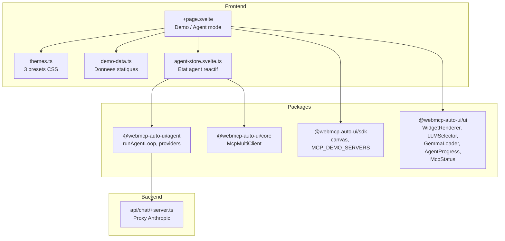

Showcase (`apps/showcase2/`) est la vitrine interactive de tous les composants UI du projet. Elle fonctionne en deux modes : un mode **demo statique** qui affiche chaque type de widget avec des donnees d'exemple, et un mode **agent** ou un LLM genere les widgets a partir de donnees reelles d'un serveur MCP. Trois themes prealables transforment completement l'apparence de tous les composants.

## Ce que vous voyez quand vous ouvrez l'app

Quand vous ouvrez Showcase, vous voyez une page plein ecran avec un header sticky et translucide.

**Header** : a gauche, "WebMCP Auto-UI" en gras avec un sous-titre "Component Showcase -- Corporate" (le theme actif). Au centre, trois boutons de theme : Corporate, Pastel, Cyberpunk. A droite, un lien GitHub.

**Barre de controles agent** : juste en dessous, une rangee de controles permet de piloter l'agent :
- Un selecteur de serveur MCP (dropdown avec les serveurs de demo)
- Un selecteur de modele LLM (haiku, sonnet, opus, Gemma E2B/E4B)
- Une checkbox Nano-RAG (experimentale)
- Un bouton "Generate" qui connecte le serveur MCP selectionne et lance l'agent
- Un indicateur de connexion MCP une fois connecte

**Mode demo (par defaut)** : la page affiche tous les widgets en deux sections :
- **Simple Widgets** : grille 3 colonnes avec stat, kv, list, chart, alert, code, text, actions, tags
- **Rich Widgets** : colonne unique pour les widgets larges (table, cards, gallery, carousel, timeline, profile, hemicycle, map, etc.)

Chaque widget est encadre dans un conteneur avec un bandeau superieur affichant son label et son `type` en code colore.

**Mode agent** : quand vous cliquez "Generate", l'agent se connecte au serveur MCP, interroge les donnees, et genere des widgets adaptes. La page passe en mode agent et affiche les widgets generes a la place des demos statiques.

## Architecture



## Stack technique

| Composant | Detail |
|-----------|--------|
| Framework | SvelteKit + Svelte 5 |
| Styles | TailwindCSS 3.4 |
| LLM providers | `RemoteLLMProvider` (Claude), `WasmProvider` (Gemma) |
| MCP | `McpMultiClient` |
| Themes | 3 presets avec CSS custom properties |
| Adapter | `@sveltejs/adapter-node` |

**Packages utilises :**
- `@webmcp-auto-ui/agent` : `runAgentLoop`, `RemoteLLMProvider`, `WasmProvider`, `buildSystemPrompt`, `fromMcpTools`, `autoui`, `buildDiscoveryCache`, `ContextRAG`
- `@webmcp-auto-ui/core` : `McpMultiClient`
- `@webmcp-auto-ui/sdk` : `canvas`, `MCP_DEMO_SERVERS`
- `@webmcp-auto-ui/ui` : `WidgetRenderer`, `LLMSelector`, `GemmaLoader`, `AgentProgress`, `McpStatus`, `getTheme`

## Lancement

| Environnement | Port | Commande |
|---------------|------|----------|
| Dev | 5178 | `npm -w apps/showcase2 run dev` |
| Production | 3010 | `PORT=3010 node build/index.js` |

```bash
npm -w apps/showcase2 run dev
# Accessible sur http://localhost:5178
```

## Fonctionnalites

### 3 themes dynamiques

Les themes modifient les CSS custom properties du document en temps reel :

| Theme | Mode | Accent | Style |
|-------|------|--------|-------|
| **Corporate** | dark | bleu `#3b82f6` | Professionnel, gris ardoise |
| **Pastel** | light | violet `#8b5cf6` | Fond creme, tons chauds |
| **Cyberpunk** | dark | vert neon `#00ffaa` | Noir profond, neon rose/vert |

Chaque theme definit 11 variables CSS (bg, surface, surface2, border, border2, accent, accent2, amber, teal, text1, text2). Le changement de theme est instantane et affecte tous les widgets simultanément.

### Mode demo statique

Le fichier `demo-data.ts` fournit des donnees d'exemple pour chaque type de widget. Les widgets sont repartis en deux categories :
- **Simple** (grille 3 colonnes) : stat, kv, list, chart, alert, code, text, actions, tags
- **Rich** (pleine largeur) : table, cards, gallery, carousel, timeline, profile, hemicycle, map, etc.

### Mode agent genere

Quand vous cliquez "Generate" :
1. L'app se connecte au serveur MCP selectionne
2. L'agent construit les layers (MCP + autoui)
3. `runAgentLoop` genere des widgets a partir des donnees reelles
4. Les widgets remplacement les demos statiques
5. Les metriques s'affichent : nombre de widgets, tool calls, temps

Un bouton "Demo mode" permet de revenir aux widgets statiques.

### Gemma WASM in-browser

En selectionnant Gemma E2B ou E4B, le modele est charge directement dans le navigateur. Le composant `GemmaLoader` affiche la progression du telechargement avec les MB charges/total et le temps ecoule.

### Nano-RAG experimental

Activable via une checkbox. Utilise `ContextRAG` pour compacter le contexte de l'agent via des embeddings.

## Configuration

| Variable | Description | Defaut |
|----------|-------------|--------|
| `ANTHROPIC_API_KEY` | Cle API Anthropic (`.env` server-side) | requis |

## Code walkthrough

### `src/lib/themes.ts`
Definit l'interface `ThemePreset` et les 3 presets. Chaque preset est un objet avec `id`, `label`, `mode` (light/dark) et `overrides` (map de variables CSS).

### `src/lib/demo-data.ts`
Exporte `SIMPLE_BLOCKS` et `RICH_BLOCKS`, deux tableaux de `DemoBlock` avec type, label et data. Les donnees sont realistes : metriques serveur, configuration reseau, liste de projets, historique de prix, etc.

### `src/lib/agent-store.svelte.ts`
Store reactif Svelte 5 qui encapsule toute la logique agent : connexion MCP, initialisation Gemma, generation de widgets, suivi des metriques. Separe du composant principal pour une meilleure lisibilite.

### `+page.svelte`
Orchestre les deux modes (demo/agent), les themes, et les composants UI. Le `$derived` `displayBlocks` determine quels widgets afficher selon le mode actif.

## Personnalisation

### Ajouter un theme

Ajouter un objet dans le tableau `PRESETS` de `themes.ts` :

```typescript
{
  id: 'ocean',
  label: 'Ocean',
  mode: 'dark',
  overrides: {
    'color-bg': '#0a1628',
    'color-accent': '#0ea5e9',
    // ... 9 autres variables
  },
}
```

### Ajouter des widgets de demo

Ajouter un objet dans `SIMPLE_BLOCKS` ou `RICH_BLOCKS` de `demo-data.ts` avec le `type` correspondant a un widget supporte par `WidgetRenderer`.

## Deploiement

| Chemin sur le serveur | `/opt/webmcp-demos/showcase2/` (racine) |
|----------------------|------------------------------------------|
| Service systemd | `webmcp-showcase2` |
| ExecStart | `node build/index.js` |

```bash
./scripts/deploy.sh showcase2
```

## Liens

- [Demo live](https://demos.hyperskills.net/showcase2/)
- [Package UI](/packages/ui/) -- tous les widgets
- [Flex](/apps/flex2/) -- utilisation complete avec agent
