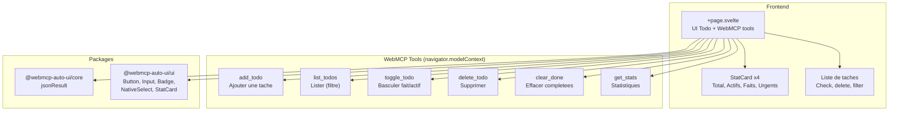

Todo (`apps/todo2/`) est une application de gestion de taches qui expose ses operations via le protocole W3C WebMCP. Contrairement aux autres apps du projet, elle n'utilise pas d'agent LLM ni de connexion MCP distante -- elle **est** elle-meme un serveur WebMCP. C'est une demonstration de la facon dont une app existante peut devenir "MCP-ready" en enregistrant ses fonctions comme outils WebMCP.

## Ce que vous voyez quand vous ouvrez l'app

Quand vous ouvrez Todo, vous voyez une interface de todo-list classique et bien finie, dans un style sombre monospace.

En haut, une barre affiche "Todo2 WebMCP" avec un indicateur vert "6 tools" qui confirme que l'app a enregistre ses outils WebMCP dans le navigateur.

Juste en dessous, 4 cartes `StatCard` affichent les metriques en temps reel :
- **Total** : nombre total de taches
- **Actifs** : taches non terminees
- **Faits** : taches completees
- **Urgents** : taches de priorite haute non terminees

Un formulaire d'ajout propose un champ texte, un selecteur de priorite (low/normal/high) et un bouton "Ajouter".

Trois boutons filtres (Tous, Actifs, Faits) permettent de filtrer la liste. Un bouton rouge "Effacer faits" apparait quand il y a des taches completees.

La liste de taches affiche chaque tache avec :
- Un bouton check/circle pour basculer l'etat
- Un point de couleur (rouge pour high, gris pour normal, gris fonce pour low)
- Le texte de la tache (barre si completee)
- Un badge de priorite
- Un bouton poubelle au survol pour supprimer

L'app demarre avec 3 taches pre-remplies : "Activer WebMCP dans chrome://flags", "Tester les outils dans l'extension", et "Lire la doc WebMCP W3C" (deja completee).

## Architecture



## Stack technique

| Composant | Detail |
|-----------|--------|
| Framework | SvelteKit + Svelte 5 |
| Styles | TailwindCSS 3.4 |
| Icones | lucide-svelte (Check, Trash2, Plus, Circle) |
| Adapter | `@sveltejs/adapter-static` |
| WebMCP | `navigator.modelContext.registerTool()` |

**Packages utilises :**
- `@webmcp-auto-ui/core` : `jsonResult` (helper pour formater les reponses d'outils)
- `@webmcp-auto-ui/ui` : `Button`, `Input`, `Badge`, `NativeSelect`, `StatCard`

:::note
Todo2 n'utilise pas les packages `agent` ni `sdk`. C'est l'app la plus simple du projet -- elle ne fait qu'exposer ses fonctions via l'API W3C WebMCP du navigateur.
:::

## Lancement

| Environnement | Port | Commande |
|---------------|------|----------|
| Dev | 5176 | `npm -w apps/todo2 run dev` |
| Production | -- | Fichiers statiques (nginx) |

```bash
npm -w apps/todo2 run dev
# Accessible sur http://localhost:5176
```

## Fonctionnalites

### 6 outils WebMCP

Les outils sont enregistres au `onMount` via `navigator.modelContext.registerTool()` et desenregistres au `onDestroy` :

| Outil | Description | Annotations |
|-------|-------------|-------------|
| `add_todo` | Ajoute une tache avec texte et priorite optionnelle | -- |
| `list_todos` | Liste les taches avec filtre optionnel (all/active/done) | `readOnlyHint: true` |
| `toggle_todo` | Bascule une tache entre fait et actif | -- |
| `delete_todo` | Supprime une tache par ID | `destructiveHint: true` |
| `clear_done` | Supprime toutes les taches completees | `destructiveHint: true` |
| `get_stats` | Retourne les statistiques (total, active, done, high) | `readOnlyHint: true` |

Les annotations `readOnlyHint` et `destructiveHint` informent le LLM du comportement de l'outil pour une meilleure prise de decision.

### Composants UI du package

L'app utilise exclusivement les composants du package `@webmcp-auto-ui/ui` :
- `StatCard` pour les 4 metriques avec variantes (default, info, success, error)
- `Button` avec variantes (default, outline, ghost, destructive) et tailles (sm, icon)
- `Input` pour le champ de saisie
- `NativeSelect` pour le selecteur de priorite
- `Badge` avec variante secondary pour les labels de priorite

### Etat reactif Svelte 5

L'app utilise les runes Svelte 5 (`$state`, `$derived`) pour un etat entierement reactif :
- `todos` : liste reactive des taches
- `filter` : filtre actif
- `stats` : statistiques derivees automatiquement
- `filtered` : liste filtree derivee

## Configuration

L'app n'a pas de variable d'environnement. Toutes les donnees sont en memoire (pas de persistance).

## Code walkthrough

### `+page.svelte`
Fichier unique de l'app (~200 lignes). Il contient :

**Types et etat** (lignes 1-30) : interface `Todo` avec id, text, done, priority, createdAt. Trois taches pre-remplies.

**CRUD** (lignes 30-50) : fonctions `addTodo`, `toggleTodo`, `deleteTodo`, `clearDone` qui manipulent le tableau reactif.

**WebMCP** (lignes 72-116) : au `onMount`, les 6 outils sont enregistres via `navigator.modelContext.registerTool()`. Chaque outil definit un `inputSchema` (JSON Schema) et une fonction `execute` qui appelle la fonction CRUD correspondante et retourne le resultat via `jsonResult`.

**UI** (lignes 120-206) : le template Svelte avec header, stats, formulaire, filtres et liste.

## Personnalisation

### Comme template minimal

Todo2 est le point de depart le plus simple pour creer une app WebMCP :

```bash
cp -r apps/todo2 apps/mon-app
```

Modifier :
1. `package.json` : changer le nom et le port
2. `+page.svelte` : remplacer le type `Todo` par votre modele de donnees
3. Adapter les fonctions CRUD et les outils WebMCP

### Ajouter de la persistance

L'app stocke tout en memoire. Pour persister :
- **localStorage** : ajouter un `$effect` qui sauvegarde `todos` a chaque changement
- **Backend** : ajouter un endpoint API et remplacer les fonctions CRUD par des appels fetch

### Connecter a un agent

Pour piloter les outils via un agent LLM (au lieu du navigateur), voir l'architecture du [Boilerplate](/webmcp-auto-ui/apps/boilerplate/) qui integre `runAgentLoop`.

## Deploiement

| Chemin sur le serveur | `/opt/webmcp-demos/todo2/` (racine) |
|----------------------|--------------------------------------|
| Servi par | nginx (fichiers statiques) |

```bash
./scripts/deploy.sh todo2
```

## Liens

- [Demo live](https://demos.hyperskills.net/todo2/)
- [Package core](/webmcp-auto-ui/packages/core/) -- `jsonResult`
- [Package UI](/webmcp-auto-ui/packages/ui/) -- composants utilises
- [Boilerplate](/webmcp-auto-ui/apps/boilerplate/) -- version avec agent IA
