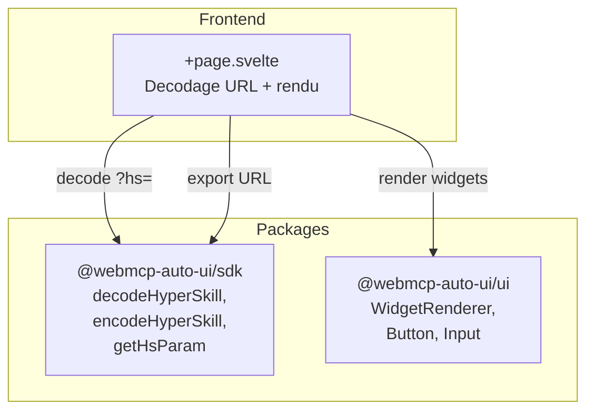

Viewer (`apps/viewer/`) est le lecteur de HyperSkills du projet. Il decode les URLs compressees `?hs=`, affiche les widgets dans une interface de lecture, et permet de creer, modifier et exporter des skills. C'est l'outil de consultation et de partage : quand quelqu'un vous envoie un lien HyperSkill, c'est le Viewer qui l'affiche.

## Ce que vous voyez quand vous ouvrez l'app

Quand vous ouvrez le Viewer sans parametre `?hs=`, vous voyez un ecran vide avec un hexagone grise et le message "Aucun parametre `?hs=` dans l'URL". Une barre "Paste URI" en haut vous invite a coller un lien HyperSkill, avec un bouton "Nouvelle" pour creer une skill vierge.

Quand une skill est chargee (via URL ou paste), l'interface se transforme :

- **En-tete** : le titre de la skill, sa description, et des boutons d'action -- "DAG" pour voir l'arbre de versions, "Tester dans Recipes" pour lancer un test live, "Modifier" pour ouvrir la skill dans Flex
- **Barre paste** : toujours visible pour charger une autre skill, plus un bouton "Exporter URL" pour copier le lien dans le presse-papier
- **Carte meta** : titre, description, serveur MCP d'origine, hash SHA, version
- **Widgets** : chaque bloc est rendu via `WidgetRenderer` dans un conteneur avec une barre d'outils au survol (modifier JSON, supprimer)
- **Bouton "Ajouter un widget"** : en bas, un bouton en pointille permet d'ajouter manuellement un widget de type `text`
- **Panneau DAG** : quand active, affiche une timeline horizontale des versions avec des noeuds cliquables relies par des fleches SVG

## Architecture



## Stack technique

| Composant | Detail |
|-----------|--------|
| Framework | SvelteKit + Svelte 5 |
| Styles | TailwindCSS 3.4 |
| Icones | lucide-svelte (ExternalLink, Pencil, Plus, Trash2, FlaskConical, GitBranch, Github) |
| Adapter | `@sveltejs/adapter-node` |

**Packages utilises :**
- `@webmcp-auto-ui/sdk` : `decodeHyperSkill`, `encodeHyperSkill`, `getHsParam`
- `@webmcp-auto-ui/ui` : `WidgetRenderer`, `Button`, `Input`

:::note
Le Viewer n'utilise pas le package `agent` et n'a pas de connexion MCP. C'est une app de consultation pure.
:::

## Lancement

| Environnement | Port | Commande |
|---------------|------|----------|
| Dev | 3008 | `npm -w apps/viewer run dev` |
| Production | 3008 | `node build/index.js` (via systemd) |

```bash
npm -w apps/viewer run dev
# Accessible sur http://localhost:3008
```

## Fonctionnalites

### Decodage HyperSkill URL

Le Viewer decode automatiquement le parametre `?hs=` au chargement. Le parametre contient une skill encodee en base64 gzip avec metadonnees (titre, description, hash, version) et contenu (liste de blocs type + data).

### Paste URI

Collez n'importe quelle URL HyperSkill (ou directement la valeur du parametre `hs`) dans la barre de saisie. Le Viewer la decode et met a jour l'URL du navigateur via `history.pushState`.

### CRUD de widgets

Chaque widget est editable :
- **Modifier** : ouvre un editeur JSON inline pour modifier le `data` du widget
- **Supprimer** : retire le widget de la liste
- **Ajouter** : cree un nouveau widget de type `text` avec un contenu par defaut
- **Changer le type** : dans l'editeur, le champ type est modifiable

### DAG de versions

Le graphe de versions affiche la chaine de hash SHA. Chaque skill peut reference un `previousHash`, formant un arbre oriente (DAG). Les noeuds sont affiches comme des boutons cliquables avec des fleches SVG entre eux.

### Navigation inter-apps

Deux boutons permettent de naviguer :
- **"Modifier"** : ouvre la skill dans Flex pour l'editer avec l'agent IA
- **"Tester dans Recipes"** : ouvre la skill dans l'explorateur de recettes

### Export URL

Le bouton "Exporter URL" re-encode la skill (avec toutes les modifications) en URL HyperSkill et la copie dans le presse-papier.

## Configuration

Le Viewer n'a pas de variable d'environnement. Il fonctionne entierement cote client.

## Code walkthrough

### `+page.svelte`
Fichier unique de l'app. Il gere :
- Le decodage de l'URL via `getHsParam` + `decodeHyperSkill` au `onMount`
- L'extraction des blocs depuis la structure HyperSkill decodee
- La construction du DAG de versions depuis les metadonnees `hash` / `previousHash`
- L'edition inline JSON avec validation (le bouton "Sauvegarder" est bloque si le JSON est invalide)
- L'export via `encodeHyperSkill` avec copie dans le presse-papier

### URL d'exemple

```
http://localhost:3008/?hs=eyJtZXRhIjp7InRpdGxlIjoiV2VhdGhlciJ9LCJjb250ZW50IjpbeyJ0eXBlIjoic3RhdCIsImRhdGEiOnsibGFiZWwiOiJUZW1wIiwidmFsdWUiOiIxNEMifX1dfQ==
```

## Personnalisation

Pour etendre le Viewer :
1. **Ajouter des types de blocs** : les widgets sont rendus par `WidgetRenderer`, qui supporte tous les types du package UI
2. **Modifier le DAG** : etendre la logique `buildDag()` pour afficher un arbre complet avec navigation
3. **Ajouter un mode collaboratif** : integrer un backend pour stocker les skills et partager les URLs

## Deploiement

| Chemin sur le serveur | `/opt/webmcp-demos/viewer/build/` (sous-dossier) |
|----------------------|---------------------------------------------------|
| Service systemd | `webmcp-viewer` |
| ExecStart | `node build/index.js` |

:::caution
Le Viewer est deploye dans le sous-dossier `build/`, pas a la racine. Le script `deploy.sh` gere ce chemin automatiquement.
:::

```bash
./scripts/deploy.sh viewer
```

## Liens

- [Demo live](https://demos.hyperskills.net/viewer/)
- [Package SDK](/webmcp-auto-ui/packages/sdk/) -- `decodeHyperSkill`, `encodeHyperSkill`
- [Flex](/webmcp-auto-ui/apps/flex/) -- pour editer avec l'agent IA
- [Recipes](/webmcp-auto-ui/apps/recipes/) -- pour tester les recettes
