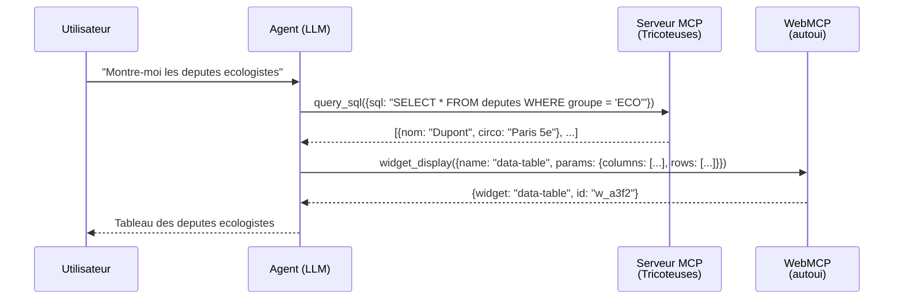
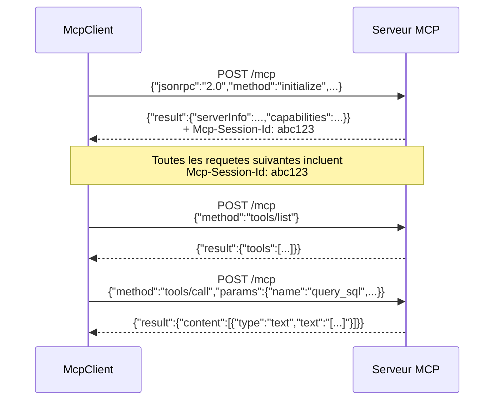
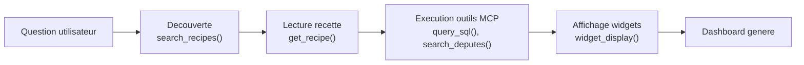
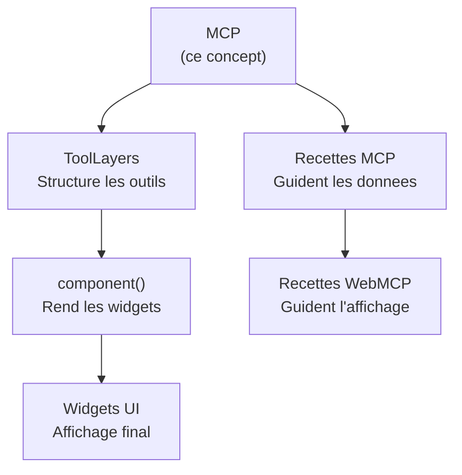

Imaginez un traducteur universel dans une conference internationale. Chaque intervenant parle une langue differente (SQL, API REST, GraphQL...), mais le traducteur convertit tout en un langage commun que tout le monde comprend. MCP joue exactement ce role entre les agents IA et les sources de donnees.

## Qu'est-ce que MCP ?

**MCP** (Model Context Protocol) est un protocole standardise par Anthropic, base sur JSON-RPC 2.0, qui permet a un agent IA de decouvrir et appeler des **outils** exposes par des serveurs distants. C'est le "USB" de l'IA : un connecteur unique pour brancher n'importe quelle source de donnees.

Dans webmcp-auto-ui, MCP est la couche de communication entre les **donnees** (serveurs MCP) et l'**interface** (widgets WebMCP).

## Pourquoi deux protocoles ? MCP vs WebMCP

C'est la distinction fondamentale du projet. Deux mondes cohabitent :

| | MCP (standard Anthropic) | WebMCP (polyfill navigateur) |
|--|--------------------------|------------------------------|
| **Ou ca tourne** | Reseau (HTTP/SSE) | Dans le navigateur (postMessage) |
| **Transport** | JSON-RPC 2.0 sur HTTP POST | Appels de fonctions JS en memoire |
| **Qui l'expose** | Un serveur distant (ex: base de donnees parlementaire) | Le serveur `autoui` local (widgets UI) |
| **Ce qu'il fournit** | Des **donnees** (SQL, API, fichiers) | De l'**affichage** (stat, chart, table, carte) |
| **Session** | Header `Mcp-Session-Id`, reconnexion auto | Pas de session, tout est local |
| **Spec** | Anthropic MCP specification | W3C WebMCP Draft CG Report (2026-03-27) |

:::tip[La regle d'or]
**MCP** = "qu'est-ce que je vais chercher ?" (donnees)
**WebMCP** = "comment est-ce que je l'affiche ?" (interface)
:::

### Diagramme : MCP vs WebMCP en action



Le LLM orchestre les deux protocoles de facon transparente : il **recupere** les donnees via MCP, puis les **presente** via WebMCP. L'utilisateur ne voit que le resultat final.

## Architecture multi-serveurs

Un agent peut se connecter a **plusieurs** serveurs MCP simultanement. Chaque serveur produit un `McpLayer` avec ses propres outils et recettes. Le LLM voit tous les outils de tous les serveurs dans un seul prompt unifie.

```mermaid
graph TD
    subgraph Agent
        L[Agent Loop]
        LLM[LLM Claude/Gemma/Ollama]
    end

    subgraph "Couche donnees MCP"
        S1[Serveur MCP 1<br/>Tricoteuses<br/>12 outils DATA]
        S2[Serveur MCP 2<br/>iNaturalist<br/>8 outils DATA]
    end

    subgraph "Couche affichage WebMCP"
        UI[autoui<br/>24+ widgets natifs<br/>+ canvas + recall]
    end

    L --> LLM
    LLM -->|tool_use| S1
    LLM -->|tool_use| S2
    LLM -->|widget_display| UI
    S1 -->|resultats JSON| LLM
    S2 -->|resultats JSON| LLM
    UI -->|{widget, id}| LLM
```

## McpClient : la connexion a un serveur

Le `McpClient` gere une connexion unique vers un serveur MCP. Il s'occupe de l'initialisation de session, des appels d'outils, et de la reconnexion automatique.

```ts
import { McpClient } from '@webmcp-auto-ui/core';

// 1. Creer le client avec ses options
const client = new McpClient('https://mcp.code4code.eu/mcp', {
  clientName: 'my-app',        // identifiant de votre app
  clientVersion: '1.0.0',
  timeout: 30000,               // 30s par requete
  headers: {                    // authentification si necessaire
    'Authorization': 'Bearer <token>',
  },
  autoReconnect: true,           // re-initialise si la session expire
  maxReconnectAttempts: 3,       // abandonne apres 3 tentatives
});

// 2. Initialiser la session (obligatoire avant tout appel)
await client.connect();

// 3. Decouvrir les outils du serveur
const tools = await client.listTools();
// -> [{ name: "query_sql", description: "Execute une requete SQL", inputSchema: {...} }, ...]

// 4. Appeler un outil
const result = await client.callTool('query_sql', { sql: 'SELECT COUNT(*) FROM deputes' });
// -> { content: [{ type: "text", text: "[{\"count\": 577}]" }] }

// 5. Fermer proprement (eviter les fuites de session)
await client.disconnect();
```

### API du McpClient

| Methode | Retour | Description |
|---------|--------|-------------|
| `connect()` | `McpInitializeResult` | Initialise la session JSON-RPC, echange les capabilities |
| `listTools()` | `McpTool[]` | Liste les outils avec nom, description, schema |
| `callTool(name, args?)` | `McpToolResult` | Appelle un outil, retourne du contenu texte/image |
| `disconnect()` | `void` | Ferme la session proprement |

## McpMultiClient : la connexion multi-serveurs

Quand vous devez interroger plusieurs sources de donnees simultanement, le `McpMultiClient` gere les connexions, agrege les listes d'outils, et route chaque appel vers le bon serveur.

```ts
import { McpMultiClient } from '@webmcp-auto-ui/core';

const multi = new McpMultiClient();

// Connecter deux serveurs
await multi.addServer('https://mcp.code4code.eu/mcp');    // politique
await multi.addServer('https://mcp.inaturalist.org/mcp');  // biodiversite

// Voir tous les outils de tous les serveurs
const allTools = multi.listAllTools();
// -> [query_sql, search_deputes, list_species, search_observations, ...]

// Appeler un outil — le routing est automatique
const result = await multi.callTool('query_sql', { sql: 'SELECT 1' });

// Deconnecter un serveur specifique
await multi.removeServer('https://mcp.code4code.eu/mcp');

// Deconnecter tout
await multi.disconnectAll();
```

## Transport : Streamable HTTP

Le protocole MCP utilise HTTP POST avec JSON-RPC 2.0. Voici ce qui se passe sous le capot :



### Details du transport

- **Content-Type** : `application/json`
- **Accept** : `application/json, text/event-stream`
- **Session** : le header `Mcp-Session-Id` est gere automatiquement apres `connect()`
- **Reconnexion** : sur une reponse 404 (session expiree), le client re-initialise avec backoff exponentiel
- **SSE** : quand le serveur repond en `text/event-stream`, le client parse les evenements Server-Sent Events

## Construction des couches MCP (ToolLayers)

Chaque serveur connecte produit un `McpLayer`. Le serveur `autoui` produit un `WebMcpLayer`. Ensemble, ils forment les `ToolLayer[]` qui structurent tout le prompt et les outils du LLM.

```ts
import { McpClient } from '@webmcp-auto-ui/core';
import { autoui } from '@webmcp-auto-ui/agent';
import type { McpLayer } from '@webmcp-auto-ui/agent';

// Couche donnees : serveur MCP
const client = new McpClient('https://mcp.code4code.eu/mcp');
await client.connect();

const mcpLayer: McpLayer = {
  protocol: 'mcp',
  serverUrl: 'https://mcp.code4code.eu/mcp',
  serverName: 'Tricoteuses',
  tools: await client.listTools(),
  recipes: [
    { name: 'profil-depute', description: 'Fiche complete depute' },
  ],
};

// Couche affichage : serveur WebMCP
const uiLayer = autoui.layer();

// Combiner les couches
const layers = [mcpLayer, uiLayer];
```

:::note[Les recettes serveur]
Les recettes MCP viennent du serveur et decrivent comment combiner ses outils. Elles sont distinctes des recettes WebMCP qui guident l'affichage. Voir la page [Recettes](/concepts/recipes/) pour la comparaison complete.
:::

## Ce que le LLM voit dans le prompt

La fonction `buildSystemPrompt(layers)` genere un prompt structure qui presente les outils et recettes par couche :

```
ETAPE 1 -- Recherche de recette
Cherche une recette pertinente :
autoui_webmcp_search_recipes()
tricoteuses_mcp_search_recipes()

ETAPE 2 -- Lecture de la recette
autoui_webmcp_get_recipe()
tricoteuses_mcp_get_recipe()

ETAPE 3 -- Execution
Suis les instructions de la recette...

ETAPE 4 -- Affichage UI
autoui_webmcp_widget_display
autoui_webmcp_canvas
```

Le prompt guide le LLM a travers un flux en 4 etapes : decouvrir les recettes, les lire, executer les outils DATA, puis afficher avec les widgets.

## Pattern complet : de la question au dashboard



### Exemple complet annote

```ts
import { McpClient } from '@webmcp-auto-ui/core';
import { runAgentLoop, autoui } from '@webmcp-auto-ui/agent';
import type { McpLayer } from '@webmcp-auto-ui/agent';

// 1. Connexion au serveur MCP
const client = new McpClient('https://mcp.code4code.eu/mcp');
await client.connect();
const tools = await client.listTools();

// 2. Construction de la couche DATA
const mcpLayer: McpLayer = {
  protocol: 'mcp',
  serverUrl: 'https://mcp.code4code.eu/mcp',
  serverName: 'Tricoteuses',
  tools,
};

// 3. Couche UI (autoui fournit les 24+ widgets natifs)
const uiLayer = autoui.layer();

// 4. Lancer la boucle agent
const result = await runAgentLoop('Liste les deputes ecologistes', {
  provider: claudeProvider,
  layers: [mcpLayer, uiLayer],     // les deux couches ensemble
  callbacks: {
    // Chaque widget rendu par le LLM arrive ici
    onWidget: (type, data) => {
      blocks.push({ type, data });
      return { id: 'w_' + Math.random().toString(36).slice(2, 6) };
    },
    // Le texte de l'assistant arrive ici
    onText: (text) => console.log('Assistant:', text),
  },
});
```

## Relations avec les autres concepts



- **ToolLayers** : MCP produit des `McpLayer` qui entrent dans le systeme de couches
- **Recettes** : les recettes MCP (serveur) et WebMCP (UI) sont deux systemes complementaires
- **component()** / **widget_display** : le LLM appelle ces outils pour rendre les donnees MCP en widgets

## Patterns avances

### Multi-serveurs avec correlation de donnees

Un agent peut croiser les donnees de deux serveurs MCP differents :

```ts
const layers = [
  tricoteusesLayer,  // donnees parlementaires
  iNaturalistLayer,  // donnees biodiversite
  autoui.layer(),    // widgets
];

// Le LLM peut chercher les deputes d'une region ET les observations
// de biodiversite dans la meme region, puis les presenter ensemble
await runAgentLoop('Compare les deputes du Var avec la biodiversite du departement', {
  provider: claudeProvider,
  layers,
  callbacks: { onWidget },
});
```

### Reconnexion avec session

Si le serveur MCP expire la session, le client re-initialise automatiquement :

```
Client -> POST /mcp (callTool)
Server -> 404 (session expiree)
Client -> POST /mcp (initialize)   // re-init automatique
Server -> 200 + nouveau session-id
Client -> POST /mcp (callTool)     // retry avec nouvelle session
Server -> 200 (resultat)
```

## Resume : tableau synthetique

| Aspect | MCP | WebMCP |
|--------|-----|--------|
| **Role** | Recuperer les donnees | Afficher les donnees |
| **Transport** | HTTP + JSON-RPC 2.0 | Appels JS en memoire |
| **Outils typiques** | `query_sql`, `search`, `list_tables` | `widget_display`, `canvas`, `recall` |
| **Recettes** | Comment combiner les outils DATA | Comment presenter avec les widgets |
| **Client** | `McpClient` / `McpMultiClient` | Pas de client (serveur local) |
| **Exemples de serveurs** | Tricoteuses, iNaturalist, Hacker News | `autoui` (le seul serveur WebMCP) |

## Contraintes

- Le serveur MCP doit supporter Streamable HTTP (POST JSON-RPC 2.0)
- `connect()` est obligatoire avant `listTools()` ou `callTool()`
- Les resultats sont text-based : parser le JSON depuis `content[0].text`
- La boucle agent tronque les resultats a 10 000 caracteres
- CORS : le serveur doit autoriser les requetes depuis votre domaine

## Erreurs courantes

| Erreur | Consequence | Correction |
|--------|-------------|-----------|
| `listTools()` avant `connect()` | Erreur session | Toujours `connect()` d'abord |
| Header `Authorization` manquant | 401/403 | Passer le Bearer token dans les options |
| `timeout` trop bas | Requete abortee | Augmenter pour les queries lourdes (60000+) |
| Pas de `disconnect()` | Fuite de session serveur | Appeler au unmount du composant |
| Confondre MCP et WebMCP | Mauvais outil appele | MCP = donnees, WebMCP = affichage |
