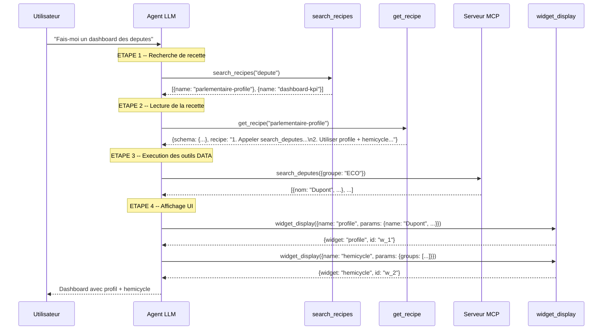
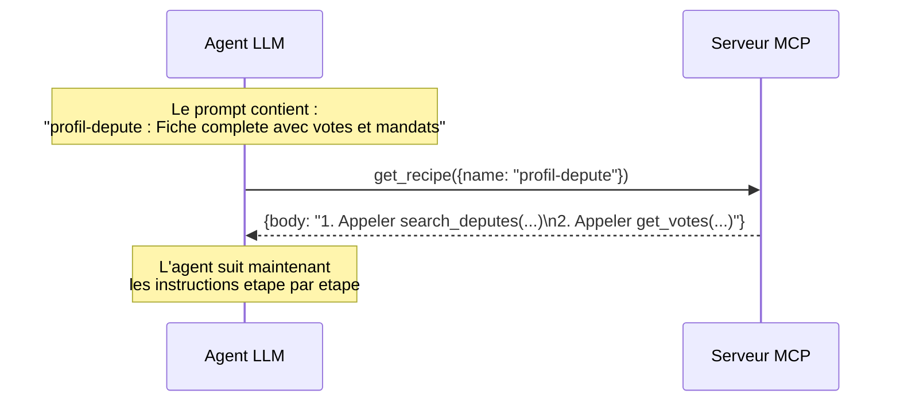
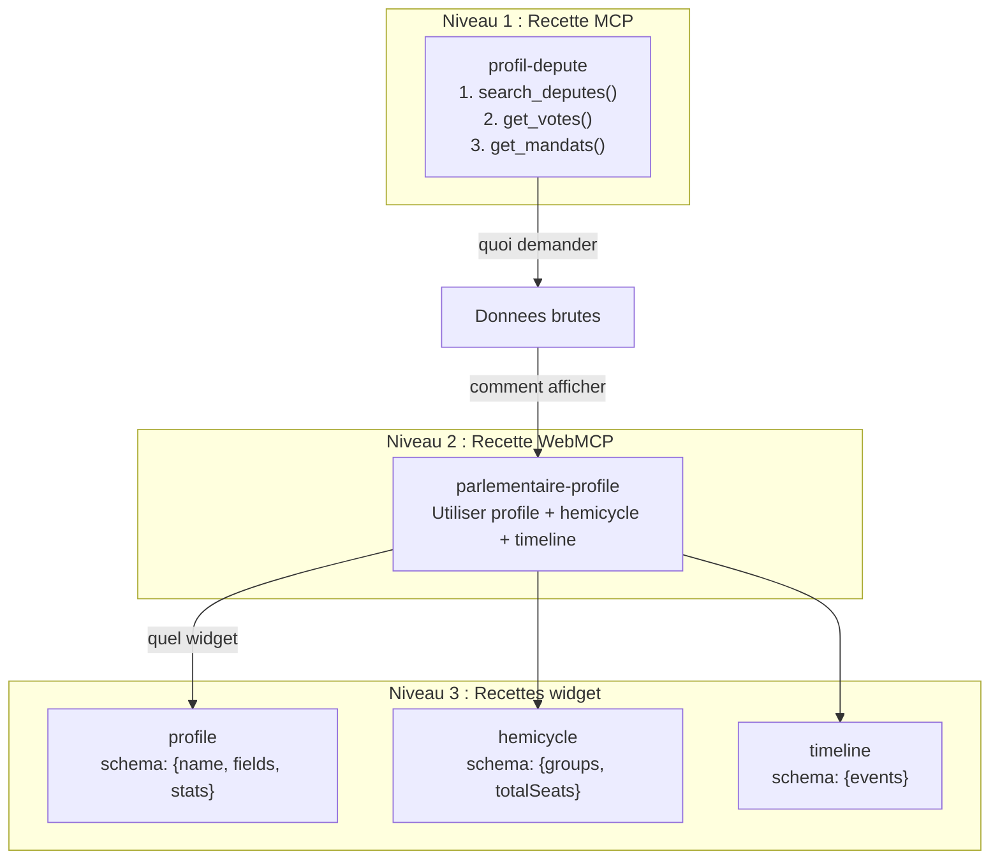

Imaginez un chef cuisinier dans une cuisine equipee. Il a les ingredients (les donnees MCP) et les ustensiles (les widgets UI). Mais sans **recette**, il devrait improviser a chaque plat. Les recettes lui disent : "avec ces ingredients, utilise ces ustensiles, dans cet ordre, pour obtenir ce resultat". C'est exactement ce que font les recettes dans webmcp-auto-ui.

## Qu'est-ce qu'une recette ?

Une recette est un **guide de composition** qui indique a l'agent comment transformer des donnees en interface. Il en existe deux types complementaires :

| | Recette WebMCP (UI) | Recette MCP (serveur) |
|--|---------------------|----------------------|
| **Qui la fournit** | Le package `agent` (fichiers `.md`) | Le serveur MCP distant |
| **Ce qu'elle guide** | **Comment afficher** les donnees (quels widgets, quel layout) | **Comment obtenir** les donnees (quels outils, dans quel ordre) |
| **Analogie** | La recette de presentation du plat | La recette de cuisson |

:::tip[Deux axes, un resultat]
L'agent utilise les deux ensemble : une recette MCP lui dit **quoi demander** au serveur, une recette WebMCP lui dit **comment presenter** le resultat. Comme un chef qui suit une recette de cuisson ET une recette de dressage.
:::

## Pourquoi les recettes existent

Sans recettes, l'agent devrait :
1. Deviner quels outils MCP appeler et dans quel ordre
2. Deviner quel widget convient pour quel type de donnees
3. Improviser la mise en page a chaque demande

Avec les recettes, l'agent suit un **chemin balisee** : il cherche une recette pertinente, la lit, et l'execute. Le resultat est plus fiable, plus rapide (moins de tokens de reflexion), et plus coherent.

## Le flux complet : de la question au dashboard



### Economie de tokens : le chargement paresseux

Le detail des recettes n'est **jamais** injecte dans le prompt initial. Seuls les noms et descriptions sont presents. Le LLM demande le body complet uniquement quand il en a besoin :

```
Prompt initial (~500 tokens pour 10 recettes) :
  "Recettes disponibles :
   - parlementaire-profile : profil depute [profile, hemicycle, timeline]
   - dashboard-kpi : metriques numeriques [stat-card, chart, table]"

→ Le LLM appelle get_recipe("parlementaire-profile")
→ Il recoit le body complet (~200 tokens) uniquement quand il en a besoin
```

Comparaison : injecter 10 recettes completes dans le prompt couterait ~2000 tokens supplementaires. Le chargement paresseux reduit ce cout a ~500 tokens fixes + ~200 tokens par recette effectivement utilisee.

## Recettes WebMCP (UI)

Les recettes WebMCP guident le LLM sur le **choix des widgets** et leur **agencement**. Ce sont des fichiers Markdown avec frontmatter YAML, distribues avec le package `@webmcp-auto-ui/agent`.

### Format d'une recette

```markdown
---
id: composer-tableau-de-bord-kpi
name: Composer un tableau de bord KPI
components_used: [stat-card, chart, table, kv]
when: les donnees contiennent des metriques numeriques
servers: []
layout:
  type: grid
  columns: 3
  arrangement: stat-cards en ligne, chart + table en dessous
---

## Quand utiliser
Les resultats MCP contiennent des metriques numeriques qu'il faut
presenter de facon synthetique : totaux, pourcentages, series temporelles.

## Comment
1. Identifier les 3-5 KPIs principaux
2. Afficher chaque KPI en stat-card avec formatage soigne
3. Ajouter un chart si des series temporelles existent
4. Completer avec un data-table pour les details

## Erreurs courantes
- Trop de stat-cards : au-dela de 5, basculer vers kv ou table
- Nombres non formates : "45230" au lieu de "45 230"
```

### Anatomie du frontmatter

| Champ | Type | Description |
|-------|------|-------------|
| `id` | `string` | Identifiant unique de la recette |
| `name` | `string` | Nom lisible par l'agent et l'utilisateur |
| `components_used` | `string[]` | Widgets recommandes par cette recette |
| `when` | `string` | Condition de declenchement (texte libre) |
| `servers` | `string[]` | Serveurs MCP cibles. Vide = universelle |
| `layout` | `object` | Suggestion d'agencement (type, colonnes, arrangement) |

Le `body` (tout ce qui suit le frontmatter) contient les instructions detaillees en Markdown.

### Interface TypeScript

```ts
interface Recipe {
  id: string;
  name: string;
  description?: string;
  components_used?: string[];
  layout?: { type: string; columns?: number; arrangement?: string };
  when: string;
  servers?: string[];
  body: string;
}
```

### Les 10 recettes built-in

| ID | Quand | Widgets recommandes |
|----|-------|-----------|
| `composer-tableau-de-bord-kpi` | Metriques numeriques, KPIs | stat-card, chart, table, kv |
| `afficher-oeuvres-art-collection-musee` | Collection d'images ou d'oeuvres | gallery, cards, carousel |
| `analyser-actualites-hacker-news` | Articles, actualites, flux | cards, table, stat-card |
| `cartographier-observations-biodiversite` | Donnees geographiques, observations | map, stat-card, table |
| `explorer-dossiers-legislatifs` | Parcours legislatif, textes de loi | timeline, kv, table |
| `gallery-images` | Collections d'images multiples | gallery, carousel |
| `parlementaire-profile` | Profil de depute ou senateur | profile, hemicycle, timeline |
| `rechercher-textes-juridiques` | Textes juridiques, articles de loi | list, kv, code |
| `weather-viz` | Donnees meteorologiques | stat-card, chart |
| `cross-server` | Donnees provenant de plusieurs serveurs | table, chart, kv |

### Filtrage par serveur

Les recettes avec un champ `servers` non-vide ne s'appliquent qu'aux serveurs indiques. Les recettes universelles (`servers: []`) sont toujours disponibles.

```ts
import { filterRecipesByServer, WEBMCP_RECIPES } from '@webmcp-auto-ui/agent';

const recipes = filterRecipesByServer(WEBMCP_RECIPES, ['tricoteuses']);
// → recettes universelles + celles qui ciblent "tricoteuses"
```

### Ecrire une recette personnalisee

Pour ajouter une recette a votre projet :

```ts
import { parseRecipe, registerRecipes } from '@webmcp-auto-ui/agent';

const myRecipe = parseRecipe(`---
id: mon-dashboard-meteo
name: Dashboard meteo personnalise
components_used: [stat-card, chart-rich, map]
when: les donnees contiennent temperature, humidite, vent
servers: []
---

## Quand utiliser
Donnees meteorologiques avec coordonnees geographiques.

## Comment
1. Afficher temperature, humidite, vent en stat-cards
2. Graphique line des previsions sur 7 jours
3. Carte avec marqueurs pour chaque station
`);

registerRecipes([myRecipe]);
```

### API complete

```ts
import {
  WEBMCP_RECIPES,           // 10 recettes built-in, auto-enregistrees
  parseRecipe,               // parser un fichier .md → Recipe
  parseRecipes,              // parser un lot de fichiers .md → Recipe[]
  recipeRegistry,            // registre singleton (lecture seule)
  registerRecipes,           // ajouter des recettes au registre
  filterRecipesByServer,     // filtrer par serveur connecte
  formatRecipesForPrompt,    // formater pour injection dans le prompt
  formatMcpRecipesForPrompt, // formater les recettes MCP serveur
} from '@webmcp-auto-ui/agent';
```

## Recettes MCP (serveur)

Les recettes MCP viennent du **serveur distant** et decrivent comment utiliser ses outils. Elles repondent a la question "comment obtenir les donnees" :

```
Recette MCP "profil-depute" :
1. Appeler search_deputes(nom: "Dupont")
2. Prendre le premier resultat, extraire l'ID
3. Appeler get_votes(depute_id: ID)
4. Appeler get_mandats(depute_id: ID)
5. Combiner les resultats
```

### Interface

```ts
interface McpRecipe {
  name: string;
  description?: string;
}
```

### Collecte et injection

```ts
// 1. Le client collecte les recettes a la connexion
const recipesResult = await client.callTool('list_recipes', {});
const mcpRecipes: McpRecipe[] = JSON.parse(recipesResult.content[0].text);
// → [{ name: 'profil-depute', description: 'Fiche complete avec votes et mandats' }]

// 2. Elles sont ajoutees a la couche MCP
const mcpLayer: McpLayer = {
  protocol: 'mcp',
  serverUrl: 'https://mcp.code4code.eu/mcp',
  serverName: 'Tricoteuses',
  tools: await client.listTools(),
  recipes: mcpRecipes,       // ← ici
};
```

### Lecture du detail par le LLM

Le LLM voit les resumes dans le prompt. Quand il a besoin des instructions completes, il appelle `get_recipe` (outil MCP expose par le serveur) :



## Recettes widget (inline dans autoui)

En plus des recettes WebMCP (fichiers `.md`) et des recettes MCP (serveur), il existe des **recettes widget** inline definies directement dans le serveur `autoui`. Ce sont les recettes les plus granulaires : chaque widget natif a sa propre recette qui documente son schema et son usage.

```
search_recipes("stat")
→ { name: "stat", description: "Statistique cle (KPI, compteur, total)" }

get_recipe("stat")
→ { schema: { type: "object", required: ["label", "value"], ... },
    recipe: "## Quand utiliser\nPour afficher un chiffre cle unique..." }
```

Le LLM decouvre les widgets disponibles via `search_recipes` et obtient le schema exact via `get_recipe`.

## Comparaison complete

| | Recette WebMCP (UI) | Recette MCP (serveur) | Recette widget (autoui) |
|--|---------------------|----------------------|------------------------|
| **Source** | Fichiers `.md` dans le package agent | Serveur MCP distant (`list_recipes`) | Serveur autoui (inline) |
| **Portee** | Composition multi-widgets | Workflow multi-outils | Un seul widget |
| **Guide quoi** | La presentation (View) | L'obtention des donnees (Model) | Le schema d'un widget |
| **Type TS** | `Recipe` | `McpRecipe` | `WidgetEntry` |
| **Porte par** | `WebMcpLayer` | `McpLayer.recipes` | `WebMcpLayer` (autoui) |
| **Lazy loading** | `get_recipe("id")` | `get_recipe(name)` (MCP) | `get_recipe("widget-name")` |
| **Body dans le prompt** | Non (resumes) | Non (resumes) | Non (resumes) |

### Comment les trois niveaux s'articulent



## Relations avec les autres concepts

- **ToolLayers** : les recettes WebMCP sont portees par la `WebMcpLayer`, les recettes MCP par les `McpLayer`
- **Widgets** : les recettes WebMCP referent les widgets par leur nom (`stat-card`, `profile`...)
- **widget_display** : l'outil que le LLM appelle apres avoir lu la recette
- **MCP** : les recettes MCP guident l'utilisation des outils DATA du serveur

## Patterns avances

### Recettes cross-server

La recette `cross-server` est concue pour les agents connectes a plusieurs serveurs MCP :

```markdown
---
id: cross-server
name: Correlation multi-serveurs
when: l'utilisateur compare des donnees provenant de serveurs differents
servers: []
---
1. Identifier les serveurs pertinents
2. Interroger chaque serveur separement
3. Croiser les resultats par cle commune (region, date, etc.)
4. Presenter en table comparative ou chart overlay
```

### Recettes interactives (recipe-browser)

Le widget `recipe-browser` permet a l'utilisateur d'explorer les recettes disponibles via une interface visuelle. Le clic sur une recette charge son detail et l'agent peut ensuite la executer.

### Registre dynamique

Le registre de recettes (`recipeRegistry`) est un singleton lecture seule. Pour ajouter des recettes a l'execution :

```ts
import { registerRecipes, parseRecipes, recipeRegistry } from '@webmcp-auto-ui/agent';

// Charger des recettes depuis un fichier
const newRecipes = parseRecipes([myMarkdown1, myMarkdown2]);
registerRecipes(newRecipes);

// Le registre contient maintenant les built-in + les nouvelles
console.log(recipeRegistry.size); // 12 (10 built-in + 2 nouvelles)
```

## Resume visuel


