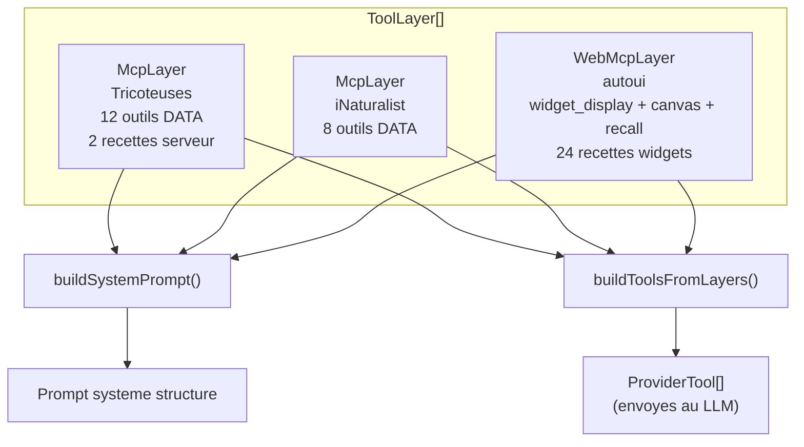
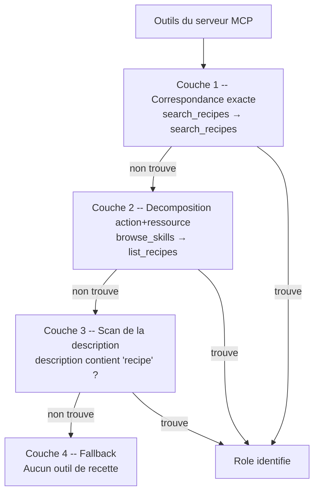

Imaginez un restaurant avec deux equipes distinctes : la cuisine (qui prepare les plats) et le service en salle (qui dresse les assiettes et les presente aux clients). Les deux sont essentiels, mais chacun a son metier. Les ToolLayers fonctionnent exactement ainsi : une couche **DATA** (la cuisine) et une couche **UI** (le service).

## Qu'est-ce qu'un ToolLayer ?

Un **ToolLayer** est une structure qui organise les outils disponibles pour l'agent en **couches typees**. Chaque couche porte un protocole (`mcp` ou `webmcp`), un nom de serveur, et la liste de ses outils.

Ce systeme remplace l'ancien passage plat d'un tableau `mcpTools[]` et apporte :
- Le **prefixage automatique** des noms d'outils (`tricoteuses_mcp_query_sql`)
- La **decouverte progressive** (lazy loading des outils)
- La **resolution canonique** des outils de recettes (un meme role, des noms differents)
- Le **prompt structure** en sections par serveur

## Pourquoi les couches existent

Sans couches, un agent connecte a 3 serveurs aurait un probleme de collision : si deux serveurs exposent un outil `search`, lequel appeler ? Les ToolLayers resolvent cela en **prefixant** chaque outil avec le nom du serveur et le protocole :

```
query_sql              → tricoteuses_mcp_query_sql
search_observations    → inaturalist_mcp_search_observations
widget_display         → autoui_webmcp_widget_display
```

:::tip[Convention de nommage]
Le format est toujours : `{serveur}_{protocole}_{outil}`
Le nom du serveur est normalise : minuscules, underscores, sans les mots "mcp"/"server".
:::

## Les deux types de couches

### McpLayer : la couche donnees

Un `McpLayer` est cree pour **chaque serveur MCP connecte**. Il porte les outils DATA (ceux qui interrogent des bases de donnees, des API, des fichiers) et les recettes serveur.

```ts
import type { McpLayer } from '@webmcp-auto-ui/agent';

const mcpLayer: McpLayer = {
  protocol: 'mcp',
  serverUrl: 'https://mcp.code4code.eu/mcp',
  serverName: 'Tricoteuses',
  tools: await client.listTools(),
  recipes: [
    { name: 'profil-depute', description: 'Fiche complete depute' },
    { name: 'scrutin-detail', description: 'Analyse scrutin public' },
  ],
};
```

```ts
// Interface TypeScript
interface McpLayer {
  protocol: 'mcp';
  serverUrl?: string;
  serverName: string;
  description?: string;
  tools: McpToolDef[];
  recipes?: McpRecipe[];
}
```

### WebMcpLayer : la couche affichage

Le serveur `autoui` fournit une `WebMcpLayer` pre-configuree avec tous les widgets natifs (stat, chart, table, carte...) et les outils d'interaction (canvas, recall).

```ts
import { autoui } from '@webmcp-auto-ui/agent';

const uiLayer = autoui.layer();
// Resultat :
// {
//   protocol: 'webmcp',
//   serverName: 'autoui',
//   description: 'Built-in UI widgets (stat, chart, hemicycle, ...)',
//   tools: [
//     { name: 'search_recipes', ... },
//     { name: 'list_recipes', ... },
//     { name: 'get_recipe', ... },
//     { name: 'widget_display', ... },
//     { name: 'canvas', ... },
//     { name: 'recall', ... },
//   ]
// }
```

```ts
// Interface TypeScript
interface WebMcpLayer {
  protocol: 'webmcp';
  serverName: string;
  description: string;
  tools: WebMcpToolDef[];
}
```

## Comment les couches se combinent



```ts
// Assembler les couches
const layers: ToolLayer[] = [mcpLayer1, mcpLayer2, autoui.layer()];
```

## Le prompt systeme genere

`buildSystemPrompt()` transforme les couches en un prompt structure qui guide le LLM a travers un flux en 4 etapes :

```ts
import { buildSystemPrompt } from '@webmcp-auto-ui/agent';

const prompt = buildSystemPrompt(layers);
```

Le prompt genere contient :

```
ETAPE 1 -- Recherche de recette
autoui_webmcp_search_recipes()
tricoteuses_mcp_search_recipes()

ETAPE 1b -- Liste des recettes (si aucun resultat)
autoui_webmcp_list_recipes()
tricoteuses_mcp_list_recipes()

ETAPE 1c -- Recherche d'outils (si aucune recette)
autoui_webmcp_search_tools(query)
tricoteuses_mcp_search_tools(query)

ETAPE 2 -- Lecture de la recette selectionnee
autoui_webmcp_get_recipe()
tricoteuses_mcp_get_recipe()

ETAPE 3 -- Execution des outils

ETAPE 4 -- Affichage UI
autoui_webmcp_widget_display
autoui_webmcp_canvas
```

:::note[Prompt en francais]
Le prompt systeme est en francais par defaut. C'est un choix delibere : les tests montrent que Claude suit mieux des instructions de workflow en francais quand les utilisateurs francophones interagissent avec lui.
:::

## buildToolsFromLayers : les outils envoyes au LLM

Cette fonction convertit les couches en `ProviderTool[]` -- le format attendu par les providers LLM. Chaque outil est prefixe et son schema est assaini pour le mode strict.

```ts
import { buildToolsFromLayers } from '@webmcp-auto-ui/agent';

const tools = buildToolsFromLayers(layers);
// Resultat :
// [
//   { name: "tricoteuses_mcp_query_sql", description: "...", input_schema: {...} },
//   { name: "tricoteuses_mcp_search_deputes", ... },
//   { name: "autoui_webmcp_widget_display", ... },
//   { name: "autoui_webmcp_canvas", ... },
//   ...
// ]
```

### Transformation des schemas

Lors de la conversion, les schemas d'entree sont automatiquement assainis :

| Transformation | Comportement |
|---------------|-------------|
| `oneOf`/`anyOf`/`allOf` | Supprimes (mode strict incompatible) |
| `additionalProperties` manquant | Ajoute a `false` (requis par le mode strict) |
| Schemas invalides | Rapportes via le callback `onSchemaPatch` |
| Aplatissement (optionnel) | `center.lat` → `center__lat` pour les LLM locaux |

## Resolution canonique des outils (4 couches)

Les serveurs MCP nomment leurs outils librement. Un serveur peut appeler sa liste de recettes `browse_skills`, un autre `list_recipes`, un autre `discover_workflows`. Le systeme a besoin de les identifier pour construire le prompt.

La **resolution canonique** identifie 3 roles parmi les outils d'un serveur :

| Role canonique | Ce qu'il fait |
|---------------|---------------|
| `search_recipes` | Chercher des recettes par mot-cle |
| `list_recipes` | Lister toutes les recettes |
| `get_recipe` | Obtenir le detail d'une recette |

La resolution se fait en 4 couches successives :



**Couche 1** : le nom correspond exactement (`search_recipes`, `list_recipes`, `get_recipe`).

**Couche 2** : le nom est decompose en tokens. Les paires (action, ressource) sont testees :
- Actions de recherche : `search`, `find`, `query`
- Actions de liste : `list`, `browse`, `explore`, `discover`
- Actions de lecture : `get`, `read`, `fetch`, `show`, `describe`
- Ressources : `recipe`, `skill`, `template`, `workflow`, `playbook`, `pattern`

Ainsi `browse_skills` → action `browse` (liste) + ressource `skills` → role `list_recipes`.

**Couche 3** : si le nom ne match pas, la description est scannee pour des mots-cles (`recipe`, `skill`, `template`...).

**Couche 4** : aucun outil de recette identifie -- le serveur n'en propose pas.

### Alias et routage

Quand un outil porte un nom different de son role canonique, un **alias** est cree :

```ts
// Le serveur expose "browse_skills", mais le prompt dit "list_recipes"
aliasMap.set('tricoteuses_mcp_list_recipes', 'tricoteuses_mcp_browse_skills');

// Quand le LLM appelle tricoteuses_mcp_list_recipes,
// la boucle agent le route vers tricoteuses_mcp_browse_skills
```

## Decouverte progressive (lazy loading)

Par defaut, le LLM ne recoit **pas** tous les outils de tous les serveurs. Il recoit uniquement les outils de **decouverte** :

```ts
import { buildDiscoveryTools } from '@webmcp-auto-ui/agent';

const discoveryTools = buildDiscoveryTools(layers);
// Uniquement :
// - search_recipes, list_recipes, get_recipe (par serveur)
// - search_tools, list_tools (par serveur)
// - widget_display, canvas, recall (WebMCP)
```

Quand le LLM "touche" un serveur pour la premiere fois (en appelant un de ses outils), la fonction `activateServerTools()` ajoute tous les outils de ce serveur :

```ts
import { activateServerTools } from '@webmcp-auto-ui/agent';

// Apres le premier appel a tricoteuses_mcp_search_recipes :
currentTools = activateServerTools(currentTools, tricoteusesLayer);
// → tous les outils DATA de Tricoteuses sont maintenant disponibles
```

```mermaid
sequenceDiagram
    participant LLM
    participant Loop as Agent Loop
    participant Tools as Outils actifs

    Note over Tools: Debut : outils de decouverte seulement
    LLM->>Loop: search_recipes("depute")
    Loop->>Loop: Premier contact avec Tricoteuses
    Loop->>Tools: activateServerTools(tricoteusesLayer)
    Note over Tools: +12 outils DATA de Tricoteuses
    Loop-->>LLM: Resultats de search_recipes
    LLM->>Loop: tricoteuses_mcp_query_sql(...)
    Note over LLM: Maintenant le LLM peut utiliser<br/>tous les outils du serveur
```

## Utilisation avec runAgentLoop

```ts
import { runAgentLoop, autoui } from '@webmcp-auto-ui/agent';

const result = await runAgentLoop('Liste les deputes ecologistes', {
  provider,
  layers: [mcpLayer1, mcpLayer2, autoui.layer()],
  callbacks: {
    onWidget: (type, data) => {
      canvas.addWidget(type, data);
      return { id: 'w_1' };
    },
  },
});
```

La boucle agent :
1. Appelle `buildSystemPrompt(layers)` pour generer le prompt
2. Appelle `buildDiscoveryTools(layers)` pour les outils initiaux
3. Ecoute les `tool_use` du LLM et les route vers le bon serveur
4. Active les outils complets d'un serveur au premier contact
5. Repete jusqu'a `end_turn`

## Variantes parallel-safe

Pour les applications qui executent **plusieurs boucles agent en parallele**, les fonctions classiques partagent un `toolAliasMap` global (deprecated). Utilisez les variantes avec suffixe `WithAliases` :

```ts
// ❌ Pas safe en parallele (alias map global)
const prompt = buildSystemPrompt(layers);
const tools = buildDiscoveryTools(layers);

// ✅ Safe en parallele (alias map locale)
const { prompt, aliasMap } = buildSystemPromptWithAliases(layers);
const { tools, aliasMap: toolAliasMap } = buildDiscoveryToolsWithAliases(layers);
```

## Resume visuel

| Concept | Type | Contient | Role |
|---------|------|----------|------|
| `McpLayer` | Couche DATA | Outils MCP + recettes serveur | Interroger des sources de donnees |
| `WebMcpLayer` | Couche UI | widget_display + canvas + recall | Rendre les donnees en widgets |
| `buildSystemPrompt()` | Fonction | Prompt en 4 etapes | Guider le LLM dans son workflow |
| `buildToolsFromLayers()` | Fonction | ProviderTool[] prefixes | Envoyer les outils au LLM |
| `buildDiscoveryTools()` | Fonction | Outils de decouverte seuls | Lazy loading des outils |
| `activateServerTools()` | Fonction | Ajout d'outils a chaud | Activer un serveur au premier contact |
| `resolveCanonicalTools()` | Fonction | Mapping role → vrai nom | Identifier les outils de recettes |
