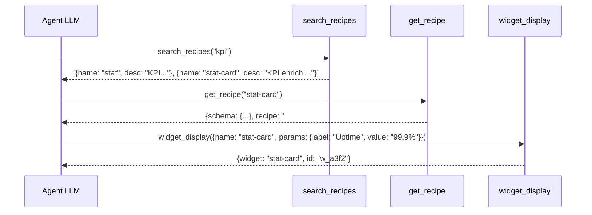
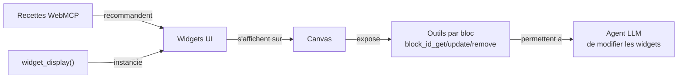

Imaginez un jeu de LEGO specialise : chaque brique a une forme precise (un graphique, un tableau, une carte) et s'emboite naturellement avec les autres. L'agent IA est le constructeur : il choisit les briques et les assemble pour creer un dashboard complet. Les **widgets UI** sont ces briques.

## Qu'est-ce qu'un widget ?

Un widget est un **composant visuel declaratif** que l'agent IA peut instancier en un seul appel d'outil. L'agent n'ecrit pas de HTML, pas de CSS, pas de JavaScript : il envoie un `type` et un objet `data`, et le widget se rend tout seul.

```ts
// L'agent appelle :
widget_display({ name: "stat", params: { label: "Revenue", value: "$142K", trend: "+12.4%", trendDir: "up" } })

// Le canvas affiche instantanement une carte KPI avec une fleche verte vers le haut
```

## Pourquoi les widgets existent

Sans widgets, un agent IA devrait generer du HTML brut pour afficher des donnees. Cela poserait trois problemes :

1. **Securite** : du HTML genere par un LLM pourrait contenir du code malveillant
2. **Coherence** : chaque dashboard aurait un style different
3. **Tokens** : decrire du HTML consomme enormement de tokens

Les widgets resolvent tout cela : l'agent envoie des **donnees structurees** (JSON valide un schema), et le framework se charge du rendu.

## Comment l'agent choisit un widget

Le flux de selection suit le systeme de recettes et de decouverte :



L'agent peut aussi utiliser les **recettes WebMCP** (fichiers `.md`) qui lui indiquent quel widget utiliser en fonction du type de donnees. Par exemple, la recette `dashboard-kpi` recommande : `stat-card` pour les metriques, `chart` pour les series temporelles, `data-table` pour les details.

## Le systeme de rendu

### Deux moteurs de rendu

Le projet supporte deux modes de rendu :

| Mode | Technologie | Usage |
|------|------------|-------|
| **Svelte** | `<BlockRenderer>` / `<WidgetRenderer>` | Apps SvelteKit (flex2, viewer2) |
| **Vanilla** | `mountWidget()` | Apps sans framework, integration externe |

### BlockRenderer (Svelte)

Le composant `BlockRenderer` recoit `{ type, data }` et dispatche vers le widget Svelte correspondant :

```svelte
<script>
  import { BlockRenderer } from '@webmcp-auto-ui/ui';
</script>

<BlockRenderer type="stat" data={{ label: 'Revenue', value: '$142K' }} />
```

- **Blocs simples** (stat, kv, list...) : donnees via la prop `data`
- **Blocs riches** (stat-card, data-table...) : donnees via la prop `spec`
- **Types inconnus** : affiche un placeholder `[type]`

### mountWidget (Vanilla)

Pour les apps sans framework :

```ts
import { mountWidget } from '@webmcp-auto-ui/core';

const container = document.getElementById('my-widget');
const cleanup = mountWidget(container, 'stat', { label: 'Revenue', value: '$142K' }, [autoui]);

// Nettoyer a la destruction
cleanup?.();
```

### Reactivity et canvas

Chaque bloc rendu sur le canvas s'auto-enregistre comme outil WebMCP (via `navigator.modelContext`). Cela permet a l'agent de **modifier** les widgets deja affiches :

```
block_<id>_get      → lire les donnees actuelles du widget
block_<id>_update   → mettre a jour les donnees
block_<id>_remove   → retirer le widget du canvas
```

Ce mecanisme cree une boucle de retro-action : l'agent affiche, l'utilisateur interagit, l'agent reagit.

## Catalogue des widgets

### Groupes

Les widgets sont organises en 5 groupes :

| Groupe | Widgets | Usage |
|--------|---------|-------|
| **simple** | stat, kv, list, chart, alert, code, text, actions, tags | Blocs de base, donnees simples |
| **rich** | stat-card, data-table, timeline, profile, trombinoscope, json-viewer, hemicycle, chart-rich, cards, grid-data, sankey, log | Visualisations complexes |
| **media** | gallery, carousel, map | Images et geographie |
| **advanced** | d3, js-sandbox | Visualisations custom D3, code arbitraire |
| **canvas** | clear, update, move, resize, style | Actions sur les widgets existants |

---

### Blocs simples (9)

#### stat -- Metrique unique

Un chiffre cle avec tendance optionnelle. Le widget le plus simple et le plus utilise.

```ts
interface StatBlockData {
  label: string;          // "Revenue"
  value: string;          // "$142K"
  trend?: string;         // "+12.4%"
  trendDir?: 'up' | 'down' | 'neutral';
}
```

```json
{ "type": "stat", "data": { "label": "Revenue", "value": "$142K", "trend": "+12.4%", "trendDir": "up" } }
```

#### kv -- Paires cle-valeur

Ideal pour les metadonnees, les proprietes d'une entite, les details d'un enregistrement.

```ts
interface KVBlockData {
  title?: string;
  rows: [string, string][];   // [["Nom", "Dupont"], ["Age", "42"]]
}
```

#### list -- Liste texte

Une liste simple a puces.

```ts
interface ListBlockData {
  title?: string;
  items: string[];
}
```

#### chart -- Bar chart simple

Pour un graphique a barres rapide. Pour des graphiques plus riches (pie, line, area), utiliser `chart-rich`.

```ts
interface ChartBlockData {
  title?: string;
  bars: [string, number][];   // [["Jan", 10], ["Fev", 20]]
}
```

#### alert -- Banniere d'alerte

Notification avec trois niveaux de severite.

```ts
interface AlertBlockData {
  title?: string;
  message?: string;
  level?: 'info' | 'warn' | 'error';
}
```

#### code -- Bloc de code

Code source avec coloration syntaxique.

```ts
interface CodeBlockData {
  lang?: string;       // "python", "sql", "javascript"...
  content?: string;
}
```

#### text -- Paragraphe texte

Texte libre, sans mise en forme complexe.

```ts
interface TextBlockData {
  content?: string;
}
```

#### actions -- Boutons d'action

Rangee de boutons cliquables. Un bouton `primary` est mis en evidence.

```ts
interface ActionsBlockData {
  buttons: { label: string; primary?: boolean }[];
}
```

#### tags -- Collection de tags

Groupe de badges/etiquettes, avec etat actif optionnel.

```ts
interface TagsBlockData {
  label?: string;
  tags: { text: string; active?: boolean }[];
}
```

---

### Widgets riches (16)

#### stat-card -- KPI enrichi

Version avancee de `stat` avec unite, delta, couleur de variante (success/warning/error/info).

```ts
interface StatCardSpec {
  label?: string;
  value?: unknown;
  unit?: string;                // "%", "EUR", "km"
  delta?: string;               // "+12%"
  trend?: 'up' | 'down' | 'flat' | {
    direction: 'up' | 'down' | 'flat';
    value?: string;
    positive?: boolean;
  };
  previousValue?: unknown;
  variant?: 'default' | 'success' | 'warning' | 'error' | 'info';
}
```

:::tip[stat vs stat-card]
Utiliser `stat` pour un chiffre simple sans decoration. Utiliser `stat-card` quand vous avez des unites, des deltas, ou un code couleur.
:::

#### data-table -- Table triable

Tableau avec colonnes configurables, tri par clic, mode compact et raye.

```ts
interface DataTableSpec {
  title?: string;
  columns?: { key: string; label: string; align?: 'left' | 'center' | 'right'; type?: string }[];
  rows?: Record<string, unknown>[];
  compact?: boolean;
  striped?: boolean;
}
```

:::caution[Limite de lignes]
Maximum 200 lignes affichees. Au-dela, le tableau est tronque.
:::

#### timeline -- Chronologie

Sequence d'evenements avec dates et statuts visuels.

```ts
interface TimelineSpec {
  title?: string;
  events?: {
    date?: string;
    title?: string;
    description?: string;
    status?: 'done' | 'active' | 'pending';
  }[];
}
```

#### profile -- Fiche profil

Carte de presentation avec avatar (initiales automatiques si pas d'URL), champs structures et statistiques.

```ts
interface ProfileSpec {
  name?: string;
  subtitle?: string;
  avatar?: { src: string; alt?: string };
  badge?: { text: string; variant?: string };
  fields?: { label: string; value: string }[];
  stats?: { label: string; value: string }[];
}
```

:::caution[Pas d'URLs inventees]
Ne jamais fabriquer d'URL pour l'avatar. Le widget affiche les initiales automatiquement si aucune URL valide n'est fournie.
:::

#### trombinoscope -- Grille de portraits

Grille de personnes avec nom, sous-titre et badge. Ideal pour les equipes, assemblees, jurys.

```ts
interface TrombinoscopeSpec {
  title?: string;
  people: { name: string; subtitle?: string; badge?: string; color?: string }[];
  columns?: number;
}
```

#### json-viewer -- Arbre JSON interactif

Explore une structure JSON complexe avec deplier/replier par niveau.

```ts
interface JsonViewerSpec {
  title?: string;
  data: unknown;
  maxDepth?: number;
  expanded?: boolean;
}
```

#### hemicycle -- Hemicycle parlementaire

Visualisation SVG de la composition d'une assemblee, avec couleurs par groupe politique.

```ts
interface HemicycleSpec {
  title?: string;
  groups?: { id: string; label: string; seats: number; color: string }[];
  totalSeats?: number;
  rows?: number;
}
```

:::caution[id obligatoire]
Chaque groupe **doit** avoir un `id` unique. Sans lui, les evenements de clic ne fonctionnent pas.
:::

#### chart-rich -- Graphique multi-type

Graphique avance supportant bar, line, area, pie et donut, avec plusieurs series de donnees.

```ts
interface ChartSpec {
  title?: string;
  type?: 'bar' | 'line' | 'area' | 'pie' | 'donut';
  labels?: string[];
  data?: { label?: string; values: number[]; color?: string }[];
  legend?: boolean;
}
```

#### cards -- Grille de cartes

Affichage en grille de resultats, dossiers ou entites, avec titre, description et tags.

```ts
interface CardsSpec {
  title?: string;
  cards: { title: string; description?: string; subtitle?: string; tags?: string[] }[];
}
```

#### grid-data -- Grille spreadsheet

Grille de donnees tabulaires avec possibilite de colorer des cellules (heatmap).

```ts
interface GridDataSpec {
  title?: string;
  columns?: { key: string; label: string; width?: string }[];
  rows: unknown[][];              // row-major: [[1, 2], [3, 4]]
  highlights?: { row: number; col: number; color: string }[];
}
```

:::tip[grid-data vs data-table]
`data-table` attend des objets (`{name: "Alice"}`), `grid-data` attend des tableaux (`["Alice", 42]`). Utiliser `data-table` pour des donnees nommees, `grid-data` pour des matrices numeriques.
:::

#### sankey -- Diagramme de flux

Visualise des flux entre noeuds : votes, co-signatures, parcours.

```ts
interface SankeySpec {
  title?: string;
  nodes?: { id: string; label: string; color?: string }[];
  links?: { source: string; target: string; value: number }[];
}
```

#### map -- Carte interactive

Carte Leaflet avec marqueurs, fond sombre CARTO. Le module Leaflet est charge dynamiquement.

```ts
interface MapSpec {
  title?: string;
  center?: { lat: number; lng: number };
  zoom?: number;                  // 1-18
  height?: string;                // CSS, ex: "400px"
  markers?: { lat: number; lng: number; label?: string; color?: string }[];
}
```

#### d3 -- Visualisation D3

Widget D3.js avec 4 presets integres : `hex-heatmap`, `radial`, `treemap`, `force`.

```ts
interface D3Spec {
  title?: string;
  preset: 'hex-heatmap' | 'radial' | 'treemap' | 'force';
  data: unknown;
  config?: Record<string, unknown>;
}
```

#### js-sandbox -- Sandbox JavaScript

Iframe securise qui execute du code JS arbitraire avec acces au DOM et a fetch.

```ts
interface JsSandboxSpec {
  title?: string;
  code: string;           // JS a executer
  html?: string;          // HTML initial dans div#root
  css?: string;           // CSS injecte dans le head
  height?: string;        // Hauteur CSS de l'iframe
}
```

#### log -- Viewer de logs

Flux de logs avec niveau de severite, timestamp et source.

```ts
interface LogViewerSpec {
  title?: string;
  entries?: {
    timestamp?: string;
    level?: 'debug' | 'info' | 'warn' | 'error';
    message: string;
    source?: string;
  }[];
}
```

#### gallery -- Galerie d'images

Collection d'images avec lightbox navigable au clavier (Escape, fleches).

```ts
interface GallerySpec {
  title?: string;
  images?: { src: string; alt?: string; caption?: string }[];
  columns?: number;
}
```

#### carousel -- Carousel de slides

Diaporama avec navigation et auto-play optionnel.

```ts
interface CarouselSpec {
  title?: string;
  slides?: { src?: string; content?: string; title?: string; subtitle?: string }[];
  autoPlay?: boolean;
  interval?: number;         // ms entre slides
}
```

#### recipe-browser -- Navigateur de recettes

Affiche les recettes disponibles sous forme de cartes cliquables. Le clic declenche une interaction qui charge le detail de la recette.

---

### Actions canvas (5)

Ces widgets ne creent pas de nouveaux blocs -- ils **modifient** les blocs existants.

| Action | Description | Parametres |
|--------|-------------|-----------|
| `clear` | Vider le canvas entierement | aucun |
| `update` | Mettre a jour les donnees d'un bloc | `{id, data}` |
| `move` | Deplacer un bloc | `{id, x, y}` |
| `resize` | Redimensionner un bloc | `{id, width, height}` |
| `style` | Appliquer des styles CSS | `{id, styles}` |

L'outil `canvas` agrege ces 5 actions :

```ts
canvas({ action: 'update', id: 'w_a3f2', params: { data: { value: "$155K" } } })
canvas({ action: 'move', id: 'w_a3f2', params: { x: 100, y: 200 } })
canvas({ action: 'clear' })
```

## Relations avec les autres concepts



- **Recettes** : les recettes WebMCP indiquent a l'agent quel widget utiliser en fonction des donnees
- **widget_display** : l'outil qui instancie un widget sur le canvas
- **ToolLayers** : les widgets sont exposes via la `WebMcpLayer` du serveur autoui
- **Canvas** : la surface reactive ou les widgets sont rendus et mis a jour

## Erreurs courantes

| Erreur | Consequence | Correction |
|--------|-------------|-----------|
| `chart` pour pie/donut | `chart` ne fait que des barres | Utiliser `chart-rich` avec `type: "pie"` |
| Objets dans `rows` de `grid-data` | Grid attend `unknown[][]` | Utiliser `data-table` pour des objets |
| Pas d'`id` sur les groups d'hemicycle | Evenements de clic casses | Toujours inclure `id` |
| `columns.key` ne correspond pas aux rows | Cellules vides | `key` doit correspondre aux cles des objets |
| URL d'avatar inventee par le LLM | Image cassee | Ne jamais fabriquer d'URLs -- le widget affiche les initiales |
| Plus de 200 lignes dans data-table | Tableau tronque sans avertissement | Paginer ou filtrer les donnees avant |
