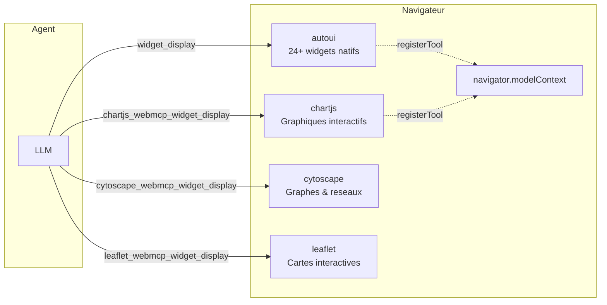
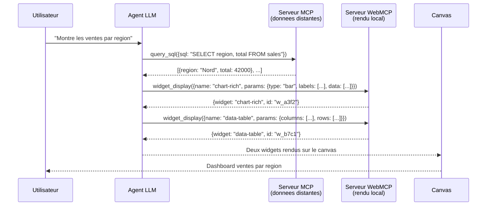

Si MCP est le "USB" pour brancher des **sources de donnees**, WebMCP est le "USB" pour brancher des **interfaces utilisateur**. Un serveur WebMCP tourne dans le navigateur et expose des widgets, des renderers et des actions UI que l'agent peut appeler exactement comme il appelle un outil MCP distant.

## Qu'est-ce que WebMCP ?

**WebMCP** est un protocole complementaire a MCP, concu pour le rendu cote client. Il repose sur deux piliers :

1. **Une API navigateur** (`navigator.modelContext`) standardisee par le W3C WebMCP Draft CG Report (2026-03-27), qui permet a toute page web d'enregistrer des outils accessibles par les agents IA.
2. **Un framework de serveurs locaux** (`createWebMcpServer`) qui structure ces outils en serveurs thematiques avec widgets, recettes et schemas JSON.



## MCP vs WebMCP : la distinction fondamentale

| | MCP | WebMCP |
|--|-----|--------|
| **Role** | Recuperer les **donnees** | **Afficher** les donnees |
| **Ou ca tourne** | Serveur distant (HTTP/SSE) | Dans le navigateur (en memoire) |
| **Transport** | JSON-RPC 2.0 sur HTTP POST | Appels de fonctions JavaScript |
| **Outils typiques** | `query_sql`, `search`, `list_tables` | `widget_display`, `canvas`, `recall` |
| **Exemples de serveurs** | Tricoteuses, iNaturalist, Hacker News | `autoui`, `chartjs`, `cytoscape`, `leaflet` |
| **Spec** | Anthropic MCP specification | W3C WebMCP Draft CG Report |

:::tip[La regle d'or]
**MCP** = "qu'est-ce que je vais chercher ?" (donnees distantes)
**WebMCP** = "comment est-ce que je l'affiche ?" (rendu local)
:::

## Creer un serveur WebMCP

Un serveur WebMCP se cree avec `createWebMcpServer` du package `@webmcp-auto-ui/core`. Il enregistre des **widgets** — des renderers qui prennent des donnees JSON et produisent du HTML/SVG/Canvas.

```ts
import { createWebMcpServer } from '@webmcp-auto-ui/core';

const myServer = createWebMcpServer('my-charts', {
  widgets: [
    {
      name: 'bar-chart',
      description: 'Renders a bar chart',
      schema: {
        type: 'object',
        properties: {
          labels: { type: 'array', items: { type: 'string' } },
          values: { type: 'array', items: { type: 'number' } },
        },
        required: ['labels', 'values'],
      },
      renderer: (container, data) => {
        // Render using Chart.js, D3, or vanilla DOM
        // Return an optional cleanup function
      },
      vanilla: true, // Mark as vanilla (non-Svelte) renderer
    },
  ],
  recipes: [rawMarkdownRecipe],
});

// Expose as a tool layer for the agent
const layer = myServer.layer();
```

### Deux modes de rendu

| Mode | Flag | Quand l'utiliser |
|------|------|------------------|
| **Vanilla** | `vanilla: true` | Librairies tierces (Chart.js, Cytoscape, D3, Plotly, Three.js) — le renderer recoit un `HTMLElement` et dessine dedans |
| **Svelte** | `vanilla: false` (defaut) | Composants Svelte 5 — le renderer est un composant `.svelte` avec des props |

Les renderers vanilla recoivent une copie deep-clonee des donnees (via `JSON.parse(JSON.stringify(data))`) pour eviter les conflits entre les proxies `$state` de Svelte 5 et les librairies qui utilisent `Object.defineProperty`.

## Le serveur `autoui`

Le package `@webmcp-auto-ui/agent` fournit un serveur WebMCP pre-configure nomme `autoui` avec 24+ widgets natifs :

| Categorie | Widgets |
|-----------|---------|
| **Simple** | `stat`, `kv`, `list`, `chart`, `alert`, `code`, `text`, `actions`, `tags` |
| **Riche** | `stat-card`, `data-table`, `timeline`, `profile`, `trombinoscope`, `json-viewer`, `hemicycle`, `chart-rich`, `cards`, `grid-data`, `sankey`, `log`, `gallery`, `carousel`, `map`, `d3`, `js-sandbox` |

L'agent appelle `widget_display({ name, params })` pour rendre n'importe lequel de ces widgets.

## Serveurs WebMCP specialises

En plus de `autoui`, le projet inclut 10+ serveurs WebMCP thematiques dans `packages/servers/` :

| Serveur | Librairie | Widgets |
|---------|-----------|---------|
| `chartjs` | Chart.js | bar, line, pie, radar, doughnut, scatter, polar-area |
| `cytoscape` | Cytoscape.js | force-graph, concentric-rings, spread-layout, physics-simulation |
| `d3` | D3.js | treemap, force-directed, chord, sunburst |
| `leaflet` | Leaflet | markers, GeoJSON, heatmap, choropleth |
| `plotly` | Plotly.js | scatter, 3D surface, contour, histogram |
| `mermaid` | Mermaid | flowchart, sequence, gantt, class, state |
| `threejs` | Three.js | mesh, lights, animations |
| `pixijs` | PixiJS | sprites, particles |
| `rough` | Rough.js | hand-drawn style sketches |
| `canvas2d` | Canvas API | custom 2D drawings |

Chaque serveur expose ses propres widgets et recettes. L'agent les decouvre via `search_recipes()` et `get_recipe()`.

## `navigator.modelContext` : l'API navigateur

Le protocole W3C WebMCP definit une API navigateur standard pour que les pages web exposent des outils aux agents IA :

```ts
// Enregistrer un outil accessible par l'agent
navigator.modelContext.registerTool({
  name: 'todo_add',
  description: 'Add a new todo item',
  inputSchema: { type: 'object', properties: { text: { type: 'string' } } },
  execute: (args) => {
    addTodo(args.text);
    return { content: [{ type: 'text', text: 'Todo added' }] };
  },
});

// Desenregistrer un outil
navigator.modelContext.unregisterTool('todo_add');
```

Dans webmcp-auto-ui, chaque widget rendu sur le canvas s'auto-enregistre via cette API avec trois outils :
- `widget_{id}_get` — lire les donnees actuelles du widget
- `widget_{id}_update` — mettre a jour les donnees
- `widget_{id}_remove` — supprimer le widget

Cela permet a l'agent (ou a une extension navigateur) d'interagir avec les widgets deja rendus.

:::note[Activation dans Chrome]
L'API `navigator.modelContext` est disponible dans Chrome 146+ avec le flag `chrome://flags/#enable-webmcp-testing`. L'extension [Model Context Tool Inspector](https://chromewebstore.google.com/) permet de visualiser les outils enregistres.
:::

## `mountWidget` : rendu sans framework

Pour les cas ou Svelte n'est pas disponible (vanilla JS, React, Vue), le package `@webmcp-auto-ui/core` fournit `mountWidget()` :

```ts
import { mountWidget } from '@webmcp-auto-ui/core';

const container = document.getElementById('my-widget');
const cleanup = mountWidget(container, myServer, 'bar-chart', {
  labels: ['Q1', 'Q2', 'Q3'],
  values: [120, 340, 250],
});

// Plus tard, nettoyer
cleanup?.();
```

`mountWidget` deep-clone les donnees, resout le renderer du serveur, et l'appelle avec le container DOM. C'est le point d'entree framework-agnostic pour le rendu WebMCP.

## Architecture complete : MCP + WebMCP



## Relations avec les autres concepts

- **[MCP](/webmcp-auto-ui/concepts/mcp/)** : recupere les donnees que WebMCP affiche
- **[Tool Layers](/webmcp-auto-ui/concepts/tool-layers/)** : les serveurs WebMCP produisent des `WebMcpLayer`
- **[Recettes](/webmcp-auto-ui/concepts/recipes/)** : chaque serveur WebMCP embarque des recettes qui guident l'agent
- **[widget_display](/webmcp-auto-ui/concepts/widget-display/)** : l'outil unifie qui dispatch vers le bon renderer WebMCP
- **[Widgets UI](/webmcp-auto-ui/concepts/ui-widgets/)** : les composants Svelte qui rendent les widgets
