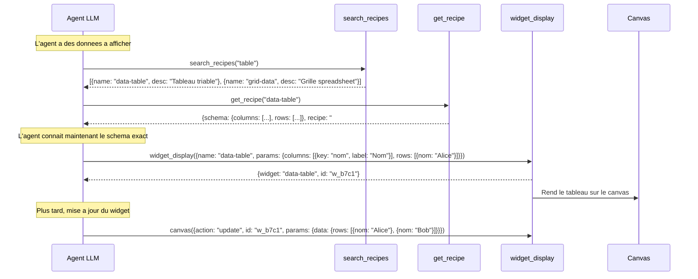
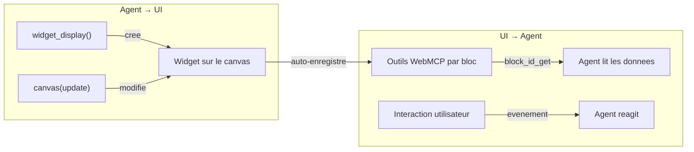
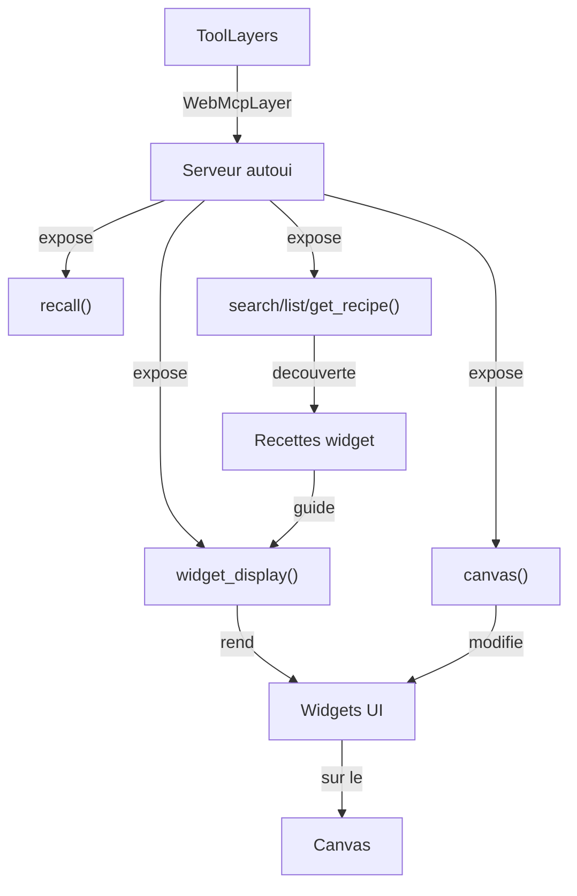

Imaginez un telecommande universelle : au lieu d'avoir une telecommande par appareil (TV, sono, lumieres), vous avez un seul bouton "affiche ca". Vous dites ce que vous voulez voir et avec quels parametres, et la telecommande se debrouille. C'est exactement le role de `widget_display` : un **outil unique** qui permet a l'agent de rendre n'importe lequel des 24+ widgets natifs.

## Qu'est-ce que l'outil widget_display ?

`widget_display` est l'outil WebMCP central qui permet a l'agent IA d'**afficher un widget sur le canvas**. L'agent envoie un nom de widget et ses parametres, et le systeme :
1. Valide les parametres contre le schema JSON du widget
2. Assainit les URLs d'images (supprime les URLs hallucinées)
3. Rend le widget sur le canvas
4. Retourne un identifiant unique pour les modifications ulterieures

```ts
// L'agent appelle :
widget_display({
  name: "stat-card",
  params: { label: "Uptime", value: "99.9", unit: "%", variant: "success" }
})

// Le systeme retourne :
{ widget: "stat-card", data: { label: "Uptime", value: "99.9", unit: "%", variant: "success" }, id: "w_a3f2" }
```

:::note[Evolution historique]
L'outil s'appelait `component()` dans les versions anterieures (avant la Phase 8). Il a ete renomme en `widget_display` lors de l'adoption du serveur WebMCP `autoui`. L'ancienne API `component()` / `componentRegistry` a ete supprimee. Le concept reste le meme : un outil unique pour rendre n'importe quel widget.
:::

## Pourquoi un outil unique ?

L'alternative serait d'exposer un outil **par widget** : `render_stat`, `render_chart`, `render_table`... soit 31 outils. Comparez :

| Approche | Outils visibles | Tokens de schema | Decouverte |
|----------|----------------|-----------------|------------|
| 1 outil par widget | 31 `render_*` | ~3000 tokens | Le LLM voit tout d'emblee |
| Outil unique `widget_display` | 1 outil | ~200 tokens | Le LLM decouvre via les recettes |

L'outil unique consomme **15x moins de tokens** de schema. Avec un LLM distant comme Claude, c'est une economie significative a chaque requete.

## Les 6 outils du serveur autoui

Le serveur `autoui` expose 6 outils au total. Les 4 premiers forment le systeme de decouverte et de rendu, les 2 derniers sont des outils utilitaires :

### search_recipes() -- Recherche

```
autoui_webmcp_search_recipes({ query: "kpi" })
```

Retourne les widgets et recettes dont le nom ou la description contient le terme recherche.

### list_recipes() -- Liste complete

```
autoui_webmcp_list_recipes()
```

Retourne la liste de tous les widgets enregistres avec nom, description et groupe.

### get_recipe() -- Schema detaille

```
autoui_webmcp_get_recipe({ name: "stat-card" })
```

Retourne le **schema JSON complet** du widget, sa description, et sa **recette d'usage** (un guide en Markdown). C'est la que l'agent apprend les parametres attendus.

### widget_display() -- Rendu

```
autoui_webmcp_widget_display({ name: "stat-card", params: { label: "Uptime", value: "99.9%" } })
```

**L'outil principal.** Valide les parametres, assainit les URLs, et rend le widget sur le canvas. Retourne `{ widget, data, id }`.

### canvas() -- Manipulation

```
autoui_webmcp_canvas({ action: "update", id: "w_a3f2", params: { data: { value: "99.8%" } } })
```

5 actions pour modifier les widgets existants : `clear`, `update`, `move`, `resize`, `style`.

### recall() -- Relecture

```
autoui_webmcp_recall({ id: "toolu_xxx" })
```

Relit le resultat complet d'un appel d'outil precedent (utile quand le resultat a ete tronque a 10 000 caracteres par la boucle agent).

## Le flux complet : de la decouverte au rendu



## Le pont bidirectionnel agent-UI

Le systeme cree un **pont bidirectionnel** entre l'agent et l'interface :



### Direction agent → UI

L'agent cree et modifie les widgets :

1. `widget_display()` cree un nouveau widget
2. `canvas(update)` met a jour les donnees d'un widget existant
3. `canvas(move/resize/style)` change la position et le style
4. `canvas(clear)` vide tout le canvas

### Direction UI → agent

Chaque widget rendu s'auto-enregistre comme source d'outils WebMCP via `navigator.modelContext` :

```ts
// Quand un widget "stat-card" avec id "w_a3f2" est monte :
navigator.modelContext.registerTool('block_w_a3f2_get', {
  description: 'Read current data of stat-card widget',
  execute: () => currentData,
});

navigator.modelContext.registerTool('block_w_a3f2_update', {
  description: 'Update stat-card widget data',
  execute: (newData) => { /* met a jour le widget */ },
});

navigator.modelContext.registerTool('block_w_a3f2_remove', {
  description: 'Remove this widget from the canvas',
  execute: () => { /* retire le widget */ },
});
```

Les interactions utilisateur (clic sur un bouton, selection dans un tableau) remontent aussi a l'agent sous forme d'evenements.

## Validation et securite

### Validation JSON Schema

Chaque appel a `widget_display` est valide contre le schema du widget cible. Si les parametres ne correspondent pas, le serveur retourne une erreur avec le schema attendu :

```ts
// L'agent envoie des parametres invalides :
widget_display({ name: "stat", params: { valeur: "42" } })

// Le serveur retourne :
{
  error: "Validation failed",
  details: [{ path: "/label", message: "required property missing" }],
  expected_schema: { type: "object", required: ["label", "value"], ... }
}
```

L'agent corrige alors son appel automatiquement (le prompt systeme inclut des regles de gestion d'erreurs).

### Assainissement des URLs d'images

Les LLMs ont tendance a inventer des URLs d'images. Le serveur `autoui` **supprime automatiquement** les URLs invalides dans les champs d'image (`src`, `avatar`, `image`, `thumbnail`...) :

```ts
// L'agent hallucine une URL :
widget_display({ name: "profile", params: {
  name: "Alice",
  avatar: { src: "portrait-alice.jpg" }   // URL relative, invalide
} })

// Le serveur supprime l'avatar invalide avant le rendu
// Le widget ProfileCard affiche les initiales "A" a la place
```

Seules les URLs commencant par `http://`, `https://`, `data:` ou `/` sont conservees.

## Noms de widgets et retrocompatibilite

Les noms de widgets utilisent des tirets : `stat-card`, `data-table`, `chart-rich`. Les anciens noms avec prefixe `render_*` sont acceptes pour la retrocompatibilite :

| Nom actuel | Ancien nom (legacy) |
|-----------|---------------------|
| `stat-card` | `render_stat_card` |
| `data-table` | `render_data_table` |
| `chart-rich` | `render_chart_rich` |

## Relations avec les autres concepts



- **ToolLayers** : le serveur autoui produit une `WebMcpLayer` qui porte tous ces outils
- **Recettes** : les recettes widget (inline dans autoui) et les recettes WebMCP (fichiers `.md`) guident le choix des widgets
- **Widgets** : le catalogue des 24+ composants visuels rendus par `widget_display`
- **MCP** : les outils MCP fournissent les donnees que `widget_display` affiche

## Patterns avances

### Composition multi-widgets

L'agent peut enchainer plusieurs `widget_display` pour composer un dashboard complet :

```
// L'agent suit une recette "dashboard-kpi"
widget_display({ name: "stat-card", params: { label: "Revenue", value: "$142K" } })  → w_1
widget_display({ name: "stat-card", params: { label: "Users", value: "3.2K" } })     → w_2
widget_display({ name: "chart-rich", params: { type: "line", ... } })                → w_3
widget_display({ name: "data-table", params: { columns: [...], rows: [...] } })      → w_4
```

### Mise a jour reactive

L'agent peut modifier un widget sans le recréer :

```
// Premiere creation
widget_display({ name: "stat", params: { label: "Prix", value: "$100" } }) → w_5

// Plus tard, mise a jour
canvas({ action: "update", id: "w_5", params: { data: { value: "$105" } } })
```

### Gestion d'erreurs en cascade

Le prompt systeme inclut des regles strictes de gestion d'erreurs :

1. Si un appel echoue : analyser le message d'erreur et le schema attendu
2. Corriger l'appel en respectant strictement le schema
3. Retenter au moins une fois avant de changer de strategie
4. Apres deux echecs identiques : chercher une autre recette

## Resume : les 6 outils en un tableau

| Outil | Role | Quand l'utiliser |
|-------|------|-----------------|
| `search_recipes` | Chercher des widgets/recettes | Au debut, pour trouver le bon widget |
| `list_recipes` | Lister tous les widgets | Si la recherche ne donne rien |
| `get_recipe` | Obtenir le schema complet | Avant le premier appel a widget_display |
| `widget_display` | Rendre un widget | Pour afficher des donnees |
| `canvas` | Modifier un widget existant | Pour mettre a jour, deplacer, styler |
| `recall` | Relire un resultat tronque | Quand un resultat MCP depasse 10K chars |
