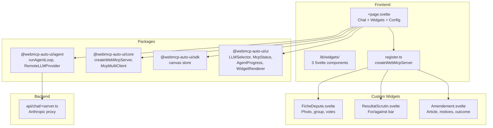

Boilerplate (`apps/boilerplate/`) is the starter template for integrating webmcp-auto-ui into a SvelteKit project. It shows how to register custom widgets via `createWebMcpServer`, connect to remote MCP servers, and drive an AI agent to automatically generate interfaces. This is the recommended starting point for any new project.

## What you see when you open the app

When you open the Boilerplate, you'll see a clean interface with a toolbar at the top. On the left, the title "Boilerplate Tricoteuses" in monospace. On the right, the MCP connection status (with connected servers and tool count), a Nano-RAG checkbox, an LLM model selector, and a light/dark theme toggle.

Below that, an input field lets you enter an MCP server URL with a "Connect" button. The app auto-connects to the Tricoteuses server (`mcp.code4code.eu/mcp`) on startup.

Below that, a row of buttons lets you enable/disable local WebMCP servers (Tricoteuses and AutoUI), each showing how many widgets they expose.

In the center, an empty state greets you with three suggestion buttons: "Fiche depute", "Scrutin", and "Amendement". When the agent generates widgets, they appear in a responsive 2-column grid.

At the bottom, an input bar lets you ask questions in natural language, and an `AgentProgress` indicator shows elapsed time, tool call count, and the last tool used.

## Architecture



## Tech stack

| Component | Detail |
|-----------|--------|
| Framework | SvelteKit + Svelte 5 |
| Styles | TailwindCSS 3.4 |
| Icons | lucide-svelte |
| LLM provider | `RemoteLLMProvider` (Claude via proxy) |
| MCP | `McpMultiClient` (multi-server) |
| Custom widgets | 3 Svelte components via `createWebMcpServer` |
| RAG | `ContextRAG` (experimental) |
| Adapter | `@sveltejs/adapter-node` |

**Packages used:**
- `@webmcp-auto-ui/core`: `createWebMcpServer`, `McpMultiClient`
- `@webmcp-auto-ui/agent`: `runAgentLoop`, `RemoteLLMProvider`, `buildSystemPrompt`, `fromMcpTools`, `autoui`, `buildDiscoveryCache`, `ContextRAG`
- `@webmcp-auto-ui/sdk`: `canvas` store
- `@webmcp-auto-ui/ui`: `LLMSelector`, `McpStatus`, `AgentProgress`, `WidgetRenderer`, `getTheme`

## Getting started

| Environment | Port | Command |
|-------------|------|---------|
| Dev | 5178 | `npm -w apps/boilerplate run dev` |
| Production | 3011 | `node index.js` (via systemd) |

```bash
npm -w apps/boilerplate run dev
# Available at http://localhost:5178
```

## Features

### 3 Tricoteuses widgets

Widgets are registered in `src/lib/widgets/register.ts` via `createWebMcpServer`. Each widget is defined by a YAML frontmatter (name, description, JSON schema) and a Svelte component:

1. **FicheDepute** (`fiche-depute`): complete profile of a French National Assembly deputy with photo, political group (color), constituency, mandate dates, participation rate, and vote breakdown (for/against/abstention)
2. **ResultatScrutin** (`resultat-scrutin`): vote result with title, number, date, proportional for/against/abstention bar, voter count, "Adopted" or "Rejected" badge
3. **Amendement** (`amendement`): parliamentary amendment with number, targeted article, author, group, explanatory statement, and outcome (adopted, rejected, withdrawn, unsupported)

### Multi-MCP AI agent

The agent uses a layered architecture:
- **MCP layers**: one layer per connected remote MCP server, with tools converted via `fromMcpTools`
- **WebMCP layers**: one layer per enabled local WebMCP server (Tricoteuses, AutoUI)

Layers are reactively recomputed on every connection change.

### Pre-filled suggestions

Three buttons trigger sample queries that demonstrate widget capabilities:
- "Show me Jean-Luc Melenchon's profile with his voting stats"
- "Display the vote result on pension reform"
- "Show an adopted amendment on article 7 of the finance bill"

### Automatic LLM optimization

Optimization options (sanitize, flatten, truncate, compress) automatically adjust via `$effect` when the LLM model changes. Small models (Gemma, local) get flattened schemas and truncated results to fit their context window.

## Configuration

| Variable | Description | Default |
|----------|-------------|---------|
| `ANTHROPIC_API_KEY` | Anthropic API key (server-side `.env`) | required |
| `mcpUrl` | Default MCP server URL | `https://mcp.code4code.eu/mcp` |

## Code walkthrough

### `src/lib/widgets/register.ts`
The key file in the Boilerplate. It creates a WebMCP server named `tricoteuses-widgets` with `createWebMcpServer`, then registers each widget via `registerWidget()`. Each registration takes a YAML frontmatter (complete JSON Schema) and a Svelte component.

```typescript
export const tricoteusesServer = createWebMcpServer('tricoteuses-widgets', {
  description: 'French parliamentary widgets...',
});

tricoteusesServer.registerWidget(`---
widget: fiche-depute
description: Deputy profile...
schema:
  type: object
  required: [nom, prenom, groupe]
  properties:
    nom: { type: string }
    ...
---
Displays a deputy profile...
`, FicheDepute);
```

### `src/routes/+page.svelte`
The main component. It manages:
- MCP connection via `McpMultiClient` (with auto-connect on mount)
- Reactive layer construction (`$derived`)
- Agent loop with `onWidget`, `onClear`, `onText`, `onToolCall` callbacks
- Widget display via `WidgetRenderer` in a responsive grid
- Toggleable local WebMCP servers

### `src/routes/api/chat/+server.ts`
Server-side proxy identical to Flex: uses `anthropicProxy` from the agent package.

## Using as a template

### From the monorepo

```bash
cp -r apps/boilerplate apps/my-app
```

Modify:
1. `package.json`: change the name (`@webmcp-auto-ui/my-app`) and port in the dev script
2. `src/lib/widgets/register.ts`: replace the 3 widgets with your own
3. `+page.svelte`: adapt the UI, suggestions, and title

### From an external project

```bash
npx degit jeanbaptiste/webmcp-auto-ui/apps/boilerplate my-app
cd my-app
npm install
npm run dev
```

### Creating a new widget

1. Create a Svelte component in `src/lib/widgets/`
2. Register it in `register.ts` with a YAML frontmatter defining the schema
3. The local WebMCP server automatically exposes the widget to the LLM

:::tip
The JSON schema in the frontmatter is critical -- it's what the LLM sees to understand which parameters to pass to the widget. Be precise with descriptions and types.
:::

## Deployment

| Server path | `/opt/webmcp-demos/boilerplate/` (root) |
|------------|-------------------------------------------|
| systemd service | `webmcp-boilerplate` |
| ExecStart | `node index.js` |

```bash
./scripts/deploy.sh boilerplate
```

## Links

- [Live demo](https://demos.hyperskills.net/boilerplate/)
- [Core package](/webmcp-auto-ui/en/packages/core/) -- `createWebMcpServer`
- [Agent package](/webmcp-auto-ui/en/packages/agent/) -- `runAgentLoop`
- [Flex (full app)](/webmcp-auto-ui/en/apps/flex2/) -- for all advanced features
