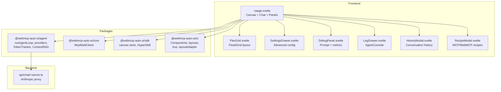

Flex (`apps/flex2/`) is the flagship app of the webmcp-auto-ui project. It's a full-featured AI canvas that combines a multi-provider LLM agent, simultaneous multi-MCP server connections, a floating/grid widget system, and a suite of debug and export tools. It showcases everything the v0.8 architecture can do.

## What you see when you open the app

When you open Flex, you'll see a clean, dark interface. At the top, a toolbar displays the MCP connection status (with available tool count), an LLM model selector (Claude haiku/sonnet/opus, Gemma E2B/E4B, or Ollama local), a light/dark theme toggle, a real-time token counter, and a HyperSkill export button.

In the center, the canvas takes up all available space. Widgets generated by the agent appear either in **float** mode (draggable and resizable windows) or **grid** mode (responsive grid). Each widget carries a provenance badge showing which tool and server generated it.

On the left, a collapsible sidebar provides access to advanced settings: LLM model, Ollama server URL, temperature, max tokens, max tools, prompt cache, custom system prompt, and schema optimization options (sanitize, flatten). A recipe panel (`RecipeModal`) lists available WebMCP and MCP recipes.

At the bottom, a slide-out drawer (`LogDrawer`) uses the `AgentConsole` component from the UI package to display real-time agent logs: iterations, LLM requests, responses, tool calls with arguments and results, and final metrics.

At the very bottom, an input bar lets you type questions in natural language. A Stop button lets you interrupt generation in progress.

## Architecture



## Tech stack

| Component | Detail |
|-----------|--------|
| Framework | SvelteKit + Svelte 5 (`$state`, `$derived`, `$effect`) |
| Styles | TailwindCSS 3.4 |
| Icons | lucide-svelte |
| LLM providers | `RemoteLLMProvider` (Claude via proxy), `WasmProvider` (Gemma in-browser), `LocalLLMProvider` (Ollama) |
| MCP | `McpMultiClient` (simultaneous multi-server) |
| State | `canvas` reactive store from SDK |
| Token tracking | `TokenTracker` with `TokenBubble` UI |
| RAG | `ContextRAG` (experimental Nano-RAG) |
| Export | `encodeHyperSkill` / `summarizeChat` |
| Adapter | `@sveltejs/adapter-node` (SSR) |

**Packages used:**
- `@webmcp-auto-ui/agent`: `runAgentLoop`, `RemoteLLMProvider`, `WasmProvider`, `LocalLLMProvider`, `buildSystemPrompt`, `fromMcpTools`, `trimConversationHistory`, `summarizeChat`, `TokenTracker`, `buildToolsFromLayers`, `runDiagnostics`, `buildDiscoveryCache`, `ContextRAG`, `autoui`
- `@webmcp-auto-ui/core`: `McpMultiClient`
- `@webmcp-auto-ui/sdk`: `canvas`, `listSkills`, `encodeHyperSkill`
- `@webmcp-auto-ui/ui`: `McpStatus`, `GemmaLoader`, `AgentProgress`, `EphemeralBubble`, `TokenBubble`, `bus`, `layoutAdapter`

## Getting started

| Environment | Port | Command |
|-------------|------|---------|
| Dev | 3007 | `npm -w apps/flex2 run dev` |
| Production | 3007 | `node index.js` (via systemd) |

```bash
npm -w apps/flex2 run dev
# Available at http://localhost:3007
```

:::note
In production, a `.env` file containing `ANTHROPIC_API_KEY` is required for the server-side proxy. Never commit this file.
:::

## Features

### Multi-provider LLM
Flex supports three provider families:
- **Claude** (haiku, sonnet, opus) via a server-side proxy that relays requests to the Anthropic API
- **Gemma WASM** (E2B, E4B) loaded directly in the browser via LiteRT. A `GemmaLoader` progress bar shows download progress (~33 MB)
- **Ollama local** via `LocalLLMProvider` for running models like Llama 3.2 on your machine

The provider is selected via the `LLMSelector` component. Smart defaults automatically adjust optimization options based on the chosen provider (e.g., flatten enabled for Gemma, sanitize for Claude).

### Multi-MCP
Connect to multiple MCP servers simultaneously. Each server's tools are merged into the agent's layers. MCP recipes are automatically loaded if the server exposes a `list_recipes` tool.

### Interactive widgets
Widgets aren't read-only. When the user clicks an element in a widget (table row, card, chart point...), the interaction is captured, translated into a message for the LLM, and injected into the agent loop to generate new contextual widgets.

### Composer/consumer mode
Switch between:
- **Composer**: full editing, free input, debug panel, export
- **Consumer**: read-only view of generated widgets

### Float/grid layout
- **Float**: draggable and resizable windows via `FloatingLayout`. The agent can move and resize widgets via `onMove`, `onResize`, `onStyle` callbacks
- **Grid**: responsive grid via `FlexLayout`

### HyperSkill export
Export the complete canvas as a gzip-compressed HyperSkill URL. The export optionally includes an LLM-generated conversation summary (`summarizeChat`) and provenance metadata.

### Debug panel
The `DebugPanel` displays in real time:
- The effective system prompt (with layers)
- Available tools with their JSON schemas
- Compatibility diagnostics (via `runDiagnostics`)
- Token metrics (input, output, cache, cost)

### Nano-RAG (experimental)
Enabled via a checkbox in the toolbar. `ContextRAG` compacts the agent's context using embeddings to retain only the most relevant passages.

## Configuration

| Variable | Description | Default |
|----------|-------------|---------|
| `ANTHROPIC_API_KEY` | Anthropic API key (server-side `.env`) | required |
| `maxContextTokens` | Max context window | 150,000 |
| `maxTokens` | Max tokens per response | 4,096 |
| `maxTools` | Max tools per request | 8 |
| `temperature` | Generation temperature | 1.0 |
| `cacheEnabled` | Anthropic prompt cache | `true` |
| `schemaSanitize` | JSON schema sanitization | auto |
| `schemaFlatten` | Schema flattening | auto |
| `truncateResults` | MCP result truncation | auto |
| `compressHistory` | History compression | auto |

## Code walkthrough

### `+page.svelte` (main component)
The main component orchestrates everything: it declares reactive state (`$state`), builds layers from connected MCP servers and local packs (`$derived`), initializes LLM providers, and drives the agent loop via `runAgentLoop`. Agent callbacks feed the canvas, logs, ephemeral bubbles, and token tracker.

### `api/chat/+server.ts` (Anthropic proxy)
A SvelteKit endpoint using `anthropicProxy` from the agent package to relay requests to the Anthropic API. The API key is read from the server-side environment or from the request body (for BYOK mode).

### `FlexGrid.svelte` (layout)
Manages widget display in float (draggable windows) or grid mode. Each widget is rendered via `WidgetRenderer` and framed by a provenance badge.

### `SettingsDrawer.svelte` (configuration)
Side drawer with all advanced settings: model, provider, generation parameters, schema options, custom prompt, MCP connection.

### `LogDrawer.svelte` (agent logs)
Bottom drawer using `AgentConsole` to display structured agent logs with timestamps and color-coded types.

## Customization

To modify Flex:

1. **Add an LLM provider**: extend the `getProvider()` function in `+page.svelte`
2. **Add local widgets**: create a `WebMcpServer` and add it to the layers
3. **Modify the system prompt**: use the "System prompt" field in Settings to prefix the generated prompt
4. **Change the layout**: toggle between float and grid via the toolbar button

## Deployment

| Server path | `/opt/webmcp-demos/flex2/` (root) |
|------------|-------------------------------------|
| systemd service | `webmcp-flex2` |
| ExecStart | `node index.js` |

```bash
./scripts/deploy.sh flex2
```

## Links

- [Live demo](https://demos.hyperskills.net/flex2/)
- [Agent package](/webmcp-auto-ui/en/packages/agent/)
- [Core package](/webmcp-auto-ui/en/packages/core/)
- [SDK package](/webmcp-auto-ui/en/packages/sdk/)
- [UI package](/webmcp-auto-ui/en/packages/ui/)
