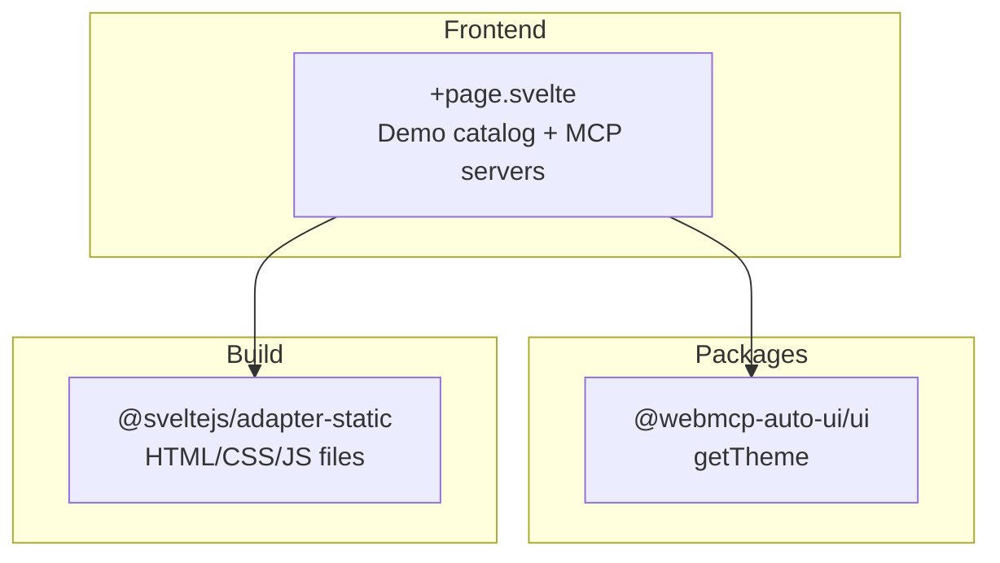

Home (`apps/home/`) is the landing page for the demo site. It's a static page that catalogs all available applications and lists connectable MCP servers. It's the first thing visitors see at `demos.hyperskills.net`.

## What you see when you open the app

When you open Home, you'll see a clean, vertical page centered within a max-width of 3 columns.

At the top, the title **WEBMCP Auto-UI** in bold with a gray subtitle explaining the project: "Interactive demos of the webmcp-auto-ui framework -- Svelte 5 components, W3C WebMCP protocol, AI-driven UI composition, and portable HyperSkills URLs." Three links: hyperskills.net, GitHub, and a theme toggle (sun/moon).

Below, a vertical list of clickable cards presents each app with:
- A vertical color stripe on the left (each app has its distinctive color)
- The app title
- A short description
- The URL path (`/flex2`, `/viewer2`, etc.)

The apps listed are: Flex, Viewer, Showcase, Todo-WebMCP, Recipes, Multi-WebMCP-UI, and Boilerplate.

At the bottom, a bordered section "Available MCP Servers" displays a 4-column grid with the 8 demo MCP servers: Tricoteuses (French Parliament), Hacker News (Stories & comments), Met Museum (Art collections), Open-Meteo (Weather data), Wikipedia (Articles & search), iNaturalist (Biodiversity), data.gouv.fr (French open data), and NASA (Space data).

A footer shows the AGPL-3.0 license, version, and commit hash.

## Architecture



## Tech stack

| Component | Detail |
|-----------|--------|
| Framework | SvelteKit + Svelte 5 |
| Styles | TailwindCSS 3.4 |
| Adapter | `@sveltejs/adapter-static` (static build) |

**Packages used:**
- `@webmcp-auto-ui/ui`: `getTheme` for dark/light toggle

:::note
Home is the only demo app using `adapter-static`. It doesn't need a Node.js server in production -- it's served directly by nginx as static files.
:::

## Getting started

| Environment | Port | Command |
|-------------|------|---------|
| Dev | 5173 | `npm -w apps/home run dev` |
| Production | -- | Static files (nginx) |

```bash
npm -w apps/home run dev
# Available at http://localhost:5173
```

### Production build

```bash
PUBLIC_BASE_URL=https://demos.hyperskills.net npm -w apps/home run build
```

:::caution
The `PUBLIC_BASE_URL` variable is required for the production build. Without it, all demo links point to relative paths that don't work on the server. It's not needed in development.
:::

## Features

### Demo catalog

Each app is represented by an object with title, description, URL, and accent color. The URL is built by prefixing `PUBLIC_BASE_URL` (or empty in dev). Cards are clickable and lead directly to the app.

### MCP servers

The MCP server grid is purely informational -- it shows available servers for apps that support MCP connections (Flex, Boilerplate, Showcase, Multi-Svelte, Recipes).

### Dark/light theme

The toggle uses `getTheme()` from the UI package. The mode is persisted in localStorage.

## Configuration

| Variable | Description | Required |
|----------|-------------|----------|
| `PUBLIC_BASE_URL` | Demo URL prefix (e.g., `https://demos.hyperskills.net`) | Production only |

## Code walkthrough

### `+page.svelte`
Single file for the app. Two static data arrays:
- `demos`: 7 objects `{title, desc, url, accent}` for app cards
- `mcpServers`: 8 objects `{name, desc}` for the server grid

The `base` variable is derived from `PUBLIC_BASE_URL` and serves as a prefix for all URLs.

## Customization

To add a new app to the catalog:
1. Add an object to the `demos` array with `title`, `desc`, `url`, and `accent` (hex color)
2. Rebuild with `PUBLIC_BASE_URL` in production

## Deployment

| Server path | `/opt/webmcp-demos/home/` (root) |
|------------|-------------------------------------|
| Served by | nginx (static files) |

```bash
PUBLIC_BASE_URL=https://demos.hyperskills.net npm -w apps/home run build
./scripts/deploy.sh home
```

## Links

- [Live demo](https://demos.hyperskills.net)
- [Flex](/webmcp-auto-ui/en/apps/flex2/) -- main app
- [UI package](/webmcp-auto-ui/en/packages/ui/) -- `getTheme`
