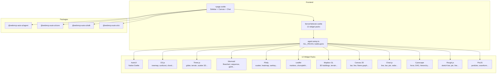

Multi-Svelte (`apps/multi-svelte/`) is the most complete and ambitious demo in the project. It brings together every capability of the architecture in a single app: 12 WebMCP server packs (D3.js, Three.js, Plotly, Leaflet, Mermaid...), multi-provider LLM, multi-MCP, float/grid layouts, token tracking, diagnostics, and an inter-widget linking system. It's the experimentation ground for advanced use cases.

## What you see when you open the app

When you open Multi-Svelte, you'll see a dense, highly configurable interface.

**Left sidebar** (collapsible): the sidebar is about 300px wide and contains vertically stacked controls:
- **LLM**: model selector (haiku, sonnet, opus, Gemma E2B/E4B, Ollama local) with an Ollama URL field
- **MCP**: URL field + optional token for connecting remote MCP servers, with a "Connect all" button to connect all 8 demo servers at once. A `RemoteMCPserversDemo` component lists servers with their status (connected, connecting, disconnected)
- **Packs**: the `ServerSelector` component shows 12 toggleable widget packs. Each pack is a button with its name, description, and on/off indicator. Only "AutoUI (Svelte)" is enabled by default
- **Parameters**: max tokens (slider), max tools, temperature, prompt cache, custom system prompt
- **Optimization**: sanitize, flatten, truncate, compress history, max result length
- **Nano-RAG**: experimental checkbox
- **Diagnostics**: icon that opens a diagnostic modal for tools and prompt

**Central canvas**: fills all remaining space. At the top, buttons toggle between float and grid modes, plus a logs toggle. Generated widgets appear either as floating draggable/resizable windows (`FloatingLayout`) or in a responsive grid (`FlexLayout`). Each window has a title bar with the widget type, inter-widget link indicators (`LinkIndicators`), and a close button. The left border of linked windows lights up with the link group color.

**Input bar**: at the bottom, a text field with Send/Stop buttons, plus ephemeral bubbles (`EphemeralBubble`) showing intermediate agent responses.

**Token tracking**: a `TokenBubble` badge permanently displays metrics: tokens in/out, cache hits, estimated cost.

**Logs**: a collapsible panel below the canvas shows structured agent logs (iterations, requests, responses, tools, final metrics).

## Architecture



## Tech stack

| Component | Detail |
|-----------|--------|
| Framework | SvelteKit + Svelte 5 |
| Styles | TailwindCSS 3.4 |
| Icons | lucide-svelte |
| LLM providers | `RemoteLLMProvider`, `WasmProvider`, `LocalLLMProvider` |
| MCP | `McpMultiClient` |
| Widget packs | 12 local WebMCP servers |
| Layouts | `FloatingLayout` (float) + `FlexLayout` (grid) |
| Token tracking | `TokenTracker` + `TokenBubble` |
| RAG | `ContextRAG` (experimental) |
| Adapter | `@sveltejs/adapter-node` |

**Packages used:**
- `@webmcp-auto-ui/agent`: `runAgentLoop`, `RemoteLLMProvider`, `WasmProvider`, `LocalLLMProvider`, `buildSystemPrompt`, `fromMcpTools`, `trimConversationHistory`, `TokenTracker`, `buildToolsFromLayers`, `runDiagnostics`, `buildDiscoveryCache`, `ContextRAG`, `autoui`
- `@webmcp-auto-ui/core`: `McpMultiClient`
- `@webmcp-auto-ui/sdk`: `canvas`, `MCP_DEMO_SERVERS`
- `@webmcp-auto-ui/ui`: `McpStatus`, `GemmaLoader`, `AgentProgress`, `EphemeralBubble`, `TokenBubble`, `LLMSelector`, `FloatingLayout`, `FlexLayout`, `WidgetRenderer`, `LinkIndicators`, `linkGroupColor`, `RemoteMCPserversDemo`, `DiagnosticIcon`, `DiagnosticModal`, `bus`, `layoutAdapter`

## Getting started

| Environment | Port | Command |
|-------------|------|---------|
| Dev | 3010 | `npm -w apps/multi-svelte run dev` |
| Production | 3012 | `node index.js` (via systemd) |

```bash
npm -w apps/multi-svelte run dev
# Available at http://localhost:3010
```

## Features

### 12 widget packs

Each pack is a local WebMCP server that exposes widgets and tools specific to a visualization library:

| Pack | Library | Widgets |
|------|---------|---------|
| **AutoUI** | Native Svelte | stat, chart, table, kv, list, cards, gallery, etc. |
| **D3.js** | D3 v7 | treemap, sunburst, chord diagram, force graph, etc. |
| **Three.js** | Three.js r170 | globe, terrain, scatter 3D, mesh viewer, etc. |
| **Mermaid** | Mermaid | flowchart, sequence, gantt, ER, class, mindmap, etc. |
| **Plotly** | Plotly.js | scatter, heatmap, 3D surface, sankey, etc. |
| **Leaflet** | Leaflet | markers, choropleth, heatmap layer, routing, etc. |
| **Mapbox GL** | Mapbox GL JS | 3D buildings, terrain, globe, animated lines, etc. |
| **Canvas 2D** | Canvas API | bar chart, line chart, flame graph, etc. |
| **Chart.js** | Chart.js 4 | line, bar, pie, doughnut, radar, scatter, bubble |
| **Cytoscape** | Cytoscape.js | force-directed, DAG, hierarchy, etc. |
| **Rough.js** | Rough.js | sketch bar, pie, line, network (hand-drawn style) |
| **PixiJS** | PixiJS | particles, waveform, gauge (WebGL animations) |

Packs are defined in `agent-setup.ts`. Each pack imports a WebMCP server from `src/lib/servers/{pack}/server.js`.

### Float and grid layout

- **Float** (`FloatingLayout`): each widget is a draggable, resizable window. The agent can position them via `onMove(id, x, y)` and `onResize(id, w, h)` callbacks. The `layoutAdapter` bridges agent tools and the layout component
- **Grid** (`FlexLayout`): responsive CSS flex-wrap grid with configurable min/max width

### Inter-widget links

The `bus` system enables widget-to-widget communication. `LinkIndicators` display colored badges in each window's title bar to indicate relationships. `linkGroupColor` assigns a deterministic color to each link group. The left border of linked windows lights up with this color.

### Real-time token tracking

`TokenTracker` accumulates metrics from each LLM request (input/output tokens, cache read/write, latency). `TokenBubble` permanently displays them in the UI with an estimated cost.

### Diagnostics

The `DiagnosticIcon` in the sidebar shows the warning count. The `DiagnosticModal` details detected issues: invalid schemas, duplicate tools, prompt too long, etc.

### Multi-MCP

Simultaneous connection to multiple remote MCP servers with optional token. The `RemoteMCPserversDemo` component lists the 8 demo servers with connect/disconnect buttons and a "Connect all" button.

### Gemma WASM

Same support as Flex: in-browser loading with `GemmaLoader` for progress tracking.

### Nano-RAG

Context compaction via embeddings, toggleable by checkbox.

## Configuration

| Variable | Description | Default |
|----------|-------------|---------|
| `ANTHROPIC_API_KEY` | Anthropic API key (`.env`) | required |
| `maxContextTokens` | Max context window | 150,000 |
| `maxTokens` | Max tokens per response | 4,096 |
| `maxTools` | Max tools count | 8 |
| `temperature` | Temperature | 1.0 |
| `cacheEnabled` | Prompt cache | `true` |

## Code walkthrough

### `src/lib/agent-setup.ts`
Central file that imports all 12 WebMCP servers and exposes them in the `ALL_PACKS` array. Exports `buildLayers(enabledIds)` to build active layers and `getActiveServers(enabledIds)` for `WidgetRenderer`.

### `src/lib/ServerSelector.svelte`
Pack display component with on/off toggle. Each pack shows its label, description, and state.

### `+page.svelte`
The main component (~500 lines of script). Manages:
- Sidebar state (open/closed)
- Active packs (`enabledPacks` Set)
- Multi-MCP connections
- LLM providers (Claude/Gemma/Ollama)
- Float/grid layout with `ManagedWindow[]`
- Agent loop with all callbacks
- Logs, token tracking, diagnostics

### `src/lib/servers/{pack}/server.js`
Each pack is a JS file that uses `createWebMcpServer` or a similar pattern to create a WebMCP server with its specific widgets and tools.

## Customization

### Creating a new widget pack

1. Create a folder `src/lib/servers/mypack/`
2. Create `server.js` exporting a `WebMcpServer` with your widgets
3. Add the import and entry to `ALL_PACKS` in `agent-setup.ts`

### Modifying the sidebar

The sidebar is directly in `+page.svelte`. Add sections following the existing pattern (uppercase title, controls below).

## Deployment

| Server path | `/opt/webmcp-demos/multi-svelte/` (root) |
|------------|---------------------------------------------|
| systemd service | `webmcp-multi-svelte` |
| ExecStart | `node index.js` |

```bash
./scripts/deploy.sh multi-svelte
```

## Links

- [Live demo](https://demos.hyperskills.net/multi-svelte/)
- [Agent package](/webmcp-auto-ui/en/packages/agent/)
- [UI package](/webmcp-auto-ui/en/packages/ui/) -- FloatingLayout, FlexLayout, LinkIndicators
- [Flex](/webmcp-auto-ui/en/apps/flex2/) -- version with HyperSkill export
