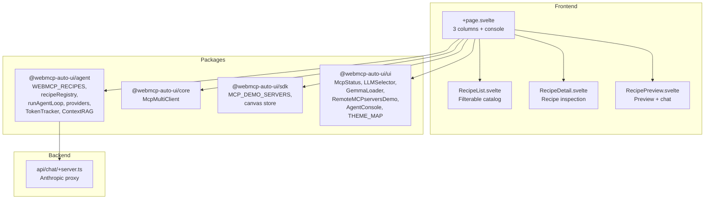

Recipes (`apps/recipes/`) is an interactive explorer for WebMCP (UI) and MCP (server) recipes. Recipes are templates that guide the AI agent to generate the right set of widgets based on context (weather data = charts + KPIs, parliamentary data = deputy profile + hemicycle, etc.). The app lets you browse, inspect, and test each recipe with real data.

## What you see when you open the app

When you open Recipes, you'll see a professional interface in 3 columns on desktop, with an adaptive tablet/mobile layout.

**Toolbar** (top): "Auto-UI recipes" title on the left. On the right: an "MCP" button to open the server connection panel, a Nano-RAG checkbox, an LLM selector, an MCP indicator, a recipe counter ("X local + Y mcp"), a GitHub link, and a theme toggle.

**Left column** (resizable, ~220px default): the `RecipeList` component shows the recipe catalog. At the top, local WebMCP recipes (built-in). At the bottom, MCP recipes loaded from connected servers. Each recipe is a clickable item with its name.

**Center column** (resizable, ~350px): the `RecipeDetail` component shows the selected recipe's details -- name, description, expected components, activation conditions ("when"), markdown body, and a "Test" button to launch the agent.

**Right column** (expandable): the `RecipePreview` component combines a chat input at the bottom and a preview area at the top. Agent-generated widgets appear here, along with text output and any errors. The chat lets you ask free-form questions (with a contextual placeholder that changes based on the selected recipe) or test the selected recipe.

**Resize bars**: between each column, a draggable vertical bar lets you resize columns.

**Agent console** (bottom): a resizable drawer (vertical drag) displays structured agent logs via `AgentConsole`: iterations, LLM requests, responses (tokens + latency), tool calls with arguments and results, final metrics.

**MCP panel** (collapsible): when the "MCP" button is active, a horizontal panel appears below the toolbar with `RemoteMCPserversDemo` to connect/disconnect demo servers.

**Mobile**: on screens < 768px, the 3 columns are replaced by tabs (Recipes, Detail, Preview). The console is reduced to 120px.

## Architecture



## Tech stack

| Component | Detail |
|-----------|--------|
| Framework | SvelteKit + Svelte 5 |
| Styles | TailwindCSS 3.4 + custom CSS (3-column layout) |
| Icons | lucide-svelte |
| LLM providers | `RemoteLLMProvider`, `WasmProvider` |
| MCP | `McpMultiClient` |
| Recipes | `WEBMCP_RECIPES`, `recipeRegistry` |
| RAG | `ContextRAG` (experimental) |
| Adapter | `@sveltejs/adapter-node` |

**Packages used:**
- `@webmcp-auto-ui/agent`: `WEBMCP_RECIPES`, `recipeRegistry`, `runAgentLoop`, `RemoteLLMProvider`, `WasmProvider`, `buildSystemPrompt`, `fromMcpTools`, `trimConversationHistory`, `TokenTracker`, `autoui`, `buildDiscoveryCache`, `ContextRAG`
- `@webmcp-auto-ui/core`: `McpMultiClient`
- `@webmcp-auto-ui/sdk`: `MCP_DEMO_SERVERS`, `canvas`
- `@webmcp-auto-ui/ui`: `McpStatus`, `LLMSelector`, `GemmaLoader`, `RemoteMCPserversDemo`, `AgentConsole`, `THEME_MAP`

## Getting started

| Environment | Port | Command |
|-------------|------|---------|
| Dev | 3009 | `npm -w apps/recipes run dev` |
| Production | 3009 | `node index.js` (via systemd) |

```bash
npm -w apps/recipes run dev
# Available at http://localhost:3009
```

## Features

### Recipe catalog

Recipes are loaded from two sources:
- **Local**: `WEBMCP_RECIPES` from the agent package (built-in, always available)
- **MCP**: dynamically loaded from connected servers that expose a `list_recipes` tool

The `RecipeList` component displays both lists separately with click selection.

### Recipe inspection

The `RecipeDetail` component shows for each recipe:
- Name and description
- Expected components (widget types)
- Activation conditions ("when" -- when the agent should use this recipe)
- Markdown body (detailed instructions)
- "Test" button to launch the agent

### Live testing with contextual placeholder

The chat input adapts its placeholder based on the selected recipe. For example:
- "biodiversity" recipe: "What birds are observed in Paris?"
- "parliamentary profile" recipe: "Show me the latest public votes"
- "weather" recipe: "What's the weather like in Lyon tomorrow?"

The prefill is reactively derived via `PLACEHOLDER_ID_MAP` and `PLACEHOLDER_MAP`.

### Resizable columns

Column resize bars use the `PointerEvent` API (capture + move + up). Minimum widths are protected (150px min).

### Resizable agent console

The bottom console drawer uses the same vertical resize pattern. Min height 80px, max 50% of the window.

### Available recipes (built-in)

| Recipe | Components | When |
|--------|-----------|------|
| KPI Dashboard | stat-card, chart, table, kv | Numeric metrics |
| Art Collection | gallery, cards, carousel | Image collections |
| News Analysis | cards, table, stat-card | Articles |
| Biodiversity | map, stat-card, table | Geographic data |
| Legislative Records | timeline, kv, table | Legislative process |
| Parliamentary Profile | profile, hemicycle, timeline | Deputy profile |
| Legal Texts | list, kv, code | Legal documents |

### Gemma WASM

Same support as Flex and Multi-Svelte: in-browser loading with progress tracking.

### Continuous conversation

The chat supports continuous conversation. Previous messages are preserved in `conversationHistory` and truncated as needed via `trimConversationHistory`. A "Clear" button resets the conversation and previews.

## Configuration

| Variable | Description | Default |
|----------|-------------|---------|
| `ANTHROPIC_API_KEY` | Anthropic API key (`.env`) | required |

## Code walkthrough

### `+page.svelte`
Main file (~850 lines). Manages:
- Recipe selection state (local vs MCP)
- Multi-MCP connection with automatic recipe loading
- LLM providers (Claude + Gemma) with smart defaults
- Layers (MCP + autoui) and system prompt
- Agent loop with detailed callbacks (logs, widgets, text, tools)
- 3-column layout with resize
- Resizable agent console
- Theming via `THEME_MAP`

### `src/lib/RecipeList.svelte`
List component with two sections (local + MCP). Handles selection and `onselect(id, source)` callback.

### `src/lib/RecipeDetail.svelte`
Detail component with frontmatter display, markdown body, and "Test" button.

### `src/lib/RecipePreview.svelte`
Preview component with chat input at the bottom, widgets rendered via `WidgetRenderer` at the top, and `AgentProgress` indicator.

## Customization

### Adding recipes

Recipes are defined in the `agent` package. To add new ones, modify the recipes file in `packages/agent/src/recipes/`.

### Modifying the layout

The 3-column layout is defined in CSS within `+page.svelte`'s `<style>`. Breakpoints are:
- Desktop (> 1024px): 3 columns
- Tablet (768-1024px): 2 columns (list + detail)
- Mobile (< 768px): tabs

## Deployment

| Server path | `/opt/webmcp-demos/recipes/` (root) |
|------------|----------------------------------------|
| systemd service | `webmcp-recipes` |
| ExecStart | `node index.js` |

```bash
./scripts/deploy.sh recipes
```

## Links

- [Live demo](https://demos.hyperskills.net/recipes/)
- [Agent package](/webmcp-auto-ui/en/packages/agent/) -- `WEBMCP_RECIPES`, `recipeRegistry`
- [Flex](/webmcp-auto-ui/en/apps/flex2/) -- using recipes in context
- [Viewer](/webmcp-auto-ui/en/apps/viewer2/) -- for viewing generated skills
