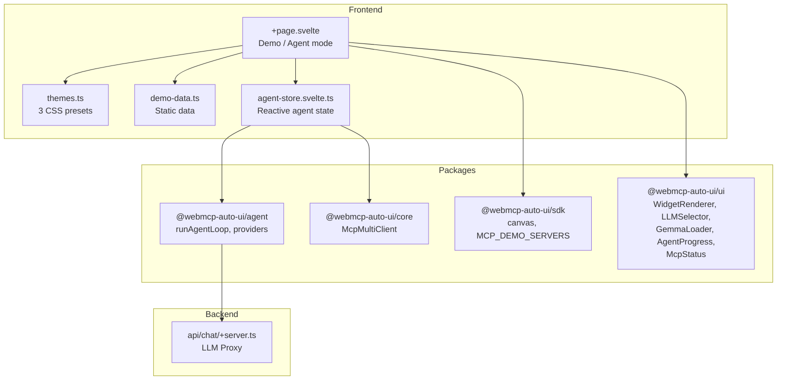

Showcase (`apps/showcase/`) is the interactive showcase of all UI components in the project. It works in two modes: a **static demo** mode that displays each widget type with sample data, and an **agent** mode where an LLM generates widgets from real MCP server data. Three preset themes completely transform the appearance of every component.

## What you see when you open the app

When you open Showcase, you'll see a full-screen page with a sticky, translucent header.

**Header**: on the left, "WebMCP Auto-UI" in bold with a subtitle "Component Showcase -- Corporate" (the active theme). In the center, three theme buttons: Corporate, Pastel, Cyberpunk. On the right, a GitHub link.

**Agent controls bar**: just below, a row of controls drives the agent:
- An MCP server selector (dropdown with demo servers)
- An LLM model selector (haiku, sonnet, opus, Gemma E2B/E4B)
- A Nano-RAG checkbox (experimental)
- A "Generate" button that connects the selected MCP server and launches the agent
- An MCP connection indicator once connected

**Demo mode (default)**: the page displays all widgets in two sections:
- **Simple Widgets**: 3-column grid with stat, kv, list, chart, alert, code, text, actions, tags
- **Rich Widgets**: single column for wide widgets (table, cards, gallery, carousel, timeline, profile, hemicycle, map, etc.)

Each widget is framed in a container with a top banner showing its label and color-coded `type`.

**Agent mode**: when you click "Generate", the agent connects to the MCP server, queries data, and generates appropriate widgets. The page switches to agent mode and displays generated widgets instead of static demos.

## Architecture



## Tech stack

| Component | Detail |
|-----------|--------|
| Framework | SvelteKit + Svelte 5 |
| Styles | TailwindCSS 3.4 |
| LLM providers | `RemoteLLMProvider` (remote LLM), `WasmProvider` (Gemma) |
| MCP | `McpMultiClient` |
| Themes | 3 presets with CSS custom properties |
| Adapter | `@sveltejs/adapter-node` |

**Packages used:**
- `@webmcp-auto-ui/agent`: `runAgentLoop`, `RemoteLLMProvider`, `WasmProvider`, `buildSystemPrompt`, `fromMcpTools`, `autoui`, `buildDiscoveryCache`, `ContextRAG`
- `@webmcp-auto-ui/core`: `McpMultiClient`
- `@webmcp-auto-ui/sdk`: `canvas`, `MCP_DEMO_SERVERS`
- `@webmcp-auto-ui/ui`: `WidgetRenderer`, `LLMSelector`, `GemmaLoader`, `AgentProgress`, `McpStatus`, `getTheme`

## Getting started

| Environment | Port | Command |
|-------------|------|---------|
| Dev | 5178 | `npm -w apps/showcase run dev` |
| Production | 3010 | `PORT=3010 node build/index.js` |

```bash
npm -w apps/showcase run dev
# Available at http://localhost:5178
```

## Features

### 3 dynamic themes

Themes modify the document's CSS custom properties in real time:

| Theme | Mode | Accent | Style |
|-------|------|--------|-------|
| **Corporate** | dark | blue `#3b82f6` | Professional, slate grays |
| **Pastel** | light | purple `#8b5cf6` | Cream background, warm tones |
| **Cyberpunk** | dark | neon green `#00ffaa` | Deep black, pink/green neon |

Each theme defines 11 CSS variables (bg, surface, surface2, border, border2, accent, accent2, amber, teal, text1, text2). Theme changes are instant and affect all widgets simultaneously.

### Static demo mode

The `demo-data.ts` file provides sample data for every widget type. Widgets are split into two categories:
- **Simple** (3-column grid): stat, kv, list, chart, alert, code, text, actions, tags
- **Rich** (full width): table, cards, gallery, carousel, timeline, profile, hemicycle, map, etc.

### Agent-generated mode

When you click "Generate":
1. The app connects to the selected MCP server
2. The agent builds layers (MCP + autoui)
3. `runAgentLoop` generates widgets from real data
4. Widgets replace the static demos
5. Metrics display: widget count, tool calls, elapsed time

A "Demo mode" button lets you switch back to static widgets.

### Gemma WASM in-browser

By selecting Gemma E2B or E4B, the model loads directly in the browser. The `GemmaLoader` component shows download progress with loaded/total MB and elapsed time.

### Experimental Nano-RAG

Toggleable via checkbox. Uses `ContextRAG` to compact the agent's context via embeddings.

## Configuration

| Variable | Description | Default |
|----------|-------------|---------|
| `ANTHROPIC_API_KEY` | Remote LLM provider API key (server-side `.env`) | required |

## Code walkthrough

### `src/lib/themes.ts`
Defines the `ThemePreset` interface and the 3 presets. Each preset is an object with `id`, `label`, `mode` (light/dark), and `overrides` (CSS variable map).

### `src/lib/demo-data.ts`
Exports `SIMPLE_BLOCKS` and `RICH_BLOCKS`, two arrays of `DemoBlock` with type, label, and data. The data is realistic: server metrics, network configuration, project lists, price history, etc.

### `src/lib/agent-store.svelte.ts`
Svelte 5 reactive store encapsulating all agent logic: MCP connection, Gemma initialization, widget generation, metrics tracking. Separated from the main component for better readability.

### `+page.svelte`
Orchestrates both modes (demo/agent), themes, and UI components. The `$derived` `displayBlocks` determines which widgets to show based on the active mode.

## Customization

### Adding a theme

Add an object to the `PRESETS` array in `themes.ts`:

```typescript
{
  id: 'ocean',
  label: 'Ocean',
  mode: 'dark',
  overrides: {
    'color-bg': '#0a1628',
    'color-accent': '#0ea5e9',
    // ... 9 more variables
  },
}
```

### Adding demo widgets

Add an object to `SIMPLE_BLOCKS` or `RICH_BLOCKS` in `demo-data.ts` with the `type` matching a widget supported by `WidgetRenderer`.

## Deployment

| Server path | `/opt/webmcp-demos/showcase/` (root) |
|------------|------------------------------------------|
| systemd service | `webmcp-showcase` |
| ExecStart | `node build/index.js` |

```bash
./scripts/deploy.sh showcase
```

## Links

- [Live demo](https://demos.hyperskills.net/showcase/)
- [UI package](/webmcp-auto-ui/en/packages/ui/) -- all widgets
- [Flex](/webmcp-auto-ui/en/apps/flex/) -- full agent usage
