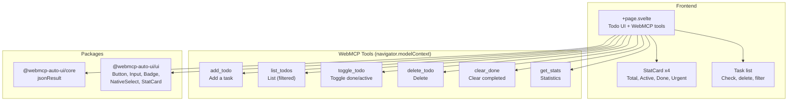

Todo (`apps/todo2/`) is a task management app that exposes its operations via the W3C WebMCP protocol. Unlike other apps in the project, it doesn't use an LLM agent or remote MCP connection -- it **is** a WebMCP server itself. It demonstrates how an existing app can become "MCP-ready" by registering its functions as WebMCP tools.

## What you see when you open the app

When you open Todo, you'll see a polished todo-list interface in a dark monospace style.

At the top, a bar displays "Todo2 WebMCP" with a green "6 tools" indicator confirming the app has registered its WebMCP tools in the browser.

Below that, 4 `StatCard` widgets display real-time metrics:
- **Total**: total task count
- **Active**: incomplete tasks
- **Done**: completed tasks
- **Urgent**: high-priority incomplete tasks

An add form provides a text field, a priority selector (low/normal/high), and an "Add" button.

Three filter buttons (All, Active, Done) let you filter the list. A red "Clear done" button appears when there are completed tasks.

The task list shows each task with:
- A check/circle button to toggle state
- A color dot (red for high, gray for normal, dark gray for low)
- The task text (strikethrough if completed)
- A priority badge
- A trash button on hover to delete

The app starts with 3 pre-filled tasks: "Enable WebMCP in chrome://flags", "Test the tools in the extension", and "Read the WebMCP W3C docs" (already completed).

## Architecture



## Tech stack

| Component | Detail |
|-----------|--------|
| Framework | SvelteKit + Svelte 5 |
| Styles | TailwindCSS 3.4 |
| Icons | lucide-svelte (Check, Trash2, Plus, Circle) |
| Adapter | `@sveltejs/adapter-static` |
| WebMCP | `navigator.modelContext.registerTool()` |

**Packages used:**
- `@webmcp-auto-ui/core`: `jsonResult` (helper for formatting tool responses)
- `@webmcp-auto-ui/ui`: `Button`, `Input`, `Badge`, `NativeSelect`, `StatCard`

:::note
Todo2 doesn't use the `agent` or `sdk` packages. It's the simplest app in the project -- it only exposes its functions via the browser's W3C WebMCP API.
:::

## Getting started

| Environment | Port | Command |
|-------------|------|---------|
| Dev | 5176 | `npm -w apps/todo2 run dev` |
| Production | -- | Static files (nginx) |

```bash
npm -w apps/todo2 run dev
# Available at http://localhost:5176
```

## Features

### 6 WebMCP tools

Tools are registered on `onMount` via `navigator.modelContext.registerTool()` and unregistered on `onDestroy`:

| Tool | Description | Annotations |
|------|-------------|-------------|
| `add_todo` | Add a task with text and optional priority | -- |
| `list_todos` | List tasks with optional filter (all/active/done) | `readOnlyHint: true` |
| `toggle_todo` | Toggle a task between done and active | -- |
| `delete_todo` | Delete a task by ID | `destructiveHint: true` |
| `clear_done` | Remove all completed tasks | `destructiveHint: true` |
| `get_stats` | Return statistics (total, active, done, high) | `readOnlyHint: true` |

The `readOnlyHint` and `destructiveHint` annotations inform the LLM about tool behavior for better decision-making.

### UI package components

The app exclusively uses components from `@webmcp-auto-ui/ui`:
- `StatCard` for the 4 metrics with variants (default, info, success, error)
- `Button` with variants (default, outline, ghost, destructive) and sizes (sm, icon)
- `Input` for the text field
- `NativeSelect` for the priority selector
- `Badge` with secondary variant for priority labels

### Svelte 5 reactive state

The app uses Svelte 5 runes (`$state`, `$derived`) for fully reactive state:
- `todos`: reactive task list
- `filter`: active filter
- `stats`: automatically derived statistics
- `filtered`: derived filtered list

## Configuration

The app has no environment variables. All data is in-memory (no persistence).

## Code walkthrough

### `+page.svelte`
Single file for the app (~200 lines). It contains:

**Types and state** (lines 1-30): `Todo` interface with id, text, done, priority, createdAt. Three pre-filled tasks.

**CRUD** (lines 30-50): `addTodo`, `toggleTodo`, `deleteTodo`, `clearDone` functions that manipulate the reactive array.

**WebMCP** (lines 72-116): on `onMount`, all 6 tools are registered via `navigator.modelContext.registerTool()`. Each tool defines an `inputSchema` (JSON Schema) and an `execute` function that calls the corresponding CRUD function and returns the result via `jsonResult`.

**UI** (lines 120-206): the Svelte template with header, stats, form, filters, and list.

## Customization

### As a minimal template

Todo2 is the simplest starting point for creating a WebMCP app:

```bash
cp -r apps/todo2 apps/my-app
```

Modify:
1. `package.json`: change the name and port
2. `+page.svelte`: replace the `Todo` type with your data model
3. Adapt the CRUD functions and WebMCP tools

### Adding persistence

The app stores everything in memory. To persist:
- **localStorage**: add an `$effect` that saves `todos` on every change
- **Backend**: add an API endpoint and replace CRUD functions with fetch calls

### Connecting to an agent

To drive tools via an LLM agent (instead of the browser), see the [Boilerplate](/en/apps/boilerplate/) architecture which integrates `runAgentLoop`.

## Deployment

| Server path | `/opt/webmcp-demos/todo2/` (root) |
|------------|--------------------------------------|
| Served by | nginx (static files) |

```bash
./scripts/deploy.sh todo2
```

## Links

- [Live demo](https://demos.hyperskills.net/todo2/)
- [Core package](/en/packages/core/) -- `jsonResult`
- [UI package](/en/packages/ui/) -- used components
- [Boilerplate](/en/apps/boilerplate/) -- version with AI agent
