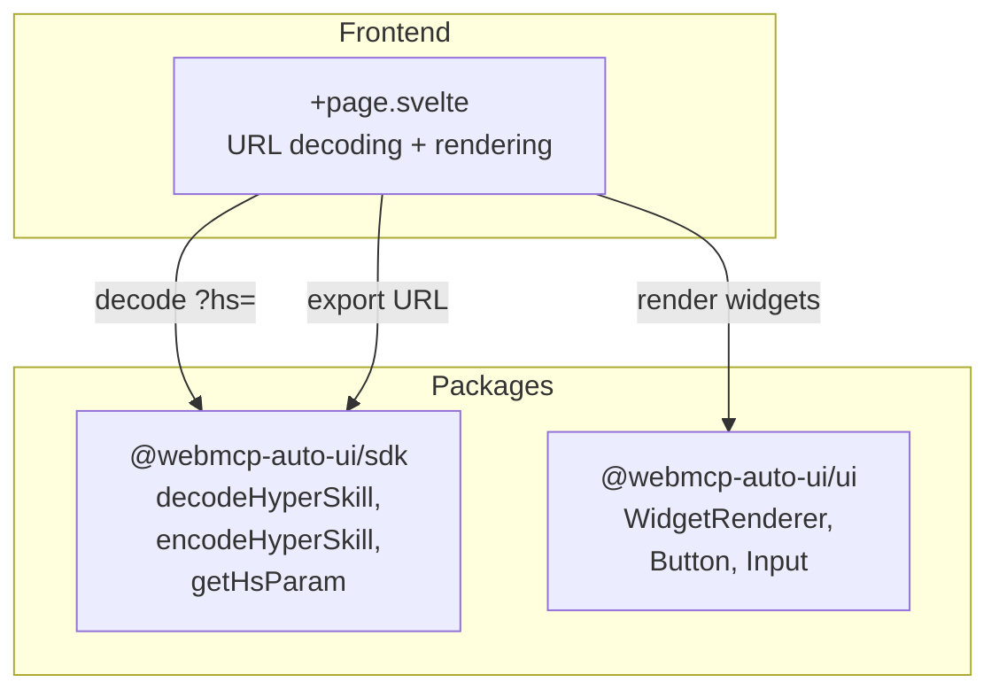

Viewer (`apps/viewer2/`) is the project's HyperSkills reader. It decodes compressed `?hs=` URLs, displays widgets in a reading interface, and lets you create, edit, and export skills. It's the consultation and sharing tool: when someone sends you a HyperSkill link, the Viewer is what displays it.

## What you see when you open the app

When you open the Viewer without a `?hs=` parameter, you'll see an empty screen with a grayed-out hexagon and the message "No `?hs=` parameter in the URL". A "Paste URI" bar at the top invites you to paste a HyperSkill link, with a "New" button to create a blank skill.

When a skill is loaded (via URL or paste), the interface transforms:

- **Header**: the skill's title, description, and action buttons -- "DAG" to view the version tree, "Test in Recipes" to launch a live test, "Edit" to open the skill in Flex
- **Paste bar**: always visible for loading another skill, plus an "Export URL" button to copy the link to the clipboard
- **Meta card**: title, description, source MCP server, SHA hash, version
- **Widgets**: each block is rendered via `WidgetRenderer` in a container with a hover toolbar (edit JSON, delete)
- **"Add widget" button**: at the bottom, a dashed button lets you manually add a `text` widget
- **DAG panel**: when enabled, displays a horizontal version timeline with clickable nodes connected by SVG arrows

## Architecture



## Tech stack

| Component | Detail |
|-----------|--------|
| Framework | SvelteKit + Svelte 5 |
| Styles | TailwindCSS 3.4 |
| Icons | lucide-svelte (ExternalLink, Pencil, Plus, Trash2, FlaskConical, GitBranch, Github) |
| Adapter | `@sveltejs/adapter-node` |

**Packages used:**
- `@webmcp-auto-ui/sdk`: `decodeHyperSkill`, `encodeHyperSkill`, `getHsParam`
- `@webmcp-auto-ui/ui`: `WidgetRenderer`, `Button`, `Input`

:::note
The Viewer doesn't use the `agent` package and has no MCP connection. It's a pure consultation app.
:::

## Getting started

| Environment | Port | Command |
|-------------|------|---------|
| Dev | 3008 | `npm -w apps/viewer2 run dev` |
| Production | 3008 | `node build/index.js` (via systemd) |

```bash
npm -w apps/viewer2 run dev
# Available at http://localhost:3008
```

## Features

### HyperSkill URL decoding

The Viewer automatically decodes the `?hs=` parameter on load. The parameter contains a base64 gzip-encoded skill with metadata (title, description, hash, version) and content (list of type + data blocks).

### Paste URI

Paste any HyperSkill URL (or just the raw `hs` parameter value) in the input bar. The Viewer decodes it and updates the browser URL via `history.pushState`.

### Widget CRUD

Each widget is editable:
- **Edit**: opens an inline JSON editor to modify the widget's `data`
- **Delete**: removes the widget from the list
- **Add**: creates a new `text` widget with default content
- **Change type**: in the editor, the type field is editable

### Version DAG

The version graph displays the SHA hash chain. Each skill can reference a `previousHash`, forming a directed acyclic graph (DAG). Nodes are displayed as clickable buttons connected by SVG arrows.

### Cross-app navigation

Two buttons enable navigation:
- **"Edit"**: opens the skill in Flex for editing with the AI agent
- **"Test in Recipes"**: opens the skill in the recipe explorer

### URL export

The "Export URL" button re-encodes the skill (with all modifications) as a HyperSkill URL and copies it to the clipboard.

## Configuration

The Viewer has no environment variables. It works entirely client-side.

## Code walkthrough

### `+page.svelte`
Single file for the app. It handles:
- URL decoding via `getHsParam` + `decodeHyperSkill` on `onMount`
- Block extraction from the decoded HyperSkill structure
- Version DAG construction from `hash` / `previousHash` metadata
- Inline JSON editing with validation (the "Save" button is blocked on invalid JSON)
- Export via `encodeHyperSkill` with clipboard copy

### Example URL

```
http://localhost:3008/?hs=eyJtZXRhIjp7InRpdGxlIjoiV2VhdGhlciJ9LCJjb250ZW50IjpbeyJ0eXBlIjoic3RhdCIsImRhdGEiOnsibGFiZWwiOiJUZW1wIiwidmFsdWUiOiIxNEMifX1dfQ==
```

## Customization

To extend the Viewer:
1. **Add block types**: widgets are rendered by `WidgetRenderer`, which supports all types from the UI package
2. **Extend the DAG**: extend the `buildDag()` logic to display a full tree with navigation
3. **Add collaboration**: integrate a backend to store skills and share URLs

## Deployment

| Server path | `/opt/webmcp-demos/viewer2/build/` (subdirectory) |
|------------|------------------------------------------------------|
| systemd service | `webmcp-viewer2` |
| ExecStart | `node build/index.js` |

:::caution
The Viewer is deployed in the `build/` subdirectory, not at the root. The `deploy.sh` script handles this path automatically.
:::

```bash
./scripts/deploy.sh viewer2
```

## Links

- [Live demo](https://demos.hyperskills.net/viewer2/)
- [SDK package](/webmcp-auto-ui/en/packages/sdk/) -- `decodeHyperSkill`, `encodeHyperSkill`
- [Flex](/webmcp-auto-ui/en/apps/flex2/) -- for editing with the AI agent
- [Recipes](/webmcp-auto-ui/en/apps/recipes/) -- for testing recipes
