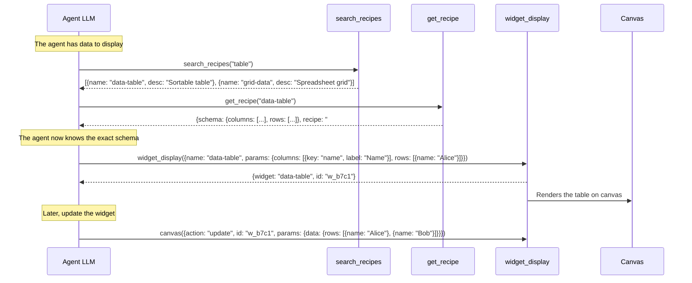
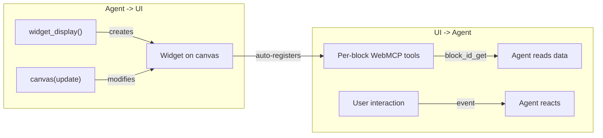
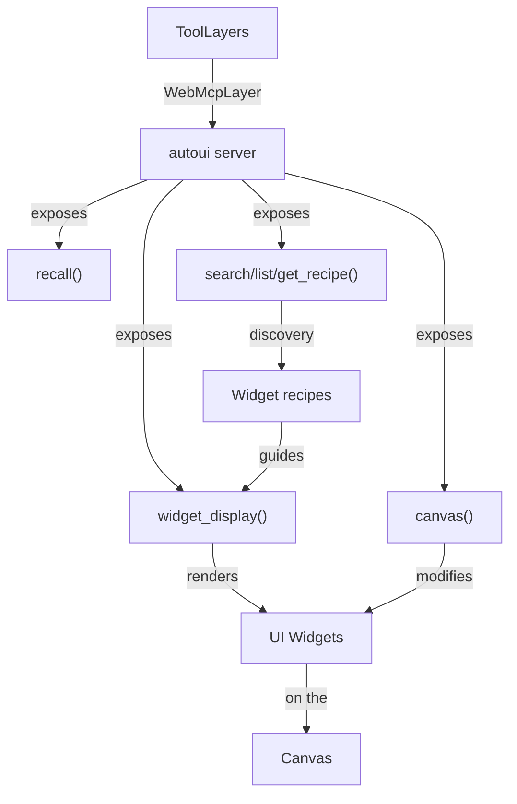

Think of a universal remote control: instead of having one remote per device (TV, speakers, lights), you have a single "show this" button. You say what you want to see and with what parameters, and the remote figures it out. That's exactly what `widget_display` does: a **single tool** that lets the agent render any of the 24+ native widgets.

## What is the component / widget_display tool?

`widget_display` is the central WebMCP tool that lets the AI agent **display a widget on the canvas**. The agent sends a widget name and its parameters, and the system:
1. Validates parameters against the widget's JSON schema
2. Sanitizes image URLs (strips hallucinated URLs)
3. Renders the widget on the canvas
4. Returns a unique identifier for later modifications

```ts
// The agent calls:
widget_display({
  name: "stat-card",
  params: { label: "Uptime", value: "99.9", unit: "%", variant: "success" }
})

// The system returns:
{ widget: "stat-card", data: { label: "Uptime", value: "99.9", unit: "%", variant: "success" }, id: "w_a3f2" }
```

:::note[Historical evolution]
The tool was called `component()` in earlier versions (before Phase 8). It was renamed to `widget_display` when the WebMCP `autoui` server was adopted. The old `component()` / `componentRegistry` API has been removed. The concept remains the same: a single tool to render any widget.
:::

## Why a single tool?

The alternative would be to expose one tool **per widget**: `render_stat`, `render_chart`, `render_table`... that's 31 tools. Compare:

| Approach | Visible tools | Schema tokens | Discovery |
|----------|--------------|--------------|-----------|
| 1 tool per widget | 31 `render_*` | ~3000 tokens | LLM sees everything upfront |
| Single `widget_display` | 1 tool | ~200 tokens | LLM discovers via recipes |

The single tool uses **15x fewer** schema tokens. With a remote LLM like Claude, that's a significant saving on every request.

## The 6 tools of the autoui server

The `autoui` server exposes 6 tools in total. The first 4 form the discovery and rendering system, the last 2 are utility tools:

### search_recipes() -- Search

```
autoui_webmcp_search_recipes({ query: "kpi" })
```

Returns widgets and recipes whose name or description contains the search term.

### list_recipes() -- Full list

```
autoui_webmcp_list_recipes()
```

Returns the list of all registered widgets with name, description and group.

### get_recipe() -- Detailed schema

```
autoui_webmcp_get_recipe({ name: "stat-card" })
```

Returns the widget's **full JSON schema**, its description, and its **usage recipe** (a Markdown guide). This is where the agent learns expected parameters.

### widget_display() -- Rendering

```
autoui_webmcp_widget_display({ name: "stat-card", params: { label: "Uptime", value: "99.9%" } })
```

**The main tool.** Validates parameters, sanitizes URLs, and renders the widget on the canvas. Returns `{ widget, data, id }`.

### canvas() -- Manipulation

```
autoui_webmcp_canvas({ action: "update", id: "w_a3f2", params: { data: { value: "99.8%" } } })
```

5 actions to modify existing widgets: `clear`, `update`, `move`, `resize`, `style`.

### recall() -- Result re-read

```
autoui_webmcp_recall({ id: "toolu_xxx" })
```

Re-reads the full result of a previous tool call (useful when the result was truncated to 10,000 characters by the agent loop).

## The complete flow: from discovery to render



## The bidirectional agent-UI bridge

The system creates a **bidirectional bridge** between the agent and the interface:



### Agent -> UI direction

The agent creates and modifies widgets:

1. `widget_display()` creates a new widget
2. `canvas(update)` updates an existing widget's data
3. `canvas(move/resize/style)` changes position and styling
4. `canvas(clear)` clears the entire canvas

### UI -> Agent direction

Each rendered widget auto-registers as a WebMCP tool source via `navigator.modelContext`:

```ts
// When a "stat-card" widget with id "w_a3f2" is mounted:
navigator.modelContext.registerTool('block_w_a3f2_get', {
  description: 'Read current data of stat-card widget',
  execute: () => currentData,
});

navigator.modelContext.registerTool('block_w_a3f2_update', {
  description: 'Update stat-card widget data',
  execute: (newData) => { /* updates the widget */ },
});

navigator.modelContext.registerTool('block_w_a3f2_remove', {
  description: 'Remove this widget from the canvas',
  execute: () => { /* removes the widget */ },
});
```

User interactions (button clicks, table selections) also bubble up to the agent as events.

## Validation and security

### JSON Schema validation

Every `widget_display` call is validated against the target widget's schema. If parameters don't match, the server returns an error with the expected schema:

```ts
// The agent sends invalid parameters:
widget_display({ name: "stat", params: { valeur: "42" } })

// The server returns:
{
  error: "Validation failed",
  details: [{ path: "/label", message: "required property missing" }],
  expected_schema: { type: "object", required: ["label", "value"], ... }
}
```

The agent then automatically corrects its call (the system prompt includes error handling rules).

### Image URL sanitization

LLMs tend to fabricate image URLs. The `autoui` server **automatically strips** invalid URLs from image fields (`src`, `avatar`, `image`, `thumbnail`...):

```ts
// The agent hallucinates a URL:
widget_display({ name: "profile", params: {
  name: "Alice",
  avatar: { src: "portrait-alice.jpg" }   // relative URL, invalid
} })

// The server strips the invalid avatar before rendering
// The ProfileCard widget displays the initials "A" instead
```

Only URLs starting with `http://`, `https://`, `data:` or `/` are preserved.

## Widget names and backward compatibility

Widget names use dashes: `stat-card`, `data-table`, `chart-rich`. Legacy `render_*` prefixed names are still accepted for backward compatibility:

| Current name | Legacy name |
|-------------|-------------|
| `stat-card` | `render_stat_card` |
| `data-table` | `render_data_table` |
| `chart-rich` | `render_chart_rich` |

## How this relates to other concepts



- **ToolLayers**: the autoui server produces a `WebMcpLayer` carrying all these tools
- **Recipes**: widget recipes (inline in autoui) and WebMCP recipes (`.md` files) guide widget selection
- **Widgets**: the catalog of 24+ visual components rendered by `widget_display`
- **MCP**: MCP tools provide the data that `widget_display` displays

## Advanced patterns

### Multi-widget composition

The agent can chain multiple `widget_display` calls to compose a complete dashboard:

```
// The agent follows a "dashboard-kpi" recipe
widget_display({ name: "stat-card", params: { label: "Revenue", value: "$142K" } })  -> w_1
widget_display({ name: "stat-card", params: { label: "Users", value: "3.2K" } })     -> w_2
widget_display({ name: "chart-rich", params: { type: "line", ... } })                -> w_3
widget_display({ name: "data-table", params: { columns: [...], rows: [...] } })      -> w_4
```

### Reactive updates

The agent can modify a widget without recreating it:

```
// Initial creation
widget_display({ name: "stat", params: { label: "Price", value: "$100" } }) -> w_5

// Later, update
canvas({ action: "update", id: "w_5", params: { data: { value: "$105" } } })
```

### Cascading error handling

The system prompt includes strict error handling rules:

1. If a call fails: analyze the error message and expected schema
2. Correct the call in strict compliance with the schema
3. Retry at least once before changing strategy
4. After two identical failures: search for a different recipe

## Summary: the 6 tools at a glance

| Tool | Role | When to use |
|------|------|-------------|
| `search_recipes` | Search widgets/recipes | At the start, to find the right widget |
| `list_recipes` | List all widgets | If search yields nothing |
| `get_recipe` | Get full schema | Before the first widget_display call |
| `widget_display` | Render a widget | To display data |
| `canvas` | Modify an existing widget | To update, move, or style |
| `recall` | Re-read a truncated result | When an MCP result exceeds 10K chars |
