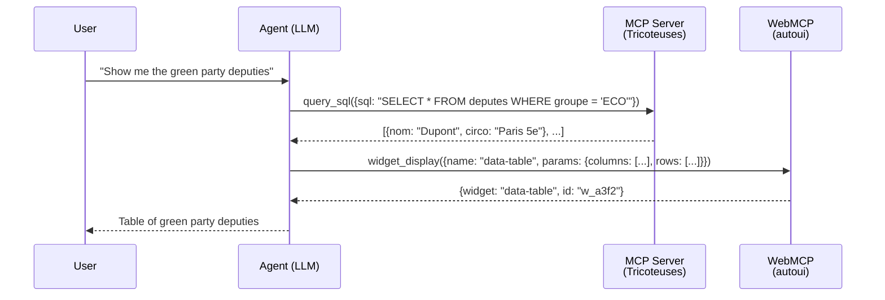
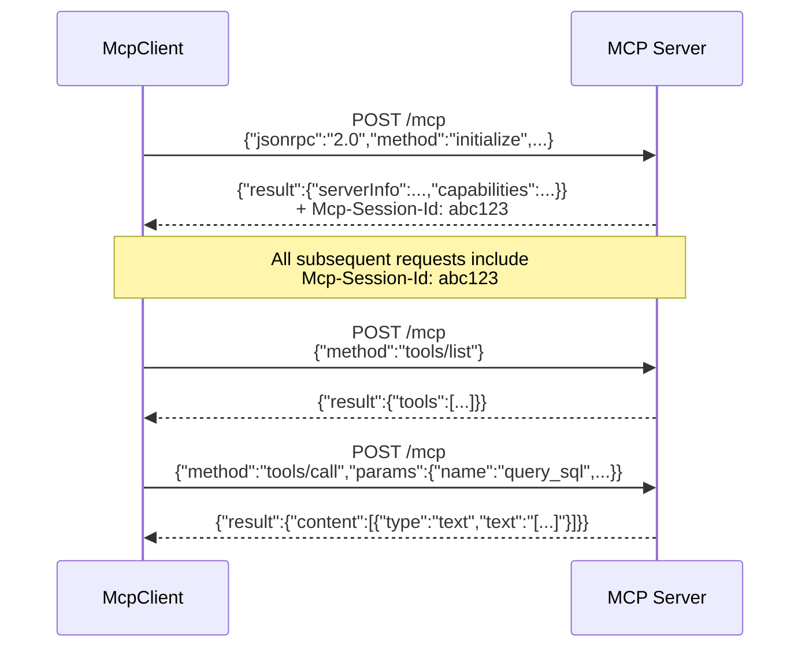
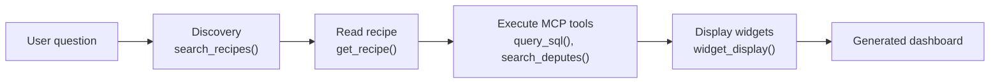
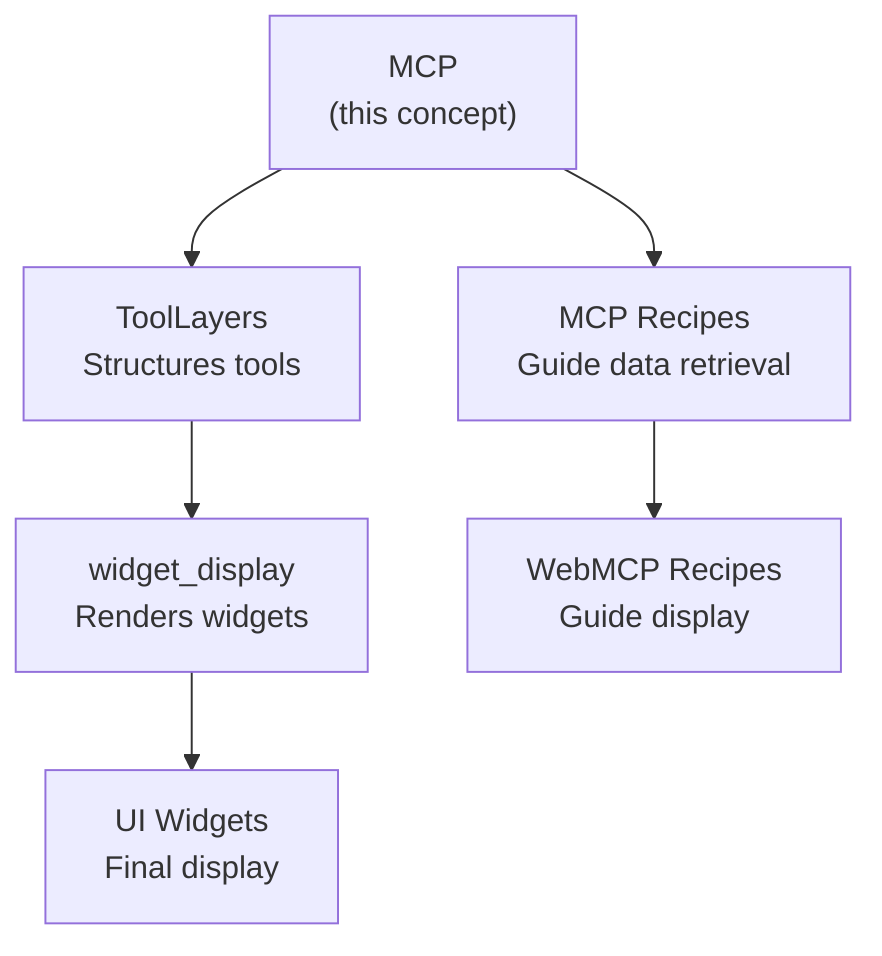

Think of a universal translator at an international conference. Each speaker talks in a different language (SQL, REST API, GraphQL...), but the translator converts everything into a common language everyone understands. MCP plays exactly this role between AI agents and data sources.

## What is MCP?

**MCP** (Model Context Protocol) is a protocol standardized by Anthropic, built on JSON-RPC 2.0, that allows an AI agent to discover and call **tools** exposed by remote servers. Think of it as the "USB" of AI: a single connector to plug in any data source.

In webmcp-auto-ui, MCP is the communication layer between **data** (MCP servers) and the **interface** (WebMCP widgets).

## Why two protocols? MCP vs WebMCP

This is the fundamental distinction in the project. Two worlds coexist:

| | MCP (Anthropic standard) | WebMCP (browser polyfill) |
|--|--------------------------|---------------------------|
| **Where it runs** | Network (HTTP/SSE) | In the browser (postMessage) |
| **Transport** | JSON-RPC 2.0 over HTTP POST | In-memory JS function calls |
| **Who exposes it** | A remote server (e.g., parliamentary database) | The local `autoui` server (UI widgets) |
| **What it provides** | **Data** (SQL, API, files) | **Display** (stat, chart, table, map) |
| **Session** | `Mcp-Session-Id` header, auto-reconnect | No session, everything is local |
| **Spec** | Anthropic MCP specification | W3C WebMCP Draft CG Report (2026-03-27) |

:::tip[The golden rule]
**MCP** = "what am I fetching?" (data)
**WebMCP** = "how am I displaying it?" (interface)
:::

### Diagram: MCP vs WebMCP in action



The LLM orchestrates both protocols transparently: it **retrieves** data via MCP, then **presents** it via WebMCP. The user only sees the final result.

## Multi-server architecture

An agent can connect to **multiple** MCP servers simultaneously. Each server produces an `McpLayer` with its own tools and recipes. The LLM sees all tools from all servers in a single unified prompt.

```mermaid
graph TD
    subgraph Agent
        L[Agent Loop]
        LLM[LLM Claude/Gemma/Ollama]
    end

    subgraph "Data layer MCP"
        S1[MCP Server 1<br/>Tricoteuses<br/>12 DATA tools]
        S2[MCP Server 2<br/>iNaturalist<br/>8 DATA tools]
    end

    subgraph "Display layer WebMCP"
        UI[autoui<br/>24+ native widgets<br/>+ canvas + recall]
    end

    L --> LLM
    LLM -->|tool_use| S1
    LLM -->|tool_use| S2
    LLM -->|widget_display| UI
    S1 -->|JSON results| LLM
    S2 -->|JSON results| LLM
    UI -->|{widget, id}| LLM
```

## McpClient: connecting to a server

The `McpClient` manages a single connection to an MCP server. It handles session initialization, tool calls, and automatic reconnection.

```ts
import { McpClient } from '@webmcp-auto-ui/core';

// 1. Create the client with options
const client = new McpClient('https://mcp.code4code.eu/mcp', {
  clientName: 'my-app',        // your app's identifier
  clientVersion: '1.0.0',
  timeout: 30000,               // 30s per request
  headers: {                    // authentication if needed
    'Authorization': 'Bearer <token>',
  },
  autoReconnect: true,           // re-initialize on session expiry
  maxReconnectAttempts: 3,       // give up after 3 attempts
});

// 2. Initialize the session (required before any call)
await client.connect();

// 3. Discover the server's tools
const tools = await client.listTools();
// -> [{ name: "query_sql", description: "Execute a SQL query", inputSchema: {...} }, ...]

// 4. Call a tool
const result = await client.callTool('query_sql', { sql: 'SELECT COUNT(*) FROM deputes' });
// -> { content: [{ type: "text", text: "[{\"count\": 577}]" }] }

// 5. Clean up (avoid session leaks)
await client.disconnect();
```

### McpClient API

| Method | Returns | Description |
|--------|---------|-------------|
| `connect()` | `McpInitializeResult` | Initializes the JSON-RPC session, exchanges capabilities |
| `listTools()` | `McpTool[]` | Lists tools with name, description, schema |
| `callTool(name, args?)` | `McpToolResult` | Calls a tool, returns text/image content |
| `disconnect()` | `void` | Closes the session cleanly |

## McpMultiClient: multi-server connections

When you need to query multiple data sources simultaneously, `McpMultiClient` manages connections, aggregates tool lists, and routes each call to the correct server.

```ts
import { McpMultiClient } from '@webmcp-auto-ui/core';

const multi = new McpMultiClient();

// Connect two servers
await multi.addServer('https://mcp.code4code.eu/mcp');    // politics
await multi.addServer('https://mcp.inaturalist.org/mcp');  // biodiversity

// See all tools from all servers
const allTools = multi.listAllTools();
// -> [query_sql, search_deputes, list_species, search_observations, ...]

// Call a tool -- routing is automatic
const result = await multi.callTool('query_sql', { sql: 'SELECT 1' });

// Disconnect a specific server
await multi.removeServer('https://mcp.code4code.eu/mcp');

// Disconnect everything
await multi.disconnectAll();
```

## Transport: Streamable HTTP

The MCP protocol uses HTTP POST with JSON-RPC 2.0. Here's what happens under the hood:



### Transport details

- **Content-Type**: `application/json`
- **Accept**: `application/json, text/event-stream`
- **Session**: the `Mcp-Session-Id` header is managed automatically after `connect()`
- **Reconnection**: on a 404 response (expired session), the client re-initializes with exponential backoff
- **SSE**: when the server responds with `text/event-stream`, the client parses Server-Sent Events

## Building MCP layers (ToolLayers)

Each connected server produces an `McpLayer`. The `autoui` server produces a `WebMcpLayer`. Together, they form the `ToolLayer[]` that structures the entire prompt and LLM toolset.

```ts
import { McpClient } from '@webmcp-auto-ui/core';
import { autoui } from '@webmcp-auto-ui/agent';
import type { McpLayer } from '@webmcp-auto-ui/agent';

// Data layer: MCP server
const client = new McpClient('https://mcp.code4code.eu/mcp');
await client.connect();

const mcpLayer: McpLayer = {
  protocol: 'mcp',
  serverUrl: 'https://mcp.code4code.eu/mcp',
  serverName: 'Tricoteuses',
  tools: await client.listTools(),
  recipes: [
    { name: 'profil-depute', description: 'Full deputy profile' },
  ],
};

// Display layer: WebMCP server
const uiLayer = autoui.layer();

// Combine the layers
const layers = [mcpLayer, uiLayer];
```

:::note[Server recipes]
MCP recipes come from the server and describe how to combine its tools. They are distinct from WebMCP recipes which guide display. See the [Recipes](/webmcp-auto-ui/en/concepts/recipes/) page for the full comparison.
:::

## What the LLM sees in the prompt

The `buildSystemPrompt(layers)` function generates a structured prompt that guides the LLM through a 4-step flow:

```
STEP 1 -- Recipe search
Search for a relevant recipe:
autoui_webmcp_search_recipes()
tricoteuses_mcp_search_recipes()

STEP 2 -- Read the recipe
autoui_webmcp_get_recipe()
tricoteuses_mcp_get_recipe()

STEP 3 -- Execution
Follow the recipe instructions...

STEP 4 -- UI display
autoui_webmcp_widget_display
autoui_webmcp_canvas
```

The prompt guides the LLM through a 4-step flow: discover recipes, read them, execute DATA tools, then display with widgets.

## Complete pattern: from question to dashboard



### Full annotated example

```ts
import { McpClient } from '@webmcp-auto-ui/core';
import { runAgentLoop, autoui } from '@webmcp-auto-ui/agent';
import type { McpLayer } from '@webmcp-auto-ui/agent';

// 1. Connect to the MCP server
const client = new McpClient('https://mcp.code4code.eu/mcp');
await client.connect();
const tools = await client.listTools();

// 2. Build the DATA layer
const mcpLayer: McpLayer = {
  protocol: 'mcp',
  serverUrl: 'https://mcp.code4code.eu/mcp',
  serverName: 'Tricoteuses',
  tools,
};

// 3. UI layer (autoui provides 24+ native widgets)
const uiLayer = autoui.layer();

// 4. Run the agent loop
const result = await runAgentLoop('List the green party deputies', {
  provider: claudeProvider,
  layers: [mcpLayer, uiLayer],     // both layers together
  callbacks: {
    // Each widget rendered by the LLM arrives here
    onWidget: (type, data) => {
      blocks.push({ type, data });
      return { id: 'w_' + Math.random().toString(36).slice(2, 6) };
    },
    // The assistant's text arrives here
    onText: (text) => console.log('Assistant:', text),
  },
});
```

## How MCP relates to other concepts



- **ToolLayers**: MCP produces `McpLayer` instances that feed into the layer system
- **Recipes**: MCP recipes (server) and WebMCP recipes (UI) are two complementary systems
- **widget_display**: the tool the LLM calls to render MCP data as widgets

## Advanced patterns

### Multi-server data correlation

An agent can cross-reference data from two different MCP servers:

```ts
const layers = [
  tricoteusesLayer,  // parliamentary data
  iNaturalistLayer,  // biodiversity data
  autoui.layer(),    // widgets
];

// The LLM can look up deputies from a region AND biodiversity
// observations in the same region, then present them together
await runAgentLoop('Compare deputies from Var with local biodiversity', {
  provider: claudeProvider,
  layers,
  callbacks: { onWidget },
});
```

### Session reconnection

If the MCP server expires the session, the client re-initializes automatically:

```
Client -> POST /mcp (callTool)
Server -> 404 (session expired)
Client -> POST /mcp (initialize)   // automatic re-init
Server -> 200 + new session-id
Client -> POST /mcp (callTool)     // retry with new session
Server -> 200 (result)
```

## Summary table

| Aspect | MCP | WebMCP |
|--------|-----|--------|
| **Role** | Retrieve data | Display data |
| **Transport** | HTTP + JSON-RPC 2.0 | In-memory JS calls |
| **Typical tools** | `query_sql`, `search`, `list_tables` | `widget_display`, `canvas`, `recall` |
| **Recipes** | How to combine DATA tools | How to present with widgets |
| **Client** | `McpClient` / `McpMultiClient` | No client needed (local server) |
| **Example servers** | Tricoteuses, iNaturalist, Hacker News | `autoui` (the only WebMCP server) |

## Constraints

- The MCP server must support Streamable HTTP (POST JSON-RPC 2.0)
- `connect()` is required before `listTools()` or `callTool()`
- Results are text-based: parse JSON from `content[0].text`
- The agent loop truncates results at 10,000 characters
- CORS: the server must allow requests from your domain

## Common errors

| Error | Consequence | Fix |
|-------|-------------|-----|
| `listTools()` before `connect()` | Session error | Always `connect()` first |
| Missing `Authorization` header | 401/403 | Pass the Bearer token in options |
| `timeout` too low | Request aborted | Increase for heavy queries (60000+) |
| No `disconnect()` | Server session leak | Call on component unmount |
| Confusing MCP with WebMCP | Wrong tool called | MCP = data, WebMCP = display |
