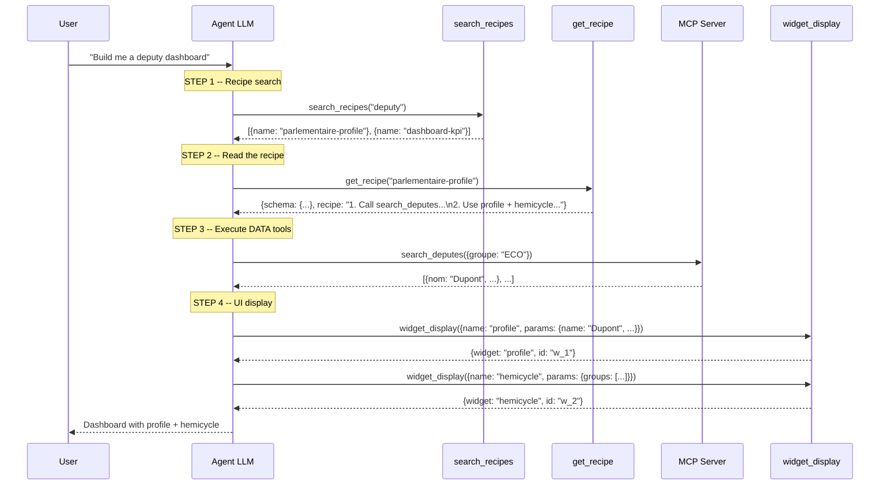
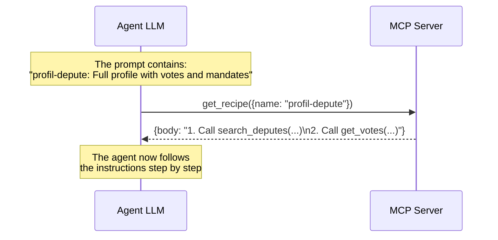
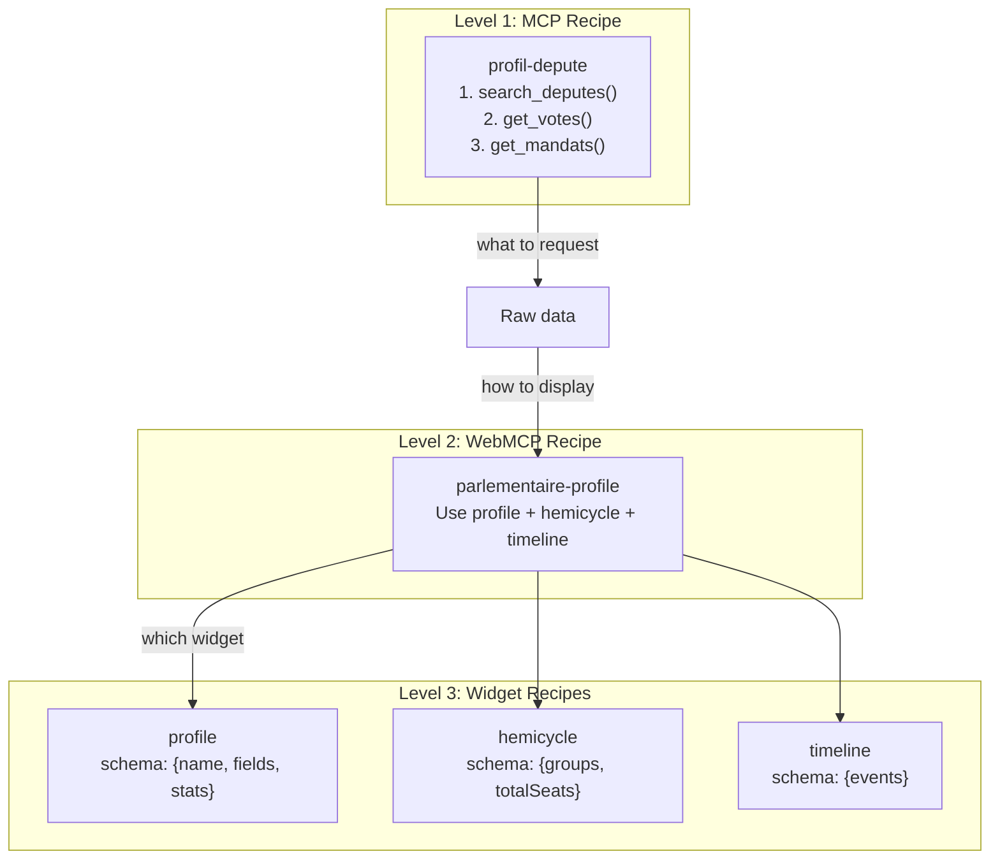
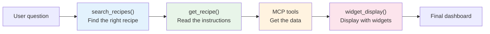

Picture a chef in a well-equipped kitchen. They have the ingredients (MCP data) and the utensils (UI widgets). But without a **recipe**, they'd have to improvise every dish. Recipes tell them: "with these ingredients, use these utensils, in this order, to get this result." That's exactly what recipes do in webmcp-auto-ui.

## What is a recipe?

A recipe is a **composition guide** that tells the agent how to transform data into an interface. There are two complementary types:

| | WebMCP Recipe (UI) | MCP Recipe (server) |
|--|---------------------|----------------------|
| **Who provides it** | The `agent` package (`.md` files) | The remote MCP server |
| **What it guides** | **How to display** data (which widgets, what layout) | **How to get** data (which tools, in what order) |
| **Analogy** | The plating recipe | The cooking recipe |

:::tip[Two axes, one result]
The agent uses both together: an MCP recipe tells it **what to request** from the server, a WebMCP recipe tells it **how to present** the result. Like a chef following both a cooking recipe AND a plating guide.
:::

## Why recipes exist

Without recipes, the agent would have to:
1. Guess which MCP tools to call and in what order
2. Guess which widget fits which type of data
3. Improvise the layout for every request

With recipes, the agent follows a **guided path**: it finds a relevant recipe, reads it, and executes it. The result is more reliable, faster (fewer reasoning tokens), and more consistent.

## The full flow: from question to dashboard



### Token economy: lazy loading

Recipe details are **never** injected into the initial prompt. Only names and descriptions are present. The LLM requests the full body only when needed:

```
Initial prompt (~500 tokens for 10 recipes):
  "Available recipes:
   - parlementaire-profile: deputy profile [profile, hemicycle, timeline]
   - dashboard-kpi: numeric metrics [stat-card, chart, table]"

-> The LLM calls get_recipe("parlementaire-profile")
-> It receives the full body (~200 tokens) only when it needs it
```

Comparison: injecting 10 complete recipes into the prompt would cost ~2000 extra tokens. Lazy loading reduces this to ~500 fixed tokens + ~200 tokens per recipe actually used.

## WebMCP Recipes (UI)

WebMCP recipes guide the LLM on **widget selection** and **arrangement**. They are Markdown files with YAML frontmatter, distributed with the `@webmcp-auto-ui/agent` package.

### Recipe format

```markdown
---
id: compose-kpi-dashboard
name: Compose a KPI dashboard
components_used: [stat-card, chart, table, kv]
when: data contains numeric metrics
servers: []
layout:
  type: grid
  columns: 3
  arrangement: stat-cards in a row, chart + table below
---

## When to use
MCP results contain numeric metrics that need a synthetic
presentation: totals, percentages, time series.

## How
1. Identify the 3-5 main KPIs
2. Display each KPI as a stat-card with proper formatting
3. Add a chart if time series data exists
4. Complete with a data-table for details

## Common mistakes
- Too many stat-cards: beyond 5, switch to kv or table
- Unformatted numbers: "45230" instead of "45,230"
```

### Frontmatter anatomy

| Field | Type | Description |
|-------|------|-------------|
| `id` | `string` | Unique recipe identifier |
| `name` | `string` | Human-readable name for agent and user |
| `components_used` | `string[]` | Widgets recommended by this recipe |
| `when` | `string` | Trigger condition (free text) |
| `servers` | `string[]` | Target MCP servers. Empty = universal |
| `layout` | `object` | Layout suggestion (type, columns, arrangement) |

The `body` (everything after the frontmatter) contains detailed instructions in Markdown.

### TypeScript interface

```ts
interface Recipe {
  id: string;
  name: string;
  description?: string;
  components_used?: string[];
  layout?: { type: string; columns?: number; arrangement?: string };
  when: string;
  servers?: string[];
  body: string;
}
```

### The 10 built-in recipes

| ID | When | Recommended widgets |
|----|------|-----------|
| `composer-tableau-de-bord-kpi` | Numeric metrics, KPIs | stat-card, chart, table, kv |
| `afficher-oeuvres-art-collection-musee` | Image or art collections | gallery, cards, carousel |
| `analyser-actualites-hacker-news` | News articles, feeds | cards, table, stat-card |
| `cartographier-observations-biodiversite` | Geographic data, observations | map, stat-card, table |
| `explorer-dossiers-legislatifs` | Legislative records, bills | timeline, kv, table |
| `gallery-images` | Multiple image collections | gallery, carousel |
| `parlementaire-profile` | Deputy or senator profile | profile, hemicycle, timeline |
| `rechercher-textes-juridiques` | Legal texts, statutory articles | list, kv, code |
| `weather-viz` | Weather data | stat-card, chart |
| `cross-server` | Multi-server data | table, chart, kv |

### Server filtering

Recipes with a non-empty `servers` field only apply to the listed servers. Universal recipes (`servers: []`) are always available.

```ts
import { filterRecipesByServer, WEBMCP_RECIPES } from '@webmcp-auto-ui/agent';

const recipes = filterRecipesByServer(WEBMCP_RECIPES, ['tricoteuses']);
// -> universal recipes + those targeting "tricoteuses"
```

### Writing a custom recipe

To add a recipe to your project:

```ts
import { parseRecipe, registerRecipes } from '@webmcp-auto-ui/agent';

const myRecipe = parseRecipe(`---
id: custom-weather-dashboard
name: Custom weather dashboard
components_used: [stat-card, chart-rich, map]
when: data contains temperature, humidity, wind
servers: []
---

## When to use
Weather data with geographic coordinates.

## How
1. Display temperature, humidity, wind as stat-cards
2. Line chart for 7-day forecast
3. Map with markers for each station
`);

registerRecipes([myRecipe]);
```

### Full API

```ts
import {
  WEBMCP_RECIPES,           // 10 built-in recipes, auto-registered
  parseRecipe,               // parse a .md file -> Recipe
  parseRecipes,              // parse a batch of .md files -> Recipe[]
  recipeRegistry,            // singleton registry (read-only)
  registerRecipes,           // add recipes to the registry
  filterRecipesByServer,     // filter by connected server
  formatRecipesForPrompt,    // format for prompt injection
  formatMcpRecipesForPrompt, // format MCP server recipes
} from '@webmcp-auto-ui/agent';
```

## MCP Recipes (server)

MCP recipes come from the **remote server** and describe how to use its tools. They answer the question "how to get the data":

```
MCP Recipe "profil-depute":
1. Call search_deputes(nom: "Dupont")
2. Take the first result, extract the ID
3. Call get_votes(depute_id: ID)
4. Call get_mandats(depute_id: ID)
5. Combine the results
```

### Interface

```ts
interface McpRecipe {
  name: string;
  description?: string;
}
```

### Collection and injection

```ts
// 1. The client collects recipes on connection
const recipesResult = await client.callTool('list_recipes', {});
const mcpRecipes: McpRecipe[] = JSON.parse(recipesResult.content[0].text);
// -> [{ name: 'profil-depute', description: 'Full profile with votes and mandates' }]

// 2. They are added to the MCP layer
const mcpLayer: McpLayer = {
  protocol: 'mcp',
  serverUrl: 'https://mcp.code4code.eu/mcp',
  serverName: 'Tricoteuses',
  tools: await client.listTools(),
  recipes: mcpRecipes,       // <- here
};
```

### Detail retrieval by the LLM

The LLM sees summaries in the prompt. When it needs full instructions, it calls `get_recipe` (an MCP tool exposed by the server):



## Widget recipes (inline in autoui)

In addition to WebMCP recipes (`.md` files) and MCP recipes (server), there are **widget recipes** defined inline in the `autoui` server. These are the most granular recipes: each native widget has its own recipe documenting its schema and usage.

```
search_recipes("stat")
-> { name: "stat", description: "Key statistic (KPI, counter, total)" }

get_recipe("stat")
-> { schema: { type: "object", required: ["label", "value"], ... },
    recipe: "## When to use\nTo display a single key figure..." }
```

The LLM discovers available widgets via `search_recipes` and gets the exact schema via `get_recipe`.

## Full comparison

| | WebMCP Recipe (UI) | MCP Recipe (server) | Widget Recipe (autoui) |
|--|---------------------|----------------------|------------------------|
| **Source** | `.md` files in the agent package | Remote MCP server (`list_recipes`) | autoui server (inline) |
| **Scope** | Multi-widget composition | Multi-tool workflow | Single widget |
| **Guides what** | Presentation (View) | Data retrieval (Model) | Widget schema |
| **TypeScript type** | `Recipe` | `McpRecipe` | `WidgetEntry` |
| **Carried by** | `WebMcpLayer` | `McpLayer.recipes` | `WebMcpLayer` (autoui) |
| **Lazy loading** | `get_recipe("id")` | `get_recipe(name)` (MCP) | `get_recipe("widget-name")` |
| **Body in prompt** | No (summaries) | No (summaries) | No (summaries) |

### How the three levels connect



## How recipes relate to other concepts

- **ToolLayers**: WebMCP recipes are carried by the `WebMcpLayer`, MCP recipes by `McpLayer` instances
- **Widgets**: WebMCP recipes reference widgets by name (`stat-card`, `profile`...)
- **widget_display**: the tool the LLM calls after reading the recipe
- **MCP**: MCP recipes guide usage of the server's DATA tools

## Advanced patterns

### Cross-server recipes

The `cross-server` recipe is designed for agents connected to multiple MCP servers:

```markdown
---
id: cross-server
name: Cross-server correlation
when: user compares data from different servers
servers: []
---
1. Identify relevant servers
2. Query each server separately
3. Cross-reference results by common key (region, date, etc.)
4. Present as comparative table or chart overlay
```

### Interactive recipes (recipe-browser)

The `recipe-browser` widget lets users explore available recipes through a visual interface. Clicking a recipe loads its detail and the agent can then execute it.

### Dynamic registry

The recipe registry (`recipeRegistry`) is a read-only singleton. To add recipes at runtime:

```ts
import { registerRecipes, parseRecipes, recipeRegistry } from '@webmcp-auto-ui/agent';

// Load recipes from a file
const newRecipes = parseRecipes([myMarkdown1, myMarkdown2]);
registerRecipes(newRecipes);

// The registry now contains built-in + new recipes
console.log(recipeRegistry.size); // 12 (10 built-in + 2 new)
```

## Visual summary


