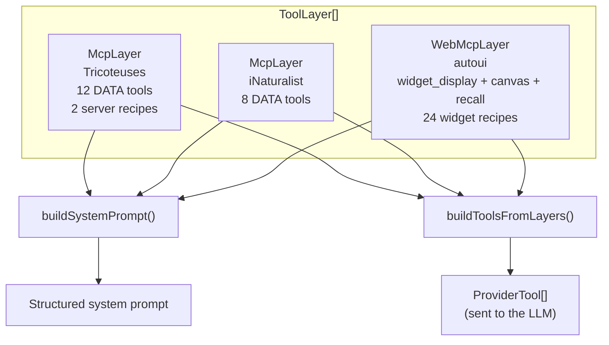
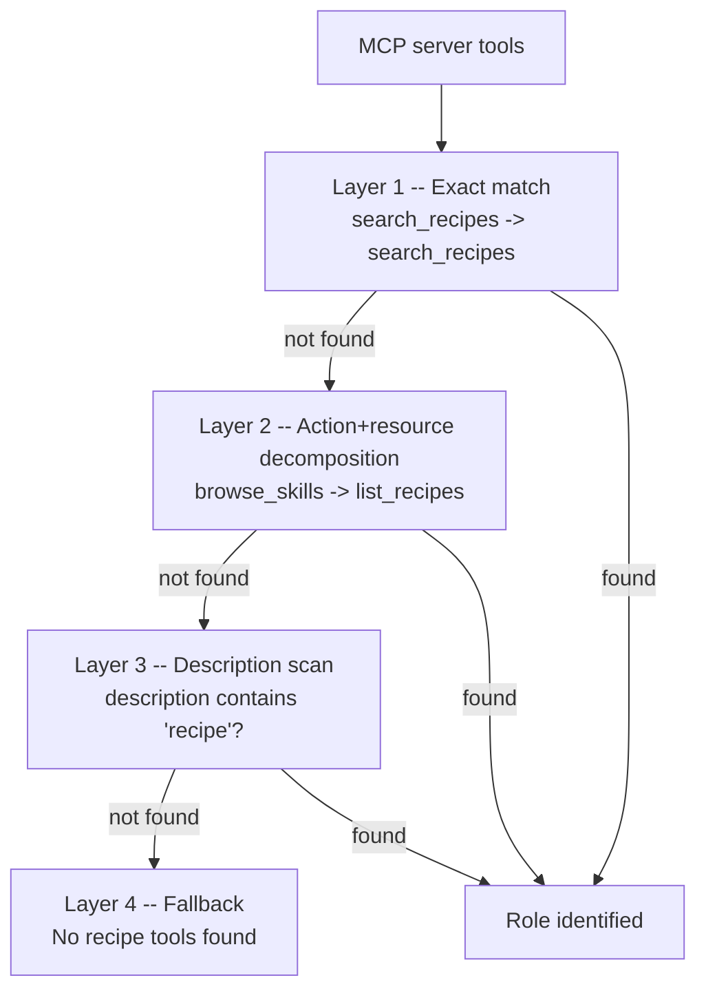

Picture a restaurant with two distinct teams: the kitchen (preparing the food) and the front-of-house staff (plating and presenting it to guests). Both are essential, but each has its own job. ToolLayers work the same way: a **DATA** layer (the kitchen) and a **UI** layer (the service).

## What is a ToolLayer?

A **ToolLayer** is a structure that organizes the tools available to an agent into **typed layers**. Each layer carries a protocol (`mcp` or `webmcp`), a server name, and the list of its tools.

This system replaces the older flat `mcpTools[]` passing pattern and brings:
- **Automatic prefixing** of tool names (`tricoteuses_mcp_query_sql`)
- **Progressive discovery** (lazy loading of tools)
- **Canonical resolution** of recipe tools (same role, different names)
- **Structured prompt** with sections per server

## Why layers exist

Without layers, an agent connected to 3 servers would face a collision problem: if two servers expose a tool named `search`, which one gets called? ToolLayers solve this by **prefixing** every tool with the server name and protocol:

```
query_sql              -> tricoteuses_mcp_query_sql
search_observations    -> inaturalist_mcp_search_observations
widget_display         -> autoui_webmcp_widget_display
```

:::tip[Naming convention]
The format is always: `{server}_{protocol}_{tool}`
The server name is normalized: lowercase, underscores, with "mcp"/"server" noise words removed.
:::

## The two types of layers

### McpLayer: the data layer

An `McpLayer` is created for **each connected MCP server**. It carries DATA tools (those that query databases, APIs, files) and server recipes.

```ts
import type { McpLayer } from '@webmcp-auto-ui/agent';

const mcpLayer: McpLayer = {
  protocol: 'mcp',
  serverUrl: 'https://mcp.code4code.eu/mcp',
  serverName: 'Tricoteuses',
  tools: await client.listTools(),
  recipes: [
    { name: 'profil-depute', description: 'Full deputy profile' },
    { name: 'scrutin-detail', description: 'Detailed vote analysis' },
  ],
};
```

```ts
// TypeScript interface
interface McpLayer {
  protocol: 'mcp';
  serverUrl?: string;
  serverName: string;
  description?: string;
  tools: McpToolDef[];
  recipes?: McpRecipe[];
}
```

### WebMcpLayer: the display layer

The `autoui` server provides a pre-configured `WebMcpLayer` with all native widgets (stat, chart, table, map...) and interaction tools (canvas, recall).

```ts
import { autoui } from '@webmcp-auto-ui/agent';

const uiLayer = autoui.layer();
// Result:
// {
//   protocol: 'webmcp',
//   serverName: 'autoui',
//   description: 'Built-in UI widgets (stat, chart, hemicycle, ...)',
//   tools: [
//     { name: 'search_recipes', ... },
//     { name: 'list_recipes', ... },
//     { name: 'get_recipe', ... },
//     { name: 'widget_display', ... },
//     { name: 'canvas', ... },
//     { name: 'recall', ... },
//   ]
// }
```

```ts
// TypeScript interface
interface WebMcpLayer {
  protocol: 'webmcp';
  serverName: string;
  description: string;
  tools: WebMcpToolDef[];
}
```

## How layers combine



```ts
// Assemble the layers
const layers: ToolLayer[] = [mcpLayer1, mcpLayer2, autoui.layer()];
```

## The generated system prompt

`buildSystemPrompt()` transforms layers into a structured prompt that guides the LLM through a 4-step flow:

```ts
import { buildSystemPrompt } from '@webmcp-auto-ui/agent';

const prompt = buildSystemPrompt(layers);
```

The generated prompt contains:

```
STEP 1 -- Recipe search
autoui_webmcp_search_recipes()
tricoteuses_mcp_search_recipes()

STEP 1b -- List recipes (if no results)
autoui_webmcp_list_recipes()
tricoteuses_mcp_list_recipes()

STEP 1c -- Tool search (if no recipe)
autoui_webmcp_search_tools(query)
tricoteuses_mcp_search_tools(query)

STEP 2 -- Read the selected recipe
autoui_webmcp_get_recipe()
tricoteuses_mcp_get_recipe()

STEP 3 -- Execute tools

STEP 4 -- UI display
autoui_webmcp_widget_display
autoui_webmcp_canvas
```

:::note[Prompt language]
The system prompt is generated in French by default. This is a deliberate choice: testing shows Claude follows workflow instructions in French more reliably when interacting with French-speaking users.
:::

## buildToolsFromLayers: tools sent to the LLM

This function converts layers into `ProviderTool[]` -- the format expected by LLM providers. Each tool is prefixed and its schema is sanitized for strict mode.

```ts
import { buildToolsFromLayers } from '@webmcp-auto-ui/agent';

const tools = buildToolsFromLayers(layers);
// Result:
// [
//   { name: "tricoteuses_mcp_query_sql", description: "...", input_schema: {...} },
//   { name: "tricoteuses_mcp_search_deputes", ... },
//   { name: "autoui_webmcp_widget_display", ... },
//   { name: "autoui_webmcp_canvas", ... },
//   ...
// ]
```

### Schema transformations

During conversion, input schemas are automatically sanitized:

| Transformation | Behavior |
|---------------|----------|
| `oneOf`/`anyOf`/`allOf` | Removed (strict mode incompatible) |
| Missing `additionalProperties` | Set to `false` (required by strict mode) |
| Invalid schemas | Reported via `onSchemaPatch` callback |
| Flattening (optional) | `center.lat` -> `center__lat` for local LLMs |

## Canonical tool resolution (4 layers)

MCP servers name their tools freely. One server might call its recipe list `browse_skills`, another `list_recipes`, another `discover_workflows`. The system needs to identify them to build the prompt.

**Canonical resolution** identifies 3 roles among a server's tools:

| Canonical role | What it does |
|---------------|--------------|
| `search_recipes` | Search recipes by keyword |
| `list_recipes` | List all recipes |
| `get_recipe` | Get recipe details |

Resolution happens in 4 successive layers:



**Layer 1**: the name matches exactly (`search_recipes`, `list_recipes`, `get_recipe`).

**Layer 2**: the name is decomposed into tokens. (Action, resource) pairs are tested:
- Search actions: `search`, `find`, `query`
- List actions: `list`, `browse`, `explore`, `discover`
- Get actions: `get`, `read`, `fetch`, `show`, `describe`
- Resources: `recipe`, `skill`, `template`, `workflow`, `playbook`, `pattern`

So `browse_skills` -> action `browse` (list) + resource `skills` -> role `list_recipes`.

**Layer 3**: if the name doesn't match, the description is scanned for keywords (`recipe`, `skill`, `template`...).

**Layer 4**: no recipe tool identified -- the server doesn't provide any.

### Aliases and routing

When a tool has a different name from its canonical role, an **alias** is created:

```ts
// The server exposes "browse_skills", but the prompt says "list_recipes"
aliasMap.set('tricoteuses_mcp_list_recipes', 'tricoteuses_mcp_browse_skills');

// When the LLM calls tricoteuses_mcp_list_recipes,
// the agent loop routes it to tricoteuses_mcp_browse_skills
```

## Progressive discovery (lazy loading)

By default, the LLM does **not** receive all tools from all servers. It only receives **discovery** tools:

```ts
import { buildDiscoveryTools } from '@webmcp-auto-ui/agent';

const discoveryTools = buildDiscoveryTools(layers);
// Only:
// - search_recipes, list_recipes, get_recipe (per server)
// - search_tools, list_tools (per server)
// - widget_display, canvas, recall (WebMCP)
```

When the LLM "touches" a server for the first time (by calling one of its tools), `activateServerTools()` adds all that server's tools:

```ts
import { activateServerTools } from '@webmcp-auto-ui/agent';

// After the first call to tricoteuses_mcp_search_recipes:
currentTools = activateServerTools(currentTools, tricoteusesLayer);
// -> all DATA tools from Tricoteuses are now available
```

```mermaid
sequenceDiagram
    participant LLM
    participant Loop as Agent Loop
    participant Tools as Active tools

    Note over Tools: Start: discovery tools only
    LLM->>Loop: search_recipes("deputy")
    Loop->>Loop: First contact with Tricoteuses
    Loop->>Tools: activateServerTools(tricoteusesLayer)
    Note over Tools: +12 DATA tools from Tricoteuses
    Loop-->>LLM: search_recipes results
    LLM->>Loop: tricoteuses_mcp_query_sql(...)
    Note over LLM: Now the LLM can use<br/>all server tools
```

## Usage with runAgentLoop

```ts
import { runAgentLoop, autoui } from '@webmcp-auto-ui/agent';

const result = await runAgentLoop('List the green party deputies', {
  provider,
  layers: [mcpLayer1, mcpLayer2, autoui.layer()],
  callbacks: {
    onWidget: (type, data) => {
      canvas.addWidget(type, data);
      return { id: 'w_1' };
    },
  },
});
```

The agent loop:
1. Calls `buildSystemPrompt(layers)` to generate the prompt
2. Calls `buildDiscoveryTools(layers)` for the initial tool set
3. Listens for `tool_use` from the LLM and routes them to the right server
4. Activates full server tools on first contact
5. Repeats until `end_turn`

## Parallel-safe variants

For applications running **multiple agent loops in parallel**, the classic functions share a global `toolAliasMap` (deprecated). Use the `WithAliases` variants instead:

```ts
// Not parallel-safe (global alias map)
const prompt = buildSystemPrompt(layers);
const tools = buildDiscoveryTools(layers);

// Parallel-safe (local alias map)
const { prompt, aliasMap } = buildSystemPromptWithAliases(layers);
const { tools, aliasMap: toolAliasMap } = buildDiscoveryToolsWithAliases(layers);
```

## Summary

| Concept | Type | Contains | Role |
|---------|------|----------|------|
| `McpLayer` | DATA layer | MCP tools + server recipes | Query data sources |
| `WebMcpLayer` | UI layer | widget_display + canvas + recall | Render data as widgets |
| `buildSystemPrompt()` | Function | 4-step prompt | Guide the LLM workflow |
| `buildToolsFromLayers()` | Function | Prefixed ProviderTool[] | Send tools to the LLM |
| `buildDiscoveryTools()` | Function | Discovery tools only | Lazy loading of tools |
| `activateServerTools()` | Function | Hot tool addition | Activate server on first contact |
| `resolveCanonicalTools()` | Function | Role-to-name mapping | Identify recipe tools |
