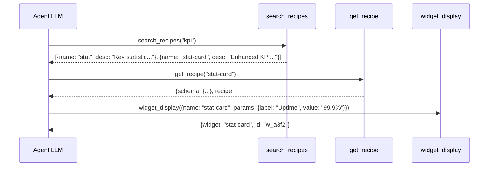
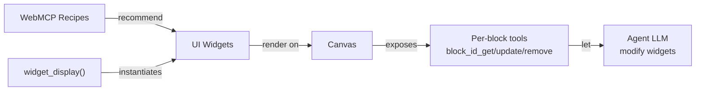

Think of a specialized LEGO set: each brick has a precise shape (a chart, a table, a map) and snaps together naturally with others. The AI agent is the builder: it picks the bricks and assembles them to create a complete dashboard. **UI widgets** are those bricks.

## What is a widget?

A widget is a **declarative visual component** that the AI agent can instantiate with a single tool call. The agent writes no HTML, no CSS, no JavaScript: it sends a `type` and a `data` object, and the widget renders itself.

```ts
// The agent calls:
widget_display({ name: "stat", params: { label: "Revenue", value: "$142K", trend: "+12.4%", trendDir: "up" } })

// The canvas instantly displays a KPI card with a green up arrow
```

## Why widgets exist

Without widgets, an AI agent would need to generate raw HTML to display data. This would create three problems:

1. **Security**: LLM-generated HTML could contain malicious code
2. **Consistency**: every dashboard would look different
3. **Tokens**: describing HTML consumes enormous amounts of tokens

Widgets solve all three: the agent sends **structured data** (JSON validated against a schema), and the framework handles rendering.

## How the agent chooses a widget

The selection flow follows the recipe and discovery system:



The agent can also use **WebMCP recipes** (`.md` files) that indicate which widget to use based on the data type. For example, the `dashboard-kpi` recipe recommends: `stat-card` for metrics, `chart` for time series, `data-table` for details.

## The rendering system

### Two rendering engines

The project supports two rendering modes:

| Mode | Technology | Usage |
|------|-----------|-------|
| **Svelte** | `<BlockRenderer>` / `<WidgetRenderer>` | SvelteKit apps (flex, viewer) |
| **Vanilla** | `mountWidget()` | Framework-free apps, external integration |

### BlockRenderer (Svelte)

The `BlockRenderer` component receives `{ type, data }` and dispatches to the matching Svelte widget:

```svelte
<script>
  import { BlockRenderer } from '@webmcp-auto-ui/ui';
</script>

<BlockRenderer type="stat" data={{ label: 'Revenue', value: '$142K' }} />
```

- **Simple blocks** (stat, kv, list...): data via the `data` prop
- **Rich blocks** (stat-card, data-table...): data via the `spec` prop
- **Unknown types**: renders a `[type]` placeholder

### mountWidget (Vanilla)

For framework-free apps:

```ts
import { mountWidget } from '@webmcp-auto-ui/core';

const container = document.getElementById('my-widget');
const cleanup = mountWidget(container, 'stat', { label: 'Revenue', value: '$142K' }, [autoui]);

// Clean up on destroy
cleanup?.();
```

### Reactivity and canvas

Each block rendered on the canvas auto-registers as a WebMCP tool (via `navigator.modelContext`). This lets the agent **modify** widgets already on display:

```
block_<id>_get      -> read the widget's current data
block_<id>_update   -> update the widget's data
block_<id>_remove   -> remove the widget from canvas
```

This creates a feedback loop: the agent displays, the user interacts, the agent reacts.

## Widget catalog

### Groups

Widgets are organized into 5 groups:

| Group | Widgets | Usage |
|-------|---------|-------|
| **simple** | stat, kv, list, chart, alert, code, text, actions, tags | Basic blocks, simple data |
| **rich** | stat-card, data-table, timeline, profile, trombinoscope, json-viewer, hemicycle, chart-rich, cards, grid-data, sankey, log | Complex visualizations |
| **media** | gallery, carousel, map | Images and geography |
| **advanced** | d3, js-sandbox | Custom D3 visualizations, arbitrary code |
| **canvas** | clear, update, move, resize, style | Actions on existing widgets |

---

### Simple blocks (9)

#### stat -- Single metric

A key number with optional trend. The simplest and most-used widget.

```ts
interface StatBlockData {
  label: string;          // "Revenue"
  value: string;          // "$142K"
  trend?: string;         // "+12.4%"
  trendDir?: 'up' | 'down' | 'neutral';
}
```

```json
{ "type": "stat", "data": { "label": "Revenue", "value": "$142K", "trend": "+12.4%", "trendDir": "up" } }
```

#### kv -- Key-value pairs

Ideal for metadata, entity properties, record details.

```ts
interface KVBlockData {
  title?: string;
  rows: [string, string][];   // [["Name", "Dupont"], ["Age", "42"]]
}
```

#### list -- Text list

A simple bulleted list.

```ts
interface ListBlockData {
  title?: string;
  items: string[];
}
```

#### chart -- Simple bar chart

For a quick bar chart. For richer charts (pie, line, area), use `chart-rich`.

```ts
interface ChartBlockData {
  title?: string;
  bars: [string, number][];   // [["Jan", 10], ["Feb", 20]]
}
```

#### alert -- Alert banner

Notification with three severity levels.

```ts
interface AlertBlockData {
  title?: string;
  message?: string;
  level?: 'info' | 'warn' | 'error';
}
```

#### code -- Code block

Source code with syntax highlighting.

```ts
interface CodeBlockData {
  lang?: string;       // "python", "sql", "javascript"...
  content?: string;
}
```

#### text -- Text paragraph

Free text with no complex formatting.

```ts
interface TextBlockData {
  content?: string;
}
```

#### actions -- Action buttons

A row of clickable buttons. A `primary` button is visually emphasized.

```ts
interface ActionsBlockData {
  buttons: { label: string; primary?: boolean }[];
}
```

#### tags -- Tag collection

A group of badges/labels with optional active state.

```ts
interface TagsBlockData {
  label?: string;
  tags: { text: string; active?: boolean }[];
}
```

---

### Rich widgets (16)

#### stat-card -- Enhanced KPI

Advanced version of `stat` with unit, delta, and color variant (success/warning/error/info).

```ts
interface StatCardSpec {
  label?: string;
  value?: unknown;
  unit?: string;                // "%", "EUR", "km"
  delta?: string;               // "+12%"
  trend?: 'up' | 'down' | 'flat' | {
    direction: 'up' | 'down' | 'flat';
    value?: string;
    positive?: boolean;
  };
  previousValue?: unknown;
  variant?: 'default' | 'success' | 'warning' | 'error' | 'info';
}
```

:::tip[stat vs stat-card]
Use `stat` for a plain number with no decoration. Use `stat-card` when you have units, deltas, or a color code.
:::

#### data-table -- Sortable table

Table with configurable columns, click-to-sort, compact and striped modes.

```ts
interface DataTableSpec {
  title?: string;
  columns?: { key: string; label: string; align?: 'left' | 'center' | 'right'; type?: string }[];
  rows?: Record<string, unknown>[];
  compact?: boolean;
  striped?: boolean;
}
```

:::caution[Row limit]
Maximum 200 rows displayed. Beyond that, the table is truncated.
:::

#### timeline -- Event timeline

Sequence of events with dates and visual statuses.

```ts
interface TimelineSpec {
  title?: string;
  events?: {
    date?: string;
    title?: string;
    description?: string;
    status?: 'done' | 'active' | 'pending';
  }[];
}
```

#### profile -- Profile card

Presentation card with avatar (automatic initials if no URL), structured fields and statistics.

```ts
interface ProfileSpec {
  name?: string;
  subtitle?: string;
  avatar?: { src: string; alt?: string };
  badge?: { text: string; variant?: string };
  fields?: { label: string; value: string }[];
  stats?: { label: string; value: string }[];
}
```

:::caution[No fabricated URLs]
Never fabricate avatar URLs. The widget automatically displays initials if no valid URL is provided.
:::

#### trombinoscope -- Portrait grid

Grid of people with name, subtitle and badge. Ideal for teams, assemblies, panels.

```ts
interface TrombinoscopeSpec {
  title?: string;
  people: { name: string; subtitle?: string; badge?: string; color?: string }[];
  columns?: number;
}
```

#### json-viewer -- Interactive JSON tree

Explore a complex JSON structure with fold/unfold by level.

```ts
interface JsonViewerSpec {
  title?: string;
  data: unknown;
  maxDepth?: number;
  expanded?: boolean;
}
```

#### hemicycle -- Parliament hemicycle

SVG visualization of an assembly's composition with colors by political group.

```ts
interface HemicycleSpec {
  title?: string;
  groups?: { id: string; label: string; seats: number; color: string }[];
  totalSeats?: number;
  rows?: number;
}
```

:::caution[id required]
Each group **must** have a unique `id`. Without it, click events won't work.
:::

#### chart-rich -- Multi-type chart

Advanced chart supporting bar, line, area, pie and donut, with multiple data series.

```ts
interface ChartSpec {
  title?: string;
  type?: 'bar' | 'line' | 'area' | 'pie' | 'donut';
  labels?: string[];
  data?: { label?: string; values: number[]; color?: string }[];
  legend?: boolean;
}
```

#### cards -- Card grid

Grid display of results, records, or entities with title, description and tags.

```ts
interface CardsSpec {
  title?: string;
  cards: { title: string; description?: string; subtitle?: string; tags?: string[] }[];
}
```

#### grid-data -- Spreadsheet grid

Tabular data grid with optional cell highlighting (heatmap).

```ts
interface GridDataSpec {
  title?: string;
  columns?: { key: string; label: string; width?: string }[];
  rows: unknown[][];              // row-major: [[1, 2], [3, 4]]
  highlights?: { row: number; col: number; color: string }[];
}
```

:::tip[grid-data vs data-table]
`data-table` expects objects (`{name: "Alice"}`), `grid-data` expects arrays (`["Alice", 42]`). Use `data-table` for named data, `grid-data` for numeric matrices.
:::

#### sankey -- Flow diagram

Visualizes flows between nodes: votes, co-signatures, journeys.

```ts
interface SankeySpec {
  title?: string;
  nodes?: { id: string; label: string; color?: string }[];
  links?: { source: string; target: string; value: number }[];
}
```

#### map -- Interactive map

Leaflet map with markers and CARTO dark basemap. The Leaflet module loads dynamically.

```ts
interface MapSpec {
  title?: string;
  center?: { lat: number; lng: number };
  zoom?: number;                  // 1-18
  height?: string;                // CSS, e.g.: "400px"
  markers?: { lat: number; lng: number; label?: string; color?: string }[];
}
```

#### d3 -- D3 visualization

D3.js widget with 4 built-in presets: `hex-heatmap`, `radial`, `treemap`, `force`.

```ts
interface D3Spec {
  title?: string;
  preset: 'hex-heatmap' | 'radial' | 'treemap' | 'force';
  data: unknown;
  config?: Record<string, unknown>;
}
```

#### js-sandbox -- JavaScript sandbox

Secure iframe that executes arbitrary JS code with DOM and fetch access.

```ts
interface JsSandboxSpec {
  title?: string;
  code: string;           // JS to execute
  html?: string;          // initial HTML in div#root
  css?: string;           // CSS injected in head
  height?: string;        // CSS height of the iframe
}
```

#### log -- Log viewer

Log stream with severity level, timestamp and source.

```ts
interface LogViewerSpec {
  title?: string;
  entries?: {
    timestamp?: string;
    level?: 'debug' | 'info' | 'warn' | 'error';
    message: string;
    source?: string;
  }[];
}
```

#### gallery -- Image gallery

Image collection with keyboard-navigable lightbox (Escape, arrows).

```ts
interface GallerySpec {
  title?: string;
  images?: { src: string; alt?: string; caption?: string }[];
  columns?: number;
}
```

#### carousel -- Slide carousel

Slideshow with navigation and optional auto-play.

```ts
interface CarouselSpec {
  title?: string;
  slides?: { src?: string; content?: string; title?: string; subtitle?: string }[];
  autoPlay?: boolean;
  interval?: number;         // ms between slides
}
```

#### recipe-browser -- Recipe browser

Displays available recipes as clickable cards. Clicking loads the recipe detail and the agent can then execute it.

---

### Canvas actions (5)

These widgets don't create new blocks -- they **modify** existing ones.

| Action | Description | Parameters |
|--------|-------------|-----------|
| `clear` | Clear the entire canvas | none |
| `update` | Update a block's data | `{id, data}` |
| `move` | Move a block | `{id, x, y}` |
| `resize` | Resize a block | `{id, width, height}` |
| `style` | Apply CSS styles | `{id, styles}` |

The `canvas` tool aggregates these 5 actions:

```ts
canvas({ action: 'update', id: 'w_a3f2', params: { data: { value: "$155K" } } })
canvas({ action: 'move', id: 'w_a3f2', params: { x: 100, y: 200 } })
canvas({ action: 'clear' })
```

## How widgets relate to other concepts



- **Recipes**: WebMCP recipes tell the agent which widget to use based on the data
- **widget_display**: the tool that instantiates a widget on the canvas
- **ToolLayers**: widgets are exposed via the autoui server's `WebMcpLayer`
- **Canvas**: the reactive surface where widgets are rendered and updated

## Common mistakes

| Mistake | Consequence | Fix |
|---------|-------------|-----|
| `chart` for pie/donut | `chart` only does bars | Use `chart-rich` with `type: "pie"` |
| Objects in `grid-data` rows | Grid expects `unknown[][]` | Use `data-table` for objects |
| No `id` on hemicycle groups | Click events break | Always include `id` |
| `columns.key` doesn't match rows | Empty cells | `key` must match row object keys |
| LLM-fabricated avatar URL | Broken image | Never fabricate URLs -- widget shows initials |
| More than 200 data-table rows | Table truncated silently | Paginate or filter data first |
