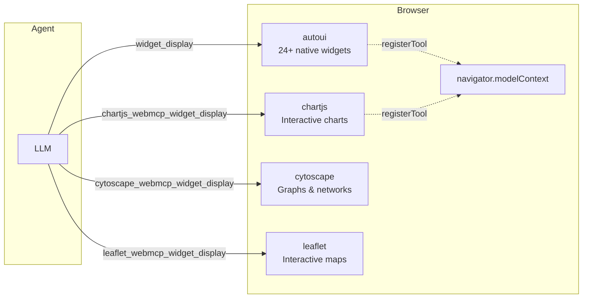
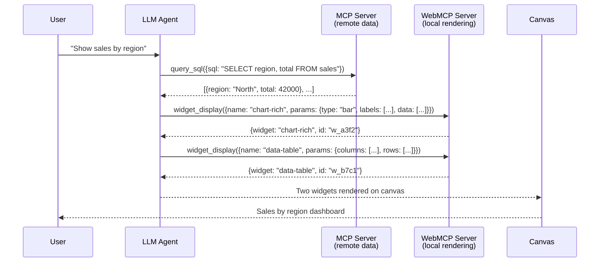

If MCP is the "USB" for connecting **data sources**, WebMCP is the "USB" for connecting **user interfaces**. A WebMCP server runs in the browser and exposes widgets, renderers, and UI actions that the agent can call exactly like a remote MCP tool.

## What is WebMCP?

**WebMCP** is a protocol complementary to MCP, designed for client-side rendering. It rests on two pillars:

1. **A browser API** (`navigator.modelContext`) standardized by the W3C WebMCP Draft CG Report (2026-03-27), allowing any web page to register tools accessible by AI agents.
2. **A local server framework** (`createWebMcpServer`) that structures these tools into thematic servers with widgets, recipes, and JSON schemas.



## MCP vs WebMCP: the fundamental distinction

| | MCP | WebMCP |
|--|-----|--------|
| **Role** | Retrieve **data** | **Display** the data |
| **Where it runs** | Remote server (HTTP/SSE) | In the browser (in-memory) |
| **Transport** | JSON-RPC 2.0 over HTTP POST | JavaScript function calls |
| **Typical tools** | `query_sql`, `search`, `list_tables` | `widget_display`, `canvas`, `recall` |
| **Example servers** | Tricoteuses, iNaturalist, Hacker News | `autoui`, `chartjs`, `cytoscape`, `leaflet` |
| **Spec** | Anthropic MCP specification | W3C WebMCP Draft CG Report |

:::tip[The golden rule]
**MCP** = "what do I fetch?" (remote data)
**WebMCP** = "how do I display it?" (local rendering)
:::

## Creating a WebMCP server

A WebMCP server is created with `createWebMcpServer` from the `@webmcp-auto-ui/core` package. It registers **widgets** — renderers that take JSON data and produce HTML/SVG/Canvas.

```ts
import { createWebMcpServer } from '@webmcp-auto-ui/core';

const myServer = createWebMcpServer('my-charts', {
  widgets: [
    {
      name: 'bar-chart',
      description: 'Renders a bar chart',
      schema: {
        type: 'object',
        properties: {
          labels: { type: 'array', items: { type: 'string' } },
          values: { type: 'array', items: { type: 'number' } },
        },
        required: ['labels', 'values'],
      },
      renderer: (container, data) => {
        // Render using Chart.js, D3, or vanilla DOM
        // Return an optional cleanup function
      },
      vanilla: true, // Mark as vanilla (non-Svelte) renderer
    },
  ],
  recipes: [rawMarkdownRecipe],
});

// Expose as a tool layer for the agent
const layer = myServer.layer();
```

### Two rendering modes

| Mode | Flag | When to use |
|------|------|-------------|
| **Vanilla** | `vanilla: true` | Third-party libraries (Chart.js, Cytoscape, D3, Plotly, Three.js) — the renderer receives an `HTMLElement` and draws into it |
| **Svelte** | `vanilla: false` (default) | Svelte 5 components — the renderer is a `.svelte` component with props |

Vanilla renderers receive a deep-cloned copy of the data (via `JSON.parse(JSON.stringify(data))`) to avoid conflicts between Svelte 5 `$state` proxies and libraries that use `Object.defineProperty`.

## The `autoui` server

The `@webmcp-auto-ui/agent` package provides a pre-configured WebMCP server named `autoui` with 24+ native widgets:

| Category | Widgets |
|----------|---------|
| **Simple** | `stat`, `kv`, `list`, `chart`, `alert`, `code`, `text`, `actions`, `tags` |
| **Rich** | `stat-card`, `data-table`, `timeline`, `profile`, `trombinoscope`, `json-viewer`, `hemicycle`, `chart-rich`, `cards`, `grid-data`, `sankey`, `log`, `gallery`, `carousel`, `map`, `d3`, `js-sandbox` |

The agent calls `widget_display({ name, params })` to render any of these widgets.

## Specialized WebMCP servers

Beyond `autoui`, the project includes 10+ thematic WebMCP servers in `packages/servers/`:

| Server | Library | Widgets |
|--------|---------|---------|
| `chartjs` | Chart.js | bar, line, pie, radar, doughnut, scatter, polar-area |
| `cytoscape` | Cytoscape.js | force-graph, concentric-rings, spread-layout, physics-simulation |
| `d3` | D3.js | treemap, force-directed, chord, sunburst |
| `leaflet` | Leaflet | markers, GeoJSON, heatmap, choropleth |
| `plotly` | Plotly.js | scatter, 3D surface, contour, histogram |
| `mermaid` | Mermaid | flowchart, sequence, gantt, class, state |
| `threejs` | Three.js | mesh, lights, animations |
| `pixijs` | PixiJS | sprites, particles |
| `rough` | Rough.js | hand-drawn style sketches |
| `canvas2d` | Canvas API | custom 2D drawings |

Each server exposes its own widgets and recipes. The agent discovers them via `search_recipes()` and `get_recipe()`.

## `navigator.modelContext`: the browser API

The W3C WebMCP protocol defines a standard browser API for web pages to expose tools to AI agents:

```ts
// Register a tool accessible by the agent
navigator.modelContext.registerTool({
  name: 'todo_add',
  description: 'Add a new todo item',
  inputSchema: { type: 'object', properties: { text: { type: 'string' } } },
  execute: (args) => {
    addTodo(args.text);
    return { content: [{ type: 'text', text: 'Todo added' }] };
  },
});

// Unregister a tool
navigator.modelContext.unregisterTool('todo_add');
```

In webmcp-auto-ui, each widget rendered on the canvas auto-registers via this API with three tools:
- `widget_{id}_get` — read the widget's current data
- `widget_{id}_update` — update the data
- `widget_{id}_remove` — remove the widget

This allows the agent (or a browser extension) to interact with already-rendered widgets.

:::note[Activation in Chrome]
The `navigator.modelContext` API is available in Chrome 146+ with the flag `chrome://flags/#enable-webmcp-testing`. The [Model Context Tool Inspector](https://chromewebstore.google.com/) extension lets you visualize registered tools.
:::

## `mountWidget`: framework-agnostic rendering

For cases where Svelte is not available (vanilla JS, React, Vue), the `@webmcp-auto-ui/core` package provides `mountWidget()`:

```ts
import { mountWidget } from '@webmcp-auto-ui/core';

const container = document.getElementById('my-widget');
const cleanup = mountWidget(container, myServer, 'bar-chart', {
  labels: ['Q1', 'Q2', 'Q3'],
  values: [120, 340, 250],
});

// Later, clean up
cleanup?.();
```

`mountWidget` deep-clones the data, resolves the server's renderer, and calls it with the DOM container. It is the framework-agnostic entry point for WebMCP rendering.

## Full architecture: MCP + WebMCP



## Relationships with other concepts

- **[MCP](/webmcp-auto-ui/en/concepts/mcp/)** — retrieves the data that WebMCP displays
- **[Tool Layers](/webmcp-auto-ui/en/concepts/tool-layers/)** — WebMCP servers produce `WebMcpLayer` entries
- **[Recipes](/webmcp-auto-ui/en/concepts/recipes/)** — each WebMCP server ships recipes to guide the agent
- **[widget_display](/webmcp-auto-ui/en/concepts/widget-display/)** — the unified tool that dispatches to the right WebMCP renderer
- **[UI Widgets](/webmcp-auto-ui/en/concepts/ui-widgets/)** — the Svelte components that render widgets
