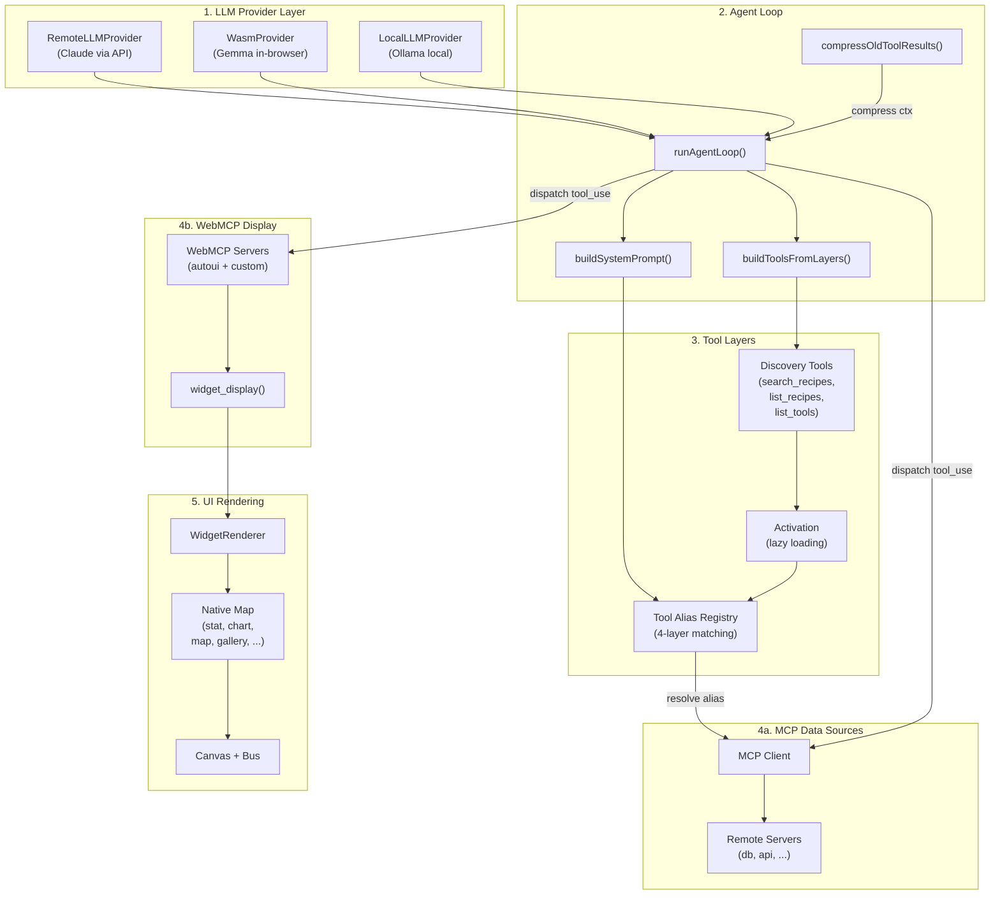

## Overview

WebMCP Auto-UI consists of **4 layers** :

1. **LLM Provider** : Interface with Claude, Gemma, or Haiku
2. **Agent Loop** : Orchestration of tool calls and context management
3. **Tool Layers** : Unified abstraction of MCP + WebMCP tools
4. **UI Rendering** : Native widgets + dispatcher

### Complete architecture diagram



## Agent Loop Flow

```mermaid
sequenceDiagram
    participant User
    participant Agent as runAgentLoop()
    participant LLM as LLM Provider
    participant Tools as Tool Dispatch
    participant MCP as MCP Client
    participant WebMCP as WebMCP Server
    participant UI as Widget Renderer
    
    User->>Agent: chat message
    Agent->>Agent: Build discovery tools
    
    loop Until end_turn or max_iterations
        Agent->>LLM: chat(messages, activeTools)
        LLM-->>Agent: response + tool_calls
        
        alt No tool calls
            Agent->>Agent: finishedNormally = true
            break
        end
        
        Agent->>Agent: Add assistant response to messages
        
        for each tool_call
            Agent->>Tools: Resolve alias + dispatch
            
            alt MCP tool
                Tools->>MCP: callTool(name, args)
                MCP-->>Tools: result
            else WebMCP tool (widget_display)
                Tools->>WebMCP: executeTool(name, args)
                WebMCP-->>Tools: {widget, data, id}
                Tools->>UI: onWidget callback
                UI-->>Tools: widgetId
            else WebMCP tool (recall)
                Tools->>Agent: resultBuffer[id]
                Agent-->>Tools: full result
            end
            
            Tools-->>Agent: tool_result (truncated if > 10KB)
            Agent->>Agent: Store in resultBuffer[tool_use_id]
        end
        
        Agent->>Agent: Add tool_results to messages
        Agent->>Agent: compressOldToolResults(messages)
        
        alt No render yet && iterationsWithoutRender >= 4
            Agent->>Agent: Strip discovery tools to force render
        end
        
        alt No render yet && iterationsWithoutRender >= 5
            Agent->>Agent: Nudge: "Call widget_display() NOW"
        end
    end
    
    Agent-->>User: AgentResult {text, toolCalls, metrics}
```

## Tool Layers — Resolution and Dispatch

### What is a Tool Layer?

A **ToolLayer** encapsulates a tool server (MCP or WebMCP) :

```typescript
interface ToolLayer {
  protocol: 'mcp' | 'webmcp';
  serverName: string;
  description?: string;
  tools: McpToolDef[] | WebMcpToolDef[];
}
```

### Unified naming: `{serverName}_{protocol}_{toolName}`

All tools receive a unique prefix :
- `recipes_mcp_search_recipes` → MCP server "recipes"
- `autoui_webmcp_stat` → WebMCP server "autoui"
- `autoui_webmcp_widget_display` → Built-in display tool

### 4-layer Canonical Tool Matching

The agent must know which tools correspond to :
- `search_recipes` — Search for a recipe
- `list_recipes` — List all recipes
- `get_recipe` — Read a complete recipe

The system finds them via 4 layers of heuristic :

```typescript
// Layer 1 — Exact name match
if (toolName === 'search_recipes') → found!

// Layer 2 — Decompose name into tokens (action, resource)
'find_templates' → action='find' + resource='templates'
if (action in SEARCH_ACTIONS && resource in RESOURCES) → found!

// Layer 3 — Scan description
if (description.includes('recipe')) → likely a recipe tool

// Layer 4 — Fallback : no recipes found
// → list raw available tools
```

### Lazy Loading and Activation

At startup, only **discovery tools** are active :
```typescript
const disc = buildDiscoveryToolsWithAliases(layers);
// → [search_recipes, list_recipes, search_tools, list_tools, ...]
```

When the agent calls a tool from a server for the first time :
```typescript
// Detect: "autoui_webmcp_stat" → serverName="autoui", protocol="webmcp"
if (!activatedServers.has("autoui_webmcp")) {
  activateServerTools(currentTools, layer); // Add all server tools
}
```

This saves initial context by hiding detailed implementations.

## Context compression

After 2+ iterations, old tool results are truncated :

```typescript
// Before (300+ chars)
{
  "content": "SELECT * FROM users;... [5000 rows] ...",
  "type": "tool_result"
}

// After (saves ~2KB)
{
  "content": "SELECT * FROM users;... [recall('toolu_xxx') for full result, 125000 chars]",
  "type": "tool_result"
}
```

The agent can call `recall('toolu_xxx')` to retrieve the full result.

## Widget Registry and Rendering

### Native Map

The UI exposes a **static map** of 30+ native widgets :

```typescript
const NATIVE_MAP = {
  'stat': { component: StatBlock, props: (data) => ({ data }) },
  'chart': { component: ChartBlock, ... },
  'map': { component: MapView, ... },
  'gallery': { component: Gallery, ... },
  // ...
};
```

### Rendering resolution

When a widget must be rendered :

1. **Search in connected WebMCP servers** → custom renderers
2. **Otherwise search in NATIVE_MAP** → native widgets
3. **Otherwise** → placeholder `[widget_type]`

```typescript
// WidgetRenderer.svelte
const customRenderer = servers?.find(s => s.getWidget(type))?.renderer;
const nativeEntry = NATIVE_MAP[type];

if (customRenderer) {
  // Custom renderer (framework component or vanilla)
} else if (nativeEntry) {
  // Native widget
} else {
  // Fallback
}
```

### SafeImage — URL Validation

Since agents can hallucinate image URLs, **SafeImage** validates URLs :

```typescript
const VALID_PREFIXES = ['http://', 'https://', 'data:', '/'];

if (!src?.startsWith(...VALID_PREFIXES)) {
  // Show placeholder instead of 
}
```

## System Prompt — Discovery Cascade

The generated prompt follows a 4-step cascade :

```text
STEP 1 — Search recipe (search_recipes)
   ↓ If no result
STEP 1b — List recipes (list_recipes)
   ↓ If no recipes
STEP 1c — Search tools (search_tools)
   ↓ If no tools
STEP 1d — List tools (list_tools)
   ↓
STEP 2 — Read recipe (get_recipe)
   ↓
STEP 3 — Execution (use recipe or tool)
   ↓
STEP 4 — UI display (widget_display)
```

This ensures that :
- Agent searches for **recipes** first (pre-defined workflows)
- As fallback, searches for **raw tools**
- Reads full documentation before executing
- Always displays a UI result (not just text)

## Canvas Store — UI State

The canvas centralizes UI state :

```typescript
// @webmcp-auto-ui/sdk
const canvas = {
  blocks: [], // Current widgets
  mode: 'chat' | 'drag',
  llm: 'claude-3-5-sonnet-20241022',
  mcpUrl: 'http://localhost:3001',
  mcpConnected: boolean,
  messages: [], // Chat history
  
  // Methods
  addWidget(type, data),
  removeBlock(id),
  updateBlock(id, data),
  addMsg(role, content),
};
```

## FONC Message Bus

Components communicate via a message bus inspired by Smalltalk (FONC) :

```typescript
// Send a message
bus.broadcast('myComponent', 'data-changed', { newValue: 42 });

// Listen
const unsub = bus.subscribe(['data-changed'], (msg) => {
  console.log(msg.payload);
});

// Link widgets (visualize relationships)
bus.link(['widget1_id', 'widget2_id'], 'groupId');
```

This approach decouples components and enables interactions without prop drilling.
