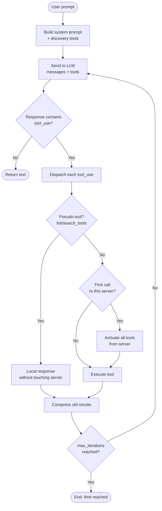
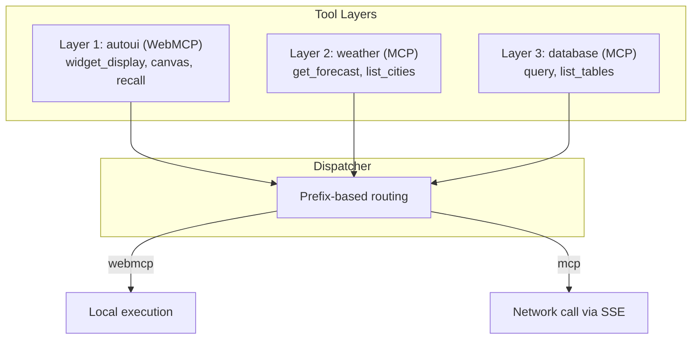
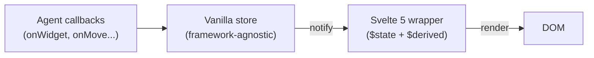
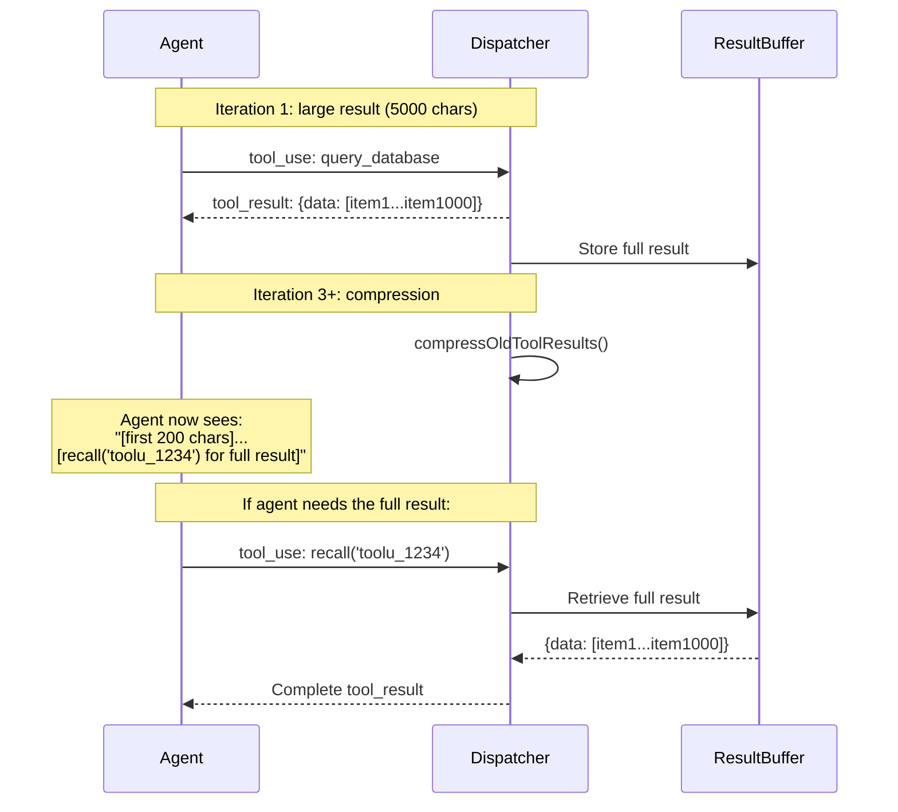

WebMCP Auto-UI is built on a **modular architecture** centered around four fundamental concepts: the **agentic loop**, **tool layers**, the **widget registry**, and the **reactive canvas**. This page explains the *why* behind each architectural choice and shows how the pieces fit together.

## Overall Architecture


The architecture breaks down into three zones:

1. **Frontend** (Svelte 5): reactive canvas, widgets, chat panel, LLM selector.
2. **Agent engine** (pure TypeScript): iterative loop, LLM providers, tool dispatcher.
3. **Tool servers**: MCP (remote, via SSE) and WebMCP (local, in-browser).

The agent engine is intentionally framework-agnostic. It can run in a Web Worker, a Node.js server, or directly in the browser's main thread.

## Detailed Agentic Loop


The agent loop is implemented in `runAgentLoop()`. Here is how it works, step by step:



**Why a loop instead of a single call?** Because an agent needs to:
- Discover available tools (iteration 1)
- Load a recipe (iteration 2)
- Call the actual tool (iteration 3)
- Adjust the layout (iteration 4)

Each iteration enriches the context. Automatic compression (`compressOldToolResults`) prevents history from filling the context window.

## LLM Providers

The `@webmcp-auto-ui/agent` package exposes three interchangeable providers. All implement the same interface:

```typescript
interface LLMProvider {
  readonly name: string;
  readonly model: string;
  chat(
    messages: ChatMessage[],
    tools: ProviderTool[],
    options?: {
      signal?: AbortSignal;
      cacheEnabled?: boolean;
      system?: string;
      maxTokens?: number;
      temperature?: number;
      onToken?: (token: string) => void;
    }
  ): Promise<LLMResponse>;
}
```

This uniform interface lets you swap providers without modifying agent code. The choice of provider is a runtime decision, not an architectural one.

### RemoteLLMProvider (Claude)

Provider for Anthropic models (Claude) via an HTTP proxy. The proxy is a SvelteKit endpoint (`/api/chat`) that adds the API key server-side:

```typescript
import { RemoteLLMProvider } from '@webmcp-auto-ui/agent';

const provider = new RemoteLLMProvider({
  proxyUrl: '/api/chat',
});

// Switch models on the fly
provider.setModel('haiku');   // Fast, cost-effective
provider.setModel('sonnet');  // Balanced
provider.setModel('opus');    // Deep reasoning
```

**Why a proxy?** To keep the API key off the browser. The proxy adds `Authorization: Bearer sk-ant-...` before relaying the request to the Anthropic API.

### WasmProvider (Gemma 4 LiteRT)

In-browser provider using Gemma 4 via the LiteRT runtime. The model runs entirely in the browser with no network calls:

```typescript
import { WasmProvider } from '@webmcp-auto-ui/agent';

const provider = new WasmProvider({
  model: 'gemma-e2b',       // 2B parameters
  contextSize: 32_768,
  onProgress: (progress, status, loaded, total) => {
    // Show download progress
  },
  onStatusChange: (status) => {
    // 'idle' | 'loading' | 'ready' | 'error'
  },
});

await provider.initialize();
```

| Variant | Parameters | Context | Use Case |
|---------|-----------|---------|----------|
| `gemma-e2b` | 2B | 32K | Fast, good for demos |
| `gemma-e4b` | 4B | 32K | More capable, requires more RAM |

`WasmProvider` natively supports Gemma's `<|tool_call|>` format for tool calling without an intermediary. The parser detects this format and converts it to `tool_use` blocks compatible with the agent loop.

:::tip[ONNX Runtime via CDN]
ONNX Runtime binaries (~33 MB) are loaded from a CDN instead of being bundled with the app. This dramatically reduces build size.
:::

### LocalLLMProvider (Ollama)

Provider for local models via Ollama. Useful for offline development or models not supported by the other providers:

```typescript
import { LocalLLMProvider } from '@webmcp-auto-ui/agent';

const provider = new LocalLLMProvider({
  backend: 'ollama',
  model: 'llama3.2',
  baseUrl: 'http://localhost:11434',
});
```

### Factory

`createProvider` instantiates the right provider based on configuration:

```typescript
import { createProvider } from '@webmcp-auto-ui/agent';

const claude = createProvider({ type: 'remote', model: 'sonnet', proxyUrl: '/api/chat' });
const gemma = createProvider({ type: 'wasm', model: 'gemma-e4b' });
const ollama = createProvider({ type: 'local', model: 'llama3.2', baseUrl: 'http://localhost:11434' });
```

### `<LLMSelector>` Component

The selector unifies all three providers in a single Svelte UI component. It displays available models and handles Gemma loading via `<GemmaLoader>`:

```svelte
<script>
  import { LLMSelector, GemmaLoader } from '@webmcp-auto-ui/ui';

  let selectedModel = $state('sonnet');
</script>

<LLMSelector bind:value={selectedModel} />
{#if selectedModel.startsWith('gemma')}
  <GemmaLoader model={selectedModel} />
{/if}
```

## Tool Layers

Each **layer** represents a **server** (MCP or WebMCP). This abstraction lets the dispatcher route calls transparently regardless of protocol.

```typescript
interface ToolLayer {
  protocol: 'mcp' | 'webmcp';
  serverName: string;
  description?: string;
  tools: WebMcpToolDef[] | McpToolDef[];
}
```



**Why layers?** To discover tools progressively. Instead of loading hundreds of tools at startup (which would saturate the LLM context), each layer is activated on demand.

### Phase 1: Discovery (Startup)

At launch, only **discovery tools** are available:

```typescript
const discoveryTools = buildDiscoveryToolsWithAliases(layers);
```

These tools let the agent explore what is available without activating servers:

| Tool | Role |
|------|------|
| `{server}_{proto}_search_recipes(query)` | Search for a recipe by keyword |
| `{server}_{proto}_list_recipes()` | List all recipes |
| `{server}_{proto}_get_recipe(name)` | Load a full recipe (schema, examples) |
| `{server}_{proto}_search_tools(query)` | Search for a tool by name or description |
| `{server}_{proto}_list_tools()` | List a server's tools |

### Phase 2: Activation (Lazy Loading)

When the agent calls a **real** (non-discovery) tool for the first time:

```typescript
if (!activatedServers.has(serverKey)) {
  activatedServers.add(serverKey);
  const layer = layers.find(l => l.serverName === serverName);
  activeTools = activateServerTools(activeTools, layer);
  // All server tools become available
}
```

Activation is irreversible within a session: once a server is activated, all its tools remain available until the conversation ends.

### Phase 3: Canonical Tool Resolution (4-Layer Matching)

For **MCP servers**, tool names are unpredictable (each server names its tools differently). The canonical resolver normalizes these names through 4 layers:


**Layer 1 -- Exact name**: The tool is called `search_recipes`? Direct match.

**Layer 2 -- Token decomposition**: The tool is called `find_recipe_by_keyword`?
```
tokens: ["find", "recipe", "by", "keyword"]
→ test pairs: (find, recipe) → SEARCH + RECIPE = "search_recipes" ✓
```

**Layer 3 -- Description keywords**: The description contains "template" or "library"? Map to `list_recipes`.

**Layer 4 -- Fallback**: No match. The tool is used as-is, without alias.

### Aliasing and Transparent Dispatch

Aliases are stored in a local map and used on every call:

```typescript
const { prompt, aliasMap } = buildSystemPromptWithAliases(layers);
// aliasMap: {
//   "myserver_mcp_search_recipes" → "myserver_mcp_find_recipes_by_keyword"
// }

// In the dispatcher:
const resolvedName = aliasMap.get(toolName) ?? toolName;
```

The agent sees normalized names (`search_recipes`), but the dispatcher calls the actual MCP server names. This indirection makes the system prompt stable regardless of the server's naming convention.

## Widget Registry (WebMCP)

A **WebMCP server** exposes **widgets** and **rendering tools**. The built-in `autoui` server manages the 30+ native widgets:

```typescript
import { createWebMcpServer } from '@webmcp-auto-ui/core';

const autoui = createWebMcpServer('autoui', {
  description: 'Built-in UI widgets'
});

// Register a widget via a markdown recipe with frontmatter
autoui.registerWidget(`
---
widget: stat
description: Key statistic (KPI, counter)
schema:
  type: object
  required: [label, value]
  properties:
    label: { type: string }
    value: { type: string }
    trend: { type: string, enum: [up, down, stable] }
---
## How to use
Call widget_display('stat', {label: "X", value: "Y"})
`, vanillaStatRenderer);
```

The recipe contains two things:
1. **Frontmatter**: JSON Schema, description, widget name.
2. **Markdown body**: natural language instructions for the agent.

The agent reads the body to understand *when* and *how* to use the widget. The schema ensures parameters are valid.

### Built-in autoui Tools

| Tool | Role |
|------|------|
| `widget_display(name, params)` | Display a widget on the canvas |
| `canvas(action, id, params)` | Manipulate widgets (move, resize, style, update, clear) |
| `recall(id)` | Re-read a compressed result |

## System Prompt Construction

The **system prompt** is dynamically built from the tool layers. It guides the agent step by step:

```
STEP 1 — Recipe search: search_recipes(query)
STEP 1b — Recipe listing: list_recipes()
STEP 1c — Tool search: search_tools(query)
STEP 1d — Tool listing: list_tools()
STEP 2 — Recipe reading: get_recipe(name)
STEP 3 — Execution: call the tool with the right parameters
STEP 4 — UI display: widget_display(name, params), canvas(action, ...)
```

**Why structure the prompt in steps?** To enforce predictable behavior. Without these instructions, LLMs tend to hallucinate tool names or jump straight to execution without discovering the schema. The steps enforce: discovery -> reading -> execution -> rendering.

## Reactive Canvas (Svelte 5)

The **canvas** is a **reactive store** with centralized state management:


### Dual-Store Architecture



Two layers work together:

**Vanilla store** (`createCanvasVanilla()`): a plain JavaScript object with a pub/sub pattern. Framework-agnostic, can run in a Worker or a Node.js server.

```typescript
const canvasVanilla = createCanvasVanilla();
canvasVanilla.addWidget('stat', { label: 'Visitors', value: '1,234' });
// → triggers notify() → all listeners receive the change
```

**Svelte 5 wrapper** (`createCanvas()`): subscribes to the vanilla store and exposes data via `$state`. Every vanilla store mutation automatically propagates through the Svelte component tree.

```typescript
const canvas = createCanvas();
// canvas.blocks is a $state that mirrors canvasVanilla.blocks
// Every add/remove/update propagates automatically
```

**Why two layers?** To support vanilla rendering (`mountWidget()` in `@webmcp-auto-ui/core`) without depending on Svelte. The vanilla store is the source of truth; Svelte is one view among several.

### FONC Message Bus

For **inter-component** communication without tight coupling:

```typescript
import { bus } from '@webmcp-auto-ui/ui';

// Emit an event
bus.broadcast('widget_sales', 'data-update', { newValue: 42 });

// Listen for an event type
bus.subscribe(['data-update'], (msg) => {
  console.log('Received from', msg.from, ':', msg.payload);
});

// Visually link widgets (SVG arrows)
bus.link(['widget_1', 'widget_2', 'widget_3'], 'group_sales');
```

The FONC (Functions Over Networked Components) bus lets widgets communicate without knowing about each other. A `chart` widget can listen to updates from a `data-table` widget without a direct import.

## History Compression and Recall

To save LLM context, old tool results are automatically compressed:



This mechanism is transparent to the agent. It sees a truncated result with a `recall()` hint, and can choose to re-read it or continue with the preview.

## widget_display Flow


The full flow of a `widget_display` call:

1. **Reception**: the dispatcher receives the `tool_use` block with the widget name and parameters.
2. **Resolution**: the widget registry finds the matching definition.
3. **Validation**: parameters are validated against the widget's JSON Schema. If validation fails, the agent receives the expected schema and can retry.
4. **Sanitization**: image URLs are checked (no oversized `data:`, no malicious URLs).
5. **ID generation**: a unique identifier `w_xxxxxx` is generated.
6. **Callback**: `onWidget(type, data)` is called, adding the widget to the canvas store.
7. **Rendering**: the Svelte `WidgetRenderer` detects the new widget and mounts the corresponding component.

## Architectural Summary

| Component | Responsibility | Package |
|-----------|---------------|---------|
| **Agent Loop** | Iterative LLM -> tools -> LLM loop | `agent` |
| **LLM Providers** | Claude (remote), Gemma 4 (WASM), Ollama (local) | `agent` |
| **Tool Layers** | MCP + WebMCP tool structuring and discovery | `agent` |
| **Dispatcher** | Prefix-based routing + lazy activation | `agent` |
| **Tool Resolver** | 4-layer canonical matching | `agent` |
| **System Prompt** | Structured instructions + tool listing | `agent` |
| **Canvas Store** | Centralized widget state (vanilla + Svelte) | `sdk` |
| **FONC Bus** | Event-based inter-component communication | `ui` |
| **Compression** | Context savings + recall | `agent` |
| **Widget Registry** | Discovery, schema validation, markdown recipes | `core` + `agent` |
| **WidgetRenderer** | Component dispatch and mounting | `ui` |
| **HyperSkills** | Canvas serialization/deserialization to URL | `sdk` |
| **Nano-RAG** | Context compaction via embeddings | `agent` |

## FAQ

### Why WebMCP and not just MCP?

MCP is a network protocol: a server exposes tools via HTTP/SSE, and a client calls them remotely. WebMCP is a *local complement* that runs in the browser. It handles widgets and UI actions that do not need network access.

### Why Svelte 5?

Svelte 5 (runes) offers fine-grained reactivity without a virtual DOM. For a canvas with 30+ widgets updating in real time, performance matters. Runes (`$state`, `$derived`, `$effect`) provide precise control over reactivity.

### Why three LLM providers?

Each provider addresses a different use case:
- **Claude**: maximum quality, requires an API key and internet connection.
- **Gemma**: total privacy (everything runs in the browser), no API key needed.
- **Ollama**: local models for offline development or custom models.

### How do I add a new widget?

Write a markdown recipe with frontmatter (JSON Schema) and register it on the WebMCP server with `autoui.registerWidget()`. No changes to agent code required.
