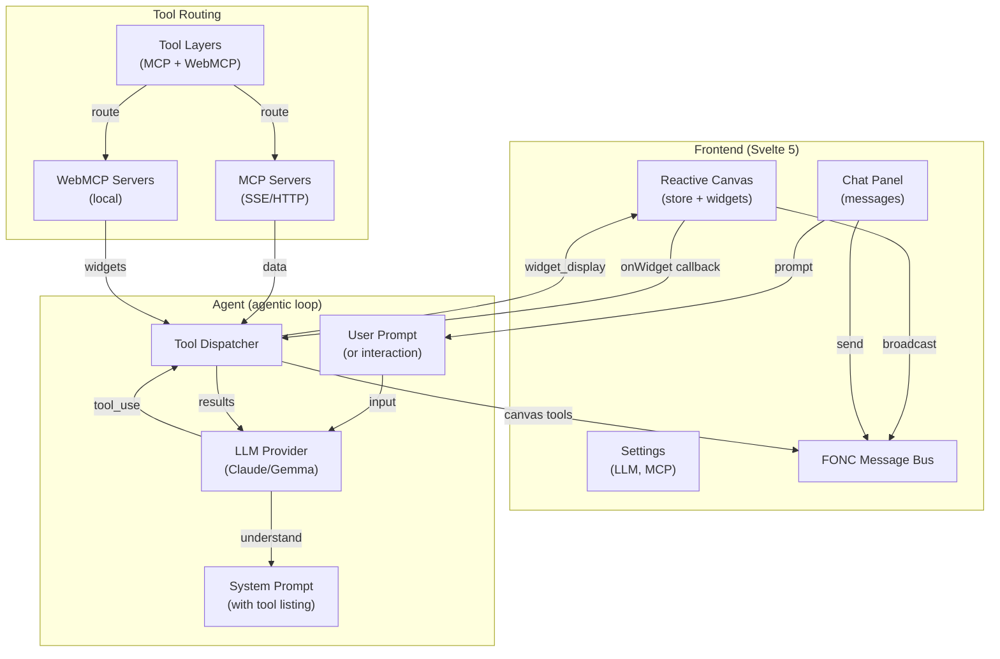
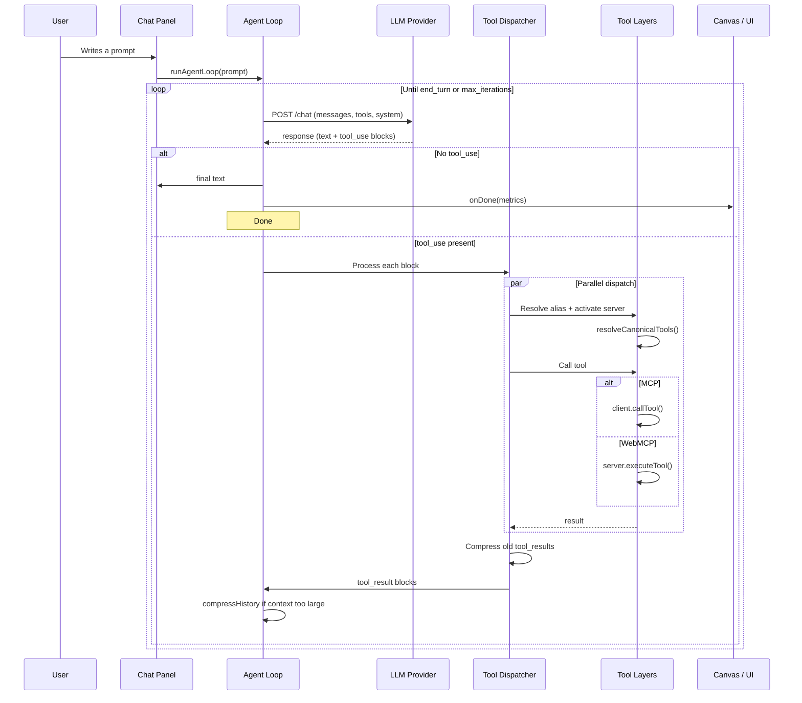
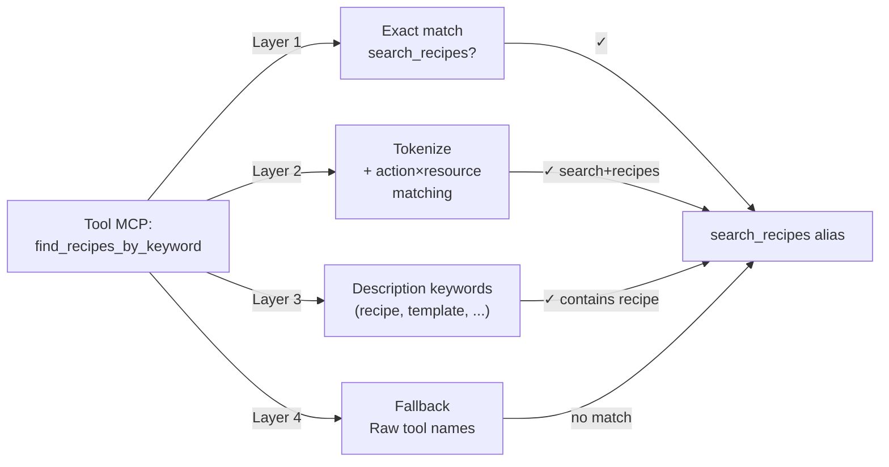
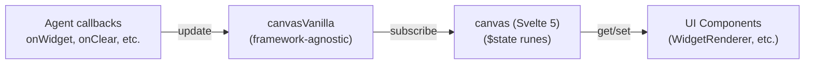
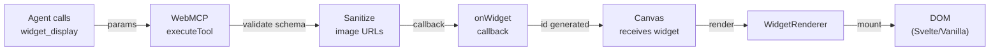

WebMCP Auto-UI uses a **modular architecture** based on four fundamental concepts: the **agentic loop**, **tool layers**, the **component registry**, and the **reactive canvas**.

## Global Architecture



## Agentic Loop in Detail



## Tool Layers (tool stacks)

Each **layer** represents a **server** (MCP or WebMCP):

```typescript
interface ToolLayer {
  protocol: 'mcp' | 'webmcp';
  serverName: string;
  description?: string;
  tools: WebMcpToolDef[] | McpToolDef[];
}
```

### Phase 1: Discovery (startup)

On launch, only **discovery tools** are available:

```typescript
const discoveryTools = buildDiscoveryToolsWithAliases(layers);
// Returns: [ {name: "server_mcp_search_recipes", ...}, 
//            {name: "server_mcp_list_tools", ...}, ... ]
```

**Discovery tools**:
- `{server}_{protocol}_search_recipes(query)` — search by keyword
- `{server}_{protocol}_list_recipes()` — list all recipes
- `{server}_{protocol}_get_recipe(name)` — load recipe details
- `{server}_{protocol}_search_tools(query)` — search tools
- `{server}_{protocol}_list_tools()` — list available tools

### Phase 2: Activation (lazy loading)

When the agent calls a **real tool** (non-discovery) for the first time:

```typescript
// Dispatcher detects it's the first time
if (!activatedServers.has(serverKey)) {
  activatedServers.add(serverKey);
  const layer = layers.find(l => l.serverName === serverName);
  activeTools = activateServerTools(activeTools, layer);
  // ✅ All server tools become available
}
```

### Phase 3: Canonical tool resolution (4-layer matching)

For **MCP servers**, tools are matched to **canonical roles**:



**Layer 1**: Exact name (`search_recipes`, `list_recipes`, `get_recipe`)

**Layer 2**: Token decomposition + action/resource matching
```typescript
// Example: "find_recipe_by_keyword"
// → tokens: ["find", "recipe", "by", "keyword"]
// → test all pairs (find, recipe) → SEARCH + RECIPE = "search_recipes" ✓
```

**Layer 3**: Keywords in description
```typescript
// Example: "Query our template library" 
// → contains "template" → LIST + template = "list_recipes" ✓
```

**Layer 4**: Fallback (no alias, use raw name)

### Aliasing and transparent dispatch

Once resolved, **aliases** are stored locally (thread-safe):

```typescript
const { prompt, aliasMap } = buildSystemPromptWithAliases(layers);
// aliasMap: {
//   "myserver_mcp_search_recipes" → "myserver_mcp_find_recipes_by_keyword"
// }

// In dispatcher:
const resolvedName = aliasMap.get(toolName) ?? toolName;
// "myserver_mcp_search_recipes" → "myserver_mcp_find_recipes_by_keyword"
```

## Component Registry (WebMCP)

A **WebMCP server** exposes **widgets** + **rendering tools**:

```typescript
// Create the server
const autoui = createWebMcpServer('autoui', {
  description: 'Built-in UI widgets'
});

// Register widgets (via markdown recipe with frontmatter)
autoui.registerWidget(`
---
widget: stat
description: Key statistic (KPI, counter)
schema:
  type: object
  required: [label, value]
  properties:
    label: { type: string }
    value: { type: string }
---
## How to use
Call widget_display('stat', {label: "X", value: "Y"})
`, vanillaStatRenderer);

// Native tools (built-in)
autoui.addTool({
  name: 'widget_display',
  description: 'Display a widget on the canvas',
  inputSchema: { ... },
  execute: async (params) => {
    // Validate widget + return { widget, data, id }
  }
});

autoui.addTool({
  name: 'canvas',
  description: 'Manipulate widgets (move, resize, style, update)',
  execute: async (params) => { ... }
});

autoui.addTool({
  name: 'recall',
  description: 'Re-read a complete result after compression',
  execute: async (params) => { ... }
});
```

## System Prompt Construction

The **system prompt** is dynamically constructed from available tools:

```typescript
const systemPrompt = buildSystemPromptWithAliases(layers).prompt;
// Contains:
// 1. General instructions (agent = AI that helps via recipes)
// 2. STEP 1 — Recipe search: list search_recipes()
// 3. STEP 1b — Recipe list: list list_recipes()
// 4. STEP 1c — Tool search: list search_tools()
// 5. STEP 1d — Tool list: list list_tools()
// 6. STEP 2 — Recipe reading: list get_recipe()
// 7. STEP 3 — Execution: precise instructions
// 8. STEP 4 — UI display: list widget_display(), canvas()
```

**Advantage**: Agent always follows a logical schema without deviation.

## Reactive Canvas (Svelte 5)

The **canvas** is a **reactive store** with centralized state management:



### Reactivity

```typescript
// Vanilla store (framework-agnostic)
const canvasVanilla = createCanvasVanilla();
canvasVanilla.addWidget('stat', { label: 'Visitors', value: '1,234' });
// → triggers notify() → listeners receive change

// Svelte 5 wrapper
const canvas = createCanvas(); // subscribed to canvasVanilla
// canvas.blocks is a $state that reflects canvasVanilla.blocks
```

### FONC Message Bus

For **inter-component** communication without direct calls:

```typescript
// Component A: emit a message
bus.broadcast('component_a', 'data-update', { newValue: 42 });

// Component B: listen
bus.subscribe(['data-update'], (msg) => {
  console.log('Received:', msg.payload);
});

// Linking widgets (FONC links)
bus.link(['widget_1', 'widget_2', 'widget_3'], 'group_sales');
// → displays arrows between widgets
```

## Compression and History Recall

To save **LLM context**:

```typescript
// After 2 iterations, old tool_result > 300 chars is compressed
compressOldToolResults(messages, resultBuffer);
// Before: { content: "very long json result..." }
// After: { content: "first 200 chars... [recall('id_xyz') for complete]" }

// If agent needs complete result:
const fullResult = await client.callTool('recall', { id: 'id_xyz' });
// → intercepted by dispatcher, uses resultBuffer
```

## widget_display Flow



## Architectural Summary

| Component | Responsibility |
|-----------|-----------------|
| **Agent Loop** | LLM loop → tools → LLM |
| **Tool Layers** | MCP + WebMCP structuring |
| **Dispatcher** | Routing + lazy activation |
| **Tool Resolver** | Canonical matching (4 layers) |
| **System Prompt** | Instructions + tool listing |
| **Canvas Store** | Centralized widget state |
| **FONC Bus** | Inter-component communication |
| **Compression** | Context saving + recall |
| **Widget Registry** | Discovery + schema validation |
