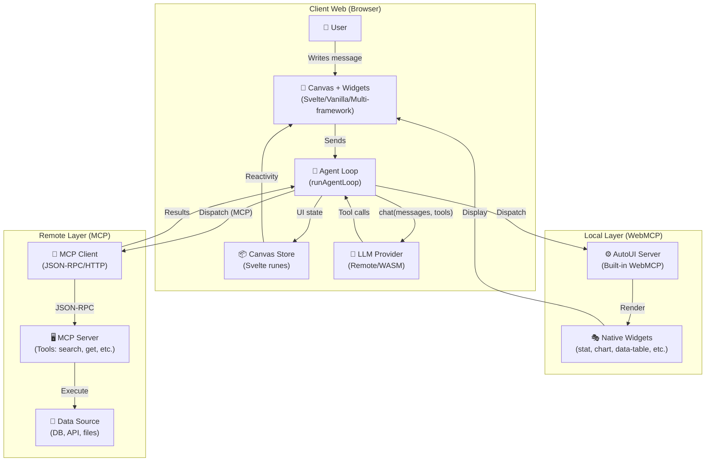
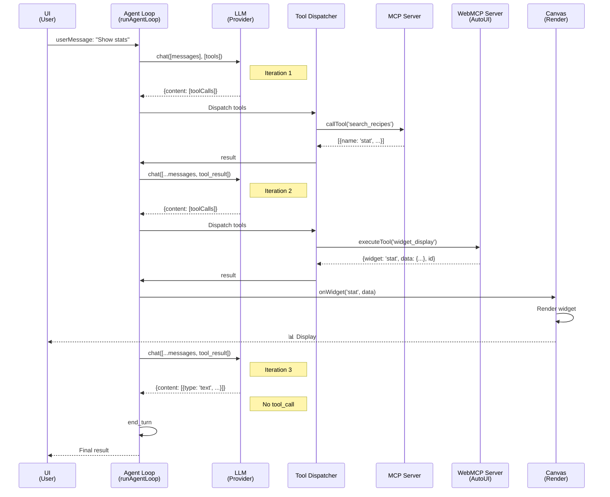
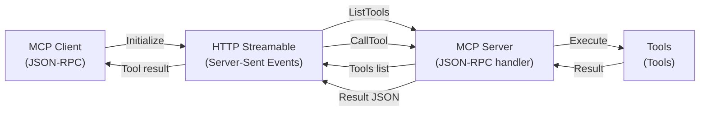
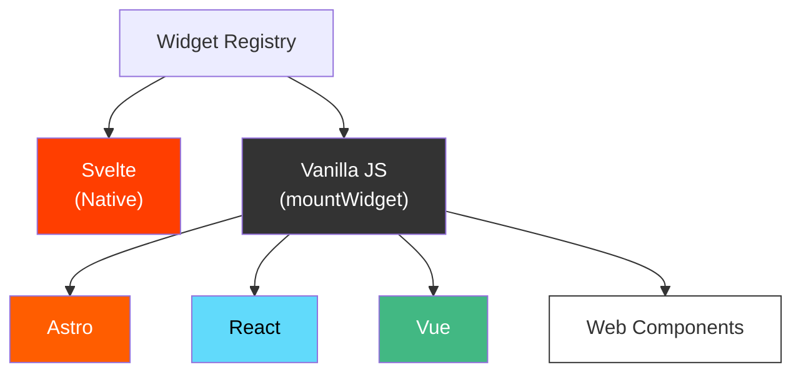

## Global Architecture



## Agent Iteration Flow



## Key Components

### 1. Agent Loop (`packages/agent/src/loop.ts`)

Iterative LLM loop with complete state management:

```typescript
async function runAgentLoop(
  userMessage: string,
  options: AgentLoopOptions
): Promise<AgentResult>
```

**Responsibilities**:
- Maintain message history
- Call LLM provider
- Parse tool calls
- Dispatch tools (MCP or WebMCP)
- Compress old results to save context
- Manage callbacks (onToken, onWidget, etc.)

**Special features**:
- **Discovery phase** : Discovery tools (`search_recipes`, `get_recipe`) at startup
- **Lazy activation** : Additional tools activated on first use
- **Recall** : Retrieve full results via `resultBuffer`
- **Nudging** : Message injection to force rendering if agent explores too much

### 2. Tool Layers (`packages/agent/src/tool-layers.ts`)

Unified abstraction for multiple tool sources:

```typescript
interface ToolLayer {
  protocol: 'mcp' | 'webmcp';
  serverName: string;
  description?: string;
  tools: McpToolDef[] | WebMcpToolDef[];
}
```

**Operations**:
- `buildToolsFromLayers()` : Generate list of all tools (prefixed)
- `buildDiscoveryToolsWithAliases()` : Initially available tools (recipes + actions)
- `activateServerTools()` : Add all tools from a server on first call
- `resolveCanonicalTools()` : 4-layer matching to identify `search_recipes` and `get_recipe`

**Canonical resolution (4 layers)**:
1. **Layer 1** : Exact match (`tool.name === 'search_recipes'`)
2. **Layer 2** : Decomposition (tokenize + action×resource pairs)
3. **Layer 3** : Description scan for keywords
4. **Layer 4** : Fallback (raw tools if no recipe found)

### 3. Canvas Store (`packages/sdk/src/stores/canvas.ts`)

Reactive state management for widgets and context:

```typescript
interface Widget {
  id: string;
  type: WidgetType;
  data: Record<string, unknown>;
}

interface CanvasSnapshot {
  blocks: Widget[];
  mode: Mode;
  llm: LLMId;
  mcpUrl: string;
  mcpConnected: boolean;
  messages: ChatMsg[];
  generating: boolean;
  // ...
}
```

**Operations**:
- `addWidget(type, data)` : Add widget to canvas
- `updateBlock(id, data)` : Update widget data
- `removeBlock(id)` : Remove widget
- `setBlocks(widgets)` : Load complete state

**Serialization**:
- `buildSkillJSON()` : Export state to JSON
- `buildHyperskillParam()` : Encode to compact URL
- `loadFromParam()` : Decode and load

### 4. AutoUI Server (`packages/agent/src/autoui-server.ts`)

Built-in WebMCP server providing:

**Native widgets** (30+):
- Simple: `stat`, `kv`, `list`, `chart`, `alert`, `code`, `text`, `actions`, `tags`
- Rich: `data-table`, `timeline`, `profile`, `trombinoscope`, `json-viewer`, `hemicycle`, `chart-rich`, `cards`, `sankey`, `map`, `log`, `gallery`, `carousel`, `d3`, `js-sandbox`

**Action tools**:
- `widget_display(name, params)` : Display a widget
- `canvas(action, id, params)` : Manipulate widgets (move, resize, style, update, clear)
- `recall(id)` : Retrieve full result from prior iteration

**Recipe tools** (auto-generated):
- `search_recipes(query)` : List available widgets
- `get_recipe(name)` : Get schema and instructions

### 5. Widget Renderer (`packages/ui/src/widgets/WidgetRenderer.svelte`)

Svelte component that encounters a widget type and selects the right renderer:

```svelte
<WidgetRenderer
  type="data-table"
  data={{rows: [...], columns: [...]}}
  servers={[autoui, customServer]}
  oninteract={(type, action, payload) => ...}
/>
```

**Resolution logic**:
1. Look for custom renderer in connected `servers`
2. Look for native renderer in `NATIVE_MAP` (Svelte)
3. Fallback vanilla renderer if defined
4. Fallback text `[type]` if no renderer found

## Model Context Protocol (MCP)

### Client and Server



### Integration in agent

Agent dispatches tool calls to MCP in 3 steps:

1. **Parse prefix** : `{serverName}_{protocol}_{toolName}`
2. **Resolve alias** : canonical (e.g. `search_recipes`) → real (e.g. `list_all_recipes`)
3. **Route** :
   - `protocol === 'mcp'` → `client.callTool(realToolName, input)`
   - `protocol === 'webmcp'` → `webmcpServer.executeTool(realToolName, input)`

## WebMCP (Local Display Layer)

Complement to MCP for the **presentation layer**:

### Widgets

Each widget is a **Markdown recipe**:

```markdown
---
widget: stat
description: Key statistic
schema:
  type: object
  required: [label, value]
  properties:
    label: { type: string }
    value: { type: string }
---

## Usage
Call widget_display('stat', {label: "Total", value: "42"}).
```

Frontmatter = schema + metadata
Body = instructions for agent

### Renderers

Two approaches:

**Native (Svelte)**:
```typescript
const NATIVE_MAP = {
  'stat': { component: StatBlock, props: (data) => ({ data }) },
  'chart': { component: ChartBlock, props: (data) => ({ data }) },
};
```

**Vanilla**:
```typescript
mountWidget(container, 'stat', {label: "Total", value: "42"}, [autoui]);
```

## LLM Providers

### Three Strategies

1. **Remote (Anthropic)** : Distant Claude API
   ```typescript
   new RemoteLLMProvider({
     apiKey: 'sk-ant-...',
     model: 'claude-3-5-sonnet-20241022',
   })
   ```

2. **WASM (Gemma)** : In-browser LLM
   ```typescript
   new WasmProvider({
     model: 'gemma-2b',
     wasmUrl: '...',
   })
   ```

3. **Local** : Local server (Ollama, etc.)
   ```typescript
   new LocalLLMProvider({
     baseUrl: 'http://localhost:11434',
     model: 'llama2',
   })
   ```

## Multi-Framework Integration



Each framework can register **widget packs**:
- `packages/widgets-d3` : D3.js visualizations
- `packages/widgets-threejs` : 3D (Three.js)
- `packages/widgets-leaflet` : Mapping
- `packages/widgets-plotly` : Interactive charts
- etc.

## Persistence and Import/Export

### HyperSkill Encoding

Each canvas can be serialized and compressed to a compact URL:

```typescript
const skill = {
  meta: { title: "My analysis", version: "1.0" },
  content: { blocks: [...], mode: "chat", llm: "sonnet" }
};

const url = await encodeHyperSkill(skill);
// https://demos.hyperskills.net?hs=Ez_xv...
```

Decoding (viewer app):
```typescript
const skill = await decodeHyperSkill(urlOrParam);
canvas.setBlocks(skill.content.blocks);
```

## Security

### Image URL Sanitization

Prevention of URL hallucinations:

```typescript
const VALID_PREFIXES = ['http://', 'https://', 'data:', '/'];
const IMAGE_KEY_PATTERN = /^(src|image|avatar|...)$/i;

function sanitizeImageUrls(obj) {
  // Nullify invalid image URLs before rendering
}
```

Applied in `widget_display()` before rendering.

### Schema Validation

All widget inputs are validated against schema:

```typescript
const validation = validateJsonSchema(params, widget.inputSchema);
if (!validation.valid) {
  return { error: 'Validation failed', details: validation.errors };
}
```
