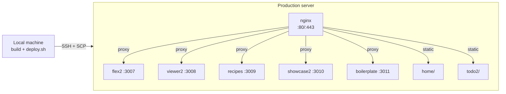
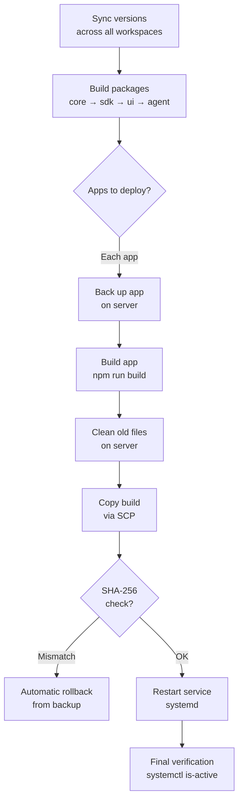

WebMCP Auto-UI deployment relies on a **centralized script** (`scripts/deploy.sh`) that manages all seven monorepo apps with their specific paths and configurations. This guide covers the complete procedure, from local build to production verification.

## Golden Rule

:::danger[Never deploy manually]
**ALWAYS use `./scripts/deploy.sh`.** Never `scp`, `rsync`, or any other manual method.

Why? Each app has a different deployment path on the server, and repeated errors have been caused by deploying to the wrong location:
- `rsync --delete` wiped production `.env` files
- `scp` to the wrong folder served stale code for hours
- Orphaned JS chunks from previous builds polluted the browser cache
:::

## Target Infrastructure



| Element | Value |
|---------|-------|
| **Server** | `demo.hyperskills.net` (via SSH alias `ssh bot`) |
| **Base path** | `/opt/webmcp-demos/` |
| **Node.js apps** | flex2 (:3007), viewer2, recipes, showcase2, boilerplate |
| **Static apps** | home, todo2 (served by nginx) |
| **Reverse proxy** | nginx on ports 80/443 |

## Applications and Deployment Paths


Each app has a specific deployment path. The `deploy.sh` script knows these paths and handles them automatically.

| App | Type | Build dir (local) | Deploy dest (server) | ExecStart | Notes |
|-----|------|-------------------|----------------------|-----------|-------|
| **flex2** | Node.js (SvelteKit) | `apps/flex2/build/` | `/opt/webmcp-demos/flex2/` | `node index.js` | Main composer |
| **viewer2** | Node.js (SvelteKit) | `apps/viewer2/build/` | `/opt/webmcp-demos/viewer2/` | `node index.js` | HyperSkills viewer |
| **showcase2** | Node.js (SvelteKit) | `apps/showcase2/build/` | `/opt/webmcp-demos/showcase2/` | `node index.js` | Widget gallery |
| **recipes** | Node.js (SvelteKit) | `apps/recipes/build/` | `/opt/webmcp-demos/recipes/` | `node index.js` | Recipe explorer |
| **boilerplate** | Node.js (SvelteKit) | `apps/boilerplate/build/` | `/opt/webmcp-demos/boilerplate/` | `node index.js` | Starter template |
| **home** | Static (SvelteKit) | `apps/home/build/` | `/opt/webmcp-demos/home/` | N/A (nginx) | Homepage |
| **todo2** | Static (SvelteKit) | `apps/todo2/build/` | `/opt/webmcp-demos/todo2/` | N/A (nginx) | Todo demo |

:::caution[Different paths]
Node.js apps are deployed to the **root** of their folder (`/opt/webmcp-demos/flex2/index.js`), because systemd runs `node index.js` from that directory. If you deploy to the wrong location, the service starts but serves stale code.
:::

## Deployment Procedure

### Step 1: Deploy via the Script

The script handles everything: package builds, app builds, cleanup, transfer, integrity verification, and service restart.

```bash
# Deploy all apps
./scripts/deploy.sh

# Deploy a specific app
./scripts/deploy.sh flex2

# Deploy multiple apps
./scripts/deploy.sh flex2 viewer2 home

# Preview what would be deployed without making changes
./scripts/deploy.sh --dry-run

# Deploy with documentation update
./scripts/deploy.sh --with-docs
```

### Step 2: Verify on Server

```bash
ssh bot

# Check Node.js services
systemctl status webmcp-flex2
systemctl status webmcp-viewer2

# Check static apps
curl -s -o /dev/null -w "%{http_code}" http://localhost/home/

# Check nginx
sudo systemctl status nginx
```

## What the Script Does

The `deploy.sh` script executes these steps in order:



### Integrity Verification (SHA-256)

After each transfer, the script compares the SHA-256 hash of the local file with the deployed file:

```bash
expected=$(sha256sum apps/flex2/build/index.js | cut -d' ' -f1)
actual=$(ssh bot "sha256sum /opt/webmcp-demos/flex2/index.js | cut -d' ' -f1")

if [ "$expected" != "$actual" ]; then
  echo "INTEGRITY ERROR — sha256 mismatch, rolling back"
  rollback_app "flex2"
fi
```

This check catches incomplete transfers, read-only files, and stale builds.

### Backup and Rollback

Before each deployment, a full copy of the existing app is stored in `/opt/webmcp-demos/.backups/`. On failure, the script automatically restores the previous version.

```bash
# Manual rollback if needed
ssh bot
cp -a /opt/webmcp-demos/.backups/flex2.prev /opt/webmcp-demos/flex2
systemctl restart webmcp-flex2
```

## Environment Variables

### On the Server (Production)

`.env` files must exist **before** the first deployment. They are created manually once and **never** deployed by the script.

:::danger[Never deploy .env files]
`.env` files contain API keys and secrets. They must never be in git or copied by the deployment script. If an `.env` disappears from the server (rsync incident of 2026-04-06), recreate it manually.
:::

### Build-Time Variables (home)

The `home` app requires `PUBLIC_BASE_URL` at build time, not runtime:

```bash
# deploy.sh handles this automatically for static apps (home, todo2)
PUBLIC_BASE_URL=https://demos.hyperskills.net npm run build
```

If you build manually (outside the script), remember this variable, otherwise internal links will point to `localhost`.

## nginx Configuration

nginx serves as reverse proxy for Node.js apps and static file server for the rest:

```nginx
# Node.js apps → proxy to local port
location /flex2/ {
  proxy_pass http://localhost:3007/;
  proxy_http_version 1.1;
  proxy_set_header Upgrade $http_upgrade;
  proxy_set_header Connection 'upgrade';
}

# Static apps → serve from disk
location /home/ {
  alias /opt/webmcp-demos/home/;
  try_files $uri $uri/index.html =404;
}

# Default page = home
location / {
  alias /opt/webmcp-demos/home/;
  try_files $uri $uri/index.html =404;
}
```

## Production Monitoring

### Logs

```bash
ssh bot

# Follow logs in real time
journalctl -u webmcp-flex2 -f

# View the last 50 log entries
journalctl -u webmcp-flex2 -n 50 --no-pager
```

### Health Checks

```bash
# Test all apps
for app in home flex2 viewer2 showcase2 recipes; do
  code=$(curl -s -o /dev/null -w "%{http_code}" "https://demos.hyperskills.net/$app/")
  echo "$app: HTTP $code"
done
```

### System Resources

```bash
ssh bot
df -h       # Disk space
free -h     # Memory
```

## Troubleshooting

### App Shows Stale Code After Deploy

**Likely cause**: orphaned JavaScript chunks. If you deployed manually (without the script), old `.js` files remain and the browser serves them from cache.

**Solution**:
```bash
ssh bot
# Clean old files
rm -rf /opt/webmcp-demos/flex2/client /opt/webmcp-demos/flex2/server
# Redeploy properly
./scripts/deploy.sh flex2
```

:::tip[The script cleans automatically]
`deploy.sh` performs targeted cleanup before each copy (removes `index.js`, `handler.js`, `client/`, `server/`, `build/`). This cleanup is the main reason to use the script over manual `scp`.
:::

### `.env` Missing After Deploy

**Cause**: `.env` files are not part of the deploy and must never be.

**Solution**: recreate the file manually on the server, then restart the service.

### nginx Returns 404

**Diagnosis**:
```bash
ssh bot

# Verify files exist
ls -la /opt/webmcp-demos/home/index.html

# Test nginx config
sudo nginx -t

# Check paths in config
grep -A 5 "location /home/" /etc/nginx/sites-available/default

# Reload after fix
sudo systemctl reload nginx
```

### API Rate-Limited (Anthropic)

**Symptom**: 429 errors in flex2 logs.

**Solutions**:
1. Wait (the client handles exponential backoff automatically)
2. Reduce `maxIterations` in agent configuration
3. Verify the API key is not shared across multiple deployments

### Service Does Not Start

```bash
ssh bot

# View detailed error
journalctl -u webmcp-flex2 -n 30 --no-pager

# Common causes:
# - Port already in use → lsof -i :3007
# - Missing .env → ls -la /opt/webmcp-demos/flex2/.env
# - Missing npm deps → cd /opt/webmcp-demos/flex2 && npm install --production
```

## Routine Maintenance

### Restart All Services

```bash
ssh bot
sudo systemctl restart webmcp-flex2 webmcp-viewer2 webmcp-recipes webmcp-showcase2 nginx
```

### Clean Old Logs

```bash
ssh bot
journalctl --vacuum-time=7d  # Keep 7 days
```

### Update Dependencies

```bash
# Locally
npm update
npm run build
./scripts/deploy.sh
```

## Deployment Checklist

Before each deployment, verify:

- [ ] Local build succeeds (`npm run build` without errors)
- [ ] Tests pass (`npm run test`)
- [ ] Code is committed and pushed
- [ ] Using `./scripts/deploy.sh` (never `scp` or `rsync`)
- [ ] After deploy: check logs (`journalctl -u webmcp-flex2 -n 20`)
- [ ] After deploy: test in browser
- [ ] If deploying `home`: verify `PUBLIC_BASE_URL` is correct

## Emergency Rollback

If a deployment breaks something and the automatic rollback did not work:

```bash
# Option 1: Restore from backup
ssh bot
cp -a /opt/webmcp-demos/.backups/flex2.prev /opt/webmcp-demos/flex2
systemctl restart webmcp-flex2

# Option 2: Redeploy an earlier version
git checkout <previous_commit>
./scripts/deploy.sh flex2
```

:::caution[Rollback speed]
The backup only contains the immediately previous version (`*.prev`). If you deploy twice in a row, the first backup is overwritten. When in doubt, check the backup contents before restoring.
:::
