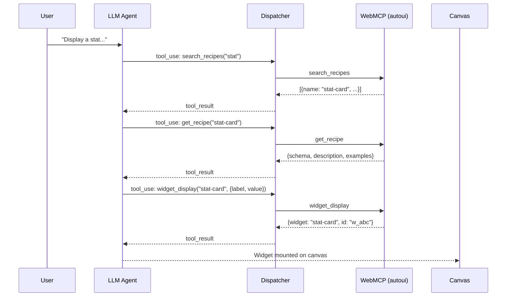
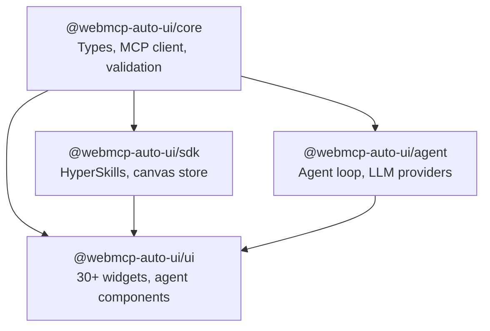

This guide walks you from installation to your first working agent. By the end, you will have an interactive canvas where an AI agent generates widgets in real time from your prompts.

## Who This Guide Is For

- **Frontend developers** looking to integrate an AI agent into a Svelte interface
- **Explorers** curious to see MCP in action on the client side
- **Contributors** who want to understand the monorepo structure before diving into code

## Prerequisites

| Tool | Minimum Version | Why |
|------|----------------|-----|
| **Node.js** | 18.x | Server runtime (SvelteKit) and build tooling |
| **npm** | 9.x | Monorepo management (workspaces) |
| **Modern browser** | Chrome/Edge recommended | WebAssembly for Gemma, Web Workers |

:::note[API key is optional]
An API key is only needed for remote LLM providers (any OpenAI-compatible provider: Claude, Gemini, ChatGPT, Mistral, Qwen, etc.). The Gemma 4 agent runs entirely in the browser — no key, no remote server.
:::

## Quick Path: Boilerplate

The fastest way to get started is with the **boilerplate** -- a ready-to-use SvelteKit app with three pre-configured Tricoteuses widgets:

```bash
npx degit jeanbaptiste/webmcp-auto-ui/apps/boilerplate my-app
cd my-app
npm install
npm run dev
```

Here is what each command does:

1. `npx degit` downloads the `apps/boilerplate` folder without git history (fast, lightweight).
2. `npm install` installs dependencies, including all four `@webmcp-auto-ui/*` packages.
3. `npm run dev` starts the SvelteKit server on `http://localhost:5173`.

The app launches with a canvas, a chat panel, and three working widgets. Type a prompt in the chat to see the agent in action.

:::tip[When to choose the boilerplate]
Choose the boilerplate if you want to **use** WebMCP Auto-UI in a project. Choose the full monorepo if you want to **contribute** to the project or modify the packages themselves.
:::

## Full Monorepo (for Contributors)

### Step 1: Clone the Repository

```bash
git clone https://github.com/jeanbaptiste/webmcp-auto-ui.git
cd webmcp-auto-ui
```

The repository is about 50 MB (excluding `node_modules`). It contains four packages and seven demo apps.

### Step 2: Install Dependencies

```bash
npm install
```

npm automatically detects the workspaces defined in `package.json` and installs all dependencies in a single pass. Local packages (`@webmcp-auto-ui/*`) are linked via symlinks -- no manual `npm link` required.

### Step 3: Configure Environment

Create a `.env.local` file at the root of the app you want to run (for example `apps/flex/.env.local`):

```bash
# Remote LLM API (optional, only required for remote agents)
LLM_API_KEY=sk-ant-...

# Remote MCP servers (optional, format: protocol://host:port)
MCP_SERVERS=http://localhost:3001,http://localhost:3002
```

:::caution[Security]
Never commit `.env` files. They are already in `.gitignore`. On the production server, `.env` files are created manually once and never deployed.
:::

### Step 4: Start Development

```bash
npm run dev
```

This command launches all apps in parallel via `concurrently`. Each app listens on a different port:

| App | Port | Description |
|-----|------|-------------|
| home | 5173 | Homepage (static) |
| flex | 5174 | Main app (SvelteKit) |
| viewer | 5175 | HyperSkills viewer |
| showcase | 5176 | Widget gallery |
| todo | 5177 | Todo demo |

To launch a single app:

```bash
npm run dev:flex    # Just flex
npm run dev:home     # Just home
```

## Your First Agent: Step by Step

### 1. Choose a Model

Open `http://localhost:5174` (flex). In the right panel, click **Settings** and select a model:

| Model | Speed | Quality | Requirement |
|-------|-------|---------|-------------|
| Claude Haiku | Fast | Good | API key |
| Claude Sonnet | Medium | Very good | API key |
| Claude Opus | Slow | Excellent | API key |
| Gemma 4 E2B | Medium | Fair | None (in-browser) |
| Gemma 4 E4B | Slow | Good | None (in-browser) |

If you choose Gemma, the browser downloads model weights (~2-6 GB). The `<GemmaLoader>` component shows real-time progress.

### 2. Write a Prompt

In the **chat panel**, type:

```
Display a stat with label "Visitors" and value "1,234"
```

### 3. Watch the Agent

The agent follows a predictable flow:



1. The agent searches for a matching recipe (`search_recipes`).
2. It loads the full recipe to learn the schema (`get_recipe`).
3. It calls `widget_display` with validated parameters.
4. The canvas displays the widget.

### 4. Go Further

Try more complex prompts:

```
Show 3 stats: visitors (1,234), conversions (3.2%), and revenue ($45,678).
Then add a bar chart with monthly sales.
```

The agent will chain multiple tool calls in a single loop.

## Monorepo Structure

```
webmcp-auto-ui/
├── packages/
│   ├── core/          # WebMCP types, polyfill, MCP client, validation
│   ├── agent/         # Agent loop, LLM providers, tool layers, Nano-RAG
│   ├── ui/            # 30+ Svelte widgets, agent components, theme, bus
│   └── sdk/           # HyperSkills, skills registry, canvas store
├── apps/
│   ├── boilerplate/   # Entry point for new devs (SvelteKit + Tricoteuses)
│   ├── flex/         # Main SvelteKit app (composer)
│   ├── showcase/     # Widget gallery
│   ├── todo/         # Todo demo
│   ├── viewer/       # HyperSkills viewer
│   ├── home/          # Homepage (static)
│   └── recipes/       # Recipe explorer
├── scripts/
│   └── deploy.sh      # Centralized deployment script
├── docs-site/         # Documentation site (Astro Starlight)
└── tests/
    └── e2e/           # Playwright tests
```

### Package Dependencies



`core` is the foundation: it depends on nothing else. `agent` and `sdk` depend on `core`. `ui` depends on all three.

## Recommended Imports

```typescript
// Agent loop
import { runAgentLoop } from '@webmcp-auto-ui/agent';

// LLM Providers
import { RemoteLLMProvider } from '@webmcp-auto-ui/agent';  // Remote LLM via proxy
import { WasmProvider } from '@webmcp-auto-ui/agent';       // Gemma 4 in-browser
import { LocalLLMProvider } from '@webmcp-auto-ui/agent';   // Ollama local

// Tool layers
import { buildDiscoveryTools, activateServerTools } from '@webmcp-auto-ui/agent';
import { resolveCanonicalTools, buildSystemPromptWithAliases } from '@webmcp-auto-ui/agent';

// Widgets
import { WidgetRenderer, BlockRenderer } from '@webmcp-auto-ui/ui';

// Canvas store (Svelte 5 only)
import { canvas } from '@webmcp-auto-ui/sdk/canvas';

// MCP Client
import { McpClient, McpMultiClient } from '@webmcp-auto-ui/core';

// HyperSkills
import { encodeHyperSkill, decodeHyperSkill } from '@webmcp-auto-ui/sdk';
```

## Practical Examples

### Create a Remote LLM Provider

`RemoteLLMProvider` connects to any OpenAI-compatible API (e.g. Claude, Gemini, ChatGPT, Mistral) through a SvelteKit proxy endpoint. Your API key stays server-side -- never exposed to the browser.

```typescript
import { RemoteLLMProvider } from '@webmcp-auto-ui/agent';

const provider = new RemoteLLMProvider({
  proxyUrl: '/api/chat',
  model: 'sonnet',  // Resolved server-side to claude-sonnet-4-6
});
```

Available aliases:

| Alias | Full Model | Use Case |
|-------|-----------|----------|
| `'haiku'` | `claude-haiku-4-5-20251001` | Fast, cost-effective |
| `'sonnet'` | `claude-sonnet-4-6` | Balanced quality/speed |
| `'opus'` | `claude-opus-4-6` | Deep reasoning |

### Create a Gemma Provider (In-Browser)

`WasmProvider` runs Gemma 4 directly in the browser via LiteRT. No API key, no remote server:

```typescript
import { WasmProvider } from '@webmcp-auto-ui/agent';

const provider = new WasmProvider({
  model: 'gemma-e4b',      // 4B variant (more capable)
  contextSize: 32_768,
  onProgress: (progress, status, loaded, total) => {
    console.log(`Loading: ${Math.round(progress * 100)}%`);
  },
  onStatusChange: (status) => {
    // 'idle' → 'loading' → 'ready' (or 'error')
    console.log('Gemma:', status);
  },
});

await provider.initialize();
```

### Run a Full Agent

```typescript
import { runAgentLoop } from '@webmcp-auto-ui/agent';
import { autoui } from '@webmcp-auto-ui/agent';

const result = await runAgentLoop('Show a chart of monthly sales', {
  provider,           // RemoteLLMProvider or WasmProvider
  layers: [
    { protocol: 'webmcp', serverName: 'autoui', tools: autoui.listTools() },
    // Add more MCP layers as needed
  ],
  maxIterations: 5,   // Safety guard: max 5 loops
  callbacks: {
    onToolCall: (call) => console.log('Tool called:', call.name, `(${call.elapsed}ms)`),
    onWidget: (type, data) => {
      console.log('Widget generated:', type);
      // Add to canvas here
      return { id: `w_${Date.now()}` };
    },
    onText: (text) => console.log('Agent says:', text),
  },
});

console.log('Result:', result.text);
console.log('Tools called:', result.metrics.toolCalls);
```

This example shows the complete flow: the provider sends the prompt to the LLM, the agent loop iterates by calling tools, and callbacks receive events in real time.

### Display a Widget in Svelte

```svelte
<script>
  import { WidgetRenderer } from '@webmcp-auto-ui/ui';
  import { autoui } from '@webmcp-auto-ui/agent';

  const widgetData = {
    label: 'Visitors',
    value: '1,234',
    trend: 'up',
    variant: 'success',
  };
</script>

<WidgetRenderer
  type="stat-card"
  data={widgetData}
  servers={[autoui]}
/>
```

`WidgetRenderer` detects the type, loads the matching Svelte component, and passes the data as props. The `servers` attribute references WebMCP servers for schema validation.

### Connect to an MCP Server

```typescript
import { McpClient } from '@webmcp-auto-ui/core';

const client = new McpClient({
  serverUrl: 'http://localhost:3000',
});

await client.initialize();

// List tools exposed by the server
const tools = await client.listTools();
console.log('MCP tools:', tools.map(t => t.name));

// Call a tool
const result = await client.callTool('get_forecast', { location: 'Paris' });
console.log('Result:', result);
```

The MCP client communicates via SSE (Server-Sent Events) with the remote server. Initialization negotiates capabilities and retrieves the tool list.

## Local Deployment (Preview)

To test a production build locally:

```bash
npm run build    # Build all apps
npm run preview  # Start the preview server
```

Accessible on `http://localhost:4173`. This is the same code that will be deployed to production.

## Troubleshooting

### Agent Does Not Call Tools

1. **Check layers**: the `layers` array passed to `runAgentLoop` must contain at least one layer with tools.
2. **Check the system prompt**: `buildSystemPromptWithAliases(layers)` must return a prompt that lists available tools.
3. **Check logs**: enable `onToolCall` in callbacks to trace every call.
4. **Check the model**: some models (small Gemma variants) struggle with the tool calling format.

### Gemma Does Not Load

- **Internet connection**: the first launch downloads weights (~2-6 GB depending on variant).
- **Browser**: Chrome or Edge recommended. Firefox supports WebAssembly but may be slower.
- **Memory**: Gemma 4B requires ~8 GB of available RAM in the browser.
- **Console**: open `F12` and check errors in the Console tab.

### Widgets Do Not Display

- **Unknown type**: verify that the type passed to `WidgetRenderer` exists in the native map (`NATIVE_WIDGET_NAMES`).
- **Invalid schema**: data is validated against the widget's JSON Schema. If validation fails, the widget is not mounted.
- **Silent errors**: open the browser console to see validation errors.

### Build Fails

- **Build order**: packages must be compiled before apps (`core` -> `sdk` -> `ui` -> `agent`). The `npm run build` script handles this order.
- **Stale cache**: delete `node_modules/.cache` and re-run `npm run build`.
- **Types**: run `npm run check` to surface TypeScript errors.

## Next Steps

- **[Architecture](./architecture)**: Understand the agent loop, tool layers, and reactive canvas
- **[Tool Calling](./tool-calling)**: The complete journey of a tool call
- **[Deployment](./deploy)**: Host in production with `deploy.sh`
- **[Contributing](./contributing)**: Patterns, pitfalls, and contribution workflow
