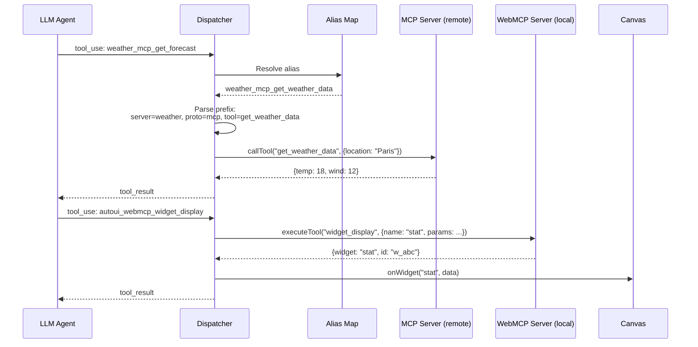
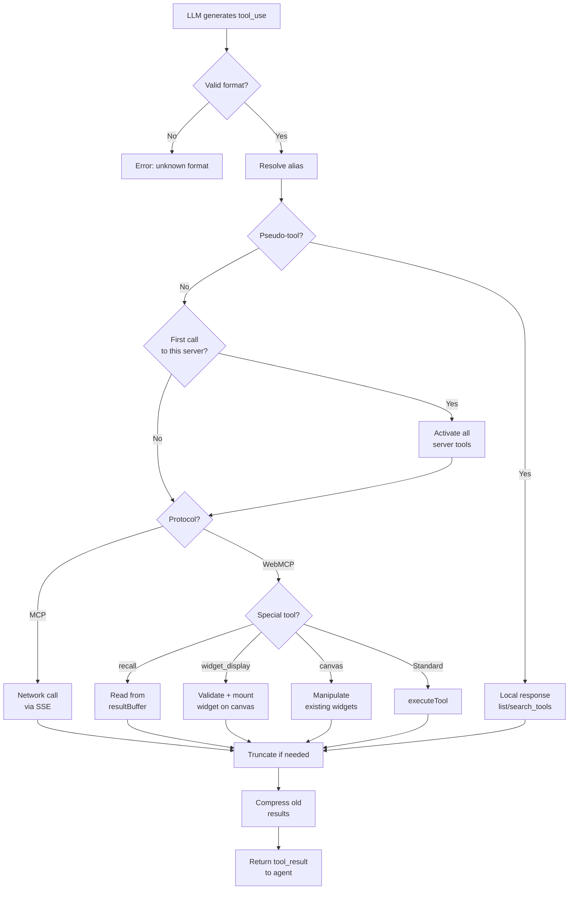

**Tool calling** is the central mechanism of WebMCP Auto-UI. The LLM agent generates `tool_use` blocks, and the dispatcher routes them to the right server -- remote MCP or local WebMCP. This page traces the complete journey of a tool call, from the LLM to the result.

## Flow Overview



## Anatomy of a Tool Call

### 1. Agent Generates a tool_use Block

When the LLM decides to use a tool, it produces a structured block:

```typescript
{
  type: 'tool_use',
  id: 'toolu_1234',                    // Unique call identifier
  name: 'weather_mcp_get_forecast',    // Canonical name with prefix
  input: { location: 'Paris', days: 3 } // Tool parameters
}
```

The name follows the `{serverName}_{protocol}_{toolName}` convention. This format tells the dispatcher immediately:
- **Which server** to contact (`weather`)
- **Which protocol** to use (`mcp` = remote, `webmcp` = local)
- **Which tool** to call (`get_forecast`)

### 2. Dispatcher Routes the Call

The dispatcher is the routing core. For each `tool_use` block, it:

1. Resolves aliases (canonical names to actual server names)
2. Parses the prefix to identify server, protocol, and tool
3. Routes to MCP or WebMCP

```typescript
for (const block of toolBlocks) {
  // Step 1: Resolve alias
  const resolvedName = aliasMap.get(block.name) ?? block.name;

  // Step 2: Parse prefix
  const match = resolvedName.match(/^(.+?)_(mcp|webmcp)_(.+)$/);
  if (!match) {
    result = `Error: unknown tool format`;
  } else {
    const [, serverName, protocol, realToolName] = match;

    // Step 3: Routing
    if (protocol === 'mcp') {
      // → Network call via MCP client
    } else if (protocol === 'webmcp') {
      // → Local execution via WebMCP server
    }
  }
}
```

:::note[Prefix format]
The regex `^(.+?)_(mcp|webmcp)_(.+)$` uses a non-greedy match on the first group (`(.+?)`) to support server names containing underscores (e.g., `my_weather_mcp_get_forecast`).
:::

### 3. Interceptor (Pseudo-Tools)

Before normal dispatch, two **pseudo-tools** are intercepted locally. They do not trigger server activation:

```typescript
if (toolMatch[3] === 'list_tools' || toolMatch[3] === 'search_tools') {
  const layer = layers.find(l =>
    sanitizeServerName(l.serverName) === serverName &&
    l.protocol === protocol
  );

  if (pseudoTool === 'list_tools') {
    // Return the complete tool list for the server
    result = JSON.stringify(layer.tools);
  } else {
    // Filter by keyword in name or description
    const query = String(block.input.query ?? '').toLowerCase();
    const matches = layer.tools.filter(t =>
      t.name.toLowerCase().includes(query) ||
      t.description.toLowerCase().includes(query)
    );
    result = JSON.stringify(matches);
  }
}
```

**Why intercept?** So the agent can explore available tools without triggering a network connection. The agent can call `list_tools()` as often as it wants with zero network cost.

### 4. Lazy Server Activation

On the **first real call** to a server's tool:

```typescript
const serverKey = `${serverName}_${protocol}`;

if (!activatedServers.has(serverKey)) {
  activatedServers.add(serverKey);
  const layer = layers.find(l =>
    sanitizeServerName(l.serverName) === serverName &&
    l.protocol === protocol
  );
  if (layer) {
    // Add ALL server tools to active tools
    activeTools = activateServerTools(activeTools, layer);
  }
}
```

After activation, the LLM receives the full tool list for the server on its next call. Activation is a one-shot operation: it happens once per session.

## MCP Dispatch


MCP dispatch goes through an SSE (Server-Sent Events) client connected to the remote server:

```typescript
if (protocol === 'mcp') {
  if (!client) {
    result = `Error: no MCP client available for tool ${name}`;
  } else {
    // Call the tool on the remote server
    const mcpResult = await client.callTool(realToolName, block.input);

    // Extract text content from the MCP response
    const textContent = mcpResult.content?.find(
      (c) => c.type === 'text'
    ) as { text?: string } | undefined;
    const rawResult = textContent?.text ?? JSON.stringify(mcpResult);

    // Truncate if result exceeds limit (default: 10,000 chars)
    result = truncateResults
      ? truncateResult(rawResult, maxResultLength)
      : rawResult;
  }
}
```

Truncation prevents a large result (a 10,000-row table, for example) from filling the context window. The full result is stored in the `resultBuffer` and accessible via `recall()`.

:::caution[Network latency]
MCP calls involve a network round trip. If the server is slow or unreachable, the dispatcher waits indefinitely (unless an `AbortSignal` is provided via agent options).
:::

## WebMCP Dispatch


WebMCP dispatch executes the tool locally in the browser:

```typescript
if (protocol === 'webmcp') {
  // Special case: recall (re-read a compressed result)
  if (realToolName === 'recall' && resultBuffer.size > 0) {
    const recallId = (block.input as { id: string }).id;
    result = resultBuffer.get(recallId)
      ?? `No result found for id '${recallId}'.`;
  } else {
    // Normal dispatch to WebMCP server
    const webmcpServer = webmcpServers.get(serverName);
    if (!webmcpServer) {
      result = `Error: no WebMCP server "${serverName}" found.`;
    } else {
      const toolResult = await webmcpServer.executeTool(
        realToolName,
        block.input
      );
      result = typeof toolResult === 'string'
        ? toolResult
        : JSON.stringify(toolResult);
    }
  }
}
```

WebMCP dispatch handles three special cases beyond standard execution:

### Special Case: widget_display

When the called tool is `widget_display`, the dispatcher detects the result and triggers the rendering callback:

```typescript
if (realToolName === 'widget_display') {
  const wr = toolResult as Record<string, unknown>;
  if (wr.widget && wr.data && !wr.error) {
    const widgetResult = callbacks.onWidget?.(
      wr.widget as string,
      wr.data as Record<string, unknown>
    );
    if (widgetResult?.id) {
      result = JSON.stringify({ ...wr, id: widgetResult.id });
    }
  }
}
```

The `onWidget` callback is responsible for adding the widget to the canvas. The returned `id` lets the agent manipulate the widget in subsequent iterations (move, resize, update).

### Special Case: canvas

The `canvas` tool lets the agent manipulate existing widgets:

```typescript
if (realToolName === 'canvas') {
  const action = block.input.action as string;
  const id = block.input.id as string;
  const actionParams = block.input.params as Record<string, unknown>;

  switch (action) {
    case 'clear':  callbacks.onClear?.(); break;
    case 'update': callbacks.onUpdate?.(id, actionParams ?? {}); break;
    case 'move':   callbacks.onMove?.(id, x, y); break;
    case 'resize': callbacks.onResize?.(id, width, height); break;
    case 'style':  callbacks.onStyle?.(id, styles); break;
  }
}
```

| Action | Description | Example Use |
|--------|-------------|-------------|
| `clear` | Empty the entire canvas | "Start from scratch" |
| `update` | Modify a widget's data | Change a stat's value |
| `move` | Reposition a widget (CSS transform) | Rearrange layout |
| `resize` | Resize a widget | Enlarge a chart |
| `style` | Apply CSS styles | Change background color |

### Special Case: recall

`recall` is a pseudo-tool that re-reads a compressed result. It is intercepted before normal dispatch:

```typescript
if (realToolName === 'recall' && resultBuffer.size > 0) {
  const recallId = (block.input as { id: string }).id;
  result = resultBuffer.get(recallId) ?? `No result found...`;
}
```

## Widget Display in Detail

`widget_display()` is the primary tool for UI rendering. Here is the complete journey of a call:


### End-to-End Example

```typescript
// 1. Agent calls widget_display
{
  type: 'tool_use',
  id: 'toolu_5678',
  name: 'autoui_webmcp_widget_display',
  input: {
    name: 'stat-card',
    params: {
      label: 'Conversion',
      value: '3.2%',
      trend: 'up',
      variant: 'success'
    }
  }
}
```

The dispatcher executes these steps in sequence:

1. **Resolution**: find the `stat-card` widget definition in the registry.
2. **Validation**: check that `params` matches the JSON Schema (`label` and `value` required, `trend` must be one of `[up, down, stable]`).
3. **Sanitization**: verify image URLs (if present) against an allowlist of domains.
4. **ID generation**: create a unique identifier `w_1a2b3c`.
5. **Callback**: call `onWidget('stat-card', {...params})` to add the widget to the canvas.
6. **Canvas store**: the store adds `{ id: 'w_1a2b3c', type: 'stat-card', data: {...} }` to the block list.
7. **Svelte rendering**: `WidgetRenderer` detects the new block and mounts the `StatCard` component with props.
8. **Display**: the widget appears on the canvas.

:::tip[Auto-repair]
If validation fails, the dispatcher returns the error **and** the expected schema. Modern LLMs (Claude, Gemma 4) can correct their parameters and retry automatically. The `autoRepairParams` module can also attempt automatic repair before returning the error.
:::

## Error Handling

### Schema Validation Error

```typescript
// Agent omits a required field
{
  name: 'autoui_webmcp_widget_display',
  input: {
    name: 'stat',
    params: { label: 'Sales' }  // Missing 'value' (required)
  }
}

// Dispatcher returns error + schema
{
  type: 'tool_result',
  content: JSON.stringify({
    error: 'Validation failed',
    details: [{ path: '/value', message: 'required' }],
    expected_schema: { type: 'object', required: ['label', 'value'], ... }
  })
}
```

The agent receives the expected schema and can retry with the correct fields. This error-correction pattern is natural for LLMs.

### Tool Not Found

```typescript
// MCP server not connected
if (!client) {
  result = `Error: no MCP client available for tool ${name}`;
}

// WebMCP server not registered
if (!webmcpServer) {
  result = `Error: no WebMCP server "${serverName}" found.`;
}
```

### Execution Failure

```typescript
try {
  const toolResult = await webmcpServer.executeTool(realToolName, block.input);
  result = ...;
} catch (e) {
  call.error = e instanceof Error ? e.message : String(e);
  toolResults.push({
    type: 'tool_result',
    tool_use_id: block.id,
    content: `Error: ${call.error}`
  });
}
```

Execution errors are caught and returned to the agent as normal `tool_result` messages. The agent can decide to retry, use a different tool, or report the failure to the user.

## Metrics and Monitoring

Every tool call is tracked with metrics:

```typescript
const call: ToolCall = {
  id: block.id,          // Unique call ID
  name: block.name,      // Canonical tool name
  args: block.input,     // Parameters
  result: result,        // Result (or error)
  error: undefined,      // Error message if failed
  elapsed: Math.round(performance.now() - t1),  // Duration in ms
  guided: wasDiscovering, // true if preceded by a discovery tool
};

metrics.toolCalls++;
callbacks.onToolCall?.(call);
```

The `onToolCall` callback enables:
- **Logging** every call for debugging
- **Measuring** MCP server latency
- **Counting** tools called per iteration
- **Detecting** loops (same tool called repeatedly with same parameters)

The `<AgentConsole>` component from `@webmcp-auto-ui/ui` displays these metrics in real time in the interface.

## Result Compression

After approximately 2 iterations, old `tool_result` messages are compressed to save context:

```typescript
// Before compression
{
  type: 'tool_result',
  tool_use_id: 'toolu_1234',
  content: '{"data": [item1, item2, ... item1000], "total": 1000}'
  // 5000 characters
}

// After compression (mutated in place in the messages array)
{
  type: 'tool_result',
  tool_use_id: 'toolu_1234',
  content: '{"data": [item1, item2... [recall(\'toolu_1234\') for full result, 5000 chars]'
  // 200 characters
}

// Full result stored in buffer
resultBuffer.set('toolu_1234', '{"data": [item1, item2, ... item1000]}');
```

The agent can re-read the full result at any time by calling `recall('toolu_1234')`. This mechanism is transparent: the agent decides whether it needs the full result or if the preview is enough.

## Flow Summary



## FAQ

### Why the `{server}_{proto}_{tool}` format instead of just the tool name?

Because the same tool name can exist on multiple servers. For example, `list_items` could be defined on both a `database` and a `filesystem` server. The prefix disambiguates.

### How many tools can an agent handle?

In theory, as many as the context window allows. In practice, beyond 50 active tools, LLM choice quality degrades. The lazy loading mechanism limits tools to only the servers actually used.

### What happens if an MCP server does not respond?

The call waits until a timeout (configurable via `AbortSignal`). The agent receives an error and can decide what to do next (retry, use a different tool, inform the user).

### How do I add a custom pseudo-tool?

Pseudo-tools are managed in the dispatcher. To add one, you need to modify the interception logic in `loop.ts`. This is intentionally limited: pseudo-tools should be rare and well-defined.
