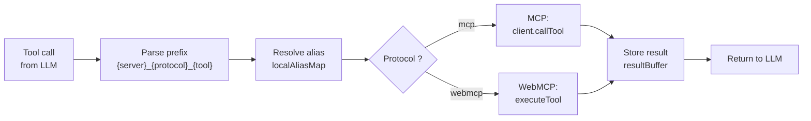

## Overview

**Tool calling** is the process by which the agent LLM calls tools to accomplish tasks. WebMCP Auto-UI provides a unified system for dispatching tools from heterogeneous sources (MCP, WebMCP) with alias resolution and lazy loading.

## Tool Nomenclature

All tools are prefixed according to their source:

```
{serverName}_{protocol}_{toolName}
```

**Examples**:
- `recipes_mcp_search_recipes` → MCP server "recipes", tool "search_recipes"
- `db_mcp_query_users` → MCP server "db", tool "query_users"
- `autoui_webmcp_widget_display` → WebMCP server "autoui", tool "widget_display"

**Server name sanitization**:
- Lowercase
- Replace invalid characters with `_`
- Remove double `_`
- Fallback : `"mcp"` if empty

## Dispatch Pipeline



### Step 1: Prefix Parsing

```typescript
const match = block.name.match(/^(.+?)_(mcp|webmcp)_(.+)$/);
if (!match) {
  return `Error: unknown tool format "${name}".`;
}
const [, serverName, protocol, realToolName] = match;
```

### Step 2: Alias Resolution

Agent maintains a **local alias map** to map canonical names to real names:

```typescript
const localAliasMap = new Map<string, string>();

// Example:
// localAliasMap.set('myserver_mcp_search_recipes', 'myserver_mcp_list_all_recipes')
// localAliasMap.set('myserver_mcp_get_recipe', 'myserver_mcp_fetch_recipe')

const resolvedName = localAliasMap.get(name) ?? name;
```

Why? Because different MCP servers use different names for similar concepts. Agent replaces canonical names with real names before dispatch.

### Step 3: Dispatch (MCP)

```typescript
if (protocol === 'mcp') {
  if (!client) {
    result = `Error: no MCP client available`;
  } else {
    const mcpResult = await client.callTool(realToolName, block.input);
    const textContent = mcpResult.content?.find(c => c.type === 'text');
    result = textContent?.text ?? JSON.stringify(mcpResult);
  }
}
```

### Step 4: Dispatch (WebMCP)

```typescript
if (protocol === 'webmcp') {
  // Special interception for recall
  if (realToolName === 'recall' && resultBuffer.size > 0) {
    const recallId = (block.input as { id: string }).id;
    result = resultBuffer.get(recallId) ?? `No result for '${recallId}'.`;
  } else {
    const webmcpServer = webmcpServers.get(serverName);
    if (!webmcpServer) {
      result = `Error: no WebMCP server "${serverName}" found.`;
    } else {
      const toolResult = await webmcpServer.executeTool(realToolName, block.input);
      result = typeof toolResult === 'string' ? toolResult : JSON.stringify(toolResult);

      // Special handling for widget_display
      if (realToolName === 'widget_display' && toolResult?.widget && !toolResult?.error) {
        callbacks.onWidget?.(toolResult.widget, toolResult.data);
      }
    }
  }
}
```

### Step 5: Storage and Compression

Results are stored for future recall and compressed to save context:

```typescript
resultBuffer.set(block.id, result); // Full storage

// Compression after iteration
function compressOldToolResults(messages: ChatMessage[], resultBuffer?: Map<string, string>): void {
  for (let i = 0; i < messages.length - 2; i++) {
    for (const block of messages[i].content) {
      if (block.type === 'tool_result' && block.content.length > 300) {
        const preview = block.content.slice(0, 200);
        block.content = `${preview}... [recall('${block.tool_use_id}') for full]`;
      }
    }
  }
}
```

## Tool Layers and Canonical Resolution

A **tool layer** describes a tool source:

```typescript
interface ToolLayer {
  protocol: 'mcp' | 'webmcp';
  serverName: string;
  description?: string;
  tools: McpToolDef[] | WebMcpToolDef[];
}
```

### Building Layers

**Example**:

```typescript
const layers = [
  {
    protocol: 'mcp',
    serverName: 'recipes',
    tools: [
      { name: 'search_recipes', description: 'Search for recipes...' },
      { name: 'get_recipe', description: 'Get recipe details...' },
      // ...
    ],
  },
  {
    protocol: 'webmcp',
    serverName: 'autoui',
    tools: [
      { name: 'widget_display', ... },
      { name: 'canvas', ... },
    ],
  },
];
```

### 4-Layer Resolution

When an MCP server exposes tools that resemble recipes, agent **normalizes** them under canonical names `search_recipes` and `get_recipe` via a 4-layer process:

#### Layer 1: Exact Match

```typescript
if (tool.name === 'search_recipes') {
  found.set('search_recipes', { role: 'search_recipes', realToolName: tool.name });
}
```

#### Layer 2: Name + Resource Decomposition

Tokenize name, search for an (action, resource) pair:

```typescript
const tokens = tokenize('list_recipes'); // ['list', 'recipes']
for (const a of tokens) {
  for (const r of tokens) {
    const role = matchRole(a, r);
    // matchRole('list', 'recipes') → 'search_recipes'
  }
}
```

Search actions: `search`, `list`, `find`, `browse`, `discover`, `query`, `explore`
Get actions: `get`, `read`, `fetch`, `show`, `describe`, `detail`, `view`, `load`

Resources: `recipe`, `skill`, `template`, `prompt`, `workflow`, `playbook`, `pattern`, `example`

#### Layer 3: Description Scan

If name doesn't match, scan description for keywords:

```typescript
if (description.toLowerCase().includes('recipe') || 
    description.includes('workflow')) {
  // Identify as recipe tool
}
```

#### Layer 4: Fallback

If no recipe tool found, list raw tools from server in system prompt.

### Concrete Example

Consider MCP server "cookbook" with tools:

```json
[
  {
    "name": "list_all_recipes",
    "description": "Fetch all available recipes from the cookbook"
  },
  {
    "name": "fetch_recipe",
    "description": "Get the full details of a specific recipe"
  }
]
```

**Resolution**:
1. Layer 1: No exact match
2. Layer 2:
   - `list_all_recipes` → tokens `['list', 'all', 'recipes']` → pair `(list, recipes)` → `search_recipes` ✓
   - `fetch_recipe` → tokens `['fetch', 'recipe']` → pair `(fetch, recipe)` → `get_recipe` ✓
3. **Alias map created**:
   ```typescript
   aliasMap.set('cookbook_mcp_search_recipes', 'cookbook_mcp_list_all_recipes');
   aliasMap.set('cookbook_mcp_get_recipe', 'cookbook_mcp_fetch_recipe');
   ```

Agent then uses canonical names in prompt, but resolves via this map at dispatch.

## System Prompt and Discovery

### Discovery Phase

At startup, agent only has access to **discovery tools**:

```typescript
const disc = buildDiscoveryToolsWithAliases(layers);
activeTools = disc.tools;
```

Tools included:
- `{server}_mcp_search_recipes` (if detected)
- `{server}_mcp_get_recipe` (if detected)
- `{server}_webmcp_widget_display`
- `{server}_webmcp_canvas`
- `{server}_webmcp_recall`

### Lazy Activation

When agent calls a tool for the first time, all tools from that server are activated:

```typescript
const activateMatch = block.name.match(/^(.+?)_(mcp|webmcp)_(.+)$/);
if (activateMatch) {
  const [, serverName, protocol] = activateMatch;
  const serverKey = `${serverName}_${protocol}`;
  if (!activatedServers.has(serverKey)) {
    activatedServers.add(serverKey);
    const layer = layers.find(l => l.serverName === serverName && l.protocol === protocol);
    if (layer) {
      activeTools = activateServerTools(activeTools, layer);
    }
  }
}
```

**Benefit**: Limits initial prompt size, activates tools on demand.

### System Prompt

System prompt includes:

1. **Business instructions**: How to proceed (steps 1-4)
2. **Tool enumeration**:
   ```
   Discovery: {server}_mcp_search_recipes(), {server}_mcp_get_recipe()
   Action: {server}_webmcp_widget_display(), {server}_webmcp_canvas()
   ```
3. **Fallback raw servers**: If no recipes found
4. **Error handling**: Retry tools with corrected schema

See `buildSystemPromptWithAliases()` for exact generation.

## Callbacks and UI Integration

### Available Callbacks

```typescript
interface AgentCallbacks {
  onIterationStart?: (iteration: number, maxIterations: number) => void;
  onLLMRequest?: (messages: ChatMessage[], tools: ProviderTool[]) => void;
  onLLMResponse?: (response: LLMResponse, latencyMs: number, tokens?: {...}) => void;
  onToolCall?: (call: ToolCall) => void;
  onWidget?: (type: string, data: Record<string, unknown>) => { id: string } | void;
  onText?: (text: string) => void;
  onToken?: (token: string) => void;
  onDone?: (metrics: AgentMetrics) => void;
  // Canvas mutation tools
  onClear?: () => void;
  onUpdate?: (id: string, data: Record<string, unknown>) => void;
  onMove?: (id: string, x: number, y: number) => void;
  onResize?: (id: string, w: number, h: number) => void;
  onStyle?: (id: string, styles: Record<string, string>) => void;
}
```

### Complete Example

```typescript
const result = await runAgentLoop(userMessage, {
  provider,
  layers,
  callbacks: {
    onToken: (token) => {
      // Direct streaming
      console.log(token);
    },
    onWidget: (type, data) => {
      // A widget was displayed
      canvas.addWidget(type, data);
      return { id: canvas.blocks[canvas.blocks.length - 1].id };
    },
    onToolCall: (call) => {
      console.log(`✓ ${call.name} → ${call.result}`);
    },
    onDone: (metrics) => {
      console.log(`Agent done: ${metrics.totalTokens} tokens, ${metrics.iterations} iterations`);
    },
  },
});
```

## Error Handling

### Schema Validation

All widget inputs are validated:

```typescript
const validation = validateJsonSchema(params, widget.inputSchema);
if (!validation.valid) {
  return {
    error: 'Validation failed',
    details: validation.errors,
    expected_schema: widget.inputSchema,
  };
}
```

Agent receives expected schema and can correct its call.

### Result Truncation

Long results are truncated to save context:

```typescript
function truncateResult(result: string, maxLen: number = 10_000): string {
  if (result.length <= maxLen) return result;
  
  // Try to slice a JSON array intelligently
  try {
    const parsed = JSON.parse(result);
    if (Array.isArray(parsed)) {
      let sliced = parsed;
      while (JSON.stringify(sliced).length > maxLen && sliced.length > 1) {
        sliced = sliced.slice(0, Math.ceil(sliced.length / 2));
      }
      return JSON.stringify(sliced) + `\n... (truncated, ${parsed.length} items total)`;
    }
  } catch { /* not JSON */ }
  
  return result.slice(0, maxLen) + '\n... (truncated)';
}
```

## Recall and Persistence

### Result Buffer

Each iteration stores its results in a map:

```typescript
const resultBuffer = new Map<string, string>();

// In loop
resultBuffer.set(block.id, result); // Full storage

// Compression
const preview = result.slice(0, 200);
block.content = `${preview}... [recall('${block.id}') for full]`;
```

### Recall Tool

When agent calls `recall(id)`, full result is retrieved:

```typescript
if (realToolName === 'recall' && resultBuffer.size > 0) {
  const recallId = (block.input as { id: string }).id;
  result = resultBuffer.get(recallId) ?? `No result for '${recallId}'.`;
}
```

Useful for inspecting old results without replaying tool.
