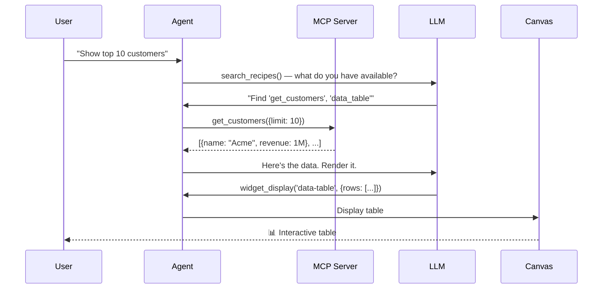

## About

**WebMCP Auto-UI** is a complete automatic generation and orchestration system for user interfaces by AI agents using the **Model Context Protocol (MCP)**.

The project combines three pillars:

1. **Agent Loop** — An iterative LLM loop that calls MCP tools to discover and execute recipes
2. **Tool Layers** — A system of normalized component layers (MCP, WebMCP) with alias resolution and lazy loading
3. **Canvas & Widgets** — Multi-framework reactive interface rendering with vanilla and Svelte/React/Vue/Astro support

### Vision

Users ask natural language questions. The agent:
- 🔍 **Discovers** available tools via MCP
- 🎯 **Selects** the best recipe/widget
- ⚙️ **Executes** necessary operations
- 🎨 **Displays** results in contextual UI

All without manual code — interfaces are generated from **JSON schemas and Markdown recipes**.

## Project Structure

```
packages/
  ├── core/              # WebMCP types, validation, streamable HTTP MCP client
  ├── agent/             # Agent loop, tool layers, autoui server
  ├── ui/                # Svelte components (WidgetRenderer, primitives)
  ├── sdk/               # Canvas store, HyperSkill encoding
  └── widgets-*/         # Specialized widget packs (D3, Three.js, Leaflet, etc.)

apps/
  ├── flex/              # SvelteKit demo (chat mode)
  ├── viewer/            # SvelteKit viewer (skill loading)
  ├── home/              # Astro static homepage
  ├── multi-*/           # Multi-framework showcases (Astro, React, Vue, WebComponents)
  └── ...
```

## Key Concepts

### MCP (Model Context Protocol)
Standardized protocol for exposing **tools** (functions serialized in JSON Schema) that LLMs can call.

- **MCP Server** : exposes tools (e.g. database, API, computation)
- **MCP Client** : queries the server, executes tools
- **Format** : JSON-RPC over streamable HTTP (no polling)

### WebMCP
Local extension of MCP for the **presentation layer** :
- Registers **widgets** (UI components) with input schemas
- Provides **action tools** : `widget_display()`, `canvas()`, `recall()`
- Rendered by Svelte (native) or vanilla JavaScript

### Tool Layers
Unified abstraction for tools from multiple sources:

```typescript
interface ToolLayer {
  protocol: 'mcp' | 'webmcp';
  serverName: string;
  tools: McpToolDef[] | WebMcpToolDef[];
}
```

Tools are prefixed: `{serverName}_{protocol}_{toolName}` to avoid collisions.

### Agent Loop
LLM iteration loop:

```
LLM.chat(messages, tools) → {text, tool_calls}
  ↓
FOR each tool_call:
  dispatch(tool_call) → result
  store_result(resultBuffer)
  add_to_history()
↓
COMPRESS old results to save context
↓
(repeat until end_turn or max_iterations)
```

### Recipes
Markdown document with YAML frontmatter describing a widget:

```markdown
---
widget: stat
description: Key statistic (KPI)
schema:
  type: object
  required: [label, value]
  properties:
    label: { type: string }
    value: { type: string }
---

## When to use
To display a key number (KPI, total, counter).

## How
Call widget_display('stat', {label: "Total", value: "42"}).
```

## Typical User Flow



## Multi-Framework Integration

The project supports multiple renderers:

- **Svelte** (`@webmcp-auto-ui/ui`) : `<WidgetRenderer>` with all native widgets
- **Vanilla JS** (`@webmcp-auto-ui/core`) : `mountWidget()` for direct DOM mounting
- **Widget Packs** : D3, Three.js, Leaflet, Plotly, Mermaid, Mapbox, etc. registered dynamically
- **Astro, React, Vue, Web Components** : integration via `multi-*` showcases

## Quick Start

See [Getting Started](/guide/getting-started/) to install and launch your first demo.

## Documentation

- **[Architecture](/guide/architecture/)** — Detailed system diagrams
- **[Tool Calling](/guide/tool-calling/)** — Tool dispatch mechanics and alias resolution
- **[Deployment](/guide/deploy/)** — Deployment scripts and paths
