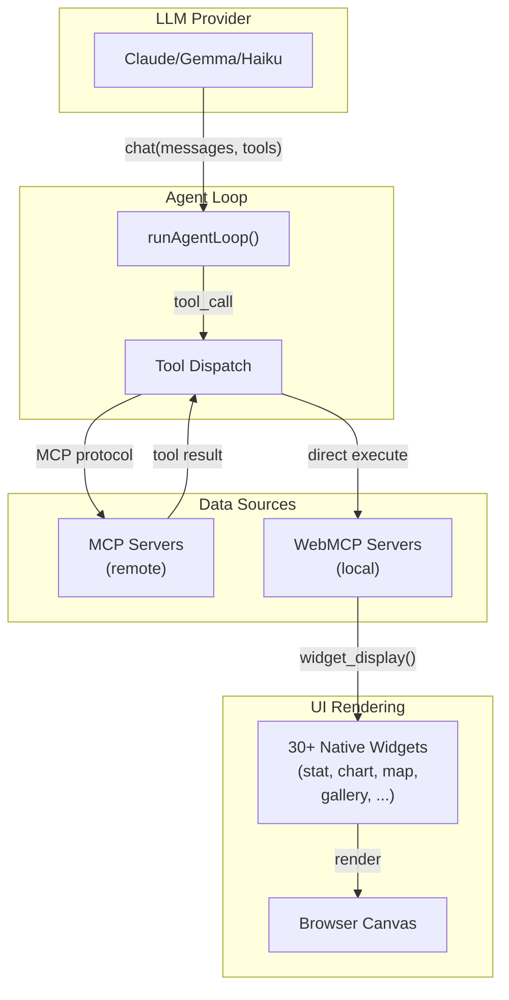

## Welcome

**WebMCP Auto-UI** is a full-stack framework that enables AI agents (Claude, Gemma, etc.) to **automatically generate user interfaces** by calling tools via [Model Context Protocol (MCP)](https://modelcontextprotocol.io).

Instead of returning raw text or JSON, an agent can call `widget_display('chart', {...})` to display an interactive chart. MCP tools (databases, APIs, calculations) are exposed to the agent via a unified abstraction layer.

### Use cases

- **Dynamically generated dashboards** : An agent explores a database and generates visualizations without manual rendering code
- **Interactive data explorers** : List, filter, display results as charts, tables, maps
- **Automated workflows** : Orchestrate MCP tools + UI display in an agent loop
- **Rapid prototyping** : Design skills (workflows) in JSON, execute them instantly

### Schematic architecture

### Key points

1. **Bidirectional** : Agents call tools (MCP), tools return data that agents format for widgets
2. **Lazy loading** : Tools discovered progressively — system starts with `search_recipes`, `list_recipes`, then activates servers on demand
3. **Recipe system** : Each widget has a recipe (documentation + JSON schema) that agents use to generate correct calls
4. **Framework-agnostic** : Svelte, vanilla JS, or React component rendering — logic stays the same
5. **Context compression** : Old tool results are truncated after use to save tokens

### Key components

| Component | Role |
|-----------|------|
| `@webmcp-auto-ui/core` | WebMCP polyfill, MCP client, WebMCP server |
| `@webmcp-auto-ui/agent` | Agent loop, tool layers, system prompt builder |
| `@webmcp-auto-ui/ui` | 30+ Svelte widgets, dispatcher, SafeImage |
| `@webmcp-auto-ui/sdk` | Canvas store, HyperSkill encoding, registry |

### Getting started

See **[Getting Started](./guide/getting-started)** for 5-minute installation.

Next, consult **[Architecture](./guide/architecture)** to understand how components fit together.
