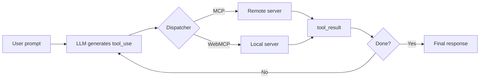

import { Card, CardGrid, LinkCard } from '@astrojs/starlight/components';

WebMCP Auto-UI is a platform for automatic user interface generation driven by AI agents. It brings together the **Model Context Protocol (MCP)** for data integration, an **LLM agent engine** for orchestration, and a **declarative widget system** for client-side rendering.

In short: you describe what you want in natural language, and the agent builds the interface for you -- widgets, data, layout, everything.

## Quick Start

Five lines are all you need to launch your first agent:

```bash
npx degit jeanbaptiste/webmcp-auto-ui/apps/boilerplate my-app
cd my-app
npm install
npm run dev
# Open http://localhost:5173 — type a prompt in the chat
```

The agent receives your message, picks the right widgets, calls the necessary tools, and builds the interface on the canvas in real time.

## Overview


The diagram above shows the three fundamental layers of the system:

1. **The LLM agent** (Claude or Gemma) receives a user prompt and decides which tools to call.
2. **The dispatcher** routes each call to the right server -- remote MCP (data, APIs) or local WebMCP (widgets, UI actions).
3. **The reactive canvas** displays the generated widgets and lets the agent reposition, resize, and update them.

## Why WebMCP Auto-UI?

Traditional interfaces are hand-coded: one component per screen, routes, state management. WebMCP Auto-UI flips this model.

| Traditional Approach | With WebMCP Auto-UI |
|---------------------|---------------------|
| Designer + developer code each screen | Agent generates the interface from a prompt |
| Adding a widget = PR + review + deploy | Adding a widget = a markdown recipe |
| API connection = custom code per endpoint | MCP connection = declarative hookup |
| Fixed layout | Reactive canvas, rearrangeable by the agent |

:::tip[No compromise on control]
The agent does not replace the developer. It amplifies productivity by generating repetitive interfaces. The recipe system and JSON Schema validation ensure every widget honors a strict contract.
:::

## Key Features

- **Autonomous agents**: Native agentic loop supporting Claude (API), Gemma 4 (LiteRT in-browser), and Ollama (local)
- **Multi-protocol tool calling**: Transparent dispatch to MCP (network protocol) and WebMCP (local)
- **30+ native widgets**: Stat, chart, timeline, map, gallery, hemicycle, Sankey, D3, JS sandbox...
- **Lazy loading**: Load tools on demand to optimize LLM context
- **Skill serialization**: Export/import via HyperSkills with gzip compression -- a full canvas fits in a URL
- **Reactive canvas**: Svelte 5 (runes) rendering with FONC message bus for inter-component communication
- **Nano-RAG**: Context compaction via embeddings for long conversations

## Key Concepts

### 1. Tool Layers

Tools are organized into **structured layers** so the agent knows where to route each call:

- **MCP Layers**: Remote MCP servers (data, external APIs). Communication via SSE (Server-Sent Events).
- **WebMCP Layers**: Local servers running in the browser (widgets, UI actions, storage).

Each tool gets a canonical prefix that encodes its origin: `{serverName}_{protocol}_{toolName}`. For example, `weather_mcp_get_forecast` refers to the `get_forecast` tool on the `weather` server, accessible via the MCP protocol.

### 2. Agent Loop

The agent runs an iterative loop until `end_turn` (the LLM decides it is done) or `max_iterations` (safety guard):



At each iteration, the agent can call multiple tools in parallel, receive results, and decide what to do next. Automatic compression of older results (`recall`) prevents the context window from filling up.

### 3. Widget Discovery (Lazy Discovery)

On startup, the agent only knows about **discovery tools** -- a lightweight catalog:

- `search_recipes(query)`: Search for a recipe by keyword
- `list_recipes()`: List all available recipes
- `get_recipe(name)`: Load a full recipe with its schema
- `search_tools(query)` / `list_tools()`: Explore available tools

When the agent calls a real tool for the first time, the server **activates** and all its tools become available. This mechanism saves LLM context: instead of loading hundreds of tools at startup, only those actually needed are activated.

### 4. HyperSkills (Serialization)

Canvases are exported as **skills** in JSON, compressed into short URLs via gzip/Brotli:

```typescript
import { encodeHyperSkill, decodeHyperSkill } from '@webmcp-auto-ui/sdk';

// Export a canvas to a shareable URL
const url = await encodeHyperSkill(skill, window.location.href);
// → "https://demos.hyperskills.net/?hs=eJy0kc9qwzAMxu..."

// Restore a canvas from a URL
const restored = await decodeHyperSkill(url);
```

An entire canvas -- widgets, data, layout, chat history -- fits in a single URL. Perfect for sharing and collaboration.

## Packages

The monorepo is organized into four packages, each with a clear responsibility:

| Package | Responsibility | Key Exports |
|---------|---------------|-------------|
| `@webmcp-auto-ui/core` | WebMCP types, polyfill, MCP client, JSON Schema validation | `McpClient`, `createWebMcpServer`, `validateJsonSchema`, `McpMultiClient` |
| `@webmcp-auto-ui/agent` | Agent loop, LLM providers, tool layers, recipes, Nano-RAG | `runAgentLoop`, `RemoteLLMProvider`, `WasmProvider`, `autoui` |
| `@webmcp-auto-ui/ui` | Svelte components (30+ widgets), theme, message bus, agent UI | `WidgetRenderer`, `LLMSelector`, `ChatPanel`, `bus` |
| `@webmcp-auto-ui/sdk` | HyperSkills, skills registry, canvas store | `encode`, `decode`, `createSkill`, `listSkills` |

:::note[Framework-agnostic architecture]
`core` and `agent` are pure TypeScript -- no Svelte dependency. They can be used with any framework (React, Vue, vanilla JS) via the `mountWidget()` function in core.
:::

## Tech Stack

- **Frontend framework**: Svelte 5 (runes) with SvelteKit for server apps
- **Styling**: UnoCSS with dark/light themes and semantic tokens
- **LLM**: Anthropic Claude (API via proxy), Google Gemma 4 (LiteRT, in-browser), Ollama (local)
- **Schema**: JSON Schema for agent-side validation of every widget
- **Communication**: postMessage bridge for cross-document WebMCP
- **Testing**: Vitest (unit) + Playwright (e2e on deployed apps)

## Use Cases

### Data Explorers
The agent connects to an MCP server (database, REST API), browses the available data, and builds charts and tables to visualize it.

### Smart Dashboards
From a prompt like *"Show this week's KPIs"*, the agent collects metrics, picks the right widgets (stat-card, chart, timeline), and composes a dashboard.

### Creative Assistants
The LLM generates text and visual content, then auto-arranges it in a grid, carousel, or gallery on the canvas.

### Interactive Configurators
The agent guides the user through dynamically generated forms, validates responses, and adapts subsequent steps.

### Skill Sharing
A finished canvas exports to a short URL. A colleague opens the link, and the canvas restores identically -- widgets, data, theme, everything.

## Next Steps

<CardGrid stagger>
  <LinkCard title="Getting Started" href="./guide/getting-started" description="From git clone to your first working agent in 5 minutes" />
  <LinkCard title="Architecture" href="./guide/architecture" description="Agent loop, tool layers, reactive canvas and widget registry" />
  <LinkCard title="Tool Calling" href="./guide/tool-calling" description="How tools are called, routed, and executed" />
  <LinkCard title="Deployment" href="./guide/deploy" description="Production deployment with deploy.sh" />
  <LinkCard title="Contributing" href="./guide/contributing" description="Patterns, pitfalls, and contribution workflow" />
</CardGrid>
