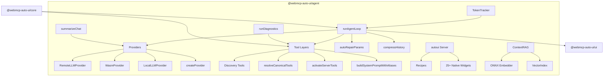
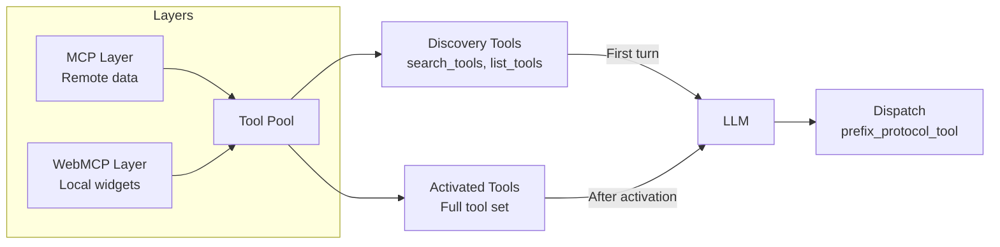
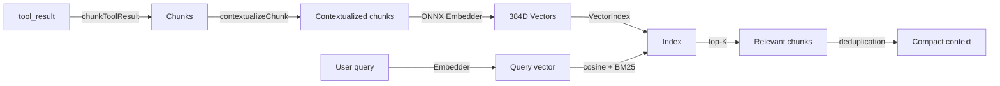

The `@webmcp-auto-ui/agent` package is the brain of the platform. It orchestrates the LLM agent loop (prompt, tool call, result, prompt), manages providers (remote LLM via any OpenAI-compatible API, in-browser Gemma WASM, local Ollama), structures tools into layers with lazy loading, and provides a built-in WebMCP server (`autoui`) with over 25 native widgets.

This is the largest package in the monorepo and the one that ties everything together.

## Internal Architecture



## Installation

```ts
import { runAgentLoop, RemoteLLMProvider, autoui } from '@webmcp-auto-ui/agent';
```

In an app's `package.json`:

```json
{
  "devDependencies": {
    "@webmcp-auto-ui/agent": "file:../../packages/agent",
    "@webmcp-auto-ui/core": "file:../../packages/core"
  }
}
```

The package depends on `@webmcp-auto-ui/core` and optionally on `@huggingface/transformers` + `onnxruntime-web` for nano-RAG and embeddings.

---

## runAgentLoop

The central function. Runs an iterative loop: send a message to the LLM, receive a response (text or tool calls), execute the tools, send results back, until `end_turn` or `maxIterations`.

```ts
import { runAgentLoop } from '@webmcp-auto-ui/agent';

const result = await runAgentLoop('Show a Q1 sales chart', {
  provider: remoteLLMProvider,
  layers: toolLayers,
  maxIterations: 5,
  callbacks: {
    onToken: (token) => process.stdout.write(token),
    onToolCall: (call) => console.log('Tool:', call.name),
    onWidget: (type, data) => {
      console.log(`Widget: ${type}`, data);
      return { id: `w_${Date.now()}` };
    },
  },
});

console.log(result.text);           // Final response
console.log(result.toolCalls);      // All tool calls
console.log(result.metrics);        // Tokens, latency, iterations
console.log(result.stopReason);     // 'end_turn' | 'max_iterations'
```

### AgentLoopOptions

```ts
interface AgentLoopOptions {
  // Required
  provider: LLMProvider;              // LLM provider (Remote, Wasm, or Local)

  // MCP connection (optional if WebMCP only)
  client?: McpClient;

  // Tools
  layers?: ToolLayer[];               // Structured tool layers
  maxTools?: number;                  // Max tools per LLM call

  // Loop control
  maxIterations?: number;             // Max iterations (default: 5)
  signal?: AbortSignal;               // Cancellation

  // LLM parameters
  maxTokens?: number;
  temperature?: number;
  topK?: number;
  cacheEnabled?: boolean;             // Prompt caching (default: true)

  // Prompt
  systemPrompt?: string;              // Custom system prompt
  initialMessages?: ChatMessage[];    // Previous history

  // Context optimization
  truncateResults?: boolean;          // Truncate long results (default: true)
  compressHistory?: boolean;          // Compress old results (default: true)
  maxResultLength?: number;           // Max chars per result (default: 10000)

  // Streaming
  callbacks?: AgentCallbacks;
}
```

### AgentResult

```ts
interface AgentResult {
  text: string;                       // Final text response
  toolCalls: ToolCall[];              // Tool call history
  metrics: AgentMetrics;              // Global metrics
  stopReason: 'end_turn' | 'max_iterations';
  messages: ChatMessage[];            // Full conversation (useful for continuation)
}
```

### AgentCallbacks

Callbacks enable real-time streaming and event-driven reactions:

```ts
interface AgentCallbacks {
  // Lifecycle
  onIterationStart?: (iteration: number, maxIterations: number) => void;
  onDone?: (metrics: AgentMetrics) => void;

  // LLM
  onLLMRequest?: (messages: ChatMessage[], tools: ProviderTool[]) => void;
  onLLMResponse?: (response: LLMResponse, latencyMs: number, tokens?: { input: number; output: number }) => void;
  onToken?: (token: string) => void;       // Token-by-token streaming
  onText?: (text: string) => void;         // Complete text block

  // Tools
  onToolCall?: (call: ToolCall) => void;

  // Widgets
  onWidget?: (type: string, data: Record<string, unknown>) => { id: string } | void;
  onClear?: () => void;
  onUpdate?: (id: string, data: Record<string, unknown>) => void;
  onMove?: (id: string, x: number, y: number) => void;
  onResize?: (id: string, w: number, h: number) => void;
  onStyle?: (id: string, styles: Record<string, string>) => void;
}
```

:::tip[Streaming]
The `onToken` callback fires for each token generated, enabling progressive display. `onText` fires once with the complete text block after all tokens.
:::

### Internal mechanisms

**History compression**: after each iteration, old `tool_result` blocks are compressed to save context. Large results are truncated with a `recall('id')` hint so the LLM can retrieve them on demand.

**Result buffer**: every tool result is stored in an internal buffer. The `recall(id)` tool lets the LLM re-read a complete result that has been compressed.

**Auto-repair**: if the LLM generates invalid parameters (flat instead of nested, stringified JSON, missing fields), `autoRepairParams` attempts mechanical fixes before returning an error.

**Discovery tools**: on the first turn, the agent only sees discovery tools (`search_tools`, `list_tools`). When it activates a server, the full tool set is revealed (lazy loading).

---

## LLM Providers

All providers implement the `LLMProvider` interface:

```ts
interface LLMProvider {
  chat(
    messages: ChatMessage[],
    options: { tools?: ProviderTool[]; maxTokens?: number; temperature?: number; topK?: number; signal?: AbortSignal; cacheEnabled?: boolean; systemPrompt?: string }
  ): Promise<LLMResponse>;
}
```

### RemoteLLMProvider

Provider for any OpenAI-compatible remote LLM API (e.g. Claude/Anthropic, Gemini/Google, ChatGPT/OpenAI, Le Chat/Mistral, Qwen) via an HTTP proxy. The proxy (typically a SvelteKit `+server.ts`) adds the API key and relays requests to the provider.

```ts
import { RemoteLLMProvider } from '@webmcp-auto-ui/agent';

const provider = new RemoteLLMProvider({
  proxyUrl: '/api/chat',       // Proxy URL (required)
  model: 'sonnet',             // 'haiku' | 'sonnet' | 'opus' (default: 'haiku')
  apiKey: 'sk-...',            // Optional, injected into the body
});
```

Model identifiers resolve automatically:
- `'haiku'` resolves to `claude-haiku-4-5-20250414`
- `'sonnet'` resolves to `claude-sonnet-4-6-20250514`
- `'opus'` resolves to `claude-opus-4-6-20250514`

### WasmProvider

Gemma 4 LiteRT provider that runs the model directly in the browser via WASM, with no server required. The model runs on the **main thread** (no Web Worker) and natively supports the `<|tool_call|>` format for tool calls.

```ts
import { WasmProvider } from '@webmcp-auto-ui/agent';

const provider = new WasmProvider({
  model: 'gemma-e2b',       // 'gemma-e2b' (2B params) or 'gemma-e4b' (4B params)
  contextSize: 32768,        // Context size (default: 32768)
  onProgress: (progress, status, loadedBytes, totalBytes) => {
    console.log(`Loading: ${Math.round(progress * 100)}%`);
  },
  onStatusChange: (status) => {
    console.log(`Status: ${status}`);
    // 'idle' -> 'loading' -> 'ready' (or 'error')
  },
});

// Initialize the model (downloads weights ~200-400 MB)
await provider.initialize();
```

:::caution[Main thread]
Gemma runs on the main thread. During inference, the UI may momentarily freeze. For long tasks, use the remote LLM provider instead.
:::

### LocalLLMProvider

Provider for Ollama (local LLM via HTTP server).

```ts
import { LocalLLMProvider } from '@webmcp-auto-ui/agent';

const provider = new LocalLLMProvider({
  baseUrl: 'http://localhost:11434',
  model: 'mistral',
});
```

### createProvider (factory)

Instantiates the correct provider from a declarative config:

```ts
import { createProvider } from '@webmcp-auto-ui/agent';

const remote = createProvider({ type: 'remote', proxyUrl: '/api/chat', model: 'sonnet' });
const wasm = createProvider({ type: 'wasm', model: 'gemma-e2b' });
const local = createProvider({ type: 'local', baseUrl: 'http://localhost:11434', model: 'mistral' });
```

### Backward-compatibility aliases (deprecated)

```ts
import { AnthropicProvider } from '@webmcp-auto-ui/agent';  // = RemoteLLMProvider
import { GemmaProvider } from '@webmcp-auto-ui/agent';      // = WasmProvider
```

---

## Tool Layers

Tool layers structure tools into layers for lazy loading, system prompt injection, and alias resolution. This system lets the agent discover tools progressively without saturating the context.



### Layer types

```ts
type ToolLayer = McpLayer | WebMcpLayer;

interface McpLayer {
  protocol: 'mcp';
  serverName: string;
  description?: string;
  serverUrl?: string;
  tools: McpToolDef[];
  recipes?: McpRecipe[];
}

interface WebMcpLayer {
  protocol: 'webmcp';
  serverName: string;
  description: string;
  tools: WebMcpToolDef[];
}
```

### Tool naming convention

Tools are prefixed following the `{server}_{protocol}_{tool}` convention:
- `recipes_mcp_search_recipes` — `search_recipes` tool from the MCP server `recipes`
- `autoui_webmcp_widget_display` — `widget_display` tool from the WebMCP server `autoui`

### buildSystemPromptWithAliases

Generates the system prompt with tool listings, canonical aliases, and execution instructions.

```ts
import { buildSystemPromptWithAliases } from '@webmcp-auto-ui/agent';

const { prompt, aliasMap } = buildSystemPromptWithAliases(layers);
```

### buildDiscoveryToolsWithAliases

Builds the initial discovery tools. On the first turn, the agent only sees these tools — it must "activate" a server to see its full tool set.

```ts
import { buildDiscoveryToolsWithAliases } from '@webmcp-auto-ui/agent';

const { tools, aliasMap } = buildDiscoveryToolsWithAliases(layers);
```

### activateServerTools

Activates the full tools of a layer. Called when the agent discovers a server through discovery tools.

```ts
import { activateServerTools } from '@webmcp-auto-ui/agent';

const nextTools = activateServerTools(currentTools, layer);
```

### resolveCanonicalTools

Resolves MCP tools to canonical roles via a 4-layer matching system. This lets the prompt reference generic names (`search_recipes`, `list_recipes`, `get_recipe`) that map to the server's actual tool names.

```ts
import { resolveCanonicalTools } from '@webmcp-auto-ui/agent';

const matches = resolveCanonicalTools(mcpTools);
// CanonicalMatch[] { role, realToolName }
```

The 4 matching layers:

1. **Exact match** — tool name matches exactly (`search_recipes`)
2. **Decompose** — tokenize name and test all (action, resource) pairs
3. **Description keywords** — scan description for keywords (recipe, template, workflow)
4. **Fallback** — no match found

---

## Built-in WebMCP Server (autoui)

The package ships with a pre-configured WebMCP server featuring over 25 native widgets and 6 core tools.

```ts
import { autoui, NATIVE_WIDGET_NAMES } from '@webmcp-auto-ui/agent';

const layer = autoui.layer();
```

### Native widgets

| Widget | Description |
|--------|-------------|
| `stat` | Key statistic (label + value + trend) |
| `kv` | Key-value pairs |
| `list` | Item list |
| `chart` | Simple bar chart |
| `alert` | Alert (info, warning, error, success) |
| `code` | Syntax-highlighted code block |
| `text` | Markdown text |
| `actions` | Interactive action buttons |
| `tags` | Colored badges/tags |
| `stat-card` | Rich statistic card |
| `data-table` | Sortable data table |
| `timeline` | Event timeline |
| `profile` | User profile card |
| `trombinoscope` | Profile grid |
| `json-viewer` | Interactive JSON tree |
| `hemicycle` | Parliamentary hemicycle |
| `chart-rich` | Multi-series chart (bar, line, area, pie, donut) |
| `cards` | Card grid |
| `grid-data` | Data grid |
| `sankey` | Sankey diagram |
| `map` | Leaflet map with markers |
| `log` | Log viewer |
| `gallery` | Image gallery |
| `carousel` | Image/content carousel |
| `d3` | D3.js visualizations (treemap, force, heatmap, radial) |
| `js-sandbox` | JavaScript sandbox for custom visualizations |
| `recipe-browser` | Recipe browser |

### Native tools

```ts
// widget_display — display a widget on the canvas
await callTool('widget_display', { name: 'stat', params: { label: 'Revenue', value: '$42k' } });

// canvas — manipulate the canvas
await callTool('canvas', { action: 'clear' });
await callTool('canvas', { action: 'update', id: 'widget_123', params: { value: '$45k' } });
await callTool('canvas', { action: 'move', id: 'widget_123', x: 100, y: 200 });

// recall — replay a previous tool result
await callTool('recall', { id: 'toolu_abc123' });

// search_recipes / list_recipes / get_recipe — discover widgets
await callTool('search_recipes', { query: 'chart' });
```

---

## Recipes

Recipes are Markdown files with YAML frontmatter that document widgets for the agent. They are compiled at build time and injected into the system prompt.

### WEBMCP_RECIPES

Static array of all compiled recipes:

```ts
import { WEBMCP_RECIPES } from '@webmcp-auto-ui/agent';
console.log(WEBMCP_RECIPES.length);
```

### parseRecipe / parseRecipes

Parse Markdown files into `Recipe` objects:

```ts
import { parseRecipe, parseRecipes } from '@webmcp-auto-ui/agent';

const recipe = parseRecipe(markdownString);   // Recipe | null
const recipes = parseRecipes(markdownArray);  // Recipe[]
```

### recipeRegistry

Global registry with registration, filtering, and formatting:

```ts
import {
  registerRecipes,
  filterRecipesByServer,
  formatRecipesForPrompt,
  formatMcpRecipesForPrompt,
} from '@webmcp-auto-ui/agent';

registerRecipes(recipes);
const filtered = filterRecipesByServer(recipes, 'nasa');
const promptBlock = formatRecipesForPrompt(recipes);
```

---

## summarizeChat

Summarizes an agent conversation for HyperSkill export. Sends the history to the LLM for an anonymized 2-3 sentence summary.

```ts
import { summarizeChat } from '@webmcp-auto-ui/agent';

const result = await summarizeChat({
  messages: conversationHistory,
  provider: remoteLLMProvider,
  toolsUsed: ['widget_display', 'search_recipes'],
  toolCallCount: 5,
  mcpServers: ['nasa', 'hackernews'],
});

console.log(result.chatSummary);    // Anonymized text summary
console.log(result.provenance);     // Traceability object
```

The summary is automatically anonymized: names of people, companies, locations, and URLs are replaced with generic terms.

---

## Token Tracker

Tracks tokens and latency in real time with 60-second rolling rates.

```ts
import { TokenTracker } from '@webmcp-auto-ui/agent';

const tracker = new TokenTracker();

tracker.record(
  { input_tokens: 1500, output_tokens: 200, cache_read_input_tokens: 800 },
  1200  // latency in ms
);

const m = tracker.metrics;
console.log(`Total: ${m.totalInputTokens} in / ${m.totalOutputTokens} out`);
console.log(`Rate: ${m.requestsPerMin} req/min`);
console.log(`Cache: ${m.totalCachedGB.toFixed(3)} GB read from cache`);

const unsubscribe = tracker.subscribe((metrics) => updateUI(metrics));
```

```ts
interface TokenMetrics {
  totalRequests: number;
  totalInputTokens: number;
  totalOutputTokens: number;
  totalCacheReadTokens: number;
  requestsPerMin: number;
  inputTokensPerMin: number;
  outputTokensPerMin: number;
  lastInputTokens: number;
  lastOutputTokens: number;
  lastCacheReadTokens: number;
  lastLatencyMs: number;
  totalCachedGB: number;
  isWasm: boolean;
}
```

---

## Nano-RAG (context compaction)

The nano-RAG module compresses agent context by chunking tool results, embedding them via ONNX (`all-MiniLM-L6-v2`), and retrieving only the relevant chunks before each LLM call.



### ContextRAG

```ts
import { ContextRAG } from '@webmcp-auto-ui/agent';

const rag = new ContextRAG({
  topK: 5,              // Chunks to retrieve per query (default: 5)
  maxChunkSize: 300,    // Max chunk size in chars (default: 300)
  enabled: true,
  onProgress: (status, loaded, total) => console.log(`Embedder: ${status}`),
});

await rag.initialize();
await rag.ingest('toolu_123', toolResultText);
const context = await rag.query('revenue Q1');
```

Uses hybrid embeddings + BM25 retrieval with Jaccard deduplication and LRU eviction.

---

## Diagnostics

Analyzes layers, schemas, and prompts to detect potential issues.

```ts
import { runDiagnostics } from '@webmcp-auto-ui/agent';

const diagnostics = runDiagnostics(layers, tools, systemPrompt);
diagnostics.forEach(d => {
  console.log(`[${d.severity}] ${d.title}: ${d.detail}`);
});
```

```ts
interface Diagnostic {
  severity: 'error' | 'warning';
  title: string;
  detail: string;
  quickFix?: string;
  codeFix?: string;
}
```

---

## Auto-Repair

Automatically repairs tool call parameters when the LLM generates incorrect structures.

```ts
import { autoRepairParams } from '@webmcp-auto-ui/agent';

const { params, fixes } = autoRepairParams(rawInput, toolSchema, toolName);
if (fixes.length > 0) console.log('Repairs applied:', fixes);
```

Supported repairs:
- **Flat to nested**: `{name, key1, key2}` becomes `{name, params: {key1, key2}}`
- **String to object**: stringified JSON is parsed automatically
- **Missing fields**: required fields get default values when possible

---

## Utilities

### toProviderTools / fromMcpTools

```ts
import { toProviderTools, fromMcpTools } from '@webmcp-auto-ui/agent';

const providerTools = toProviderTools(mcpTools);  // McpToolDef[] -> ProviderTool[]
const toolDefs = fromMcpTools(tools);             // McpTool[] -> McpToolDef[]
```

### trimConversationHistory

```ts
import { trimConversationHistory } from '@webmcp-auto-ui/agent';

const trimmed = trimConversationHistory(messages, 4096);
```

---

## Types

### Messages and content

```ts
interface ChatMessage {
  role: 'user' | 'assistant' | 'system';
  content: string | ContentBlock[];
}

type ContentBlock =
  | { type: 'text'; text: string }
  | { type: 'tool_use'; id: string; name: string; input: Record<string, unknown> }
  | { type: 'tool_result'; tool_use_id: string; content: string };

interface LLMResponse {
  content: ContentBlock[];
  stopReason: string;
  usage?: { input_tokens: number; output_tokens: number; cache_read_input_tokens?: number };
}
```

### Tools and metrics

```ts
interface ToolCall {
  id: string;
  name: string;
  args: Record<string, unknown>;
  result?: string;
  error?: string;
  elapsed?: number;
  guided?: boolean;    // Preceded by a discovery tool
}

interface AgentMetrics {
  totalTokens: number;
  promptTokens: number;
  completionTokens: number;
  totalLatencyMs: number;
  toolCalls: number;
  iterations: number;
  cacheHits: number;
}
```

### Models

```ts
type RemoteModelId = 'haiku' | 'sonnet' | 'opus';
type WasmModelId = 'gemma-e2b' | 'gemma-e4b';
type LLMId = RemoteModelId | WasmModelId;
type ModelId = LLMId | string;  // Includes Ollama models
```

---

## Tutorial: Full Agent with MCP + WebMCP

### Step 1: Set up providers and clients

```ts
import { runAgentLoop, RemoteLLMProvider, autoui } from '@webmcp-auto-ui/agent';
import { McpClient } from '@webmcp-auto-ui/core';

const provider = new RemoteLLMProvider({ proxyUrl: '/api/chat', model: 'sonnet' });
const client = new McpClient('https://mcp.example.com/mcp');
await client.connect();
```

### Step 2: Build layers

```ts
const layers = [
  {
    protocol: 'mcp' as const,
    serverName: 'data-api',
    description: 'Data API: users, sales, metrics',
    tools: await client.listTools(),
  },
  autoui.layer(),
];
```

### Step 3: Run the loop with callbacks

```ts
const result = await runAgentLoop('Show me quarterly sales in a chart', {
  client,
  provider,
  layers,
  maxIterations: 5,
  callbacks: {
    onIterationStart: (i, max) => console.log(`--- Iteration ${i}/${max} ---`),
    onToken: (token) => process.stdout.write(token),
    onToolCall: (call) => console.log(`[Tool] ${call.name}`),
    onWidget: (type, data) => {
      console.log(`[Widget] ${type}`);
      return { id: `w_${Date.now()}` };
    },
    onDone: (metrics) => console.log(`Done: ${metrics.totalTokens} tokens`),
  },
});
```

### Typical flow

1. Agent receives the user message
2. Calls `search_tools` or `list_tools` to discover tools
3. Activates the `data-api` MCP server (lazy loading)
4. Calls the MCP tool to fetch sales data
5. Calls `widget_display` with `chart-rich` to display the chart
6. Responds with a summary

---

## Best Practices

:::tip[Limit iterations]
Keep `maxIterations` between 3 and 8. Beyond that, the agent may loop endlessly. If it consistently hits the limit, the system prompt likely needs tuning.
:::

:::tip[Prompt caching]
Caching (`cacheEnabled: true` by default) reduces costs by 90% by avoiding re-sending the system prompt on every request. Leave it enabled except for debugging.
:::

:::caution[Result size]
`truncateResults` and `compressHistory` are active by default. Disabling them risks exceeding the LLM's context window. For large results (>10k chars), use the `recall` tool rather than keeping everything in context.
:::

:::caution[Tool schemas]
Some MCP servers expose schemas with `$ref`, `oneOf`, or `anyOf` that certain LLM APIs don't support. Sanitization is enabled by default (`sanitize: true`), but check with `runDiagnostics` if you encounter schema errors.
:::

---

## FAQ

**What's the difference between RemoteLLMProvider and WasmProvider?**
Remote sends requests to a cloud LLM API (e.g. Claude, Gemini, ChatGPT) via an HTTP proxy. Wasm downloads and runs the Gemma model directly in the browser with no server. Remote is more powerful but paid; Wasm is free but slower and less capable.

**How does the agent know which widget to use?**
Recipes injected into the system prompt describe each widget (name, description, parameter schema, use cases). The agent picks the best match for the data it wants to display.

**Is nano-RAG enabled by default?**
No. You need to explicitly create a `ContextRAG` instance. Nano-RAG is most useful for long conversations with many large tool results.

**Can I use an Ollama model with widgets?**
Yes, but Ollama models are generally less effective than large remote models (e.g. Claude, Gemini) for tool calls. Test with `runDiagnostics` to verify schema compatibility.

**How does auto-repair work?**
When the LLM generates invalid parameters (flat object, stringified JSON, missing fields), `autoRepairParams` attempts mechanical fixes before returning an error. This significantly improves tool call success rates, especially with local models.
