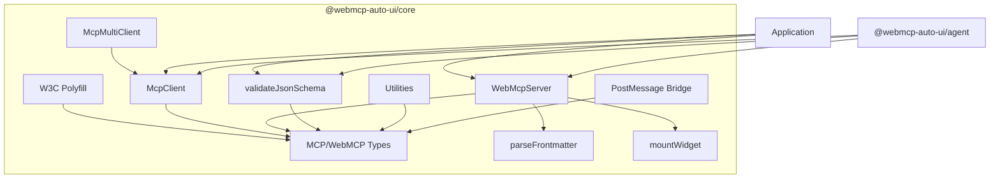
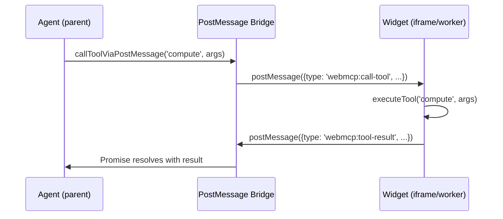

The `@webmcp-auto-ui/core` package is the technical foundation of the entire WebMCP Auto-UI platform. It provides four key capabilities: a **W3C WebMCP polyfill** (conforming to the Draft CG Report 2026-03-27), a **Streamable HTTP MCP client**, a **WebMCP server** for exposing widgets and tools, and a **JSON Schema validator** with zero external dependencies.

Zero dependencies. Framework-agnostic. Works on both server and client.

## Internal Architecture



## Installation

The package is part of the monorepo. In an app within the project:

```ts
import { McpClient, createWebMcpServer, validateJsonSchema } from '@webmcp-auto-ui/core';
```

In an app's `package.json`:

```json
{
  "devDependencies": {
    "@webmcp-auto-ui/core": "file:../../packages/core"
  }
}
```

---

## W3C WebMCP Polyfill

The polyfill implements all 17 mandatory features of the W3C WebMCP Draft CG Report (2026-03-27). It installs `navigator.modelContext` in browsers that don't natively support it, making MCP tools accessible through a standardized API.

### The "MCP polyfill" concept

The idea is straightforward: browsers don't yet implement the Model Context Protocol natively. The polyfill intercepts calls to `navigator.modelContext` and routes them to a JavaScript implementation that handles tool registration, schema validation, and communication with LLM agents.

### initializeWebMCPPolyfill

Installs the polyfill on `navigator.modelContext`.

```ts
import { initializeWebMCPPolyfill, cleanupWebMCPPolyfill, hasNativeWebMCP } from '@webmcp-auto-ui/core';

// Check if the browser supports WebMCP natively
if (!hasNativeWebMCP()) {
  initializeWebMCPPolyfill({
    defaultConfirmationTier: 'auto',
  });
}

// Later, cleanly remove the polyfill
cleanupWebMCPPolyfill();
```

The polyfill restores the original `navigator.modelContext` descriptors on cleanup (save/restore pattern).

### Registering tools via the polyfill

Once installed, tools register through the standard API:

```ts
await navigator.modelContext.registerTool({
  name: 'search_recipes',
  description: 'Search for recipes',
  inputSchema: {
    type: 'object',
    properties: {
      query: { type: 'string', description: 'Search keyword' }
    },
    required: ['query']
  }
}, async (params) => {
  return { content: [{ type: 'text', text: 'Results...' }] };
});
```

### executeToolInternal

Executes a tool registered in the polyfill (used internally by the agent loop).

```ts
import { executeToolInternal } from '@webmcp-auto-ui/core';

const result = await executeToolInternal('search_recipes', { query: 'pasta' });
```

---

## MCP Client

JSON-RPC client for the Model Context Protocol over Streamable HTTP. Handles sessions, reconnection, and timeouts automatically.

### McpClient

```ts
import { McpClient } from '@webmcp-auto-ui/core';

const client = new McpClient('http://localhost:3000/mcp', {
  clientName: 'my-app',
  clientVersion: '1.0.0',
  timeout: 30000,
});
```

The constructor accepts the MCP server URL and an options object:

```ts
interface McpClientOptions {
  clientName?: string;              // Default: 'webmcp-auto-ui'
  clientVersion?: string;           // Default: '0.1.0'
  timeout?: number;                 // Default: 30000 ms
  headers?: Record<string, string>; // Additional HTTP headers
  autoReconnect?: boolean;          // Automatic reconnection (default: true)
  maxReconnectAttempts?: number;    // Max attempts (default: 3)
}
```

### Connection lifecycle

```ts
// 1. Connect and JSON-RPC handshake
const initResult = await client.connect();
// McpInitializeResult { protocolVersion, capabilities, serverInfo }

// 2. Discover available tools
const tools = await client.listTools();
// McpTool[] — each tool has name, description, and inputSchema

// 3. Call a tool
const result = await client.callTool('search_recipes', { query: 'desserts' });
// McpToolResult { content: [...], isError? }

// 4. Clean shutdown
await client.close();
```

:::tip
The client manages sessions automatically via the `Mcp-Session-Id` header. If the connection drops and `autoReconnect` is enabled, it retries up to `maxReconnectAttempts` times.
:::

### McpMultiClient

When your application needs to interact with multiple MCP servers simultaneously — for example a recipe server and a database server — `McpMultiClient` simplifies management.

```ts
import { McpMultiClient } from '@webmcp-auto-ui/core';

const multi = new McpMultiClient();

// Connect to multiple servers
await multi.connect('recipes', 'http://localhost:3000/mcp');
await multi.connect('database', 'http://localhost:3001/mcp');

// List connected servers
const servers = multi.listServers();
// ConnectedServer[] { url, name, tools, ... }

// Call a tool on a specific server
const result = await multi.callTool('recipes', 'search_recipes', { query: 'pasta' });

// Close all connections
await multi.closeAll();
```

```ts
interface ConnectedServer {
  url: string;
  name: string;
  tools: McpTool[];
  client: McpClient;
}
```

---

## WebMCP Server

The WebMCP server is the local counterpart of a remote MCP server. While MCP provides **data** (via HTTP server), WebMCP provides **widgets** (client-side, in the browser). This symmetry allows the agent to combine remote data and local display in a unified loop.

### createWebMcpServer

Creates a WebMCP server capable of registering widgets and tools.

```ts
import { createWebMcpServer } from '@webmcp-auto-ui/core';

const server = createWebMcpServer('my-widgets', {
  description: 'Custom UI widgets for my app',
});
```

The server returns a `WebMcpServer` object:

```ts
interface WebMcpServer {
  readonly name: string;
  readonly description: string;

  registerWidget(recipeMarkdown: string, renderer: WidgetRenderer): void;
  addTool(tool: WebMcpToolDef): void;
  layer(): { protocol: 'webmcp'; serverName: string; description: string; tools: WebMcpToolDef[] };
  getWidget(name: string): WidgetEntry | undefined;
  listWidgets(): WidgetEntry[];
}
```

### Registering a widget

Widgets are declared via a **recipe** — a Markdown file with YAML frontmatter. The frontmatter defines the name, description, and JSON Schema for parameters. The Markdown body contains documentation injected into the agent's prompt.

```ts
server.registerWidget(`
---
widget: my-chart
description: Custom chart with title and data
schema:
  type: object
  properties:
    title:
      type: string
      description: Chart title
    data:
      type: array
      description: Data to display
required:
  - data
---

## When to use

Use this widget to display data as a chart.
The 'title' field is optional, 'data' is required.
`, renderer);
```

### Renderers

The server supports two types of renderers:

**Vanilla renderer (JavaScript function)** — for framework-free widgets:

```ts
const renderer = (container: HTMLElement, data: Record<string, unknown>) => {
  const title = data.title as string || 'Untitled';
  container.innerHTML = `
    <div style="padding: 16px; border-radius: 8px; background: var(--color-surface);">
      <h2>${title}</h2>
      <div class="chart-body">...</div>
    </div>
  `;

  // Optionally return a cleanup function
  return () => { container.innerHTML = ''; };
};
```

**Framework renderer (Svelte, React, etc.)** — pass the component directly:

```ts
import MyChart from './MyChart.svelte';
server.registerWidget(recipeMd, MyChart);
```

The server automatically detects whether the renderer is a function (vanilla) or a framework component, setting the `vanilla` flag in `WidgetEntry` accordingly.

### Adding a custom tool

```ts
server.addTool({
  name: 'compute',
  description: 'Perform a mathematical computation',
  inputSchema: {
    type: 'object',
    properties: {
      operation: { type: 'string', enum: ['add', 'subtract', 'multiply', 'divide'] },
      a: { type: 'number' },
      b: { type: 'number' },
    },
    required: ['operation', 'a', 'b'],
  },
  execute: async (params) => {
    const { operation, a, b } = params as { operation: string; a: number; b: number };
    const ops: Record<string, (x: number, y: number) => number> = {
      add: (x, y) => x + y, subtract: (x, y) => x - y,
      multiply: (x, y) => x * y, divide: (x, y) => x / y,
    };
    return { result: ops[operation](a, b) };
  },
});
```

### Exporting as a layer

The `layer()` method converts the server into a `ToolLayer` for the agent loop:

```ts
const layer = server.layer();
// { protocol: 'webmcp', serverName: 'my-widgets', description: '...', tools: [...] }
```

### Listing and retrieving widgets

```ts
const widgets = server.listWidgets();
// WidgetEntry[] — each entry has name, description, inputSchema, recipe, renderer

const widget = server.getWidget('my-chart');
if (widget) {
  console.log(widget.vanilla); // true if renderer is a plain function
}
```

---

## parseFrontmatter

Parses the YAML frontmatter from a recipe Markdown file. Internal implementation with no YAML dependency — supports scalars, nested objects (indentation), arrays (`- item`), and inline values.

```ts
import { parseFrontmatter } from '@webmcp-auto-ui/core';

const { frontmatter, body } = parseFrontmatter(markdownString);
// frontmatter: { widget: 'stat', description: '...', schema: {...} }
// body: remaining Markdown content
```

:::note
If the Markdown doesn't start with `---`, the function returns an empty frontmatter and the full body. No error is thrown.
:::

---

## mountWidget

Mounts a vanilla widget into a DOM container. Resolves the widget by name across the provided servers, then calls its renderer.

```ts
import { mountWidget } from '@webmcp-auto-ui/core';

const container = document.getElementById('widget-container');
const cleanup = mountWidget(container, 'stat', { label: 'Revenue', value: '$42k' }, [server]);

// Later, unmount cleanly
cleanup?.();
```

---

## JSON Schema Validation

### validateJsonSchema

Strict validation of data against a JSON Schema. Supports primitive types, nested objects, arrays, `minimum`/`maximum`/`minLength`/`maxLength`/`enum` constraints, and `required` fields.

```ts
import { validateJsonSchema } from '@webmcp-auto-ui/core';

const schema = {
  type: 'object',
  properties: {
    name: { type: 'string', minLength: 1 },
    age: { type: 'number', minimum: 0 },
    role: { type: 'string', enum: ['admin', 'user', 'guest'] },
  },
  required: ['name'],
};

const ok = validateJsonSchema({ name: 'Alice', age: 30 }, schema);
// { valid: true, errors: [] }

const err = validateJsonSchema({ age: -5 }, schema);
// { valid: false, errors: [
//   { path: '$.name', message: 'required property missing' },
//   { path: '$.age', message: 'value below minimum' }
// ] }
```

**Return types:**

```ts
interface ValidationResult {
  valid: boolean;
  errors: ValidationError[];
}

interface ValidationError {
  path: string;       // JSON Pointer path (e.g., '$.properties.age')
  message: string;
  expected?: string;
  actual?: string;
}
```

:::tip
This validation is used internally by the WebMCP server to validate tool parameters before execution, and by the agent loop to verify LLM-generated tool call arguments.
:::

---

## Utilities

### sanitizeSchema

Cleans a JSON Schema for Anthropic API compatibility. Claude's API enforces strict constraints on schemas (no `$ref` without `$defs`, no `additionalProperties` in certain contexts, limited depth).

```ts
import { sanitizeSchema } from '@webmcp-auto-ui/core';

const clean = sanitizeSchema(rawSchema);
```

Removes:
- Unresolved references (`$ref` without `$defs`)
- Invalid additional properties
- Overly deep nested schemas

The variant `sanitizeSchemaWithReport` also returns the list of applied modifications:

```ts
import { sanitizeSchemaWithReport } from '@webmcp-auto-ui/core';

const { schema, patches } = sanitizeSchemaWithReport(rawSchema);
// patches: SchemaPatch[] — each patch describes a modification
```

### flattenSchema / unflattenParams

Flattens nested object schemas into flat schemas using `key__subkey` convention. Useful when the LLM struggles with deeply nested objects.

```ts
import { flattenSchema, unflattenParams } from '@webmcp-auto-ui/core';

// Flatten the schema
const flat = flattenSchema(nestedSchema);
// { properties: { config__host: ..., config__port: ... } }

// Unflatten params received from the LLM
const nested = unflattenParams({ config__host: 'localhost', config__port: 3000 }, pathMap);
// { config: { host: 'localhost', port: 3000 } }
```

### createToolGroup

Creates a tool group with a shared namespace prefix.

```ts
import { createToolGroup } from '@webmcp-auto-ui/core';

const group = createToolGroup('database', [
  { name: 'query', description: 'Execute a SQL query', inputSchema: { /* ... */ } },
  { name: 'insert', description: 'Insert a record', inputSchema: { /* ... */ } },
]);
// group.tools: database_query, database_insert
```

### textResult / jsonResult

Helpers for building MCP-compliant tool results:

```ts
import { textResult, jsonResult } from '@webmcp-auto-ui/core';

const text = textResult('Operation successful');
// { content: [{ type: 'text', text: 'Operation successful' }] }

const json = jsonResult({ count: 42, items: ['a', 'b'] });
// { content: [{ type: 'text', text: '{"count":42,"items":["a","b"]}' }] }
```

---

## PostMessage Bridge

The postMessage bridge enables tools to run in isolated contexts (iframes, Web Workers) while communicating with the main agent. This is how untrusted code can execute safely (sandbox widgets, third-party extensions).



### listenForAgentCalls

Listens for incoming tool calls via postMessage. Typically used inside an iframe or worker.

```ts
import { listenForAgentCalls, signalCompletion } from '@webmcp-auto-ui/core';

const stopListening = listenForAgentCalls(async (toolName, args) => {
  const result = await executeTool(toolName, args);
  signalCompletion(result);
});

stopListening();
```

### callToolViaPostMessage

Calls a tool in a remote context. Returns a Promise that resolves when the result arrives via postMessage.

```ts
import { callToolViaPostMessage } from '@webmcp-auto-ui/core';

const result = await callToolViaPostMessage(targetWindow, 'compute', { a: 5, b: 3 });
```

### isWebMCPEvent

Checks if a message event is a valid WebMCP message.

```ts
import { isWebMCPEvent } from '@webmcp-auto-ui/core';

window.addEventListener('message', (e) => {
  if (isWebMCPEvent(e.data)) {
    console.log(e.data.type);
    // 'webmcp:call-tool' | 'webmcp:tool-result' | 'webmcp:tool-error'
  }
});
```

---

## Types

### JSON Schema Types

```ts
export type JsonSchemaType =
  | 'string' | 'number' | 'integer' | 'boolean'
  | 'object' | 'array' | 'null';

export interface JsonSchemaObject {
  type?: JsonSchemaType | JsonSchemaType[];
  description?: string;
  properties?: Record<string, JsonSchema>;
  required?: string[];
  items?: JsonSchema | JsonSchema[];
  minLength?: number;
  maxLength?: number;
  minimum?: number;
  maximum?: number;
  enum?: unknown[];
}

export type JsonSchema = boolean | JsonSchemaObject;
```

### MCP Types

```ts
export interface McpTool {
  name: string;
  description?: string;
  inputSchema?: JsonSchema;
  outputSchema?: JsonSchema;
}

export interface McpToolResult {
  content: McpToolResultContent[];
  isError?: boolean;
}

export interface McpToolResultContent {
  type: 'text' | 'image' | 'resource';
  text?: string;
  data?: string;
  mimeType?: string;
  resource?: { uri: string; mimeType?: string; text?: string };
}

export interface McpInitializeResult {
  protocolVersion: string;
  capabilities: McpCapabilities;
  serverInfo: McpServerInfo;
}
```

### WebMCP Types

```ts
export interface WebMcpToolDef {
  name: string;
  description: string;
  inputSchema: Record<string, unknown>;
  execute: (params: Record<string, unknown>) => Promise<unknown>;
}

export interface WidgetEntry {
  name: string;
  description: string;
  inputSchema: Record<string, unknown>;
  recipe: string;
  renderer: WidgetRenderer;
  group?: string;
  vanilla: boolean;  // true when the renderer is a plain function
}

export type WidgetRenderer =
  | ((container: HTMLElement, data: Record<string, unknown>) => void | (() => void))
  | unknown;  // Framework component (Svelte, React, etc.)
```

---

## Tutorial: Building a WebMCP Server from Scratch

This tutorial walks through creating a WebMCP server with two widgets and a custom tool, then integrating it with the agent loop.

### Step 1: Create the server

```ts
import { createWebMcpServer } from '@webmcp-auto-ui/core';

const server = createWebMcpServer('dashboard', {
  description: 'Dashboard widgets',
});
```

### Step 2: Register a stat widget

```ts
server.registerWidget(`
---
widget: metric
description: Displays a key metric with label, value, and trend
schema:
  type: object
  properties:
    label:
      type: string
    value:
      type: string
    trend:
      type: string
      enum: [up, down, stable]
  required:
    - label
    - value
---

## Usage

Use this widget to display an important KPI.
Examples: "Revenue: $42k (up)", "Users: 1.2k (stable)".
`, (container, data) => {
  const trend = data.trend === 'up' ? '+' : data.trend === 'down' ? '-' : '=';
  container.innerHTML = `
    <div style="padding: 16px; border-radius: 8px; background: var(--color-surface);">
      <div style="font-size: 0.875rem; color: var(--color-muted);">${data.label}</div>
      <div style="font-size: 1.5rem; font-weight: bold;">${data.value} ${trend}</div>
    </div>
  `;
});
```

### Step 3: Add a data tool

```ts
server.addTool({
  name: 'fetch_metrics',
  description: 'Retrieve dashboard metrics',
  inputSchema: {
    type: 'object',
    properties: { period: { type: 'string', enum: ['day', 'week', 'month'] } },
    required: ['period'],
  },
  execute: async (params) => {
    const { period } = params as { period: string };
    return {
      revenue: period === 'day' ? '$2.1k' : period === 'week' ? '$14.8k' : '$42k',
      users: period === 'day' ? '89' : period === 'week' ? '523' : '1.2k',
    };
  },
});
```

### Step 4: Connect to the agent loop

```ts
import { runAgentLoop, RemoteLLMProvider } from '@webmcp-auto-ui/agent';

const provider = new RemoteLLMProvider({ proxyUrl: '/api/chat', model: 'sonnet' });

const result = await runAgentLoop('Show me the monthly metrics', {
  provider,
  layers: [server.layer()],
  callbacks: {
    onWidget: (type, data) => {
      console.log(`Widget ${type}:`, data);
      return { id: `widget_${Date.now()}` };
    },
  },
});
```

---

## Integration with Other Packages

```mermaid
graph LR
    CORE["@webmcp-auto-ui/core"] -->|McpClient, types| AGENT["@webmcp-auto-ui/agent"]
    CORE -->|WebMcpServer.layer()| AGENT
    CORE -->|validateJsonSchema| AGENT
    AGENT -->|autoui server| UI["@webmcp-auto-ui/ui"]
    UI -->|mountWidget| CORE
    SDK["@webmcp-auto-ui/sdk"] -->|canvas store| UI
```

- **agent** depends on core for the MCP client, types, schema validation, and sanitization
- **ui** uses `mountWidget` from core for vanilla widgets
- **agent** uses `createWebMcpServer` from core to build the built-in `autoui` server

---

## Best Practices

:::tip[Prefer layers]
Rather than calling `client.callTool()` manually, export the server as a layer via `.layer()` and let the agent loop handle dispatch. The layer system automatically adds namespacing, discovery, and canonical aliasing.
:::

:::caution[Anthropic-compatible schemas]
Claude's API imposes constraints on JSON Schemas (no `$ref`, no `oneOf`/`anyOf`/`allOf`). Use `sanitizeSchema()` before sending a schema to the LLM, or enable the `sanitize: true` option in the agent loop's `SchemaTransformOptions` (enabled by default).
:::

:::caution[Widget cleanup]
Vanilla renderers that add event listeners or timers must return a cleanup function. Without it, widgets accumulate memory leaks on each re-render.
:::

---

## FAQ

**Is the W3C polyfill spec-compliant?**
Yes, it implements all 17 mandatory features of the Draft CG Report 2026-03-27. The architecture is module-level (no class) for tree-shakability.

**Can I use McpClient without the agent loop?**
Absolutely. The client is framework-agnostic and can be used independently to query any Streamable HTTP MCP server.

**Why doesn't parseFrontmatter use a YAML library?**
To maintain the zero-dependency guarantee. The internal implementation covers recipe use cases (scalars, nested objects, simple arrays) without requiring a full YAML parser.

**How does the postMessage bridge handle security?**
WebMCP messages are typed and validated (`isWebMCPEvent`). The bridge only transmits protocol-conforming messages, rejecting everything else. Sandboxed iframes benefit from standard browser isolation.
