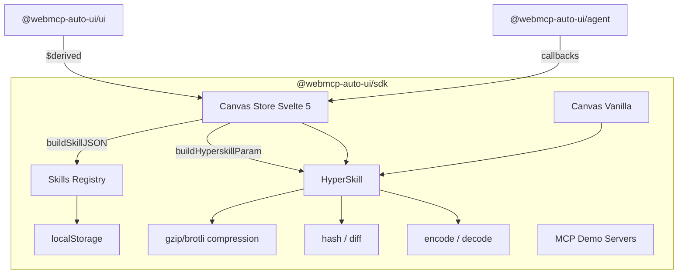
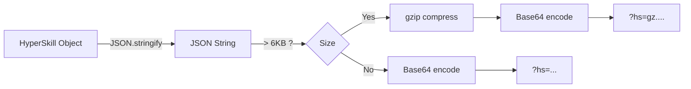
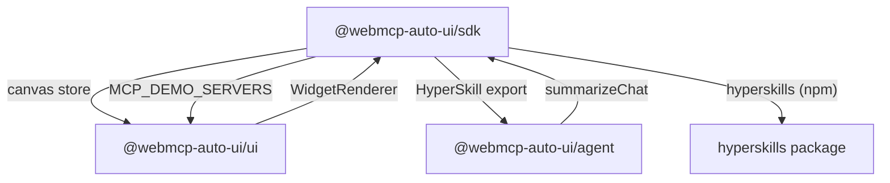

The `@webmcp-auto-ui/sdk` package provides the application layer between the agent and the UI. It manages reactive canvas state (widgets, chat, MCP connection), the HyperSkill system for serializing and sharing complete configurations as short URLs, and a persistent skills registry backed by localStorage.

It bridges what the agent produces and what the UI displays.

## Internal Architecture



## Installation

```ts
// Main import (types + HyperSkill + skills registry)
import { encodeHyperSkill, decodeHyperSkill, createSkill } from '@webmcp-auto-ui/sdk';

// Canvas store — Svelte 5 (with $state/$derived runes)
import { canvas } from '@webmcp-auto-ui/sdk/canvas';

// Canvas store — vanilla (React, Vue, or plain JS)
import { canvas } from '@webmcp-auto-ui/sdk/canvas-vanilla';
```

In an app's `package.json`:

```json
{
  "devDependencies": {
    "@webmcp-auto-ui/sdk": "file:../../packages/sdk"
  }
}
```

The package depends on `hyperskills` (NPM) for HyperSkill encoding/decoding, and on Svelte 5 as a peer dependency for the reactive canvas store.

---

## Canvas Store

The canvas store is the central state store for the application. It manages:
- Displayed **widgets** (blocks)
- Selected **LLM model**
- **MCP connection** (URL, status, tools)
- **Chat history** (messages)
- **Theme overrides**
- **Generation state** (is the agent currently responding?)

### Two store versions

The SDK exports two versions of the same store with identical APIs:

| Import | Framework | Reactivity |
|--------|-----------|-----------|
| `@webmcp-auto-ui/sdk/canvas` | Svelte 5 | Runes (`$state` / `$derived`) |
| `@webmcp-auto-ui/sdk/canvas-vanilla` | Agnostic | `subscribe()` / `getSnapshot()` |

### Full API

```ts
// -- Widgets -------------------------------------------------------
canvas.blocks: Widget[];                      // List of displayed widgets
canvas.addWidget(type, data): Widget;         // Add a widget, returns the created object
canvas.removeBlock(id): void;                 // Remove a widget by ID
canvas.updateBlock(id, data): void;           // Update widget data
canvas.moveBlock(fromId, toId): void;         // Reorder a widget
canvas.clearBlocks(): void;                   // Clear the canvas
canvas.setBlocks(widgets): void;              // Replace all widgets at once

// -- Mode ----------------------------------------------------------
canvas.mode: 'auto' | 'drag' | 'chat';
canvas.setMode(mode): void;

// -- LLM -----------------------------------------------------------
canvas.llm: 'haiku' | 'sonnet' | 'gemma-e2b' | 'gemma-e4b';
canvas.setLlm(model): void;

// -- MCP -----------------------------------------------------------
canvas.mcpUrl: string;
canvas.setMcpUrl(url): void;
canvas.mcpConnected: boolean;
canvas.mcpConnecting: boolean;
canvas.mcpName: string;
canvas.mcpTools: McpToolInfo[];
canvas.setMcpConnecting(bool): void;
canvas.setMcpConnected(connected, name?, tools?): void;
canvas.setMcpError(error): void;

// -- Chat ----------------------------------------------------------
canvas.messages: ChatMsg[];
canvas.addMsg(role, content, thinking?): ChatMsg;
canvas.updateMsg(id, content, thinking?): void;
canvas.clearMessages(): void;

// -- Theme ---------------------------------------------------------
canvas.themeOverrides: Record<string, string>;
canvas.setThemeOverrides(overrides): void;

// -- Derived metrics -----------------------------------------------
canvas.blockCount: number;
canvas.isEmpty: boolean;
canvas.generating: boolean;
```

### Svelte 5 example

```svelte
<script lang="ts">
  import { canvas } from '@webmcp-auto-ui/sdk/canvas';
  import { WidgetRenderer } from '@webmcp-auto-ui/ui';
</script>

<select bind:value={canvas.llm}>
  <option value="haiku">Claude Haiku</option>
  <option value="sonnet">Claude Sonnet</option>
  <option value="gemma-e2b">Gemma 2B (local)</option>
</select>

<button onclick={() => canvas.addWidget('stat', { label: 'Sales', value: '1000' })}>
  Add widget
</button>

<div class="grid grid-cols-2 gap-4">
  {#each canvas.blocks as widget (widget.id)}
    <WidgetRenderer type={widget.type} data={widget.data} />
  {/each}
</div>

<p>{canvas.blockCount} widgets displayed</p>
```

### Vanilla example (React, Vue, plain JS)

```ts
import { canvas } from '@webmcp-auto-ui/sdk/canvas-vanilla';

const unsubscribe = canvas.subscribe(() => {
  const snapshot = canvas.getSnapshot();
  console.log('Widgets:', snapshot.blocks.length);
  renderWidgets(snapshot.blocks);
});

canvas.addWidget('stat', { label: 'Users', value: '42k' });

unsubscribe();
```

:::tip[useSyncExternalStore pattern]
The vanilla canvas is compatible with React 18+'s `useSyncExternalStore` pattern for seamless integration without additional wrappers.
:::

---

## HyperSkill: Experience Serialization

The HyperSkill system serializes a complete experience (widgets, theme, MCP connection, history) into a short, shareable URL parameter. This is what makes demos shareable via simple links.

### Serialization flow



### encodeHyperSkill

Serializes a HyperSkill object into a URL parameter. Automatically compresses with gzip when the payload exceeds 6 KB.

```ts
import { encodeHyperSkill } from '@webmcp-auto-ui/sdk';

const skill = {
  meta: {
    title: 'Q1 Dashboard',
    llm: 'sonnet',
    mcp: 'https://mcp.example.com/mcp',
    tags: ['sales', 'quarterly'],
  },
  content: {
    blocks: [
      { type: 'stat', data: { label: 'Revenue', value: '$42k', trend: 'up' } },
    ],
  },
};

const param = await encodeHyperSkill(skill, 'https://demos.hyperskills.net');
// "g_qs9K2wZqE..." or "gz.eJzLSM3JyVcozy/KSQEAHmwFpA==" (if compressed)
```

### decodeHyperSkill

Deserializes a URL parameter or full URL into a HyperSkill object:

```ts
import { decodeHyperSkill } from '@webmcp-auto-ui/sdk';

const skill = await decodeHyperSkill('g_qs9K2wZqE...');
const skill2 = await decodeHyperSkill('https://demos.hyperskills.net?hs=g_qs9K2w...');

console.log(skill.meta.title);       // 'Q1 Dashboard'
console.log(skill.content.blocks);   // [{ type: 'stat', ... }]
```

Automatically supports:
- **gzip** (`gz.` prefix)
- **brotli** (`br.` prefix)
- **Plain Base64** (no prefix)
- **Full URLs** with `?hs=...`

### HyperSkill interface

```ts
interface HyperSkill {
  meta: HyperSkillMeta;
  content: unknown;
}

interface HyperSkillMeta {
  title?: string;
  description?: string;
  version?: string;
  created?: string;
  mcp?: string;
  mcpName?: string;
  llm?: string;
  tags?: string[];
  theme?: Record<string, string>;
  hash?: string;
  previousHash?: string;
  chatSummary?: string;
  provenance?: {
    mcpServers?: string[];
    toolsUsed?: string[];
    toolCallCount?: number;
    skillsReferenced?: string[];
    llm?: string;
    exportedAt?: string;
  };
}
```

### Raw functions (re-exports)

The SDK re-exports raw functions from the `hyperskills` NPM package:

```ts
import { encode, decode, hash, diff, getHsParam } from '@webmcp-auto-ui/sdk';

const param = await encode('https://example.com', jsonString, { compress: 'gz' });
const { sourceUrl, content } = await decode(param);
const h = await hash('https://example.com', jsonString);
const changes = await diff(oldJson, newJson);
const hsParam = getHsParam('https://example.com?hs=abc123'); // 'abc123'
```

:::note[Typed wrapper]
The `hyperskills` package is pure JavaScript. The SDK imports it with `// @ts-ignore` and re-exports each function with explicit types, following the project's convention for untyped JS packages.
:::

### Hash and versioning

The hash system enables skill versioning with a linked list of hashes:

```ts
import { computeHash, createVersion } from '@webmcp-auto-ui/sdk';

const h = await computeHash('https://example.com', skillContent);

const version = await createVersion(skill, 'https://example.com', previousHash);
// { hash, previousHash, timestamp, skill }
```

### Diff

Compare two skill versions:

```ts
import { diffSkills } from '@webmcp-auto-ui/sdk';
const changes = await diffSkills(oldSkill, newSkill);
```

---

## Canvas Store x HyperSkill

The canvas store natively integrates HyperSkill functions for export and import:

```ts
import { canvas } from '@webmcp-auto-ui/sdk/canvas';

// Export current state as skill JSON
const skill = canvas.buildSkillJSON();

// Generate a compressed HyperSkill parameter
const param = await canvas.buildHyperskillParam();
const url = `https://demos.hyperskills.net?hs=${param}`;

// Import from a parameter
await canvas.loadFromParam(param);

// Import from a full URL
await canvas.loadFromUrl('https://demos.hyperskills.net?hs=g_qs9K2w...');
```

:::tip[Sharing demos]
This mechanism powers all demo apps' sharing features. A user can configure a dashboard, click "Share", and send the URL to a colleague who will see the exact same state.
:::

---

## Skills Registry

The skills registry persists configurations in localStorage with a full CRUD API.

### Registry API

```ts
import {
  createSkill, updateSkill, deleteSkill, getSkill,
  listSkills, clearSkills, loadSkills, loadDemoSkills,
  onSkillsChange,
} from '@webmcp-auto-ui/sdk';
```

### Types

```ts
interface Skill {
  id: string;
  name: string;
  description?: string;
  content: any;
  created: number;
  updated: number;
  version?: string;
  tags?: string[];
}

interface SkillBlock {
  type: string;
  data: Record<string, unknown>;
}
```

### CRUD operations

```ts
const skill = createSkill('dashboard-q1', {
  description: 'Quarterly sales dashboard',
  content: { blocks: [{ type: 'stat', data: { label: 'Revenue', value: '$42k' } }] },
  tags: ['sales'],
});

const retrieved = getSkill(skill.id);
const all = listSkills();
updateSkill(skill.id, { name: 'Dashboard Q1 2024' });
deleteSkill(skill.id);
```

### Batch operations

```ts
await loadSkills(skillObjects);      // Load a set of skills at once
await loadDemoSkills();              // Load pre-configured demo skills
clearSkills();                       // Clear the entire registry
```

### Reactivity

```ts
const unsubscribe = onSkillsChange((skills) => {
  console.log(`${skills.length} skills in registry`);
});
```

### Auto-save example

```svelte
<script lang="ts">
  import { canvas } from '@webmcp-auto-ui/sdk/canvas';
  import { createSkill, updateSkill } from '@webmcp-auto-ui/sdk';

  let currentSkillId: string | null = null;

  function autoSave() {
    const json = canvas.buildSkillJSON();
    if (!currentSkillId) {
      const skill = createSkill(`skill_${Date.now()}`, json);
      currentSkillId = skill.id;
    } else {
      updateSkill(currentSkillId, json);
    }
  }

  $effect(() => {
    canvas.blocks;  // Reactive dependency
    const timer = setTimeout(autoSave, 5000);
    return () => clearTimeout(timer);
  });
</script>
```

---

## MCP Demo Servers

List of available MCP demo servers for testing the agent:

```ts
import { MCP_DEMO_SERVERS } from '@webmcp-auto-ui/sdk';

interface McpDemoServer {
  name: string;
  description: string;
  url: string;
  tools: string[];
}

MCP_DEMO_SERVERS.forEach(server => {
  console.log(`${server.name}: ${server.url}`);
  console.log(`  Tools: ${server.tools.join(', ')}`);
});
```

This array feeds the `<RemoteMCPserversDemo>` component from the UI package.

---

## Tutorial: Multi-Skills Application

### Step 1: Initialize the canvas

```svelte
<script lang="ts">
  import { canvas } from '@webmcp-auto-ui/sdk/canvas';
  import { listSkills, createSkill, getSkill, loadDemoSkills } from '@webmcp-auto-ui/sdk';
  import { WidgetRenderer, LLMSelector } from '@webmcp-auto-ui/ui';

  let skills = $state(listSkills());
  let selectedId = $state<string | null>(null);

  $effect(() => {
    if (skills.length === 0) {
      loadDemoSkills().then(() => { skills = listSkills(); });
    }
  });
</script>
```

### Step 2: Navigate between skills

```svelte
<aside class="w-64 p-4 bg-gray-100">
  <h2 class="font-bold mb-4">Skills</h2>
  <ul>
    {#each skills as skill (skill.id)}
      <li>
        <button
          class:bg-blue-500={selectedId === skill.id}
          onclick={() => {
            selectedId = skill.id;
            const s = getSkill(skill.id);
            if (s?.content?.blocks) canvas.setBlocks(s.content.blocks);
            if (s?.content?.llm) canvas.setLlm(s.content.llm);
          }}
        >
          {skill.name}
        </button>
      </li>
    {/each}
  </ul>
</aside>
```

### Step 3: HyperSkill export

```svelte
<script lang="ts">
  async function shareSkill() {
    const param = await canvas.buildHyperskillParam();
    const url = `https://demos.hyperskills.net?hs=${param}`;
    await navigator.clipboard.writeText(url);
    alert('Link copied!');
  }
</script>

<button onclick={shareSkill}>Share</button>
```

### Step 4: Import from URL

```svelte
<script lang="ts">
  import { onMount } from 'svelte';
  import { getHsParam } from '@webmcp-auto-ui/sdk';

  onMount(async () => {
    const param = getHsParam(window.location.href);
    if (param) await canvas.loadFromParam(param);
  });
</script>
```

---

## Integration with Other Packages



---

## Best Practices

:::tip[Canvas Svelte vs Vanilla]
Use `@webmcp-auto-ui/sdk/canvas` in Svelte components for automatic reactivity. Use `@webmcp-auto-ui/sdk/canvas-vanilla` in non-Svelte contexts (React, tests, scripts).
:::

:::caution[HyperSkill URL size]
URLs with `?hs=...` are limited by nginx configuration (~8 KB by default). Gzip compression kicks in automatically above 6 KB, but very large skills may still exceed the limit. Consider storing the skill on a backend with a short identifier in that case.
:::

:::caution[localStorage limits]
The skills registry uses localStorage, which is limited to ~5 MB per origin. Avoid storing large data in skill content (base64 images, large JSON). Prefer storing references (URLs) rather than raw data.
:::

---

## FAQ

**Why are there two canvas store versions?**
The Svelte 5 store uses runes (`$state`/`$derived`) for fine-grained native reactivity. The vanilla store uses a `subscribe`/`getSnapshot` pattern compatible with any framework. Both share the same internal logic.

**Is the HyperSkill parameter secure?**
The parameter is Base64-encoded (optionally compressed), not encrypted. Don't put sensitive data in a skill. Chat summaries are automatically anonymized by `summarizeChat`.

**How does compression work?**
Above 6 KB, `encodeHyperSkill` uses gzip via the browser's `CompressionStream` API. The `gz.` prefix tells `decodeHyperSkill` to decompress. Brotli is also supported (`br.` prefix), but gzip is the default due to wider support.

**Do skills persist across sessions?**
Yes, the registry uses localStorage. Skills remain available as long as the user doesn't clear their browser storage. For cross-device sharing, use HyperSkill export.
