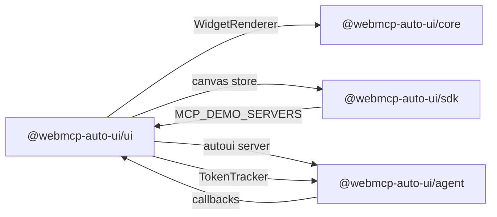

The `@webmcp-auto-ui/ui` package provides a comprehensive library of Svelte 5 components for building agent-powered applications. It covers four areas: **widgets** (over 25 types for data display), **layouts** (grid, floating, stack, flex), **agent components** (LLM selector, progress, chat, settings), and **infrastructure** (theming, message bus, UI primitives).

All components use the project's design system (CSS tokens, Tailwind preset) and support light/dark themes.

## Internal Architecture

```mermaid
graph TD
    subgraph "@webmcp-auto-ui/ui"
        THEME[ThemeProvider] --> TOKENS[CSS Tokens]
        WR[WidgetRenderer] --> SIMPLE[9 Simple Widgets]
        WR --> RICH[16 Rich Widgets]
        WR --> CUSTOM[Custom widgets<br/>via WebMCP server]
        BR[BlockRenderer] --> WR

        LAYOUTS[Layouts] --> TILING[TilingLayout]
        LAYOUTS --> FLOATING[FloatingLayout]
        LAYOUTS --> STACK[StackLayout]
        LAYOUTS --> FLEX[FlexLayout]

        AGENT_UI[Agent Components] --> LLM[LLMSelector]
        AGENT_UI --> GEMMA[ModelLoader]
        AGENT_UI --> MCP_S[McpStatus]
        AGENT_UI --> PROG[AgentProgress]
        AGENT_UI --> CHAT[ChatPanel]
        AGENT_UI --> CONSOLE[AgentConsole]
        AGENT_UI --> SETTINGS[SettingsPanel]

        BUS[FONC bus] --> LINKS[LinkOverlay]
        BUS --> LI[LinkIndicators]
        ADAPTER[layoutAdapter] --> LAYOUTS
    end

    SDK["@webmcp-auto-ui/sdk"] -->|canvas store| AGENT_UI
    AGENT["@webmcp-auto-ui/agent"] -->|autoui server| WR
```



## Installation

```ts
import { WidgetRenderer, LLMSelector, ThemeProvider, bus } from '@webmcp-auto-ui/ui';
```

In an app's `package.json`:

```json
{
  "devDependencies": {
    "@webmcp-auto-ui/ui": "file:../../packages/ui",
    "@webmcp-auto-ui/sdk": "file:../../packages/sdk"
  }
}
```

Peer dependencies: `svelte ^5.0.0`, `d3 ^7.9.0` (for D3Widget), `leaflet >=1.9.0` (for MapView).

---

## Theming

### ThemeProvider

Root wrapper that provides theme context to all child components. Manages dark/light toggling and CSS overrides.

```svelte
<script lang="ts">
  import { ThemeProvider } from '@webmcp-auto-ui/ui';
</script>

<ThemeProvider defaultMode="dark" overrides={{ '--color-primary': '#4F46E5' }}>
  <slot />
</ThemeProvider>
```

**Props:**

```ts
interface Props {
  defaultMode?: ThemeMode;              // 'light' | 'dark' (default: 'light')
  overrides?: Record<string, string>;   // CSS custom properties
  theme?: ThemeJSON;                    // External theme JSON
  children: Snippet;
}
```

### getTheme

Svelte context function to access the theme API from any child of `ThemeProvider`.

```svelte
<script lang="ts">
  import { getTheme } from '@webmcp-auto-ui/ui';
  const theme = getTheme();
</script>

<span>Mode: {theme.mode}</span>
<button onclick={theme.toggle}>Toggle</button>
```

**Returned API:**

```ts
interface ThemeAPI {
  readonly mode: ThemeMode;
  toggle: () => void;
  setMode: (m: ThemeMode) => void;
}
```

### Tokens and constants

```ts
import { DARK_TOKENS, LIGHT_TOKENS, THEME_MAP } from '@webmcp-auto-ui/ui';
import type { ThemeMode, ThemeOverrides, ThemeTokens } from '@webmcp-auto-ui/ui';
```

---

## Widget Rendering

### WidgetRenderer

The main component that resolves and displays a widget. It searches WebMCP servers (custom), then the native registry. Unknown widgets get a fallback display.

```svelte
<script lang="ts">
  import { WidgetRenderer } from '@webmcp-auto-ui/ui';
  import { autoui } from '@webmcp-auto-ui/agent';
</script>

<WidgetRenderer
  id="block_1"
  type="stat"
  data={{ label: 'Revenue', value: '$42k', trend: 'up' }}
  servers={[autoui]}
  oninteract={(type, action, payload) => console.log(action, payload)}
/>
```

**Props:**

```ts
interface Props {
  id?: string;
  type: string;
  data: Record<string, unknown>;
  servers?: WebMcpServer[];
  oninteract?: (type: string, action: string, payload: unknown) => void;
}
```

**Interaction actions:**

| Action | Widget | Description |
|--------|--------|-------------|
| `itemclick` | list | Click on a list item |
| `rowclick` | data-table | Click on a table row |
| `cardclick` | cards | Click on a card |
| `imageclick` | gallery | Click on an image |
| `slidechange` | carousel | Slide change |
| `cellclick` | grid-data | Click on a cell |

**WebMCP auto-registration:** each widget automatically registers 3 tools on `navigator.modelContext`:
- `widget_{id}_get()` — get current data
- `widget_{id}_update(...)` — update data
- `widget_{id}_remove()` — remove the widget

### BlockRenderer

Legacy alias for `WidgetRenderer`. Kept for backward compatibility.

---

## Simple Widgets (9)

Lightweight widgets for basic data display.

### StatBlock

Key statistic with label, value, and optional trend arrow.

```svelte
<StatBlock data={{ label: 'Revenue', value: '$42k', trend: 'up' }} />
```

### KVBlock

Key-value pairs in a grid layout.

```svelte
<KVBlock data={{
  items: [
    { key: 'Status', value: 'Active' },
    { key: 'Region', value: 'Europe' }
  ]
}} />
```

### ListBlock

Bulleted item list.

```svelte
<ListBlock data={{ items: ['First item', 'Second item'], title: 'Tasks' }} />
```

### ChartBlock

Simple bar chart (no external library).

```svelte
<ChartBlock data={{ bars: [['Jan', 10], ['Feb', 20], ['Mar', 15]] }} />
```

### AlertBlock

Colored alert with icon and message. Levels: info, warning, error, success.

```svelte
<AlertBlock data={{ level: 'warning', title: 'Attention', message: 'Data is 24h old.' }} />
```

### CodeBlock

Syntax-highlighted code with copy button.

```svelte
<CodeBlock data={{ code: 'const x = 42;', language: 'javascript' }} />
```

### TextBlock

Markdown text rendered as HTML.

```svelte
<TextBlock data={{ text: '# Title\n\nParagraph with **bold**.' }} />
```

### ActionsBlock

Interactive action buttons. The agent can offer choices to the user.

```svelte
<ActionsBlock data={{
  actions: [
    { label: 'Approve', value: 'approve', variant: 'primary' },
    { label: 'Reject', value: 'reject', variant: 'danger' }
  ]
}} />
```

### TagsBlock

Colored badges/tags.

```svelte
<TagsBlock data={{
  tags: [
    { label: 'Frontend', color: '#3B82F6' },
    { label: 'Production', color: '#10B981' }
  ]
}} />
```

---

## Rich Widgets (16)

Advanced widgets for complex visualizations.

### DataTable

Data table with sortable column headers.

```svelte
<DataTable
  spec={{
    columns: [
      { key: 'name', label: 'Name' },
      { key: 'age', label: 'Age' }
    ],
    rows: [
      { name: 'Alice', age: 30 },
      { name: 'Bob', age: 25 }
    ]
  }}
  onrowclick={(row) => console.log(row)}
/>
```

### StatCard

Rich statistic card with icon, trend, and description.

```svelte
<StatCard spec={{
  title: 'Revenue', value: '$42,000', change: '+12%',
  trend: 'up', description: 'Compared to previous quarter'
}} />
```

### Timeline

Event timeline with visual status indicators (done, active, pending).

```svelte
<Timeline spec={{
  events: [
    { title: 'Launch', date: '2024-01', status: 'done' },
    { title: 'Public beta', date: '2024-03', status: 'active' },
    { title: 'v1.0', date: '2024-06', status: 'pending' }
  ]
}} />
```

### ProfileCard

Profile card with avatar, custom fields, and statistics.

```svelte
<ProfileCard spec={{
  name: 'Alice Martin', subtitle: 'Lead Developer',
  fields: [{ label: 'Team', value: 'Backend' }],
  stats: [{ label: 'Commits', value: '1,234' }]
}} />
```

### Trombinoscope

Profile grid (team, class, organization).

```svelte
<Trombinoscope spec={{
  people: [
    { name: 'Alice', role: 'Dev', avatar: '...' },
    { name: 'Bob', role: 'Design', avatar: '...' }
  ]
}} />
```

### JsonViewer

Interactive, explorable JSON tree with expandable nodes.

```svelte
<JsonViewer spec={{ data: { users: [{ name: 'Alice' }], count: 1 }, expanded: true }} />
```

### Hemicycle

Parliamentary hemicycle with colored seats by group.

```svelte
<Hemicycle spec={{
  groups: [
    { name: 'Majority', seats: 289, color: '#3B82F6' },
    { name: 'Opposition', seats: 248, color: '#EF4444' }
  ]
}} />
```

### Chart (Rich)

Multi-series chart. Supports: bar, line, area, pie, donut.

```svelte
<Chart spec={{
  type: 'bar',
  labels: ['Q1', 'Q2', 'Q3', 'Q4'],
  data: [
    { label: 'Sales', values: [10, 20, 15, 25] },
    { label: 'Costs', values: [8, 12, 10, 15] }
  ]
}} />
```

### Cards

Card grid with title, description, and tags.

```svelte
<Cards
  spec={{
    cards: [
      { title: 'Project A', description: 'In progress', tags: ['frontend'] },
      { title: 'Project B', description: 'Complete', tags: ['backend'] }
    ]
  }}
  oncardclick={(card) => console.log(card)}
/>
```

### GridData

Data grid with clickable cells (spreadsheet-like).

```svelte
<GridData spec={{
  headers: ['Mon', 'Tue', 'Wed', 'Thu', 'Fri'],
  rows: [
    { label: 'Alice', cells: [8, 7, 9, 8, 6] },
    { label: 'Bob', cells: [6, 8, 7, 9, 7] }
  ]
}} />
```

### Sankey

Sankey diagram for visualizing flows between categories.

```svelte
<Sankey spec={{
  nodes: ['Source A', 'Source B', 'Target X', 'Target Y'],
  links: [
    { source: 0, target: 2, value: 10 },
    { source: 1, target: 3, value: 8 }
  ]
}} />
```

### MapView

Interactive Leaflet map with markers and popups.

```svelte
<MapView spec={{
  center: { lat: 48.8566, lng: 2.3522 },
  zoom: 12,
  height: '400px',
  markers: [{ lat: 48.8566, lng: 2.3522, label: 'Paris', popup: 'Capital' }]
}} />
```

:::note
MapView requires `leaflet` as a peer dependency. Leaflet CSS is loaded automatically.
:::

### D3Widget

D3.js visualizations with presets: hex-heatmap, radial, treemap, force graph.

```svelte
<D3Widget spec={{
  preset: 'treemap',
  data: {
    name: 'root',
    children: [
      { name: 'A', value: 100 },
      { name: 'B', value: 200 }
    ]
  }
}} />
```

### JsSandbox

Isolated JavaScript sandbox for custom visualizations. Runs code in a secure iframe.

```svelte
<JsSandbox spec={{
  code: "document.getElementById('root').textContent = 'Hello!';",
  html: '<div id="root"></div>',
  css: 'body { font-family: sans-serif; }',
  height: '300px'
}} />
```

### LogViewer

Log viewer with level filtering and color-coding.

```svelte
<LogViewer spec={{
  title: 'Application Logs',
  entries: [
    { timestamp: '2024-01-15T10:30:00Z', level: 'info', message: 'Server started', source: 'main' },
    { timestamp: '2024-01-15T10:31:00Z', level: 'error', message: 'Connection failed', source: 'db' },
  ],
  maxHeight: '400px',
}} />
```

### Gallery

Responsive image gallery in a grid layout.

```svelte
<Gallery
  spec={{
    title: 'Collection',
    images: [
      { src: 'https://example.com/a.jpg', alt: 'Image A', caption: 'First' },
      { src: 'https://example.com/b.jpg', alt: 'Image B', caption: 'Second' },
    ],
    columns: 3,
  }}
  onimageclick={(img, index) => console.log(img, index)}
/>
```

### Carousel

Image/content carousel with navigation and optional autoplay.

```svelte
<Carousel
  spec={{
    title: 'Presentation',
    slides: [
      { src: 'https://example.com/slide1.jpg', title: 'Slide 1' },
      { content: '<h2>Text</h2><p>HTML content</p>', title: 'Slide 2' },
    ],
    autoPlay: true,
    interval: 5000,
  }}
  onslidechange={(slide, index) => console.log(slide, index)}
/>
```

---

## Agent Components

### LLMSelector

LLM model selector supporting remote (Claude) and local (Gemma WASM) models.

```svelte
<LLMSelector value={canvas.llm} onchange={(model) => canvas.setLlm(model)} />
```

**Props:** `value?: string`, `disabled?: boolean`, `onchange?: (model: string) => void`

Available models: `haiku`, `sonnet`, `opus` (Anthropic Claude), `gemma-e2b`, `gemma-e4b` (Google Gemma WASM).

### ModelLoader

Loading indicator for the Gemma WASM model with progress bar, downloaded size, and elapsed time.

```svelte
<ModelLoader status="loading" progress={45} elapsed={12}
  loadedMB={120} totalMB={267} modelName="Gemma E2B"
  onunload={() => { /* unload model */ }} />
```

**Props:** `status: 'idle' | 'loading' | 'ready' | 'error'`, `progress?`, `elapsed?`, `loadedMB?`, `totalMB?`, `modelName?`, `onunload?`

### McpStatus

MCP connection indicator (green/red dot + tool count).

```svelte
<McpStatus connected={canvas.mcpConnected} connecting={canvas.mcpConnecting}
  name={canvas.mcpName} toolCount={canvas.mcpTools.length} />
```

**Props:** `connected`, `connecting`, `name?`, `toolCount?`, `servers?`, `onconnect?`

### AgentProgress

Animated agent progress bar with real-time metrics.

```svelte
<AgentProgress active={canvas.generating} elapsed={12} toolCalls={3} lastTool="search_recipes" />
```

**Props:** `active?`, `elapsed?`, `toolCalls?`, `lastTool?`

### McpConnector

MCP connection interface with URL field and connect button.

```svelte
<McpConnector url={canvas.mcpUrl} connecting={canvas.mcpConnecting}
  onconnect={(url) => { /* connect */ }} />
```

### ChatPanel

Complete chat panel with message feed, generation indicator, and input field.

```svelte
<ChatPanel {feed} bind:input generating={false}
  onsend={(msg) => { /* send to agent */ }} />
```

**Props:** `feed?: ChatFeedItem[]`, `input?`, `generating?`, `timer?`, `toolCount?`, `lastTool?`, `placeholder?`, `showSrc?`, `onsend?`

**Feed types:**

```ts
interface ChatBubble { role: 'user' | 'assistant'; html: string; }
interface ChatBlock { type: string; data: Record<string, unknown>; }
type ChatFeedItem = ChatBubble | ChatBlock;
```

### AgentConsole

Agent log console with type filtering and clear button.

```svelte
<AgentConsole logs={logArray} onclear={() => { /* clear */ }} />
```

### SettingsPanel

Agent settings panel with bindable parameters.

```svelte
<SettingsPanel bind:systemPrompt bind:maxTokens bind:temperature bind:cacheEnabled />
```

**Props:** `systemPrompt?`, `effectivePrompt?`, `maxTokens?` (4096), `maxContextTokens?` (150000), `maxTools?` (8), `cacheEnabled?` (true), `temperature?` (0.7), `topK?` (10), `modelType?`, `modelId?`

### EphemeralBubble

Ephemeral message bubbles shown during generation. Disappear automatically.

### TokenBubble

Real-time token metrics (req/min, tokens in/out, cache).

### RemoteMCPserversDemo

Multi-server MCP connection UI with pre-configured server list.

### DiagnosticModal / DiagnosticIcon

Components for displaying `runDiagnostics` results from the agent package.

---

## Primitives

### Card / Panel / Window

```svelte
<Card><p>Content</p></Card>

<Panel title="Stats" collapsible={true}><div>Content</div></Panel>

<Window title="Editor" draggable={true}><p>Content</p></Window>
```

### NativeSelect / Tooltip / Button / Badge

```svelte
<NativeSelect bind:value><option value="a">A</option></NativeSelect>

<Tooltip content="More info"><span>Hover me</span></Tooltip>

<Button variant="default" size="sm">Click</Button>
<Badge variant="outline">Tag</Badge>
```

### Dialog

Accessible modal components (shadcn-svelte pattern):

```svelte
<Dialog>
  <DialogTrigger><button>Open</button></DialogTrigger>
  <DialogContent>
    <DialogHeader>
      <DialogTitle>Title</DialogTitle>
      <DialogDescription>Description</DialogDescription>
    </DialogHeader>
    <p>Content</p>
    <DialogFooter><button>Confirm</button></DialogFooter>
  </DialogContent>
</Dialog>
```

### SafeImage

Robust image with URL validation and fallback. Validates protocols (http, https, data, /), shows placeholder if invalid or failed to load.

```svelte
<SafeImage src="https://example.com/image.jpg" alt="Description" fallbackText="Image" />
```

---

## Layouts

### TilingLayout

Responsive tile grid.

```svelte
<TilingLayout gap="4" columns={3}>
  <div>Widget 1</div>
  <div>Widget 2</div>
</TilingLayout>
```

### FloatingLayout

Floating layout with draggable, resizable windows. Uses a snippet `children` receiving each window's context.

```svelte
<FloatingLayout bind:this={fl} {windows} defaultWidth={380} defaultHeight={280}>
  {#snippet children(win, _lw, ctx)}
    <div>
      <div onmousedown={(e) => ctx.ondragstart(e)}>{win.title}</div>
      {#if !ctx.collapsed}
        <div>Widget {win.id}</div>
      {/if}
      <div onmousedown={(e) => ctx.onresizestart(e)}></div>
    </div>
  {/snippet}
</FloatingLayout>
```

**Exposed methods (via `bind:this`):** `move(id, x, y)`, `resize(id, w, h)`, `toggleCollapse(id)`, `fitToContent(id)`

### FlexLayout

Responsive flex layout with adaptive width.

```svelte
<FlexLayout {windows} minWidth={260} maxWidth={600} showSlider={true}>
  {#snippet children(win, _lw, ctx)}
    <div>Widget {win.id} (scale: {ctx.scale})</div>
  {/snippet}
</FlexLayout>
```

### StackLayout

Stacked layout: one window at a time or vertical scrolling.

```svelte
<StackLayout {windows} mode="scroll" gap={8}>
  {#snippet children(win, _lw)}
    <div>{win.title}: content</div>
  {/snippet}
</StackLayout>
```

### GridLayout

CSS grid with explicit cell positioning.

```svelte
<GridLayout rows={4} cols={4}>
  <div style="grid-row: 1; grid-column: 1 / 3;">Widget A</div>
</GridLayout>
```

### Window Manager Types

```ts
interface ManagedWindow {
  id: string; title: string; visible: boolean; focused: boolean;
  folded: boolean; weight: number; createdAt: number; lastFocusedAt: number;
}

interface LayoutWindow {
  id: string; x: number; y: number;
  width: number; height: number; zIndex: number;
  visible: boolean; folded: boolean;
}
```

---

## FONC Message Bus

Inter-component messaging system for decoupled widget communication.

```ts
import { bus } from '@webmcp-auto-ui/ui';

const unregister = bus.register('widget_123', 'widget', ['update', '*'], (msg) => {
  console.log(`Message from ${msg.from}: ${msg.channel}`, msg.payload);
});

bus.send('widget_123', 'widget_456', 'update', { newValue: 42 });
bus.broadcast('widget_123', 'refresh', { timestamp: Date.now() });

const groupId = bus.link(['widget_1', 'widget_2']);
bus.unlink('widget_1', groupId);
bus.getLinks('widget_1');
bus.getGroup(groupId);
bus.hasLinks('widget_1');
```

### LinkOverlay / LinkIndicators

```svelte
<LinkOverlay />                          <!-- SVG arrows between linked widgets -->
<LinkIndicators busId="widget_123" />    <!-- Visual indicators in window title bars -->
```

### linkGroupColor

```ts
import { linkGroupColor } from '@webmcp-auto-ui/ui';
const color = linkGroupColor('group_abc'); // "hsl(210, 70%, 60%)"
```

---

## Layout Adapter

Singleton connecting layouts to agent tools (`canvas` tool with `move`, `resize`, `style` actions).

```ts
import { layoutAdapter } from '@webmcp-auto-ui/ui';

layoutAdapter.register({
  move: (id, x, y) => floatingLayout?.move(id, x, y),
  resize: (id, w, h) => floatingLayout?.resize(id, w, h),
  style: (id, styles) => { /* apply CSS variables */ },
});

layoutAdapter.unregister();
```

---

## Tutorial: Building a Complete Agent Chat

### Step 1: Base structure

```svelte
<script lang="ts">
  import { ThemeProvider, LLMSelector, McpStatus, AgentProgress,
           ChatPanel, WidgetRenderer } from '@webmcp-auto-ui/ui';
  import { canvas } from '@webmcp-auto-ui/sdk/canvas';
  import { runAgentLoop, RemoteLLMProvider, autoui } from '@webmcp-auto-ui/agent';
  import type { ChatFeedItem } from '@webmcp-auto-ui/ui';

  let feed = $state<ChatFeedItem[]>([]);
  let timer = $state(0);
  let toolCount = $state(0);

  const provider = new RemoteLLMProvider({ proxyUrl: '/api/chat', model: 'sonnet' });
</script>
```

### Step 2: Chat logic

```svelte
<script lang="ts">
  async function send(msg: string) {
    feed = [...feed, { role: 'user', html: `<p>${msg}</p>` }];
    canvas.generating = true;
    const start = Date.now();
    const interval = setInterval(() => { timer = (Date.now() - start) / 1000; }, 100);

    try {
      await runAgentLoop(msg, {
        provider,
        layers: [autoui.layer()],
        callbacks: {
          onToolCall: (call) => { toolCount++; },
          onWidget: (type, data) => {
            feed = [...feed, { type, data }];
            return { id: `w_${Date.now()}` };
          },
          onText: (text) => {
            feed = [...feed, { role: 'assistant', html: `<p>${text}</p>` }];
          },
        },
      });
    } finally {
      canvas.generating = false;
      clearInterval(interval);
    }
  }
</script>
```

### Step 3: Assemble the UI

```svelte
<ThemeProvider defaultMode="dark">
  <div class="flex flex-col h-screen">
    <header class="p-4 border-b flex items-center gap-4">
      <LLMSelector value={canvas.llm} onchange={(m) => canvas.setLlm(m)} />
      <McpStatus connected={canvas.mcpConnected} name={canvas.mcpName} />
      {#if canvas.generating}
        <AgentProgress active elapsed={timer} toolCalls={toolCount} />
      {/if}
    </header>
    <main class="flex-1 overflow-auto p-4">
      <ChatPanel {feed} generating={canvas.generating} onsend={send} />
    </main>
  </div>
</ThemeProvider>
```

---

## Integration with Other Packages



---

## Best Practices

:::tip[ThemeProvider is required]
Always wrap your application root in `<ThemeProvider>`. Without it, CSS tokens aren't injected and components have no colors.
:::

:::tip[Use WidgetRenderer over direct imports]
Prefer `<WidgetRenderer type="stat" data={...} />` over importing `StatBlock` directly. The renderer handles resolution (native vs custom), fallback, and WebMCP auto-registration.
:::

:::caution[Peer dependencies]
`MapView` requires `leaflet`, `D3Widget` requires `d3`. If you don't use these widgets, the peer dependencies aren't required — widgets are only imported when used through `WidgetRenderer`.
:::

:::caution[FloatingLayout performance]
With more than 20 windows, FloatingLayout may become slow due to z-index and position recalculation. Prefer `FlexLayout` or `StackLayout` for large collections.
:::

---

## FAQ

**How many widgets are available?**
25 native widgets (9 simple + 16 rich), plus the ability to add custom widgets via a WebMCP server.

**Can I use widgets without the agent?**
Yes. Each widget is a standalone Svelte component that can be imported directly. `WidgetRenderer` is convenient but not mandatory.

**How do I add a custom widget?**
Create a WebMCP server with `createWebMcpServer()` (core package), register your widget with `registerWidget()`, and pass the server in the `servers` prop of `WidgetRenderer`.

**Is the FONC bus persistent?**
No, the bus is in-memory. Links and messages are lost on page reload. To persist links, store them in the canvas store.

**What's the relationship between layouts?**
`TilingLayout` is a static grid. `FlexLayout` is responsive with a size slider. `FloatingLayout` enables free drag & drop. `StackLayout` stacks vertically. Choose based on the desired interaction mode.
