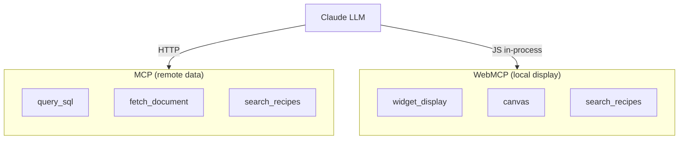
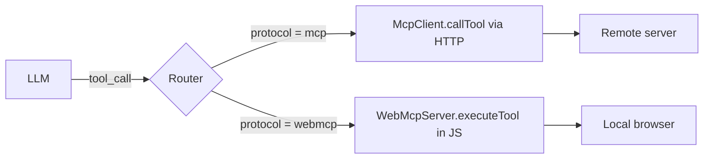
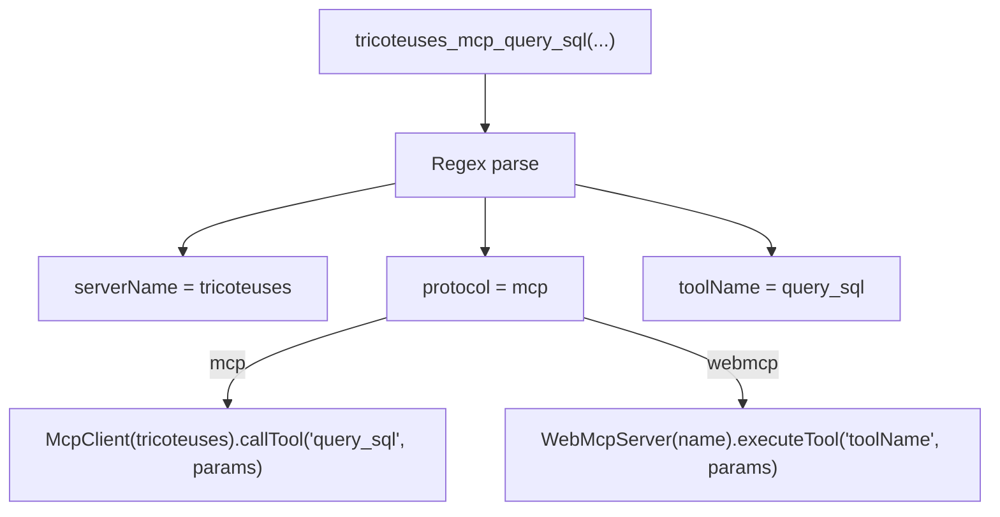
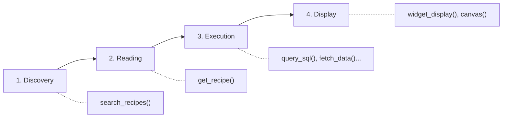
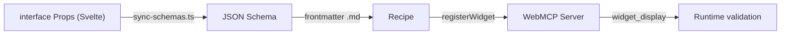
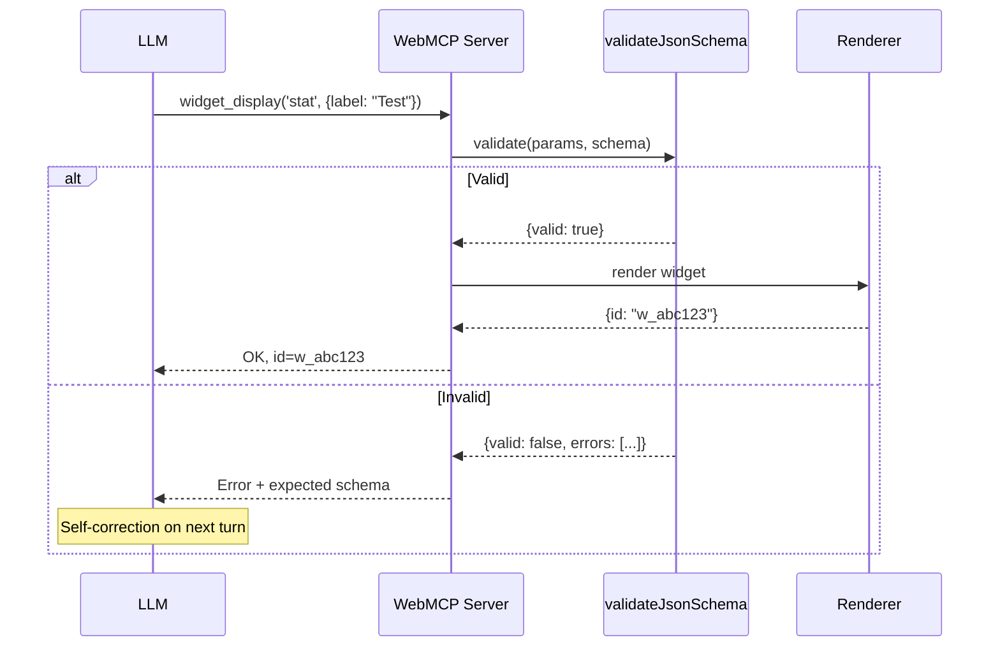
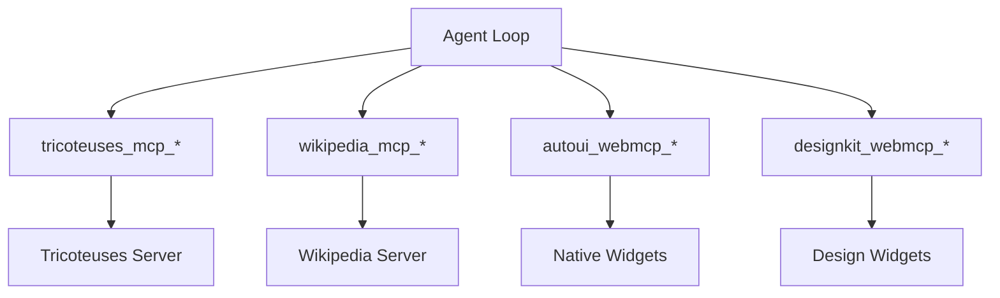
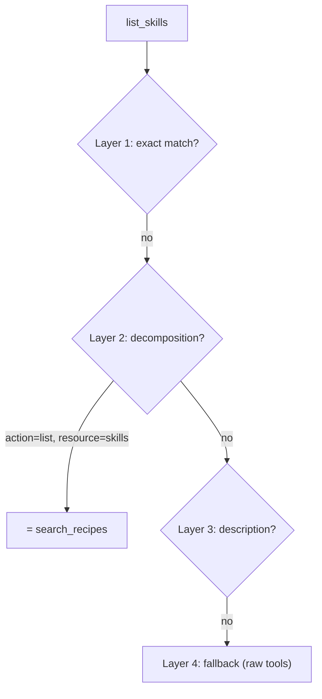
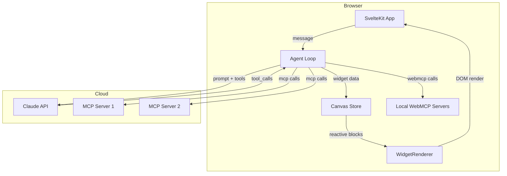

This tutorial is a deep dive into the architecture of webmcp-auto-ui. You will not write code here, but you will understand how every piece fits together. By the end, you will know exactly what happens when a user asks a question and a widget appears on screen.

## Goal

Understand the complete architecture: the two protocols (MCP and WebMCP), their symmetry, uniform prefixing, lazy loading, the schema pipeline, and the canonical resolver.

## Prerequisites

- Have read [Getting started with the boilerplate](./boilerplate) (or used the app)
- Understand what an LLM and a tool call are

## What you will learn

A deep understanding of the architecture that will let you:
- Debug tool routing issues
- Add new MCP and WebMCP servers
- Understand agent loop logs
- Extend the system with new protocols

---

## The two protocols

The system relies on two symmetric protocols:

- **MCP** (Model Context Protocol) provides **remote data** -- SQL queries, REST APIs, scraping, etc.
- **WebMCP** provides **local display** -- widgets, canvas, browser interactions.

Each exposes **tools** (atomic actions) and **recipes** (composition guides).



### Comparison table

| Dimension | MCP | WebMCP |
|-----------|-----|--------|
| Role | Data, APIs, databases | Display, interaction |
| Transport | HTTP Streamable / stdio | In-process JS calls |
| Execution | Remote server | Local browser |
| Latency | Network (50-500ms) | Instant (&lt;1ms) |
| Example tools | query_sql, fetch_document | widget_display, canvas |
| Recipes | Describe the data | Describe the presentation |
| Package | `@webmcp-auto-ui/core` | `@webmcp-auto-ui/core` |

---

## The fundamental symmetry

The key design principle is **symmetry**: the LLM does not distinguish an MCP tool from a WebMCP tool. Both protocols expose the same interface:

- `search_recipes()` -- discover available recipes
- `get_recipe()` -- get the schema and instructions
- Specific tools -- execute actions

From the LLM's perspective, an MCP call and a WebMCP call follow the same cycle: discovery, schema reading, execution. Only the internal routing differs.



:::note[Why this symmetry?]
By making both protocols interchangeable from the LLM's perspective, we simplify the system prompt, reduce routing errors, and can combine data sources and display modes arbitrarily.
:::

---

## Uniform prefixing

All tools follow the naming convention:

```
{serverName}_{protocol}_{toolName}
```

Examples with multiple connected servers:

| Full prefixed tool | serverName | protocol | toolName |
|-------------------|------------|----------|----------|
| `tricoteuses_mcp_query_sql` | tricoteuses | mcp | query_sql |
| `datagouv_mcp_fetch_dataset` | datagouv | mcp | fetch_dataset |
| `autoui_webmcp_widget_display` | autoui | webmcp | widget_display |
| `designkit_webmcp_widget_display` | designkit | webmcp | widget_display |

The agent loop parses this prefix with a regex:

```typescript
/^(.+?)_(mcp|webmcp)_(.+)$/
```

Then dispatches:
- `protocol === 'mcp'` --> `McpClient.callTool(toolName, params)`
- `protocol === 'webmcp'` --> `WebMcpServer.executeTool(toolName, params)`

This guarantees **no name collisions** even with 10 servers connected simultaneously.



---

## The dynamic system prompt

`buildSystemPrompt(layers)` generates a **recipe-driven** prompt adapted to the connected servers. The prompt enforces a strict 4-step workflow:



### Dynamic placeholders

The tool lists at steps 1, 2, and 4 are **placeholders**: `buildSystemPrompt` automatically injects the prefixed names based on the connected layers. With 2 MCP servers and 1 WebMCP, step 1 will contain:

```
tricoteuses_mcp_search_recipes(), datagouv_mcp_search_recipes(), autoui_webmcp_search_recipes()
```

---

## Lazy loading

At startup, the agent loop does **not** expose all tools from all servers. It only provides discovery tools:

| Protocol | Tools exposed at start |
|----------|----------------------|
| MCP | `search_recipes`, `get_recipe` |
| WebMCP | `search_recipes`, `get_recipe`, `widget_display`, `canvas`, `recall` |

```mermaid
sequenceDiagram
    participant LLM
    participant Loop as Agent Loop
    participant MCP as MCP Server

    Note over Loop: Start: only search_recipes, get_recipe
    LLM->>Loop: search_recipes("data")
    Loop->>MCP: search_recipes
    MCP-->>Loop: recipes found
    LLM->>Loop: query_sql(...)
    Note over Loop: First call to this server!
    Loop->>Loop: activateServerTools(server)
    Note over Loop: All server tools now active
    Loop->>MCP: query_sql
    MCP-->>Loop: results
```

### Token savings

With 4 servers and 50 tools total, discovery mode exposes about 20 tools instead of 50 -- saving 3,000--5,000 tokens in the initial prompt.

:::tip[Why it matters]
Fewer tokens in the prompt = more tokens available for data and LLM reasoning. This is particularly critical with lightweight models (Haiku, Gemma) that have smaller context windows.
:::

---

## The schema pipeline

Widget schemas follow a 4-step pipeline from Svelte component to runtime:



### Runtime validation

When the LLM calls `widget_display(name, params)`, the WebMCP server validates params against the JSON Schema **before** passing them to the renderer:



---

## Full conversation flow

Here is the complete sequence when the user asks: "Show me the profile of MP Jean Dupont".

```mermaid
sequenceDiagram
    participant User
    participant App
    participant Loop as Agent Loop
    participant LLM as Claude
    participant MCP as MCP Server
    participant WebMCP as WebMCP Server

    User->>App: "Show me MP Jean Dupont's profile"
    App->>Loop: runAgentLoop(message, options)

    Note over Loop: Iteration 1: Discovery
    Loop->>LLM: prompt + discovery tools
    LLM-->>Loop: tool_call: search_recipes("MP profile")
    Loop->>MCP: search_recipes
    MCP-->>Loop: recipe "deputy-profile"

    Note over Loop: Iteration 2: Reading + Execution
    Loop->>LLM: recipe results
    LLM-->>Loop: tool_call: get_recipe("deputy-profile")
    Loop->>MCP: get_recipe
    MCP-->>Loop: schema + instructions

    Note over Loop: Iteration 3: Data
    Loop->>LLM: widget schema
    LLM-->>Loop: tool_call: query_sql(...)
    Loop->>MCP: query_sql
    MCP-->>Loop: deputy JSON data

    Note over Loop: Iteration 4: Display
    Loop->>LLM: data
    LLM-->>Loop: tool_call: widget_display("profile", {...})
    Loop->>WebMCP: widget_display
    WebMCP-->>Loop: {id: "w_xyz"}
    Loop-->>App: AgentResult
    App-->>User: Profile widget displayed!
```

### Safety mechanisms

Two safeguards prevent infinite loops:

1. **No-render iteration counter** -- after 4 iterations without `widget_display`, discovery tools are removed. After 5, a nudge message is injected.
2. **`maxIterations`** (default 5) -- the loop stops even if the LLM has not finished.

### Result compression

After each iteration, previous `tool_result` entries are compressed: texts longer than 300 characters are truncated to 200 with a `recall('id')` hint. The LLM can retrieve the full result via the `recall` tool.

---

## Multi-server

Multiple MCP and WebMCP servers coexist thanks to uniform prefixing.



### Namespace isolation

Each server is a complete namespace. If `autoui` and `designkit` both expose a `widget_display` tool, the LLM sees:

- `autoui_webmcp_widget_display` -- standard widgets (stat, chart, map...)
- `designkit_webmcp_widget_display` -- design widgets (mockup, wireframe...)

No confusion possible.

---

## The canonical resolver (4 layers)

MCP servers do not always use the exact names `search_recipes` and `get_recipe`. The canonical resolver identifies equivalent tools via 4 matching layers:

| Layer | Strategy | Example |
|-------|----------|---------|
| Layer 1 | Exact name match | `search_recipes` |
| Layer 2 | Decomposition (action, resource) | `list_skills` --> search_recipes |
| Layer 3 | Description scan for keywords | description contains "recipe" + "search" |
| Layer 4 | Fallback: no recipe tool, list raw tools | server without recipes |



The resolver registers **aliases** in a local map:

```typescript
aliasMap.set('server_mcp_search_recipes', 'server_mcp_list_skills');
```

The system prompt uses the canonical name (`search_recipes`), and the agent loop resolves the alias at execution time.

---

## Extensibility

The layer-based architecture accommodates new server types without modifying the agent loop.

### New protocols

`ToolLayer` is a discriminated union by `protocol`. Adding a third type = new union member + a case in `buildToolsFromLayers()`.

```typescript
// Today
export type ToolLayer = McpLayer | WebMcpLayer;
// Tomorrow
export type ToolLayer = McpLayer | WebMcpLayer | WasmLayer;
```

---

## Overall architecture



---

## Summary

| Concept | Implementation |
|---------|---------------|
| Protocols | MCP (remote) + WebMCP (local), symmetric |
| Prefixing | `{server}_{protocol}_{tool}` |
| Layers | `McpLayer[]` + `WebMcpLayer[]` = `ToolLayer[]` |
| Lazy loading | `buildDiscoveryTools()` + `activateServerTools()` |
| System prompt | `buildSystemPrompt(layers)` -- dynamic |
| Schema pipeline | TS Props --> sync-schemas --> .md --> WebMCP |
| Validation | JSON Schema at runtime before rendering |
| Multi-server | Isolated namespaces, aliases, recipe filtering |
| Canonical resolver | 4 layers: exact, decomposition, description, fallback |
| Context compression | Truncation + recall() for long results |
| Extensibility | Discriminated union `ToolLayer`, new type |

---

## Troubleshooting

| Problem | Likely cause | Solution |
|---------|-------------|----------|
| "Unknown tool" in logs | Prefix doesn't match any server | Verify serverName in the layer matches |
| LLM ignores an MCP server | No recipes, LLM doesn't know what to ask | Add a `recipes.json` file to the server |
| Infinite loop | LLM never finishes | Reduce `maxIterations` or check system prompt |
| Tools not visible | Server missing from layers | Verify `layers` contains the server's layer |

---

## Going further

- **Implement a new protocol**: extend the `ToolLayer` union and add a case in `buildToolsFromLayers()`
- **Create a native bridge**: implement a WebMCP server that communicates with native code (Swift, Kotlin)
- **Optimize lazy loading**: use `buildDiscoveryCache()` to pre-compute discovery tools

## See also

- [Getting started with the boilerplate](./boilerplate)
- [Create a WebMCP server](./create-webmcp-server)
- [System architecture](/webmcp-auto-ui/en/guide/architecture)
