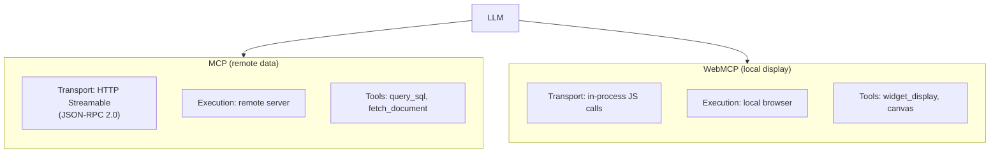
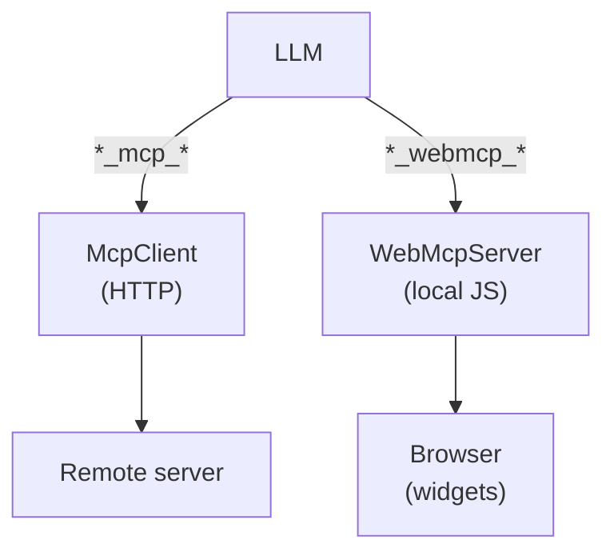
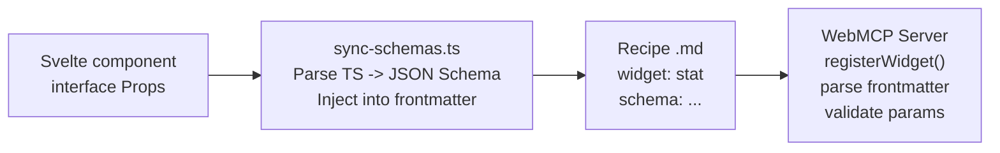
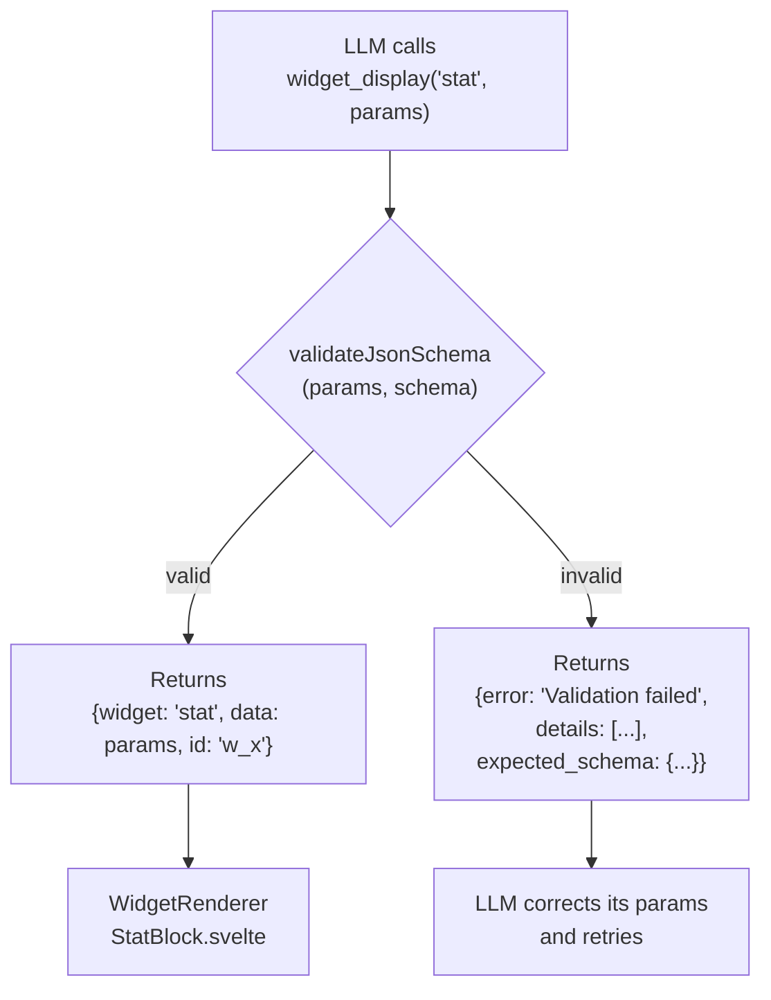
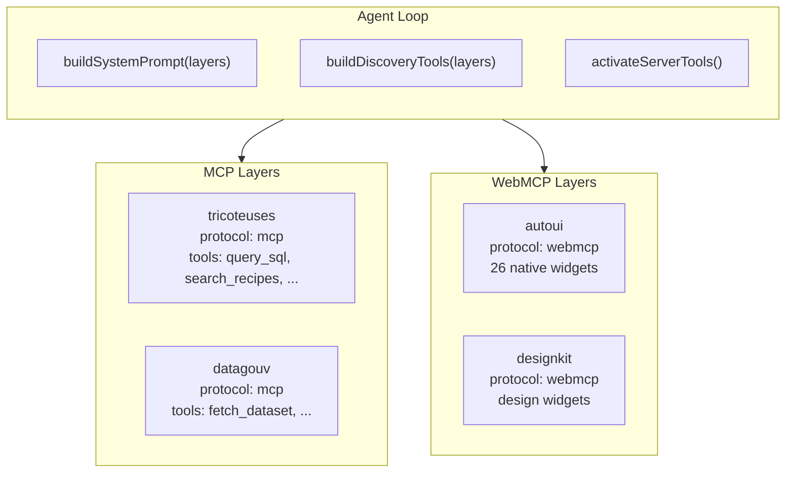
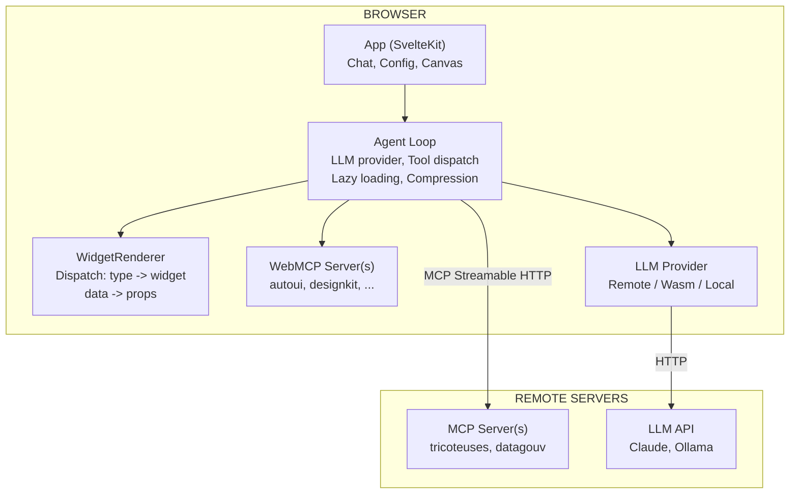

This tutorial explains how MCP and WebMCP coexist in webmcp-auto-ui, and how the agent loop orchestrates them transparently.

## The two protocols

The system relies on two symmetric protocols:

- **MCP** (Model Context Protocol) provides **remote data** -- SQL queries, REST APIs, scraping, etc.
- **WebMCP** provides **local display** -- widgets, canvas, browser interactions.

Each exposes **tools** (atomic actions) and **recipes** (composition guides).



### Comparison table

| Dimension       | MCP                            | WebMCP                          |
|-----------------|--------------------------------|---------------------------------|
| Role            | Data, APIs, databases          | Display, interaction            |
| Transport       | HTTP Streamable / stdio        | In-process JS calls             |
| Execution       | Remote server                  | Local browser                   |
| Latency         | Network (50-500ms)             | Instant (&lt;1ms)                  |
| Example tools   | query_sql, fetch_document      | widget_display, canvas          |
| Recipes         | Describe the data              | Describe the presentation       |
| Package         | `@webmcp-auto-ui/core`        | `@webmcp-auto-ui/core`         |

---

## The symmetry

The fundamental design is **symmetry**: the LLM does not distinguish an MCP tool from a WebMCP tool. Both protocols expose the same interface:

- `search_recipes()` -- discover available recipes
- `get_recipe()` -- get the schema and instructions
- Specific tools -- execute actions

From the LLM's perspective, an MCP call and a WebMCP call follow the same cycle: discovery, schema reading, execution. Only the internal routing differs -- the agent loop dispatches to the correct server based on the prefix.



---

## Uniform prefixing

All tools follow the naming convention:

```
{serverName}_{protocol}_{toolName}
```

Concrete examples with multiple connected servers:

| Full prefixed tool                           | serverName    | protocol | toolName        |
|----------------------------------------------|---------------|----------|-----------------|
| `tricoteuses_mcp_query_sql`                  | tricoteuses   | mcp      | query_sql       |
| `tricoteuses_mcp_search_recipes`             | tricoteuses   | mcp      | search_recipes  |
| `datagouv_mcp_fetch_dataset`                 | datagouv      | mcp      | fetch_dataset   |
| `autoui_webmcp_widget_display`               | autoui        | webmcp   | widget_display  |
| `autoui_webmcp_search_recipes`               | autoui        | webmcp   | search_recipes  |
| `designkit_webmcp_widget_display`            | designkit     | webmcp   | widget_display  |

Routing in the agent loop parses this prefix with a regex:

```typescript
/^(.+?)_(mcp|webmcp)_(.+)$/
```

Then dispatches:
- `protocol === 'mcp'` --> `McpClient.callTool(toolName, params)`
- `protocol === 'webmcp'` --> `WebMcpServer.executeTool(toolName, params)`

This prefixing guarantees **no name collisions** even with 10 servers connected simultaneously.

---

## The dynamic system prompt

`buildSystemPrompt(layers)` generates a **recipe-driven** prompt adapted to the connected servers. The prompt enforces a strict 4-step workflow:

1. **Discovery** -- call `search_recipes()` to find the relevant recipe
2. **Reading** -- call `get_recipe()` to read the instructions
3. **Execution** -- follow the recipe instructions (fetch data, etc.)
4. **Display** -- use `widget_display`, `canvas`, `recall` for UI rendering

### Dynamic placeholders

The tool lists at steps 1, 2, and 4 are **placeholders**: `buildSystemPrompt` automatically injects the prefixed names based on the connected layers. With 2 MCP servers and 1 WebMCP, step 1 will contain for example:

```
tricoteuses_mcp_search_recipes(), datagouv_mcp_search_recipes(), autoui_webmcp_search_recipes()
```

### Per-app customization

Apps can pass a custom `systemPrompt` in the `runAgentLoop()` options. When provided, it replaces the generated prompt. However, the unified prompt adapts to the connected servers and covers the majority of cases.

---

## Lazy loading

At startup, the agent loop does **not** expose all tools from all servers. It only provides discovery tools:

| Protocol | Tools exposed at start                               |
|----------|------------------------------------------------------|
| MCP      | `search_recipes`, `get_recipe`                       |
| WebMCP   | `search_recipes`, `get_recipe`, `widget_display`,    |
|          | `canvas`, `recall`                                   |

WebMCP action tools (`widget_display`, `canvas`, `recall`) are always present because they are needed to display results.

```mermaid
sequenceDiagram
    participant LLM
    participant Loop as Agent Loop
    participant MCP as MCP Server

    Note over LLM,Loop: Iteration 1 - Discovery
    LLM->>Loop: tricoteuses_mcp_search_recipes("profile")
    Loop->>MCP: callTool("search_recipes", ...)
    MCP-->>Loop: [{name: "parl-profile"}]
    Note over Loop: activateServerTools(tricoteuses)
    Note over Loop: All MCP tools now active

    Note over LLM,Loop: Iteration 2 - Data
    LLM->>Loop: tricoteuses_mcp_query_sql(...)
    Loop->>MCP: callTool("query_sql", ...)
    MCP-->>Loop: {name: "Dupont", ...}
```

When the LLM calls a tool from a server for the first time, `activateServerTools()` adds all tools from that server to the active set. The server is activated only once.

### Token savings

With 4 servers and 50 tools total, discovery mode exposes about 20 tools instead of 50. This represents savings of approximately 3,000-5,000 tokens in the initial prompt -- significant when the budget is 8K tokens per turn.

---

## The schema pipeline

Widget schemas follow a 4-step pipeline, from Svelte component to runtime:



The `sync-schemas.ts` script maintains an explicit mapping between each widget name and its `.svelte` file (e.g. `"stat"` ↔ `StatBlock.svelte`, `"profile"` ↔ `ProfileCard.svelte`).

### Runtime validation

When the LLM calls `widget_display(name, params)`, the WebMCP server validates the params against the JSON Schema **before** passing them to the renderer:



If validation fails, the LLM receives an error message with the expected schema, allowing it to correct its call.

---

## Full conversation flow

Sequence diagram of a typical conversation. The user asks: "Show me the profile of MP Jean Dupont".

```mermaid
sequenceDiagram
    participant U as User
    participant LLM
    participant Loop as Agent Loop
    participant MCP as MCP Server
    participant WS as WebMCP Server

    U->>LLM: "Profile of Jean Dupont"

    Note over LLM,Loop: Iteration 1 - Discovery
    LLM->>Loop: tricoteuses_mcp_search_recipes("profile")
    Loop->>MCP: callTool("search_recipes", ...)
    MCP-->>Loop: [{name: "parl-profile", desc: "..."}]
    Note over Loop: activateServerTools(tricoteuses)
    Loop-->>LLM: result

    Note over LLM,Loop: Iteration 2 - Data
    LLM->>Loop: tricoteuses_mcp_query_sql("SELECT ... mp")
    Loop->>MCP: callTool("query_sql", ...)
    MCP-->>Loop: {name: "Dupont", group: "RE", photo: "..."}
    Loop-->>LLM: result

    Note over LLM,Loop: Iteration 3 - Schema
    LLM->>Loop: autoui_webmcp_get_recipe("profile")
    Loop->>WS: executeTool("get_recipe", ...)
    WS-->>Loop: {schema: {...}, recipe: "..."}
    Loop-->>LLM: result

    Note over LLM,Loop: Iteration 4 - Display
    LLM->>Loop: autoui_webmcp_widget_display("profile", {...})
    Loop->>WS: executeTool("widget_display", ...)
    WS-->>Loop: {widget: "profile", data: {...}, id: "w_x"}
    Note over Loop: onWidget() -> WidgetRenderer -> ProfileCard
    Loop-->>LLM: result

    LLM-->>U: "Here is the profile of Jean Dupont"
    Note over U: ProfileCard rendered on the canvas
```

### Safety mechanisms

Two safeguards prevent infinite loops:

1. **Iterations without rendering counter** -- after 4 iterations without `widget_display`, discovery tools are removed from the active set. After 5 iterations, a nudge message is injected.

2. **`maxIterations`** (default 5) -- the loop stops even if the LLM has not finished.

### Result compression

After each iteration, previous `tool_result` entries are compressed: texts longer than 300 characters are truncated to 200 with a `recall('id')` hint. The LLM can retrieve the full result via the `recall` tool.

---

## Multi-server

Multiple MCP and WebMCP servers coexist thanks to uniform prefixing.



### Namespace isolation

Each server is a complete namespace. If `autoui` and `designkit` both expose a `widget_display` tool, the LLM sees:

- `autoui_webmcp_widget_display` -- standard widgets (stat, chart, map...)
- `designkit_webmcp_widget_display` -- design widgets (mockup, wireframe...)

No possible confusion.

---

## The canonical resolver (4 layers)

MCP servers do not always use the exact names `search_recipes` and `get_recipe`. The canonical resolver identifies equivalent tools via 4 matching layers:

| Layer   | Strategy | Example |
|---------|----------|---------|
| Layer 1 | Exact name match | `search_recipes` |
| Layer 2 | Decomposition (action, resource) | `list_skills` --> action=list, resource=skills --> search_recipes |
| Layer 3 | Description scan for keywords | description contains "recipe" + action "search" |
| Layer 4 | Fallback: no recipe tool, list raw tools | server without recipes |

The resolver registers **aliases** in a local map:

```typescript
// If the server exposes "list_skills" instead of "search_recipes"
aliasMap.set('server_mcp_search_recipes', 'server_mcp_list_skills');
```

The system prompt uses the canonical name (`search_recipes`), and the agent loop resolves the alias at execution time.

---

## Extensibility

The layer-based architecture is designed to accommodate new server types without modifying the agent loop.

### Browser WebMCP

A `browser` WebMCP server could expose `notify`, `clipboard`, `share`, `download`. The LLM would call `browser_webmcp_notify(...)`.

### Native WebMCP (SwiftUI bridge)

A native bridge could expose `widget_display` (SwiftUI rendering), `haptic`, `speech`. Same convention: `native_webmcp_*`.

### New protocols

`ToolLayer` is a discriminated union by `protocol`. Adding a third type = new union member + a case in `buildToolsFromLayers()`.

```typescript
// Today
export type ToolLayer = McpLayer | WebMcpLayer;
// Tomorrow
export type ToolLayer = McpLayer | WebMcpLayer | WasmLayer;
```

---

## Overall architecture



---

## Summary

| Concept                | Implementation                                |
|------------------------|-----------------------------------------------|
| Protocols              | MCP (remote) + WebMCP (local), symmetric      |
| Prefixing              | `{server}_{protocol}_{tool}`                  |
| Layers                 | `McpLayer[]` + `WebMcpLayer[]` = `ToolLayer[]`|
| Lazy loading           | `buildDiscoveryTools()` + `activateServerTools()` |
| System prompt          | `buildSystemPrompt(layers)` -- dynamic        |
| Schema pipeline        | TS Props --> sync-schemas --> .md --> WebMCP   |
| Validation             | JSON Schema at runtime before rendering       |
| Multi-server           | Isolated namespaces, aliases, recipe filtering |
| Canonical resolver     | 4 layers: exact, decomposition, description, fallback |
| Context compression    | Truncation + recall() for long results        |
| Extensibility          | Discriminated union `ToolLayer`, new type      |

## See also

- [Getting started with the boilerplate](./boilerplate)
- [Create a WebMCP server](./create-webmcp-server)
- [System architecture](/guide/architecture)
