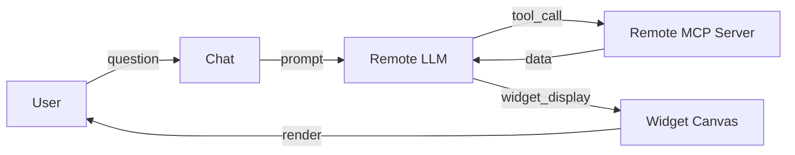
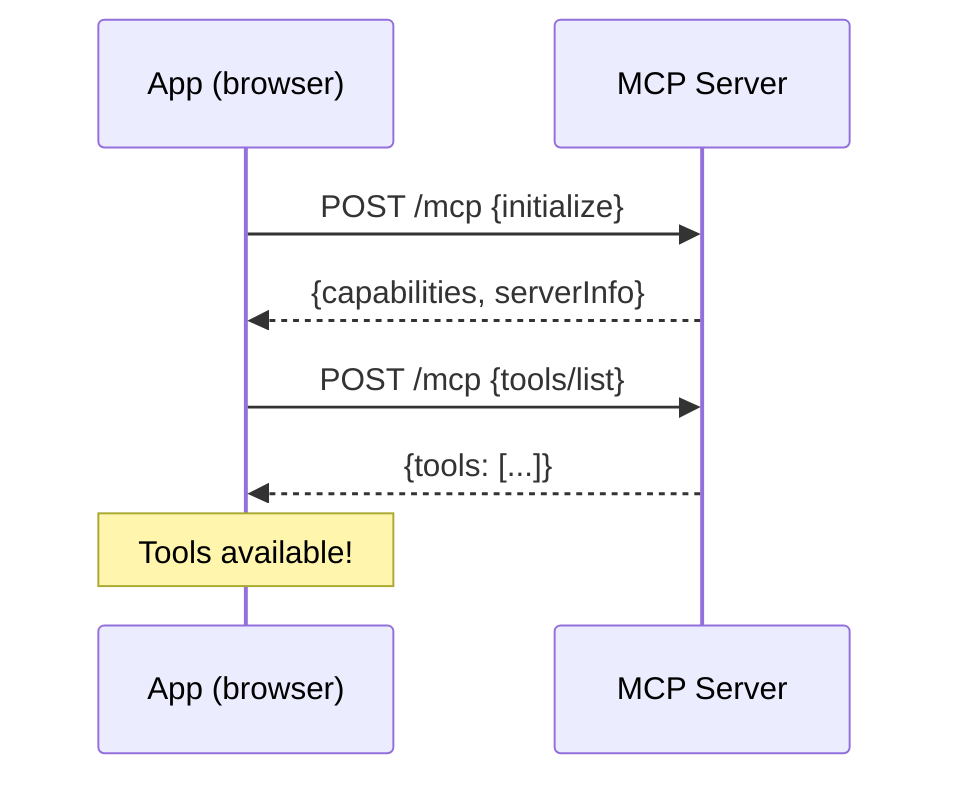

In just 10 minutes, you will have a working application that connects to an MCP server, queries a remote LLM, and displays widgets automatically generated by the AI. This is the ideal starting point for any webmcp-auto-ui project.

## Goal

Install the boilerplate, connect a remote MCP server, and get your first AI-generated widget rendered in the browser.

## Prerequisites

- **Node.js 18+** installed
- An **LLM provider API key** (e.g. Anthropic for Claude, Google for Gemini, OpenAI for ChatGPT) -- free tiers available for first experiments
- A terminal and a code editor
- No prior knowledge of MCP required

## What you will build

At the end of this tutorial, you will have a complete SvelteKit 5 app with:
- A chat connected to a remote LLM (e.g. Claude, Gemini, ChatGPT)
- A remote MCP server connected (French parliamentary data)
- Widgets that appear automatically on a canvas
- A working light/dark theme toggle



---

## Step 1: Scaffolding

Start by cloning the boilerplate with `degit`, which downloads the directory without git history:

```bash
npx degit jeanbaptiste/webmcp-auto-ui/apps/boilerplate my-app
cd my-app
npm install
```

This installs a SvelteKit 5 app pre-wired with the 4 monorepo packages:

| Package | Role |
|---------|------|
| `@webmcp-auto-ui/core` | MCP client, WebMCP server, JSON Schema validation |
| `@webmcp-auto-ui/agent` | Agent loop, LLM providers, lazy loading |
| `@webmcp-auto-ui/sdk` | Canvas store, HyperSkill encoding |
| `@webmcp-auto-ui/ui` | Svelte components (LLMSelector, McpStatus, WidgetRenderer, etc.) |

:::tip[Why degit?]
`degit` copies only the files, without the monorepo's `.git`. You start with a clean project, ready to initialize your own repository.
:::

**Checkpoint**: after `npm install`, verify that `node_modules/@webmcp-auto-ui` contains the 4 subdirectories (`core`, `agent`, `sdk`, `ui`).

---

## Step 2: Configure the API proxy

The browser cannot call the LLM provider API directly (API keys must never be exposed client-side). The boilerplate includes a SvelteKit server proxy that relays requests.

Open `src/routes/api/chat/+server.ts` (already present in the boilerplate):

```ts
import { env } from '$env/dynamic/private';
import type { RequestHandler } from '@sveltejs/kit';
import { anthropicProxy } from '@webmcp-auto-ui/agent/server';

export const POST: RequestHandler = async ({ request }) => {
  const body = await request.json() as Record<string, unknown>;
  const apiKey = (body.__apiKey as string | undefined) || env.ANTHROPIC_API_KEY || '';
  delete body.__apiKey;
  return anthropicProxy(body, apiKey, request.headers.get('X-Model'));
};
```

Here is what happens:
- The proxy reads the API key from server-side environment variables (never exposed to the client)
- `anthropicProxy` reformats the body and sends it to the remote LLM API
- The `X-Model` header allows changing the model dynamically (`'haiku'`, `'sonnet'`, `'opus'`)

Add your API key to a `.env` file at the project root:

```
ANTHROPIC_API_KEY=sk-ant-...
```

:::caution[Never commit your .env]
The `.env` file is already in the boilerplate's `.gitignore`. Do not remove it.
:::

**Checkpoint**: the `.env` file exists and contains `ANTHROPIC_API_KEY=sk-ant-...` (your actual key).

---

## Step 3: Understand the MCP connection

The boilerplate uses `McpMultiClient` to manage one or more connections to remote MCP servers. An MCP server exposes **tools** that the LLM can call to retrieve data.

```ts
import { McpMultiClient } from '@webmcp-auto-ui/core';

const multiClient = new McpMultiClient();
await multiClient.addServer('https://mcp.code4code.eu/mcp');
```

`addServer` performs three operations:
1. **Connects** to the server via HTTP Streamable (JSON-RPC 2.0)
2. **Initializes** the MCP protocol (capability exchange)
3. **Retrieves** the list of available tools

In the boilerplate, the connection is already wired in the main component: a URL field + a "Connect" button. The app auto-connects on page load.



**Checkpoint**: run `npm run dev`, open `http://localhost:5173`, and verify the MCP indicator at the top turns green.

---

## Step 4: Understand the LLM provider

The LLM provider is the abstraction that communicates with different language models. The boilerplate uses `RemoteLLMProvider` for remote models (any OpenAI-compatible API):

```ts
import { RemoteLLMProvider } from '@webmcp-auto-ui/agent';

const provider = new RemoteLLMProvider({ proxyUrl: '/api/chat' });
```

The `<LLMSelector>` component (in the top bar) lets you switch models on the fly:

| Alias | Actual model | Use case |
|-------|-------------|----------|
| `haiku` | Claude Haiku | Fast, economical, ideal for testing |
| `sonnet` | Claude Sonnet | Balanced performance/cost |
| `opus` | Claude Opus | Maximum quality |

:::tip[Start with Haiku]
During development, use Haiku to iterate quickly. Switch to Sonnet or Opus when you are satisfied with the workflow.
:::

---

## Step 5: Run the agent loop

The agent loop is the heart of the system. It orchestrates exchanges between the LLM, MCP tools (remote data), and WebMCP widgets (local display).

Here is the complete code as it appears in the boilerplate:

```ts
import { runAgentLoop, buildSystemPrompt, fromMcpTools, autoui } from '@webmcp-auto-ui/agent';
import type { ToolLayer, McpLayer } from '@webmcp-auto-ui/agent';

// 1. Build layers (remote MCP + local WebMCP)
const layers: ToolLayer[] = [];

// MCP layer: each connected server provides its tools
for (const server of multiClient.listServers()) {
  const mcpLayer: McpLayer = {
    protocol: 'mcp',
    serverName: server.name,
    tools: fromMcpTools(server.tools),
  };
  layers.push(mcpLayer);
}

// WebMCP layer: native widgets (stat, chart, table, map...)
layers.push(autoui.layer());

// 2. Generate system prompt adapted to connected servers
const systemPrompt = buildSystemPrompt(layers);

// 3. Run the loop
const result = await runAgentLoop(userMessage, {
  provider,
  systemPrompt,
  layers,
  maxIterations: 10,
  maxTokens: 4096,
  callbacks: {
    onWidget: (type, data) => {
      // The LLM requested displaying a widget
      const id = 'b_' + Date.now().toString(36);
      blocks = [...blocks, { id, type, data }];
      return { id };
    },
    onText: (text) => { ephemeralText = text; },
    onToolCall: (call) => { console.log('Tool:', call.name); },
  },
});
```

The flow works as follows:

```mermaid
sequenceDiagram
    participant User
    participant Loop as Agent Loop
    participant LLM as Remote LLM
    participant MCP as MCP Server
    participant UI as Canvas

    User->>Loop: "Show me Melenchon's profile"
    Loop->>LLM: prompt + available tools
    LLM->>Loop: tool_call: search_recipes("deputy")
    Loop->>MCP: search_recipes
    MCP-->>Loop: recipe "deputy-profile"
    Loop->>LLM: result + continue
    LLM->>Loop: tool_call: get_recipe("deputy-profile")
    Loop->>MCP: get_recipe
    MCP-->>Loop: schema + instructions
    Loop->>LLM: widget schema
    LLM->>Loop: tool_call: query_sql(...)
    Loop->>MCP: data query
    MCP-->>Loop: JSON data
    Loop->>LLM: data
    LLM->>Loop: tool_call: widget_display("profile", {...})
    Loop->>UI: display widget
    UI-->>User: Widget rendered!
```

`buildSystemPrompt` generates a prompt that enforces a 4-step workflow on the LLM:
1. **Discovery**: search for available recipes
2. **Reading**: read the recipe's schema and instructions
3. **Execution**: call data tools
4. **Display**: call `widget_display` with the right data

**Checkpoint**: type "Show me Jean-Luc Melenchon's profile" in the chat. You should see the progress indicator, then a widget appear.

---

## Step 6: Display widgets

Widget rendering is done via `<WidgetRenderer>`. This component automatically resolves the Svelte component matching the widget `type`:

```svelte
<script lang="ts">
  import { WidgetRenderer } from '@webmcp-auto-ui/ui';
</script>

<div class="grid grid-cols-1 md:grid-cols-2 gap-4">
  {#each blocks as block (block.id)}
    <WidgetRenderer
      id={block.id}
      type={block.type}
      data={block.data}
      {servers}
    />
  {/each}
</div>
```

`WidgetRenderer` looks for the right component in this order:
1. Custom WebMCP servers (passed via the `servers` prop)
2. Native `autoui` widgets (stat, chart, table, map, profile, timeline, etc.)

If the type is not recognized by any server, a JSON fallback is shown for debugging.

:::note[WidgetRenderer vs BlockRenderer]
`WidgetRenderer` is the recommended component for apps using multiple WebMCP servers. `BlockRenderer` is a simpler component that only handles native widgets.
:::

---

## Step 7: Add UI components

The boilerplate integrates several pre-built UI components that simplify interface construction:

```svelte
<script lang="ts">
  import {
    LLMSelector,     // Model selector (haiku/sonnet/opus)
    McpStatus,       // MCP connection indicator
    AgentProgress,   // Agent loop progress
    WidgetRenderer,  // Widget rendering
    getTheme,        // Light/dark theme
  } from '@webmcp-auto-ui/ui';
</script>

<!-- Top bar -->
<header class="flex items-center gap-3 px-4 border-b">
  <McpStatus
    connecting={canvas.mcpConnecting}
    connected={canvas.mcpConnected}
    name={mcpName}
    servers={multiClient.listServers().map(s => ({
      url: s.url, name: s.name, toolCount: s.tools.length
    }))}
  />
  <LLMSelector />
</header>

<!-- Agent progress (animated bar during generation) -->
<AgentProgress
  active={canvas.generating}
  elapsed={chatTimer}
  toolCalls={chatToolCount}
  lastTool={chatLastTool}
/>
```

Each component is self-contained:
- **`McpStatus`** displays a green/red dot with the server name and tool count
- **`LLMSelector`** exposes a dropdown to choose the LLM model
- **`AgentProgress`** shows a progress bar with elapsed time, tool call count, and last tool called

---

## Step 8: Add a custom widget

The boilerplate includes 3 custom widgets (deputy profiles, ballots, amendments) as examples. To create your own:

1. **Create a local WebMCP server**:

```ts
import { createWebMcpServer } from '@webmcp-auto-ui/core';
import MyWidget from './widgets/MyWidget.svelte';
import myWidgetRecipe from './recipes/my-widget.md?raw';

const myServer = createWebMcpServer('my-app', {
  description: 'Custom widgets for my application',
});

myServer.registerWidget(myWidgetRecipe, MyWidget);
```

2. **Add the layer to the agent loop**:

```ts
layers.push(myServer.layer());
```

3. **Pass the server to WidgetRenderer**:

```svelte
<WidgetRenderer
  id={block.id}
  type={block.type}
  data={block.data}
  servers={[myServer]}
/>
```

The LLM automatically discovers your widgets via `search_recipes` and can use them in its responses.

:::tip[Go further]
See the [Create a custom widget](./create-custom-widget) tutorial for a complete guide with recipes, schemas, and interactions.
:::

---

## Start the development server

```bash
npm run dev
```

The app is accessible at `http://localhost:5173`. It auto-connects to the default MCP server.

**Final checkpoint**: type a question in the chat and verify that:
1. The progress indicator activates
2. Tool calls appear in the console
3. One or more widgets appear on the canvas

---

## Project structure

```
my-app/
  src/
    routes/
      +page.svelte          # Main page (chat + canvas)
      +layout.svelte        # Root layout (ThemeProvider)
      api/chat/+server.ts   # Remote LLM API proxy
    lib/
      widgets/
        register.ts         # WebMCP server + widget registration
        MyWidget.svelte     # Custom widget component
      recipes/
        my-widget.md        # Widget recipe (frontmatter + instructions)
  .env                      # ANTHROPIC_API_KEY (never committed)
  package.json
  svelte.config.js
  vite.config.ts
```

---

## Troubleshooting

| Problem | Likely cause | Solution |
|---------|-------------|----------|
| "Failed to fetch" in chat | Missing or invalid API key | Check `.env` and restart dev server |
| MCP stays red | Incorrect URL or MCP server down | Verify the URL, test with `curl -X POST <url>` |
| Widgets don't appear | LLM not calling `widget_display` | Check that `autoui.layer()` is in the layers |
| "Module not found" on build | Packages not installed | Re-run `npm install` |

---

## Going further

- **Add a second MCP server**: call `multiClient.addServer('https://other-server/mcp')` to combine data sources
- **Customize the theme**: modify tokens in `ThemeProvider` (see [Build a themed demo](./themed-demo))
- **Create your own widgets**: follow the [Create a custom widget](./create-custom-widget) tutorial
- **Enable Nano-RAG**: check the "Nano-RAG" box to compress context with local embeddings

## See also

- [Create a custom widget](./create-custom-widget)
- [Use existing widgets](./use-existing-widgets)
- [Connect an MCP server](./connect-mcp-server)
- [MCP / WebMCP Architecture](./architecture-mcp-webmcp)
