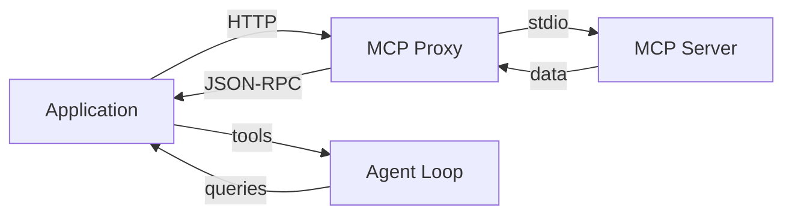
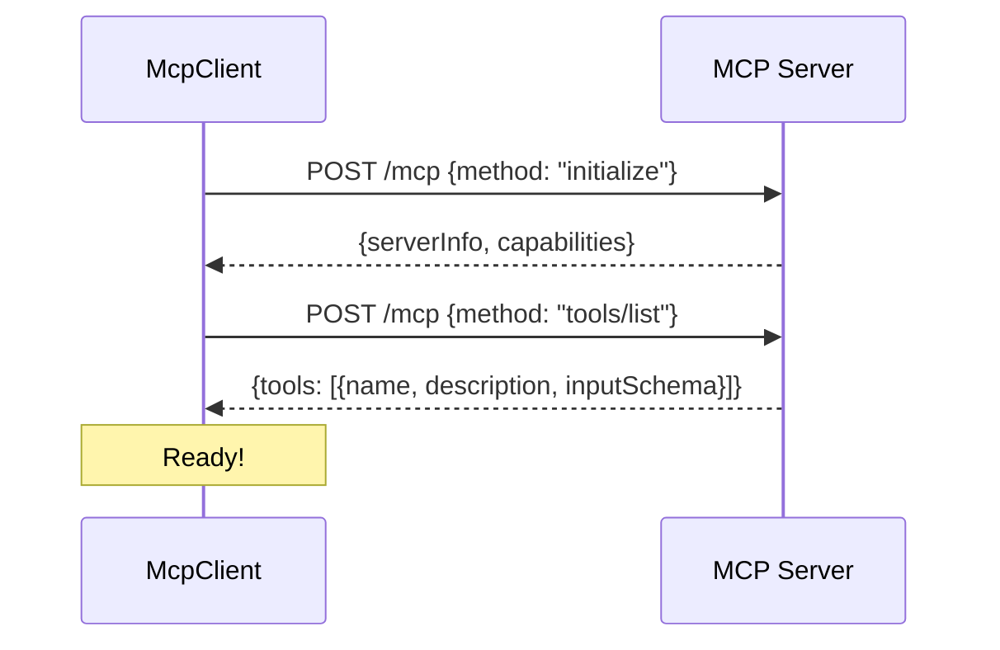
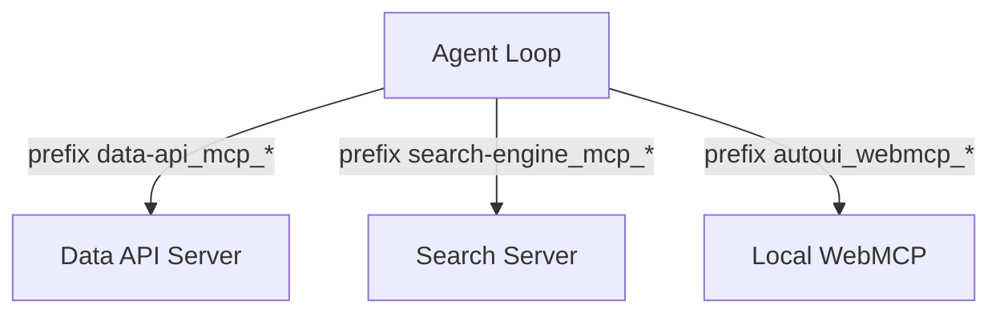

MCP servers are the data sources for your webmcp-auto-ui applications. This tutorial shows you how to connect an external MCP server, create tool layers, and integrate them into the agent loop so the LLM can query remote data.

## Goal

Connect a remote MCP server, retrieve its tools, and use them in the agent loop so the LLM can query data in real time.

## Prerequisites

- The boilerplate is installed (see [Getting started](./boilerplate))
- An MCP server accessible via HTTP (public or local)

## What you will build

An application that connects to one or more MCP servers, with error handling, lazy loading, and full agent loop integration.



---

## Key concepts

**MCP** (Model Context Protocol) is a standardized client-server protocol that allows an LLM to access remote tools. Each MCP server exposes:

- **Tools**: atomic actions the LLM can call (e.g., `query_sql`, `search`, `fetch_document`)
- **Recipes** (optional): composition guides that explain how to combine tools

Transport uses HTTP Streamable with JSON-RPC 2.0 messages.

---

## Step 1: Initialize the MCP client

The `@webmcp-auto-ui/core` package provides `McpClient` for connecting to an MCP server:

```typescript
import { McpClient } from '@webmcp-auto-ui/core';

const mcpClient = new McpClient('http://localhost:3000/mcp', {
  clientName: 'WebMCP Auto-UI',
  clientVersion: '1.0.0',
  timeout: 30000,
});

await mcpClient.initialize();

const tools = await mcpClient.listTools();
console.log('Available tools:', tools);
```

Initialization performs:
1. An `initialize` request with client capabilities
2. The server responds with its capabilities and info
3. A `tools/list` request to retrieve available tools



**Checkpoint**: the `tools` variable contains an array of objects with `name`, `description`, and `inputSchema`.

---

## Step 2: Create a tool layer (ToolLayer)

A `ToolLayer` encapsulates an MCP server with its tools in the format expected by the agent:

```typescript
import type { ToolLayer } from '@webmcp-auto-ui/agent';

async function createMcpLayer(url: string, name: string): Promise<ToolLayer> {
  const client = new McpClient(url);
  await client.initialize();
  const tools = await client.listTools();

  return {
    protocol: 'mcp',
    serverName: name,
    description: `Tools from the ${name} server`,
    serverUrl: url,
    tools: tools.map(t => ({
      name: t.name,
      description: t.description ?? '',
      inputSchema: t.inputSchema,
    })),
  };
}

const wikiLayer = await createMcpLayer(
  'https://demos.hyperskills.net/mcp-wikipedia/mcp',
  'wikipedia'
);
```

---

## Step 3: Integrate with the agent loop

Pass the MCP client and tool layers to `runAgentLoop()`:

```typescript
import { runAgentLoop, RemoteLLMProvider } from '@webmcp-auto-ui/agent';

const provider = new RemoteLLMProvider({
  proxyUrl: '/api/chat',
  model: 'sonnet',
});

const result = await runAgentLoop('Search for information about Svelte', {
  client: mcpClient,
  provider,
  layers: [wikiLayer],
  maxIterations: 5,
  callbacks: {
    onToolCall: (call) => {
      console.log(`Tool called: ${call.name}`);
      if (call.result) console.log('Result:', call.result);
    },
    onText: (text) => {
      console.log('Agent says:', text);
    },
  },
});
```

**Checkpoint**: the console shows tool calls and results returned by the MCP server.

---

## Step 4: Handle multiple MCP servers

### With McpMultiClient (recommended)

`McpMultiClient` automatically manages multiple connections and call routing:

```typescript
import { McpMultiClient } from '@webmcp-auto-ui/core';
import { fromMcpTools } from '@webmcp-auto-ui/agent';
import type { McpLayer, ToolLayer } from '@webmcp-auto-ui/agent';

const multi = new McpMultiClient();
await multi.addServer('https://demos.hyperskills.net/mcp-wikipedia/mcp');
await multi.addServer('https://demos.hyperskills.net/mcp-metmuseum/mcp');
await multi.addServer('https://demos.hyperskills.net/mcp-openmeteo/mcp');

const layers: ToolLayer[] = multi.listServers().map(server => ({
  protocol: 'mcp' as const,
  serverName: server.name,
  tools: fromMcpTools(server.tools),
}));

const result = await runAgentLoop('What is the weather in Paris?', {
  client: multi,
  provider,
  layers,
  maxIterations: 5,
});
```



:::note[Automatic prefixing]
Each tool is prefixed with `{serverName}_mcp_{toolName}`. The LLM sees `wikipedia_mcp_search` and `metmuseum_mcp_search_objects` -- no confusion possible.
:::

---

## Error handling

Wrap the connection in a try/catch:

```typescript
async function safeConnectMcp(url: string) {
  try {
    const client = new McpClient(url, { timeout: 10000 });
    await client.initialize();
    return client;
  } catch (error) {
    if (error instanceof Error) {
      if (error.message.includes('timeout')) {
        console.error('MCP server unreachable (timeout)');
      } else if (error.message.includes('404')) {
        console.error('MCP endpoint not found');
      } else {
        console.error('Connection error:', error.message);
      }
    }
    return null;
  }
}
```

:::caution[Network timeout]
Public MCP servers can be slow on first call (cold start). Use a 30-second timeout for the initial connection, then reduce to 10 seconds for subsequent calls.
:::

---

## Lazy loading

For servers with many tools, lazy loading avoids overloading the LLM's prompt. The agent loop handles this automatically:

```typescript
const result = await runAgentLoop('...', {
  client: mcpClient,
  provider,
  layers: [mcpLayer],
  // Lazy loading is active by default
});
```

With 4 servers and 50 tools total, discovery mode exposes about 20 tools instead of 50, saving 3,000--5,000 tokens in the initial prompt.

---

## Available public MCP servers

| Server | Production URL | Main tools |
|--------|---------------|------------|
| Wikipedia | `/mcp-wikipedia/mcp` | `search`, `readArticle` |
| Met Museum | `/mcp-metmuseum/mcp` | `search-museum-objects`, `get-museum-object` |
| Open Meteo | `/mcp-openmeteo/mcp` | `weather_forecast`, `geocoding` |
| HackerNews | `/mcp-hackernews/mcp` | `get-front-page`, `search-posts` |
| iNaturalist | `/mcp-inaturalist/mcp` | `search_observations` |
| NASA | `/mcp-nasa/mcp` | `nasa_apod`, `nasa_mars_rover` |

URLs are prefixed with `https://demos.hyperskills.net`.

---

## Troubleshooting

| Problem | Likely cause | Solution |
|---------|-------------|----------|
| "Failed to initialize" | Server down or wrong URL | Test with `curl -X POST <url>` |
| "Timeout" | Slow server startup | Increase timeout to 30s |
| Empty tools | Server doesn't expose `tools/list` | Check MCP server version |
| "CORS error" | Cross-origin blocked | Use an nginx proxy (see [Deploy MCP proxies](./setup-mcp-proxies)) |

---

## Going further

- **Create your own MCP server**: any compatible MCP server (Node, Python) works
- **Configure proxies**: for production MCP deployment, see [Deploy MCP proxies](./setup-mcp-proxies)
- **Combine MCP and WebMCP**: see [MCP / WebMCP Architecture](./architecture-mcp-webmcp)

## See also

- [Create a custom widget](./create-custom-widget)
- [Use existing widgets](./use-existing-widgets)
- [Core package (McpClient)](/packages/core)
- [Official MCP specification](https://modelcontextprotocol.io)
