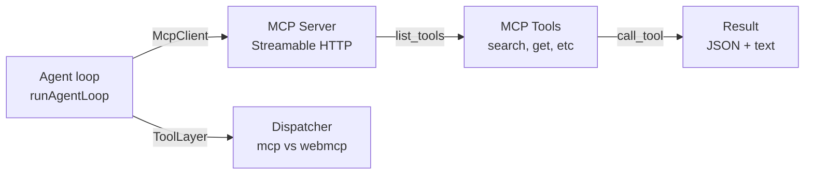

MCP servers provide **data tools** (fetch info, query databases, call APIs) and **recipes** (automated procedures). This tutorial shows how to connect an MCP server to the WebMCP Auto-UI agent.

## MCP protocol architecture



**Flow:**
1. Agent discovers tools via `list_tools()`
2. Agent calls tools based on LLM responses
3. Results compressed and injected into conversation history
4. LLM uses data for next iteration

## Step 1: Configure the MCP client

```typescript
// src/lib/mcp-client.ts
import { McpClient } from '@webmcp-auto-ui/core';

export const mcpClient = new McpClient('http://localhost:3001/mcp', {
  clientName: 'my-app',
  clientVersion: '1.0.0',
  timeout: 30000,
  autoReconnect: true,
  maxReconnectAttempts: 5,
});

export async function initMcp() {
  try {
    await mcpClient.initialize();
    console.log('MCP initialized');
    return true;
  } catch (err) {
    console.error('MCP error:', err);
    return false;
  }
}
```

## Step 2: Discover tools

```typescript
// src/lib/mcp-tools.ts
import { mcpClient } from './mcp-client';
import type { McpToolDef } from '@webmcp-auto-ui/agent';

export async function listMcpTools(): Promise<McpToolDef[]> {
  const result = await mcpClient.listTools();
  return result.tools.map(t => ({
    name: t.name,
    description: t.description ?? '',
    inputSchema: t.inputSchema as Record<string, unknown> | undefined,
  }));
}

export async function getToolDescription(toolName: string): Promise<string | null> {
  const tools = await listMcpTools();
  const tool = tools.find(t => t.name === toolName);
  return tool?.description ?? null;
}
```

## Step 3: Create the ToolLayer

A `ToolLayer` encapsulates an MCP server in a format usable by the agent:

```typescript
// src/lib/mcp-layer.ts
import { mcpClient } from './mcp-client';
import type { ToolLayer } from '@webmcp-auto-ui/agent';
import type { McpToolDef } from '@webmcp-auto-ui/agent';

export async function createMcpLayer(serverName: string): Promise<ToolLayer> {
  const tools = await mcpClient.listTools();
  
  const mcpTools: McpToolDef[] = tools.tools.map(t => ({
    name: t.name,
    description: t.description ?? '',
    inputSchema: t.inputSchema as Record<string, unknown> | undefined,
  }));

  return {
    protocol: 'mcp',
    serverName, // ex: 'recipes', 'knowledge-base', 'api'
    description: `Tools provided by the ${serverName} server`,
    tools: mcpTools,
  };
}
```

## Step 4: Integrate with agent loop

```typescript
// src/lib/agent-setup.ts
import { runAgentLoop, buildSystemPromptWithAliases } from '@webmcp-auto-ui/agent';
import { mcpClient, initMcp } from './mcp-client';
import { createMcpLayer } from './mcp-layer';
import type { LLMProvider } from '@webmcp-auto-ui/agent';

export async function setupAgent(provider: LLMProvider) {
  // 1. Initialize MCP
  const mcpReady = await initMcp();
  if (!mcpReady) {
    throw new Error('MCP not available');
  }

  // 2. Create layers (MCP + native WebMCP)
  const mcpLayer = await createMcpLayer('recipes');
  
  const layers = [
    mcpLayer,
    // Optional: add other servers
    // await createMcpLayer('knowledge-base'),
  ];

  // 3. Build system prompt (with canonical aliases)
  const { prompt: systemPrompt, aliasMap } = buildSystemPromptWithAliases(layers);

  return {
    provider,
    client: mcpClient,
    layers,
    systemPrompt,
    aliasMap,
  };
}
```

## Step 5: Run the agent loop

```svelte
<!-- routes/chat/+page.svelte -->
<script lang="ts">
  import { runAgentLoop } from '@webmcp-auto-ui/agent';
  import { setupAgent } from '$lib/agent-setup';
  import { RemoteLLMProvider } from '@webmcp-auto-ui/agent';
  import { canvas } from '@webmcp-auto-ui/sdk/canvas';

  let messages: Array<{ role: string; content: string }> = [];
  let userInput = '';
  let isRunning = false;

  const provider = new RemoteLLMProvider({
    apiKey: import.meta.env.VITE_ANTHROPIC_KEY,
    model: 'claude-3-5-sonnet-20241022',
  });

  async function sendMessage() {
    if (!userInput.trim() || isRunning) return;

    const msg = userInput;
    userInput = '';
    isRunning = true;

    try {
      const { provider: llm, client, layers } = await setupAgent(provider);

      const result = await runAgentLoop(msg, {
        provider: llm,
        client,
        layers,
        maxIterations: 5,
        callbacks: {
          // Real-time UI updates
          onIterationStart: (iter, max) => {
            console.log(`Iteration ${iter}/${max}`);
          },
          onLLMResponse: (response) => {
            console.log('LLM responded:', response.content);
          },
          onToolCall: (call) => {
            console.log(`Tool called: ${call.name}`);
            if (call.result) {
              console.log('Result:', call.result.slice(0, 200));
            }
          },
          onWidget: (type, data) => {
            // Agent requests widget display
            canvas.addWidget(type as any, data);
            return { id: 'auto' };
          },
          onText: (text) => {
            // Display text as it arrives
            messages = [...messages, { role: 'assistant', content: text }];
          },
          onDone: (metrics) => {
            console.log('Agent done:', metrics);
          },
        },
      });

      // Show final summary
      messages = [
        ...messages,
        { role: 'assistant', content: `✅ Done in ${result.metrics.iterations} iterations` },
      ];
    } catch (err) {
      messages = [
        ...messages,
        { role: 'system', content: `❌ Error: ${err instanceof Error ? err.message : String(err)}` },
      ];
    } finally {
      isRunning = false;
    }
  }
</script>

<div class="chat-container">
  <div class="messages">
    {#each messages as msg}
      <div class="message {msg.role}">
        {msg.content}
      </div>
    {/each}
  </div>

  <div class="input-area">
    <input
      type="text"
      bind:value={userInput}
      placeholder="Type your request..."
      disabled={isRunning}
      on:keydown={(e) => e.key === 'Enter' && sendMessage()}
    />
    <button on:click={sendMessage} disabled={isRunning || !userInput.trim()}>
      {isRunning ? 'Running...' : 'Send'}
    </button>
  </div>
</div>

<style>
  .chat-container {
    display: flex;
    flex-direction: column;
    height: 100vh;
  }
  .messages {
    flex: 1;
    overflow-y: auto;
    padding: 1rem;
  }
  .message {
    margin: 0.5rem 0;
    padding: 0.75rem;
    border-radius: 0.5rem;
  }
  .message.user {
    background: #3b82f6;
    color: white;
    text-align: right;
  }
  .message.assistant {
    background: #e5e7eb;
    color: #1f2937;
  }
  .input-area {
    display: flex;
    gap: 0.5rem;
    padding: 1rem;
    border-top: 1px solid #e5e7eb;
  }
  input {
    flex: 1;
    padding: 0.5rem;
    border: 1px solid #d1d5db;
    border-radius: 0.25rem;
  }
  button {
    padding: 0.5rem 1rem;
    background: #3b82f6;
    color: white;
    border: none;
    border-radius: 0.25rem;
    cursor: pointer;
  }
  button:disabled {
    opacity: 0.5;
  }
</style>
```

## Complete example: "Recipes" MCP server

If your MCP server exposes `search_recipes` and `get_recipe`:

```typescript
// src/lib/recipes-mcp.ts
import type { McpToolDef } from '@webmcp-auto-ui/agent';

export const RECIPES_TOOLS: McpToolDef[] = [
  {
    name: 'search_recipes',
    description: 'Search recipes by keyword',
    inputSchema: {
      type: 'object',
      properties: {
        query: { type: 'string' },
      },
      required: ['query'],
    },
  },
  {
    name: 'get_recipe',
    description: 'Fetch a complete recipe by ID',
    inputSchema: {
      type: 'object',
      properties: {
        id: { type: 'string' },
      },
      required: ['id'],
    },
  },
];
```

The system prompt will automatically guide the agent to:
1. Search for a relevant recipe (`search_recipes`)
2. Fetch the full text (`get_recipe`)
3. Follow the recipe instructions

## Error handling and reconnection

```typescript
export async function safeCallTool(
  mcpClient: McpClient,
  toolName: string,
  args: Record<string, unknown>,
): Promise<string> {
  try {
    const result = await mcpClient.callTool(toolName, args);
    const text = result.content.find((c: any) => c.type === 'text')?.text ?? '';
    return text;
  } catch (err) {
    if (err instanceof Error && err.message.includes('404')) {
      // Reconnect if session expired
      await initMcp();
      return '❌ Session expired, reconnected. Please retry.';
    }
    throw err;
  }
}
```

## Monitor available tools

Display MCP status in the UI:

```svelte
<script lang="ts">
  import { McpStatus } from '@webmcp-auto-ui/ui';
  import { mcpClient } from '$lib/mcp-client';

  let tools = [];
  let isConnected = false;

  onMount(async () => {
    try {
      await mcpClient.initialize();
      const result = await mcpClient.listTools();
      tools = result.tools;
      isConnected = true;
    } catch (err) {
      isConnected = false;
    }
  });
</script>

<McpStatus {isConnected} toolCount={tools.length} serverName="recipes" />
```

## Key points

✅ **Use `buildSystemPromptWithAliases()`** — auto-injection of exploration order (search → list → search_tools)

✅ **Wrap each server in a ToolLayer** — enables composition and reusability

✅ **Implement `autoReconnect`** — handles expired sessions in Streamable HTTP protocol

✅ **Compress history** — agent limits long results to save context

❌ **Don't call `listTools()` every iteration** — cache at startup

❌ **Don't expose MCP API keys to client** — proxy them server-side (Node.js)

❌ **Don't assume all servers have `search_recipes`** — check server documentation

## See also

- [Use existing widgets](./use-existing-widgets.mdx)
- [Architecture](../guide/architecture) — System architecture and agent loop
- [Tool Calling](../guide/tool-calling) — How tool layers work
