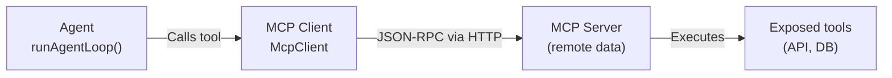

This tutorial shows how to connect an **external MCP server** (Model Context Protocol) and integrate it with the agent loop to execute tools remotely.

## Key concepts

**MCP** (Model Context Protocol) is a client-server protocol that allows an LLM to access remote tools:



## Step 1: Initialize the MCP client

```typescript
import { McpClient } from '@webmcp-auto-ui/core';

const mcpClient = new McpClient('http://localhost:3000/mcp', {
  clientName: 'WebMCP Auto-UI',
  clientVersion: '1.0.0',
  timeout: 30000,
});

// Initialize the connection
await mcpClient.initialize();

// Retrieve the list of available tools
const tools = await mcpClient.listTools();
console.log('Available tools:', tools);
```

## Step 2: Create a tool layer (ToolLayer)

A `ToolLayer` encapsulates an MCP server with its tools in the format expected by the agent:

```typescript
import type { ToolLayer } from '@webmcp-auto-ui/agent';
import { McpClient } from '@webmcp-auto-ui/core';

// Retrieve server tools
async function createMcpLayer(): Promise<ToolLayer> {
  const client = new McpClient('https://api.example.com/mcp');
  await client.initialize();

  const tools = await client.listTools();

  return {
    protocol: 'mcp',
    serverName: 'example-api',
    description: 'Tools for accessing the Example API',
    serverUrl: 'https://api.example.com/mcp',
    tools: tools.map(t => ({
      name: t.name,
      description: t.description ?? '',
      inputSchema: t.inputSchema,
    })),
  };
}

// Create the layer
const exampleLayer = await createMcpLayer();
```

## Step 3: Integrate with the agent loop

Pass the MCP client and tool layers to `runAgentLoop()`:

```typescript
import { runAgentLoop } from '@webmcp-auto-ui/agent';
import { RemoteLLMProvider } from '@webmcp-auto-ui/agent';

const provider = new RemoteLLMProvider({
  proxyUrl: '/api/chat',
  model: 'sonnet',  // resolves to claude-sonnet-4-6
});

const result = await runAgentLoop('Search for articles about Svelte', {
  client: mcpClient,  // <-- Pass the MCP client
  provider,
  layers: [exampleLayer],  // <-- Pass the tool layers
  maxIterations: 5,
  callbacks: {
    onToolCall: (call) => {
      console.log(`Tool called: ${call.name}`);
      if (call.result) console.log('Result:', call.result);
      if (call.error) console.log('Error:', call.error);
    },
    onText: (text) => {
      console.log('Agent says:', text);
    },
  },
});
```

## Full example: Connect a Wikipedia API

```typescript
import { McpClient } from '@webmcp-auto-ui/core';
import { runAgentLoop } from '@webmcp-auto-ui/agent';
import { RemoteLLMProvider } from '@webmcp-auto-ui/agent';
import type { ToolLayer } from '@webmcp-auto-ui/agent';

async function queryWikipedia(topic: string) {
  // Initialize the MCP client pointing to a Wikipedia server
  const client = new McpClient('https://mcp-wikipedia.example.com');
  await client.initialize();

  // Create the tool layer
  const tools = await client.listTools();
  const wikiLayer: ToolLayer = {
    protocol: 'mcp',
    serverName: 'wikipedia',
    description: 'Access to Wikipedia',
    tools: tools.map(t => ({
      name: t.name,
      description: t.description ?? '',
      inputSchema: t.inputSchema,
    })),
  };

  // Initialize the LLM
  const provider = new RemoteLLMProvider({
    proxyUrl: '/api/chat',
    model: 'sonnet',
  });

  // Run the agent loop
  const result = await runAgentLoop(
    `Retrieve detailed information about: ${topic}`,
    {
      client,
      provider,
      layers: [wikiLayer],
      maxIterations: 5,
      callbacks: {
        onToolCall: (call) => {
          console.log(`[${call.name}]`, call.args);
        },
        onText: (text) => {
          console.log('>', text);
        },
        onDone: (metrics) => {
          console.log(`Done in ${metrics.totalTokens} tokens`);
        },
      },
    }
  );

  return result.text;
}

// Usage
const answer = await queryWikipedia('French Revolution');
console.log(answer);
```

## Step 4: Handle multiple MCP servers

You can combine multiple MCP servers in a single agent session:

```typescript
async function createMultiServerSetup() {
  // Server 1: Data API
  const dataClient = new McpClient('https://api.data.example.com/mcp');
  await dataClient.initialize();
  const dataTools = await dataClient.listTools();
  const dataLayer: ToolLayer = {
    protocol: 'mcp',
    serverName: 'data-api',
    description: 'Data access',
    tools: dataTools.map(t => ({
      name: t.name,
      description: t.description ?? '',
      inputSchema: t.inputSchema,
    })),
  };

  // Server 2: Search
  const searchClient = new McpClient('https://search.example.com/mcp');
  await searchClient.initialize();
  const searchTools = await searchClient.listTools();
  const searchLayer: ToolLayer = {
    protocol: 'mcp',
    serverName: 'search-engine',
    description: 'Search engine',
    tools: searchTools.map(t => ({
      name: t.name,
      description: t.description ?? '',
      inputSchema: t.inputSchema,
    })),
  };

  // Run the agent with both servers
  return await runAgentLoop(
    'Find and analyze the latest trends',
    {
      client: dataClient,  // Use the primary client
      provider: new RemoteLLMProvider({ /* ... */ }),
      layers: [dataLayer, searchLayer],  // Combine layers
      maxIterations: 10,
    }
  );
}
```

## Error handling

```typescript
async function safeConnectMcp(url: string) {
  try {
    const client = new McpClient(url, {
      timeout: 10000,
      autoReconnect: true,
      maxReconnectAttempts: 3,
    });

    await client.initialize();
    console.log('Connection established');
    return client;
  } catch (error) {
    if (error instanceof Error) {
      if (error.message.includes('timeout')) {
        console.error('MCP server unreachable (timeout)');
      } else if (error.message.includes('404')) {
        console.error('MCP endpoint not found');
      } else {
        console.error('Connection error:', error.message);
      }
    }
    return null;
  }
}

// Usage
const client = await safeConnectMcp('https://api.example.com/mcp');
if (client) {
  // Continue with the client
}
```

## Lazy loading tools

For servers with many tools, use lazy loading with `buildDiscoveryTools`:

```typescript
import { buildDiscoveryTools, activateServerTools } from '@webmcp-auto-ui/agent';

// First create the discovery layer (lightweight tools)
const discoveryTools = buildDiscoveryTools([mcpLayer]);

// Pass to runAgentLoop
const result = await runAgentLoop('...', {
  client: mcpClient,
  provider,
  layers: [mcpLayer],
  // Full tools will be activated on demand
});

// Internally, the agent will activate full tools when a tool from this server is called
```

## Pattern: Agent loop with MCP in an API

```typescript
// api/agent/+server.ts
import { json } from '@sveltejs/kit';
import { runAgentLoop } from '@webmcp-auto-ui/agent';
import { RemoteLLMProvider } from '@webmcp-auto-ui/agent';
import { McpClient } from '@webmcp-auto-ui/core';

export async function POST({ request }) {
  const { message, mcpUrl } = await request.json();

  const mcpClient = new McpClient(mcpUrl);
  await mcpClient.initialize();

  const tools = await mcpClient.listTools();
  const layer = {
    protocol: 'mcp' as const,
    serverName: new URL(mcpUrl).hostname,
    description: 'MCP Server',
    tools: tools.map(t => ({
      name: t.name,
      description: t.description ?? '',
      inputSchema: t.inputSchema,
    })),
  };

  const result = await runAgentLoop(message, {
    client: mcpClient,
    provider: new RemoteLLMProvider({
      proxyUrl: '/api/chat',
      model: 'sonnet',
    }),
    layers: [layer],
    maxIterations: 5,
  });

  return json({
    text: result.text,
    toolCalls: result.toolCalls,
    metrics: result.metrics,
  });
}
```

## Integration with the Svelte UI

```svelte
<script lang="ts">
  import { canvas } from '@webmcp-auto-ui/sdk/canvas';
  import { BlockRenderer } from '@webmcp-auto-ui/ui';
  import { AgentProgress } from '@webmcp-auto-ui/ui';

  let mcpUrl = 'https://api.example.com/mcp';
  let userMessage = '';
  let loading = false;

  async function runAgent() {
    if (!userMessage.trim()) return;

    loading = true;
    canvas.setGenerating(true);

    try {
      const response = await fetch('/api/agent', {
        method: 'POST',
        headers: { 'Content-Type': 'application/json' },
        body: JSON.stringify({ message: userMessage, mcpUrl }),
      });

      const result = await response.json();

      // Add the result to the canvas
      canvas.addMsg('user', userMessage);
      canvas.addMsg('assistant', result.text);

      // Add generated widgets
      result.toolCalls.forEach((call: any) => {
        if (call.name.includes('widget_display')) {
          canvas.addWidget('json-viewer', {
            data: call.result,
          });
        }
      });

      userMessage = '';
    } catch (error) {
      console.error('Agent error:', error);
      canvas.addMsg('assistant', 'Error during execution');
    } finally {
      loading = false;
      canvas.setGenerating(false);
    }
  }
</script>

<div class="agent-panel">
  <input
    bind:value={mcpUrl}
    placeholder="MCP server URL"
    disabled={loading}
  />
  <textarea
    bind:value={userMessage}
    placeholder="Your question..."
    disabled={loading}
  />
  <button onclick={runAgent} disabled={loading}>
    {loading ? 'Processing...' : 'Send'}
  </button>

  {#if loading}
    <AgentProgress />
  {/if}

  <div class="results">
    {#each canvas.blocks as block (block.id)}
      <BlockRenderer id={block.id} type={block.type} data={block.data} />
    {/each}
  </div>
</div>

<style>
  .agent-panel {
    display: flex;
    flex-direction: column;
    gap: 1rem;
    padding: 1.5rem;
  }

  input, textarea {
    padding: 0.5rem;
    border: 1px solid #e5e7eb;
    border-radius: 0.375rem;
  }

  textarea {
    min-height: 80px;
    resize: vertical;
  }

  button:disabled {
    opacity: 0.5;
    cursor: not-allowed;
  }

  .results {
    display: grid;
    gap: 1rem;
  }
</style>
```

## Debugging

To inspect MCP calls in detail:

```typescript
// Add logging to the client
const client = new McpClient(url);

// Tool results are in AgentResult.toolCalls
const result = await runAgentLoop(message, {
  client,
  provider,
  layers,
  callbacks: {
    onToolCall: (call) => {
      console.log('=== TOOL CALL ===');
      console.log('Name:', call.name);
      console.log('Args:', JSON.stringify(call.args, null, 2));
      console.log('Result:', call.result);
      console.log('Duration:', call.elapsed, 'ms');
    },
  },
});
```

## See also

- [Create a custom widget](./create-custom-widget)
- [Use existing widgets](./use-existing-widgets)
- [Core package (McpClient)](../packages/core)
- [Official MCP specification](https://modelcontextprotocol.io)
