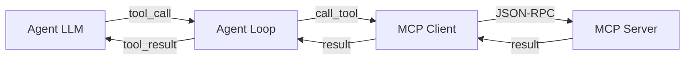

An **MCP server** exposes tools and resources (data, files, external APIs) that the AI agent can use. This tutorial shows how to connect an existing MCP server to WebMCP Auto-UI and use it in the agent loop.

## Key Concepts

- **MCP Server**: JSON-RPC server that exposes tools (e.g., search recipes, call an API)
- **MCP Client**: client that connects to the server and executes tools
- **Tool Layer**: structured layer that groups tools from an MCP server
- **Agent Loop**: loop that alternates between LLM calls and tool execution



## Architecture

WebMCP Auto-UI supports two protocols:

- **MCP** (Model Context Protocol): remote server that exposes data tools
- **WebMCP**: local server that exposes display tools (widgets)

Typically, you connect **1+ MCP servers** (data) + **1 WebMCP server** (UI autoui):

```typescript
const layers: ToolLayer[] = [
  // MCP layer — retrieves data
  {
    protocol: 'mcp',
    serverName: 'postgres',
    tools: [
      { name: 'query', description: 'Execute a SQL query', ... },
      { name: 'list_tables', description: 'List tables', ... }
    ]
  },
  // WebMCP layer — displays widgets
  {
    protocol: 'webmcp',
    serverName: 'autoui',
    tools: [
      { name: 'widget_display', description: 'Display a widget', ... },
      { name: 'search_recipes', description: 'List widgets', ... }
    ]
  }
];
```

## Example 1: Connecting a Local MCP Server via stdio

If you have a local MCP server written in Python or Node.js that communicates via stdin/stdout:

```typescript
import { spawn } from 'child_process';
import { McpClient } from '@webmcp-auto-ui/core';

// Start the MCP server
const server = spawn('python', ['./mcp_server.py'], {
  stdio: ['pipe', 'pipe', 'inherit']
});

// Create an MCP client
const mcpClient = new McpClient({
  transport: 'stdio',
  process: server,
  clientName: 'webmcp-auto-ui',
  timeout: 30000
});

// Initialize
await mcpClient.initialize();
const tools = await mcpClient.listTools();
console.log('Available tools:', tools.map(t => t.name));
```

## Example 2: Connecting a Remote MCP Server via HTTP

If your MCP server listens on an HTTP URL:

```typescript
import { McpClient } from '@webmcp-auto-ui/core';

const mcpClient = new McpClient({
  transport: 'http',
  url: 'https://mcp-server.example.com/mcp',
  clientName: 'webmcp-auto-ui',
  timeout: 30000
});

await mcpClient.initialize();
const tools = await mcpClient.listTools();
```

## Example 3: Creating a Structured MCP Layer

Once the client is created, convert the tools to a structured layer:

```typescript
import { McpClient } from '@webmcp-auto-ui/core';
import type { ToolLayer } from '@webmcp-auto-ui/agent';

const mcpClient = new McpClient({ /* ... */ });
await mcpClient.initialize();

// Retrieve tools
const mcpTools = await mcpClient.listTools();

// Create an MCP layer
const mcpLayer: ToolLayer = {
  protocol: 'mcp',
  serverName: 'my-api', // Used as prefix: my-api_mcp_query, etc.
  description: 'Custom API',
  tools: mcpTools.map(t => ({
    name: t.name,
    description: t.description ?? '',
    inputSchema: t.inputSchema
  }))
};

export { mcpClient, mcpLayer };
```

## Example 4: Using the MCP Layer in the Agent Loop

```typescript
import { runAgentLoop } from '@webmcp-auto-ui/agent';
import { RemoteLLMProvider } from '@webmcp-auto-ui/agent';
import { autoui } from '@webmcp-auto-ui/agent';
import { mcpClient, mcpLayer } from './mcp-setup.js';

const llmProvider = new RemoteLLMProvider({
  apiKey: process.env.ANTHROPIC_API_KEY,
  model: 'claude-3-5-sonnet-20241022'
});

const result = await runAgentLoop(
  'Retrieve all active users and display them in a table',
  {
    client: mcpClient,           // MCP client for tool calls
    provider: llmProvider,        // LLM provider
    layers: [
      mcpLayer,                  // MCP layer — data tools
      autoui.layer()             // WebMCP layer — display widgets
    ],
    maxIterations: 5,
    callbacks: {
      onIterationStart: (i, max) => {
        console.log(`Iteration ${i}/${max}`);
      },
      onToolCall: (call) => {
        console.log(`Tool call: ${call.name}`);
        if (call.result) console.log(`Result: ${call.result.slice(0, 100)}...`);
        if (call.error) console.log(`Error: ${call.error}`);
      },
      onWidget: (type, data) => {
        console.log(`Widget displayed: ${type}`);
        return { id: `widget_${Date.now()}` };
      },
      onDone: (metrics) => {
        console.log(`Done - ${metrics.toolCalls} calls, ${metrics.totalTokens} tokens`);
      }
    }
  }
);

console.log('Result:', result.text);
```

## Example 5: Managing Multiple MCP Servers

If you have multiple MCP servers (database, weather API, file system):

```typescript
import { McpClient } from '@webmcp-auto-ui/core';
import type { ToolLayer } from '@webmcp-auto-ui/agent';

async function setupMultipleMcpServers() {
  // Server 1: PostgreSQL
  const postgresClient = new McpClient({
    transport: 'stdio',
    process: spawn('node', ['./mcp-postgres.js']),
    timeout: 30000
  });
  await postgresClient.initialize();
  const postgresTools = await postgresClient.listTools();

  // Server 2: File system
  const fsClient = new McpClient({
    transport: 'stdio',
    process: spawn('node', ['./mcp-filesystem.js']),
    timeout: 30000
  });
  await fsClient.initialize();
  const fsTools = await fsClient.listTools();

  // Server 3: Weather API
  const weatherClient = new McpClient({
    transport: 'http',
    url: 'https://weather-api.example.com/mcp',
    timeout: 30000
  });
  await weatherClient.initialize();
  const weatherTools = await weatherClient.listTools();

  // Create layers
  const layers: ToolLayer[] = [
    {
      protocol: 'mcp',
      serverName: 'postgres',
      description: 'PostgreSQL database',
      tools: postgresTools.map(t => ({
        name: t.name,
        description: t.description ?? '',
        inputSchema: t.inputSchema
      }))
    },
    {
      protocol: 'mcp',
      serverName: 'filesystem',
      description: 'File system access',
      tools: fsTools.map(t => ({
        name: t.name,
        description: t.description ?? '',
        inputSchema: t.inputSchema
      }))
    },
    {
      protocol: 'mcp',
      serverName: 'weather',
      description: 'Weather API',
      tools: weatherTools.map(t => ({
        name: t.name,
        description: t.description ?? '',
        inputSchema: t.inputSchema
      }))
    },
    autoui.layer() // WebMCP layer
  ];

  return { layers, clients: [postgresClient, fsClient, weatherClient] };
}

const { layers, clients } = await setupMultipleMcpServers();

const result = await runAgentLoop(
  'Retrieve files from current directory and create a table with their sizes',
  {
    // Note: MCP client is not used directly when multiple clients are in play
    // The agent dispatches to the right clients via server names
    provider: llmProvider,
    layers,
    callbacks: {
      onToolCall: (call) => {
        // Each call includes server name: "postgres_mcp_query", "filesystem_mcp_ls", etc.
        console.log(`Tool: ${call.name}`);
      }
    }
  }
);
```

## Tool Dispatch Architecture

Each tool is named with the format: `{serverName}_{protocol}_{toolName}`

For example:
- `postgres_mcp_query` — "query" tool from MCP server "postgres"
- `weather_mcp_forecast` — "forecast" tool from MCP server "weather"
- `autoui_webmcp_widget_display` — "widget_display" tool from WebMCP server "autoui"

The agent loop automatically parses this format and routes to the appropriate client:

```typescript
// In the agent loop (packages/agent/src/loop.ts)
const toolMatch = name.match(/^(.+?)_(mcp|webmcp)_(.+)$/);
if (toolMatch) {
  const [, serverName, protocol, realToolName] = toolMatch;

  if (protocol === 'mcp') {
    const result = await mcpClient.callTool(realToolName, args);
  } else if (protocol === 'webmcp') {
    const server = webmcpServers.get(serverName);
    const result = await server.executeTool(realToolName, args);
  }
}
```

## Advanced: Lazy Loading Tools

When you have many tools, loading them all at once slows down the LLM. WebMCP Auto-UI supports **lazy loading**:

1. **Initial phase**: show only discovery tools (search_recipes, get_recipe)
2. **On first use**: activate all server tools
3. **Next iterations**: use activated tools

```typescript
import { 
  buildDiscoveryToolsWithAliases, 
  activateServerTools 
} from '@webmcp-auto-ui/agent';

const { tools: discoveryTools } = buildDiscoveryToolsWithAliases(layers);

const result = await runAgentLoop(userMessage, {
  provider: llmProvider,
  layers, // Include all layers
  // BUT: starts with discoveryTools only
  // The agent loop will activate tools on first use via activateServerTools()
});
```

## Canonical Tool Resolution

MCP often exposes tools with different names: `search_recipes`, `list_recipes`, `search_templates`, etc. WebMCP Auto-UI normalizes this with the **resolveCanonicalTools** system (4 layers):

```typescript
import { resolveCanonicalTools } from '@webmcp-auto-ui/agent';

const mcpTools = await mcpClient.listTools();
const matches = resolveCanonicalTools(mcpTools);

// Result: [
//   { role: 'search_recipes', realToolName: 'search_templates' },
//   { role: 'get_recipe', realToolName: 'get_template' }
// ]

// Tools are then exposed under canonical names:
// - postgres_mcp_search_recipes (alias to postgres_mcp_search_templates)
// - postgres_mcp_get_recipe (alias to postgres_mcp_get_template)
```

## Error Handling

The agent loop captures tool errors and attempts to correct them:

```typescript
// In callbacks
onToolCall: (call) => {
  if (call.error) {
    console.error(`Tool error ${call.name}: ${call.error}`);
    // The agent will receive the error message and retry
  }
}
```

The agent follows an **error policy**:

1. First error → analyze schema and fix the call
2. Second identical error → try another tool/recipe
3. Third error → report to user

## Summary

| Step | Action |
|------|--------|
| 1 | Create an MCP client via `new McpClient(...)` |
| 2 | Initialize: `await client.initialize()` |
| 3 | List tools: `await client.listTools()` |
| 4 | Create a structured MCP layer |
| 5 | Pass layer + client to `runAgentLoop()` |
| 6 | Agent automatically dispatches via `{serverName}_{protocol}_{toolName}` |

For more examples, see `packages/agent/src/loop.ts` and `packages/core/src/client.ts`.
